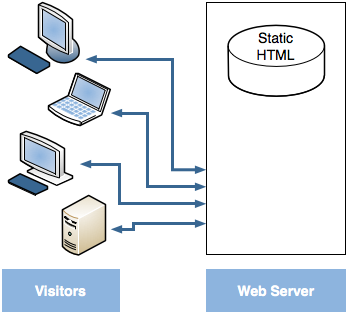
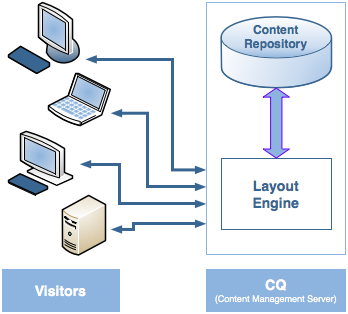

# Dispatcher
* AEM's caching and/or load balancing tool
* Help to protect AEM server from attack

## Why Use The Dispatcher to Implement Caching?
* 2 basic approaches to web publishing
	* **Static Web Servers** - such as Apache or IIS, simple and fast
	* 
	* **Content Management Servers** - provide dynamic, real-time, intelligent content, but require much more computation time and other resources
	* 

* Dispatcher helps realize an environment that is both fast and dynamic. It works as part of a static HTMl server, such as Apache, with the aim of
	* storing (caching) as much of the site content as possible, in the form of a static web site
	* accessing layout engine as little as possible
	
* Which means that
	* **static content** - handled with exactly the same speed and ease as on static web server
	* **dynamic content** - generated as needed, without slowing down the system
	
* Dispatcher contains mechanisms to generate, update static HTML based on the content of the dynamic site
* Can configure which documents are stored as static files and which are always generated dynamically

## How Dispatcher Performs Caching
* For caching, the Dispatcher module uses the web server's ability to serve static content. Dispatcher places the cached documents in the document root of the web server
* 
* Dispatcher stores the cached document in a structure equal to the requested URL

### Methods for Caching
* 2 methods for updating the cache content when changes are made
	* **Content Updates** - remove pages that changed
	* **Auto-Invalidation** - automatically invalidates part of the cache that may be out of date after an update
	
### Content Updates
* In a content update, one or more AEM document change
* AEM sends a request to the Dispatcher, which updates the cache accordingly
	1. Deletes the modified file(s) from the cache
	2. Deletes all files that start with the same handle from the cache. Example, if the file /en/index.html is updated, all the files that start with /en/index. are deleted
	3. Touches the **statfile**; updates the timestamp of the statfile to indicate the data of the last change
	
### Auto-Invalidation
* Automatically invalidates parts of the cache - without physically deleting any files
* At every content update, the file statfile is touched, so the timestamp reflects the last content update

* Dispatcher has a list of file that are subject to auto-invalidation. When a document from that is list is requested, the Dispatcher compares the date of the cached document with the timestamp of the statfile
	* If the cached document is newer, return it
	* If it is older, retrieves the current version from AEM instance
	
* 

### Determining whether a document is subject to caching
* Dispatcher checks the request against the list of cacheable documents
* If the documents is not in this list, Dispatcher requests the document from AEM instance

* Dispatcher *always* requests the document directly from AEM in the following cases
	* HTTP method is not GET
	* Request URI contains a question mark "?"
	* File extension is missing
	* Authentication header is set
	
## Benefits of Load Balancing
* Load Balancing? the practice of distributing the computational load of the website across several instances of AEM
* 
* Benefits
	* increased processing power
	* increased fail-safe coverage
	* manage different websites on the same static web server
	
## How Dispatcher performs Load Balancing
* **Performance Statistics**
* Dispatcher keeps internal statistics about how fast each instance of AEM processes documents
* Based on this data, estimate the quickest response time, and reverses the necessary computation time on that instance

* **Personalized content (Sticky Connections)**
* Subsequent requests from the same user must return to the same instance or the data is lost

## Using Multiple Dispatchers
* Make sure that each request goes through only one Dispatcher
* Dispatcher does not handle requests that come from another Dispatcher
* Both Dispather must access the AEM instance directly

## Using Dispatcher with a CDN
* CDN (Content Delivery Network), deliver content from a location closest to the end user

## Using Dispatcher with an Author Server
		
