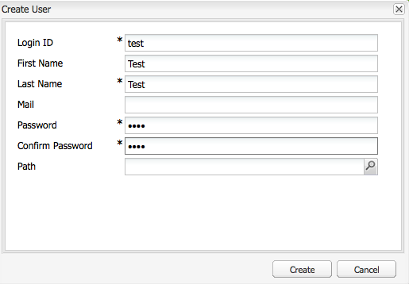

# OSGi Components, Annotations

## OSGi
* Open Services Gateway Initiative, a.k.a Dynamic Module System for Java, defines an architecture for modular application development: a component-oriented framework

## OSGi Alliance
* Expert groups within the consortium define the specifications
* Implementations of OSGi specification: Equinox OSGi, Apache Felix and Knopflerfish OSGi

## OSGi Overview
* OSGi specification defines:
	* A set of services that an OSGi container must implement
	* A contract between the container and your application
* Each module/bundle has its own class loader, separate from the class loader of all other module. The class is managed by OSGi
* Specifies exactly how classes can be shared across modules, using a mechanism of declaring explicit imports and exports. Only packages that are explicitly exported can be share with another bundle
* Advantages:
	* Install, uninstall, start, and stop without restarting the container
	* Can have more than one version of a particular bundle running at the same time
	* Provides very good infrastructure for developing service-oriented applications, as well as embedded, mobile, and rich internet apps
* An OSGi application is:
	* Collection of bundles that interact via service interfaces
	* Bundles may be independently developed and deployed
	* Bundles and their associated services may appear or disappear at any time

## Apache Felix
* Implementation of OSGi R4 Service Platform
* OSGi specification are ideally suited for projects based on the principles of modularity, component-orientation, and/or service-orientation

## Managing your OSGi applications
* http://localhost:4502/system/console

# OSGi Bundles, Services, Components
## Bundles
* What is Bundles? just a JAR files with extra meta data
* Meta data is added to promote a JAR file into a bundle. Additional metadata is added to the manifest META-INF/MANIFEST.MF
* The additional information consists of:
	* Bundle Name(s) - symbolic name used by OSGi to determine the bundle's unique identity
	* Bundle Version
	* The list of services imported and exported by this bundle
	* Optional, additional information, such as
		* Java version
		* vendor of the bundle
		* copyright statement
		* contact address
* Bundles are loosely coupled
	* Package imports and exports with versions
	* Dependencies are independent from bundle organization
	* Provides the self-describing package
	* Provides error management of unresolved bundles
	* Require modular thinking
	* Require proper meta data and consistent version management

## Dependency Management Resolution
* Automatic dependency resolution is provided by the container

## Service Registry Model
* OSGi provides a service-oriented component model using a publish/find/bind mechanism
* OSGi provides dynamic service look up using the **Whiteboard registry pattern**


## OSGi Service Advantages
* Functionality is provided through services
* Services implement one or more interfaces, which define the type of service provided
* Advantages of OSGi Services:
	* Lightweight services
	* Lookup is based on interface name
	* Direct method invocation
	* Good design practice
	* Separates interface from implementation
	* Enables reuse, substitutability, loose coupling, and late binding

## Declarative Services
* Declaratives Services specification enables the declaration of services in configuration files, which are read by the Declarative Services Runtime to observe dependencies and activate and deactivate services depending on whether requirements/dependencies are met
* A class declared this way is a component
* Declarative Services are good alternative to
	* Writing an Activator
	* Registering bundle in the framework
	* Using the service tracker
* It is through the XML configuration definition information that the container:
	* Registers the bundle's services
	* Keep track of dependencies among the bundles
	* Starts/stops services
	* Invokes the optional activation and deactivation method
	* Provides access to bundle configuration

## Components
* Provided by a bundle
* A bundle will contain/provide one or more components
* Each component has an implementation class, and can optionally implement a public interface, effectively providing this "service"
* A component is:
	* Piece of software managed by an OSGi container
	* Java object created and managed by a container
* A Service is:
	* Component provide a service
	* Component implementing one or more Java interfaces
* A bundle needs 4 things to become a component:
	* XML file where you describe the service the bundle provides and the dependencies of the other services of the OSGi Framework
	* Manifest file header entry to declare that the bundle behaves as a component
	* Active and Deactivate methods in the implementation class
	* Service component runtime

## Bundles
* Can be uploaded into the Felix container through the Adobe CQ Web console or through the placement of the bundle into a folder, named **"install"**, in the JCR

# Annotations
* **@Component**
	* Allows the OSGi Declarative Services to register your component for you
	* To registry your component without Annotations, you would have to implement Activators, which extend the DependencyActivatorBase class
	* Is the only required annotation
* **@Activate, @Deactivate, and @Modified**
	* Allows you to specify the name of active, deactivate and modified methods
* **@Service**
	* Defines whether and which service interfaces are provided by the component
* **@Reference**
	* Defines references to other services
	* These other services (consumed services) are made available to the component by the Service Component Runtime
* **@Property**
	* Defines properties which are made available to the component through the `ComponentContext.getProperties()`
	* Not required but may be used by components to define initial configuration
	* Properties may be set to identify the component if it is registered as a service

## Java Compiler Annotations
* **@Override**
	* Informs the compiler that the element is meant to override an element declared in a superclass
* **@SuppressWarnings**
	* Tells the compiler to suppress specific warnings

## Configurable Services
* Configuration objects are identified by **Persistent Identifiers (PID)** and are bound to bundles when used
* For Declaratives Services, the name of the component is used as the PID to retrieve the configuration from the Configuration Admin Service

## EXERCISE - Set up Project
* 1) Set up maven config. Add the following code to HOME/.m2/settings.xml

```xml
<?xml version="1.0" encoding="UTF-8"?>
<settings xmlns="http://maven.apache.org/SETTINGS/1.0.0"
          xmlns:xsi="http://www.w3.org/2001/XMLSchema-instance"
          xsi:schemaLocation="http://maven.apache.org/SETTINGS/1.0.0 http://maven.apache.org/xsd/settings-1.0.0.xsd">

  <profiles>
    <profile>
      <id>adobe-public</id>
      <activation>
        <activeByDefault>true</activeByDefault>
      </activation>
      <properties>
        <releaseRepository-Id>adobe-public-releases</releaseRepository-Id>
        <releaseRepository-Name>Adobe Public Releases</releaseRepository-Name>
        <releaseRepository-URL>http://repo.adobe.com/nexus/content/groups/public</releaseRepository-URL>
      </properties>
      <repositories>
        <repository>
          <id>adobe-public-releases</id>
          <name>Adobe Basel Public Repository</name>
          <url>http://repo.adobe.com/nexus/content/groups/public</url>
          <releases>
            <enabled>true</enabled>
            <updatePolicy>never</updatePolicy>
          </releases>
          <snapshots>
            <enabled>false</enabled>
          </snapshots>
        </repository>
      </repositories>
      <pluginRepositories>
        <pluginRepository>
          <id>adobe-public-releases</id>
          <name>Adobe Basel Public Repository</name>
          <url>http://repo.adobe.com/nexus/content/groups/public</url>
          <releases>
            <enabled>true</enabled>
            <updatePolicy>never</updatePolicy>
          </releases>
          <snapshots>
            <enabled>false</enabled>
          </snapshots>
        </pluginRepository>
      </pluginRepositories>
    </profile>
  </profiles>
  <activeProfiles>
    <activeProfile>adobe-public</activeProfile>
  </activeProfiles>
</settings>
```
* 2) Install AEM Developer Tools for Eclipse
	* https://eclipse.adobe.com/aem/dev-tools/
* 3) Create a sample project in Eclipse **New Project** then **AEM** then **AEM Sample Multiple-Module Project**


## EXERCISE - OSGi Component

### Goal
* Create an OSGi service (interface and implementation)
* Log the (de)activation of the service
* Retrieve a reference to the repository and log the repository name
* Consume the service from a JSP

### How to create an OSGi service
* 1) Create the service interface. Create a new java class file named **RepositoryService.java** and add the following code

```java
package com.somallg.core;

public interface RepositoryService {

	String getRepositoryName();
}
```
* 2) Implement the service interface. Create a java class file named **RepositoryServiceImpl.java**. Add the following code

```java
package com.somallg.core.impl;

import javax.jcr.Repository;

import org.apache.felix.scr.annotations.Activate;
import org.apache.felix.scr.annotations.Component;
import org.apache.felix.scr.annotations.Deactivate;
import org.apache.felix.scr.annotations.Reference;
import org.apache.felix.scr.annotations.Service;
import org.slf4j.Logger;
import org.slf4j.LoggerFactory;

import com.somallg.core.RepositoryService;

@Component(metatype = false)
@Service(value = RepositoryService.class)
public class RepositoryServiceImpl implements RepositoryService {

	private Logger logger = LoggerFactory.getLogger(getClass());

	@Reference
	private Repository repository;

	@Override
	public String getRepositoryName() {
		return repository.getDescriptor(Repository.REP_NAME_DESC);
	}

	@Activate
	protected void active() {
		logger.info("service activated");
	}

	@Deactivate
	protected void deactivate() {
		logger.info("service deactivated");
	}
}
```
* 3) Deploy the bundle and inspect the Adobe CQ Web Console: http://localhost:4502/system/console/bundles

* 4) Consume the service in a JSP by editing **content.jsp** in the geometrixx homepage component

```html
<%@include file="/libs/foundation/global.jsp"%>
<div class="container_16">
<% com.somallg.core.RepositoryService repositoryService = sling.getService(com.somallg.core.RepositoryService.class); %>

Hello, repository name is <%= repositoryService. getRepositoryName() %>
```

* 5) You should see the following on the Geometrixx homepage


# Sling, Resource, REST

## Representational State Transfer (REST)
* REST is an **architectural style** not a standard or implementation specification
* Application data and state are **represented as a set of addressable resources** which present a **uniform interface** that allows transfers of state
* Example: WWW is the largest REST application, by the use of HTTP for transport and URLs for addressing mechanisms
* Systems that follow REST principles can be called REST-ful
* REST outlines how to define and address resources
* Resources are referred to individually with a **URI** (Uniform Resource Identifier)
* REST defines a restricted collection of interactions with resources: **HTTP methods**

## Advantages of REST
* Uses well documented, well established, well used technology and methodology
* **Resource-centric** rather than method-centric
* Response payload can be of any format
* Uses the inherent HTTP security model
* Certain methods to certain URIs can easily be restricted by firewall configuration

## REST and Apache Sling
* Sling is oriented around resources, which usually map into JCR nodes
* Apache Sling handling requests
	* First URL is resolved to a resource
	* Then based on the resource it selects the actual servlet or script to handle the request
* Through URL decomposition, Apache Sling determines the resource URI and any other available information to be used in processing that resource
* The POST method is handled by the Apache SlingPostServlet. The PostServlet enables write to a database (usually JCR) directly from the HTML forms or from the command line, using cURL

## Apache Sling
* **Web framework** that uses a Java Content Repository, such as Apache Jackrabit or Adobe CRX to store and manage content
* Sling applications use either scripts or Java Servlets, selected based on the simple name conventions, to process HTTP requests in a RESTful way

## Sling Default GET Servlet
* For the default GET Servlet, Sling provides default renderers for the following mine types:
	* text
	* json
		* foo.3.json => 3 levels deep
	* docview.xml
	* sysview.xml
	* html
* You can configure the Apache Sling GET Servlet using Adobe CQ Web Console
	* Navigate to http://localhost:4502/system/console/configMgr
	* Search for: Apache Sling GET Servlet


## Sling POST Servlet
* Multiple options for modifying a JCR repository
	* WebDAV
	* Sling Default POST Servlet also called SlingPostServlet
* To create content in JCR, simply send an HTTP POST request using the path of the node where you want to store the content and the actual content, sent as request parameters
* One possibility to do that is by having an HTML Form similar to below
```html
<form method="POST" action="http://localhost:4502/content/mycontent" enctype="multipart-form/data">
	<input type="text" name="title" value="" />
	<input type="text" name="text" value="" />
</form>
```
* The simple form will set the *tile* and *text* properties on a node at /content/mycontent
* If the node does not exist it will be created, otherwise the existing conent would be modified
* Similarly, you can do this by using curl command
	* curl -u admin:admin -F"jcr:primaryType=nt:unstructured" -Ftitle="some title" -Ftext="some text" http://localhost:4502/content/mycontent
	* Verify that the node has been create/modified by navigate to: http://localhost:4502/content/mycontent.jsp
* You can configure the Apache Sling POST Servlet using Adobe CQ Web Console: http://localhost:4502/system/console/configMgr

## Sling and Resources
* **Resource** is one of the central concept of Sling
* Sling maintains a virtual tree of resources
* What is a Resource?
	* Sling's abstraction of the thing addressed by the request URI
	* Usually mapped to a JCR node
	* Could be mapped to a file system or a database
* Properties of a resource
	* Path - JCR item path
	* Type - JCR node type
	* Metadata - e.g last modification date

## Resource-First Request Processing
* Sling take a unique approach to handle requests in that a request URL is first resolved to a resource, then based on the resource it selects the actual servlet or script to handle the request
* On Traditional Web Application
	* Employs methods to select a Servlet or Controller based on the request URL
	* That Servlet or controller then tries to load some data (from database) to act upon
	* Render the result
* Sling turns this processing around in that it places the data to act upon at the center of the work and then uses the request URL to first resolve the data/content to process
* Previously, the following were needed:
	* URL structure
	* Business objects
	* DB schema
* With Sling, it reduced to
	* URL = resource = JCR Structure

## Basic Request Processing
* Using Sling, the main consideration is whether the URL resolves to a content object for which a script can then be found to perform the rendering
* Traditional web application
	* Service a request by selecting a procedure (Servlet, script) based on the request URI
	* This procedure then loads some data, usually from a database
	* Uses it to constructs and send back a resource
* For example, an URI ```http://www.example.com/product.jsp?id=1234```
	* This URL addresses the script to be used to render the result (product.jsp), not the resource that is being requested (product #1234)
* Sling turns this around by placing the content at the center of the process
* Each content item in the JCR repository is exposed as an HTTP resource, so the request URL address directly the data to be processed, not the procedure that does the processing
* Once the content is determined, the script or Servlet to be use to handle the request is determined in cascading resolution that checks, in order of priority
	* Properties of the content item
	* HTTP method used to make the request
	* Simple naming convention within the URI that provides secondary information
* For example, a Sling application might use a URL like this:
```http://www.example.com/cars/audi/s4.details.html```
* This URL would be decomposed as:
	* cars/audi/s4 - the repository path to the content item (e.g /content/cars/audi/s4)
	* details.html - the script to be used to render this content (e.g /apps/cars/details/html.jsp)
* Basic request processing steps:
	1. URL Decomposition
	2. Resolve the resource (using URL)
	3. Resolve the rendering script
	4. Source: resource Type
	5. Create rendering chain
	6. Configurable (servlet) filters
	7. Rendering servlet
	8. Invoke rendering chain

## Resource Resolver
* Sling Resource Resolver is the gateway for finding/accessing (resolving) resources
* Resource Resolver
	* abstracts the path resolution
	* abstracts access to the persistence layer(s)
* Examine the Resolver Map Entries from the Felix Console at: http://localhost:4502/system/console/jcrresolver


## Mapping Nodes to Resources
* JCR Nodes need to be mapped onto resources in order to be useful to Sling
* ResourceResolver.resolve() - resolves the resource from a given URL
* ResourceResolver.map() - get the resource path

## Adapting Resources
* An adapter helps two incompatible interfaces to work together
* Adapter design pattern is used when you want two different classes with incompatible interfaces to work together
* Sling offers an Adapter Pattern to conveniently translate objects that implement the Adaptable interface
* This interface provide a generic *adaptTo()* method that will translate the object to the class type being passed as the argument
* For example: resource to node
```java
Node node = resource.adapto(Node.class);
```

## .adaptTo() Use Cases
* get implementation-specific objects
	* from generic Resource interface to JCR Node
* shortcut creation objects that require internal context objects to be passed
	* JCR-based ResourceResolver holds a reference to JCR Session, which is needed for many objects that will work based on the request session
* Resource can be adapted to:
	* Node - JCR-node-based resource
	* Property - JCR-property-based resource
	* Item - JCR-based resource (node or property)
	* Map - map of properties
	* ValueMap - convenient-to-use map of properties
	* PersistableValueMap
	* InputStream - binary content of a file resource
	* URL - an URL to the resource
	* File - if this resource is a file system resource
	* SlingScript - if this resource is a script
	* Servlet - if this is a servlet resource
	* Authorizable
* Resource Resolver can be adapted to
	* Session - request JCR session
	* PageManager
	* ComponentManager
	* Designer
	* AssetManager
	* TagManager
	* UserManager
	* Authorizable
	* User - current user
	* PrivilegeManager
	* Preferences - preferences of the current user
	* PreferencesService
	* PinManager
	* QueryBuilder
	* Ticket
	* BlogManager
	* CalendarManger
* Additional information
	* http://dev.day.com/docs/en/cq/current/developing/sling-adapters.html

## Servlet
* Servlets are modules of Java code that run in a server application to answer client requests
* They are server-side constructs that provide component-based, platform-independent methods for building web-based applications
* Servlet are most commonly used with HTTP protocols and is often used synonymously as **HTTP Servlet**
* HTTP Servlets are typically used to
	* Provide dynamic content like getting the results of a database query
	* Process and/or store the data submitted by the HTML client
	* Manage information about the state of the stateless HTTP request

## EXERCISE - Servlets
* Write a servlet that serves GET requests
* Expose it at static URL
* Reponse shall contain the JCR repository properties as JSON

### Steps
* 1) Right-click on the core project and add a servlet class MySafeMethodServlet that extends SlingSafeMethodServlet. The serlvet path should be /bin/company/repo

```java
package com.somallg.core;

import java.io.IOException;

import javax.jcr.Repository;
import javax.servlet.ServletException;

import org.apache.felix.scr.annotations.Reference;
import org.apache.felix.scr.annotations.sling.SlingServlet;
import org.apache.sling.api.SlingHttpServletRequest;
import org.apache.sling.api.SlingHttpServletResponse;
import org.apache.sling.api.servlets.SlingSafeMethodsServlet;
import org.apache.sling.commons.json.JSONException;
import org.apache.sling.commons.json.JSONObject;

@SlingServlet(paths = "/bin/company/repo", methods = "GET")
public class MySafeMethodServlet extends SlingSafeMethodsServlet {

	private static final long serialVersionUID = -1561560923272099884L;

	@Reference
	private Repository repository;

	@Override
	protected void doGet(SlingHttpServletRequest request,
			SlingHttpServletResponse response) throws ServletException,
			IOException {
		response.setHeader("Content-Type", "application/json");

		String[] keys = repository.getDescriptorKeys();
		JSONObject jsonObject = new JSONObject();

		for (String k : keys) {
			try {
				jsonObject.put(k, repository.getDescriptor(k));
			} catch (JSONException e) {
				e.printStackTrace();
			}
		}

		response.getWriter().print(jsonObject.toString());
	}
}
```
* 2) Add the core bundle to server runtime

	* Check that the component is installed: http://localhost:4502/system/console/components

	* Navigate to: http://localhost:4502/bin/company/repo

# Sling Events
* Apache Sling provides support for eventing, handling jobs, and scheduling
* Sling's event mechanism leverages the OSGi Event Admin Specification
* To sending an event
	* Generating the event object
	* Calling the event admin
* To receive an event requires
	* Implementation of a single interface
	* Declaration, through properties which topics one is interested in
* Each event is associated with event topic, and event topic are hierachically organized
* Various types of events can be handled
	* Framework Events - e.g a Bundle event indicating a change in bundle's lifecycle
	* Service Events - indicate a service lifecycle change
	* Configuration Events - indicate that a configuration has been updated or deleted
	* JCR observation events
	* Application generated events
	* Events from messaging systems (~ JMS)
	* External events
* Not to be confused *event* mechanism with *messaging* mechanism
* Events are received by the event mechanism and distributed to registed listeners

## Listening to OSGi Events
* The event listening mechanism must
	* Implement the EventHandler interface
	* Subscribe by service registration using the Whiteboard pattern, i.e polling for events
	* Select the event with serivce properties, based on the event topic and a filter
* Property **event.topics** is set to the name of the specific topic which is to be listened for
* @Service is set to value = EventHandler.class to indicate that this is an event handler service

## Publishing Events
* 3 Steps to publish an event
	* Get the EventAdmin service
	* Create the event object (with a topic, and properties)
	* Send the event (synchronously or asynchronously)

## Job Events
* Special category of event that were introduced into Sling
* Job Events are guaranteed to be processed
* Typically used in situations such as sending notification messages or post-processing images

## Sending Job Events
* To send a job event the service needs to implement
	* org.osgi.service.event.EventHandler
	* org.apache.sling.event.JobProcessor

## EXERCISE - Event Handling

### Goal
* Implementation of an event handler
* Audit log for cq:Page replication events

### Steps
* 1) Set the log level for the core package to debug
	* Navigate to: http://localhost:4502/system/console/slinglog
	* Add new logger:
		* Log Level: DEBUG
		* Log File: logs/error.log
		* Logger: core pacakge (e.g com.somallg.core)
		
* 2) Add the basic Listener class in file named **ReplicationLogger.java* as shown below, and deploy the bundle

```java
package com.somallg.core;

import org.apache.felix.scr.annotations.Component;
import org.apache.felix.scr.annotations.Property;
import org.apache.felix.scr.annotations.Service;
import org.apache.sling.event.jobs.JobProcessor;
import org.osgi.service.event.Event;
import org.osgi.service.event.EventHandler;
import org.slf4j.Logger;
import org.slf4j.LoggerFactory;

import com.day.cq.replication.ReplicationAction;

@SuppressWarnings("deprecation")
@Service(value = EventHandler.class)
@Component(immediate = true)
@Property(name = "event.topics", value = ReplicationAction.EVENT_TOPIC)
public class ReplicationLogger implements EventHandler, JobProcessor {

	private Logger logger = LoggerFactory.getLogger(getClass());

	@Override
	public void handleEvent(Event event) {
		logger.debug("======= handling event");
		process(event);
	}
	@Override
	public boolean process(Event event) {
		logger.debug("======= processing event");
		return true;
	}

}
```
* 3) Test your listener by go to **SiteAdmin** console and **Active** a page and inspect the log for debug messages

* 4) Next add the code to log only page activation events

```java
package com.somallg.core;

import org.apache.felix.scr.annotations.Component;
import org.apache.felix.scr.annotations.Property;
import org.apache.felix.scr.annotations.Reference;
import org.apache.felix.scr.annotations.Service;
import org.apache.sling.api.resource.LoginException;
import org.apache.sling.api.resource.ResourceResolver;
import org.apache.sling.api.resource.ResourceResolverFactory;
import org.apache.sling.event.jobs.JobProcessor;
import org.osgi.service.event.Event;
import org.osgi.service.event.EventHandler;
import org.slf4j.Logger;
import org.slf4j.LoggerFactory;

import com.day.cq.replication.ReplicationAction;
import com.day.cq.replication.ReplicationActionType;
import com.day.cq.wcm.api.Page;
import com.day.cq.wcm.api.PageManager;

@SuppressWarnings("deprecation")
@Service(value = EventHandler.class)
@Component(immediate = true)
@Property(name = "event.topics", value = ReplicationAction.EVENT_TOPIC)
public class ReplicationLogger implements EventHandler, JobProcessor {

	private Logger logger = LoggerFactory.getLogger(getClass());

	@Reference
	private ResourceResolverFactory resourceResolverFactory;

	@Override
	public void handleEvent(Event event) {
		logger.debug("======= handling event");
		process(event);
	}
	@Override
	public boolean process(Event event) {
		logger.debug("======= processing event");
		ReplicationAction action = ReplicationAction.fromEvent(event);

		if (action.getType().equals(ReplicationActionType.ACTIVATE)) {
			try {
				ResourceResolver resourceResolver = resourceResolverFactory.getAdministrativeResourceResolver(null);
				PageManager pm = resourceResolver.adaptTo(PageManager.class);
				Page page = pm.getContainingPage(action.getPath());

				if (page != null) {
					logger.info("======= activation of page {}", page.getTitle());
				}
			} catch (LoginException e) {
				e.printStackTrace();
			}
		}

		return true;
	}
}
```
* 5) Activate a page in **Site Admin** and inspect the log

# Sling Scheduling
* Sling Commons Scheduling mechanism is used to start jobs periodically using a cron definition
* A service which implements either *java.lang.Runnable* or *org.quartz.job* is started if it contains either a configuration
	* scheduler.expression (cron expression)
	* scheduler.period (simple numerical period in seconds)
* The job is stared with the PID of the service. If the service has no PID, the configuration property **scheduler.name** must be set

## OSGi Service Fired By Quartz
* To use the quartz library, the following outline code is needed

```java
package <package name>;

import org.apache.felix.scr.annotations.Component;
import org.apache.felix.scr.annotations.Property;
import org.apache.felix.scr.annotations.Service;

@Component
@Service(value = Runnable.class)
@Property(name = "scheduler.expression", value = "0 0/10 * * * ?")
public class MyScheduledTask implements Runnable {

	@Override
	public void run() {
		// place events to run here.
	}
}
```
* @Component used to registered the component
* @Service(value = Runnable.class) makes it possible to schedule this service
* @Property - where to write quartz job expression for the scheduled time interval

## Scheduling at Periodic Times
* Instead of using **scheduler.expression**, use **scheduler.period**

```java
@Property(name = "scheduler.period", value = "10")
```

## Preventing Concurrent Execution
* Using **scheduler.concurrent**

```java
@Property(name = "scheduler.concurrent", boolValue = false, propertyPrivate = true)
```

## Quartz Trigger Syntax
* Cron trigger expression comprises a series of parameters separated by white space
```
<Seconds> <Minutes> <Hours> <Day of Month> <Month> <Day of Week> <Year>
```
* It can include special characters such as
	* The "*" character specify all values - sepify any value
	* The '?' character is allowed for day-of-month and day-of-week field. It s used to specify 'no specific value'. This is useful when you need to specify something in one of the two fields, but not the other
	* The '-' character - specify ranges. Example: "10-12" in the hour field means the hours 10, 11 and 12
	* The ',' character is used to specify additional values. Example: "MON,WEB,FRID" in they day-of-week field means "the day Monday, Wednesday, and Friday"
	* The '/' character is used to specify increments. Example: "0/15" in the seconds field means "the seconds 0, 15, 30, and 45"
* For example:
	* "0 0 12 * * ?" means fire at 12pm every day

## Programmatically Scheduling Jobs
* To programmatically schedule a job, you need
	* A Runnable class
	* Then add schdule times using appropriate methods

```java
@Reference
private Scheduler scheduler;
this.scheduler.addJob("myJob", job, null, "0 15 10 ? * *", true);

// periodic:
this.scheduler.addPeriodicJob("myJob", job, null, 3*60, true);

// one time:
this.scheduler.fireJobAt("myJob", job, null, fireDate);
```

## EXERCISE - Scheduling Jobs

### Goal
* Write a job that periodically deletes temporary nodes in the repository
* Configuration shall be stored in a configuration node which can be seen and edited in the Apache Felix Console

### Steps
* 1) Create a **CleanupServiceImpl.java** as below

```java
package com.somallg.core.impl;

import java.util.Dictionary;

import javax.jcr.LoginException;
import javax.jcr.RepositoryException;
import javax.jcr.Session;

import org.apache.felix.scr.annotations.Component;
import org.apache.felix.scr.annotations.Property;
import org.apache.felix.scr.annotations.Reference;
import org.apache.felix.scr.annotations.Service;
import org.apache.sling.commons.osgi.OsgiUtil;
import org.apache.sling.jcr.api.SlingRepository;
import org.osgi.service.component.ComponentContext;
import org.slf4j.Logger;
import org.slf4j.LoggerFactory;

@Component(immediate = true, metatype = true, label = "Cleanup Service")
@Service(value = Runnable.class)
@Property(name = "scheduler.expression", value = "0/10 * * * * ?")
public class CleanupServiceImpl implements Runnable {

	private Logger logger = LoggerFactory.getLogger(getClass());

	@Reference
	private SlingRepository slingRepository;

	@Property(label = "Path", description = "Delete this path", value = "/mypath")
	public static final String CLEANUP_PATH = "cleanupPath";
	private String cleanupPath;

	protected void activate(ComponentContext componentContext){
		configure(componentContext.getProperties());
	}

	@SuppressWarnings("deprecation")
	protected void configure(Dictionary<?, ?> properties) {
		this.cleanupPath = OsgiUtil.toString(properties.get(CLEANUP_PATH), null);
		logger.info("configure: cleanupPath={}", this.cleanupPath);
	}
	@Override
	public void run() {
		logger.info("running now");
		Session session = null;

		try {
			session = slingRepository.loginAdministrative(null);

			if (session.itemExists(cleanupPath)) {
				session.removeItem(cleanupPath);
				logger.info("node deleted");
				session.save();
			}
		} catch (LoginException e) {
			e.printStackTrace();
		} catch (RepositoryException e) {
			e.printStackTrace();
		} finally {
			if (session != null) {
				session.logout();
			}
		}
	}
}
```
* 2) To note
	* metatype = true - enables configuration in CQ web console
	* SlingRepository - can be used for administrative login
	* configure method - will be called when the config changes
* 3) Deploy and inspect the log output

* 4) In CRXDE Lite create a node at the root repository called **/mypath**, save the changes, then see it gets deleted by the cleanup service
* 5) Go to: http://localhost:4502/system/console/configMgr. Scroll down and look for Cleanup Service. Double click to open Configuration popup. Congigure new path


# JCR Basics, Content Modeling, Indexing, Search

## Repository Basics
* JCR API is defined in JSR-170 and JSR-283
* Apache Jackrabbit is the reference implementation of these JSRs
* Adobe CRX is the Adobe commercial extension of Jackrabbit

## JXR Review
*  JCR provides a generic application data store for both structured and unstructured content
* File systems provide excellent storage for unstructured, hierarchical content
* While Databases provide excellent storage for structured data due to transactional services and referential integrity functionality
* JCR provides the best of both data storage architectures, plus obversation, versioning, and full text search
* JCR presents a hierarchical content model where nodes and properties are defined as **Items**

## JCR Features
* Query (XPath, SQL, JQL)
* Export/Import (XML)
* Referential Integrity
* Authentication
* Access Control
* Versioning
* Observation
* Locking and Transactions (JTA)

## Repository Model
* Inside a JCR repository, content is categorized into one or more workspaces, each of which holds a hierarchical structure of nodes and properties
* Beginning with the root node at the top, the hierarchy descends much like a directory structure of a file system
	* Each node has zero or more child nodes
	* Each node has zero or more properties
* Properties
	* Cannot have children but do have values
	* The values are where the actual pieces of data are stored
	* Different types
		* strings
		* dates
		* numbers
		* binaries
* The structure of nodes above the properties serves to organize this data according to whatever principles are employed by the application
* Additional advantages of JCR is support for namepaces
* Namespaces prevent naming collisions among items and node types that come from different sources and application domains

## Node Types
* Node types define
	* the structure of application content
	* set of properties and their types
	* set of child nodes and their types
	* may extend other node types (can have super types)
	* Nodes are instances of a node type
	* Nodes must have one primary ndoe type
	* Nodes may have one or more mixin node types
	* Mixin node type mandate extra characteristics/funcationality for a particular node in addition to the primary node type
* JCR pre-defined node types
	* For reflection of repository-level functionality
		* defining storage of versions (nt:version)
		* defining storage of node types (jcr:nodeType)
	* For application-level common types
		* simulating a file or folder structure (nt:file & nt:folder)
		* allowing storage of unstructured content (nt:unstructured)
* See the node types registered in your CRX:
	* http://localhost:4502/crx/explorer/index.jsp

## Node Type Definitions
* Node types are stored in the formof Node Type Definitions
* Those are reflected in the API as `javax.jcr.nodetype.NodeType`
* Call `javax.jcr.Node.getPrimaryNodeType()` to get the node type defintion of a node
* Node Type Definition consists of a set of mandatory attributes

## Node Type Inheritance
* A node may have one or more Super Types
* From the supertype, the inheriting node type is a subtype
* A subtype inherits
	* Property definition
	* Child node definitions
	* Other attributes (such as "isMixin")
* Supertypes are discoverables via the JCR API

## Content Modeling: David's Model
1. Data First. Structure Later. Maybe
2. Drive the content hierarchy, don't let it happen
3. Workspaces are for clone(), merge() and update()
4. Beware of Same Name Siblings
5. References considered harmful
6. Fires are Files are Files
7. ID's are evil

## Repository Internals

### Persistence Manager
* Is the class that manages the reading and writing of data
* The default PM for CQ is Tar PM, which stores data in .tar files

### Jackrabbit Persistence
* Persistence Manager is an internal Jackrabbit component that handles the persistent storage of content nodes and properties
* Jackrabbit provides a set of pluggable Persistence Managers
	* e.g Apache Derby, MySQL, Oracle

### Query Syntax
* JSR 170: SQL and XPath
* JSR 283: The Abstract Query Model (AQM) defines the structure and semantics of a query

### Basic AQM Concepts
* Query has one or more selectors
* When the query is evaluated, each selector independently selects a subset of the nodes in the workspaces based on the node type
* Joins transfrom the multiple sets of node selected by each selector into a single set
* Join type can be inner, left-outer, or right-outer

### AQM Concepts - Constraints
* Query can specify a constraint to filter the set of node-tuples
* The constraints may be any combination of
	* Absolute or relative path
	* Name of the node
	* Value of a property
	* Length of a property
	* Existence of a property
	* Full-text search

### Search Basics
* 1) Get the QueryManager from the Session/Workspace

```java
QueryManager qm = session.getWorkspace().getQueryManager();
```
* 2) Create the query statement

```java
Query q = qm.createQuery("select * from moviedb:movie order by Title", Query.SQL);
```
* 3) Execute the query:

```java
QueryResult res = q.execute();
```
* 4) Iterate through the results

```java
NodeIterator nit = res.getNodes();
```

### Query Examples - SQL2
* Find all nt:folder nodes

```sql
SELECT * FROM [nt:folder]
```
* Find all files under /var. Exclude files under /var/classes

```sql
SELECT * FROM [nt:file] AS files
WHERE ISDESCENDANTNODE(files, [/var])
AND (NOT ISDESCENDANTNODE(files, [/var/classes])
```
* Find all files under /var (but not under /var/classes) created by existing user. Order results in ascending order by jcr:createdBy and jcr:created

```sql
SELECT * FROM [nt:file] AS file
	INNER JOIN [rep:User] AS user ON file.[jcr:createdBy] = user.[rep:principalName]
	WHERE ISDESCENDANTNODE(file, [/var]) AND (NOT ISDESCENDANTNODE(file, [/var/classes])) ORDER BY file.[jcr:createdBy], file.[jcr:created]
```

### Java Query Object Model (JQOM)
* JQOM = mapping of AQM to Java API
* JQOM expresses a query as a tree of Java objects
* A query is built using QueryObjectModelFactory and its createQuery method

```java
QueryManager qm = session.getWorkspace().getQueryManager();
QueryObjectModelFactory qf = qm.getQOMFactory();
QueryObjectModel query = qf.createQuery(...)
```

### JQOM Examples
* Find all nt:folder nodes

```java
QueryObjectModelFactory qf = qm.getQOMFactory();
Source source = qf.selector("nt:folder", "ntfolder");
QueryObjectModel query = qf.createQuery(source, null, null, null);
```
* Find all files under /var (but not under /var/classes)

```java
QueryObjectModelFactory qf = qm.getQOMFactory();
Selector selector = qf.selector("nt:file", "files");
Constraint pathConstraint = qf.and(qf.descendantNode("files", "/var"), qf.not(qf.descendantNode("files", "/var/classes")));
QueryObjectModel query = qf.createQuery(selector, pathConstraint, null, null);
```
* Find all files under /var (but not under /var/classes) created by existing user. Order results in ascending order by jcr:createdBy and jcr:created

```java
QueryObjectModelFactory qf = qm.getQOMFactory();
Selector selector = qf.join(qf.selector("nt:file", "file"), qf.selector("rep:User", "user"), QueryObjectModelFactory.JCR_JOIN_TYPE_INNER, qf.equijoinCondition("file", "jcr:createdBy", "user", "rep:principalName"));
Constraint pathConstraint = qf.and(qf.descendantNode("file", "/var"), qf.not(qf.descendantNOde("file", "/var/classes")));
Ordering orderdings[] = {qf.ascending(qf.propertyValue("file", "jcr:createdBy")), qf.ascending(qf.propertyValue("file", jcr:created"))};
QueryObjectModel query = qf.createQuery(selector, pathConstraint, orderings, null);
```

### Search Performance
* Fastest JCR search methodologies
	* Constraint on properties, node types, full text
	* Typically O(n) where n is the result, vs. total number of nodes
* Pretty fast JCR search  methodologies
	* Path constraints
* Need some planning
	* Constraints on child axis
	* Sorting, limit/offset
	* Joins

### Testing Queries
* Access the Query Tool in the Tools menu in CRXDE Lite


## EXERCISE - Search
* write a servlet that simplements a Sling selector
* query results are returned as JSON

### Steps
* 1) Create a servlet named **SearchServlet.java**, add the following code

```java
package com.somallg.core;

import java.io.IOException;

import javax.jcr.Node;
import javax.jcr.NodeIterator;
import javax.jcr.RepositoryException;
import javax.jcr.ValueFactory;
import javax.jcr.query.Query;
import javax.jcr.query.QueryManager;
import javax.jcr.query.qom.Constraint;
import javax.jcr.query.qom.QueryObjectModel;
import javax.jcr.query.qom.QueryObjectModelFactory;
import javax.jcr.query.qom.Selector;
import javax.servlet.ServletException;

import org.apache.felix.scr.annotations.sling.SlingServlet;
import org.apache.sling.api.SlingHttpServletRequest;
import org.apache.sling.api.SlingHttpServletResponse;
import org.apache.sling.api.servlets.SlingSafeMethodsServlet;
import org.apache.sling.commons.json.JSONArray;
import org.apache.sling.commons.json.JSONException;
import org.apache.sling.commons.json.JSONObject;

import com.day.cq.wcm.api.PageManager;

@SlingServlet(resourceTypes = "geometrixx/components/homepage", selectors = "search")
public class SearchServlet extends SlingSafeMethodsServlet {

	/**
	 *
	 */
	private static final long serialVersionUID = 1L;

	@Override
	protected void doGet(SlingHttpServletRequest request,
			SlingHttpServletResponse response) throws ServletException,
			IOException {
		response.setHeader("Content-Type", "application/json");

		JSONObject jsonObject = new JSONObject();
		JSONArray resultArray = new JSONArray();

		try {
			Node currentNode = request.getResource().adaptTo(Node.class);
			PageManager pageManager = request.getResource().getResourceResolver().adaptTo(PageManager.class);
			Node queryRoot = pageManager.getContainingPage(currentNode.getPath()).adaptTo(Node.class);

			String queryString = request.getParameter("q");

			if (queryString != null) {
				NodeIterator searchResults = performSearchWithSQL(queryRoot, queryString);

				while (searchResults.hasNext()) {
					resultArray.put(searchResults.nextNode().getPath());
				}
				jsonObject.put("result = ", resultArray);
			}

		} catch (RepositoryException e) {
			e.printStackTrace();
		} catch (JSONException e) {
			e.printStackTrace();
		}

		response.getWriter().print(jsonObject.toString());
		System.out.println(jsonObject.toString());
	}

	private NodeIterator performSearchWithSQL(Node queryRoot, String queryString) throws RepositoryException {
		// JQOM infrastructure
		QueryObjectModelFactory qf = queryRoot.getSession().getWorkspace().getQueryManager().getQOMFactory();
		ValueFactory vf = queryRoot.getSession().getValueFactory();

		// selectors
		final String SELECTOR_NAME = "results";
		final String SELECTOR_NT_UNSTRUCTURED = "nt:unstructured";

		Selector selector = qf.selector(SELECTOR_NT_UNSTRUCTURED, SELECTOR_NAME);

		Constraint constraint = qf.fullTextSearch(SELECTOR_NAME, null, qf.literal(vf.createValue(queryString)));

		constraint = qf.and(constraint, qf.descendantNode(SELECTOR_NAME, queryRoot.getPath()));

		QueryObjectModel query = qf.createQuery(selector, constraint, null, null);

		return query.execute().getNodes();
	}
```
* 2) Build and deploy
* 3) Test results at http://localhost:4502/content/geometrixx/en.search.html?q=ceo
* 4) Implement the same functionality using SQL2

```java
	private NodeIterator performSearchWithSQL2(Node queryRoot, String queryString) throws RepositoryException {
		QueryManager qm = queryRoot.getSession().getWorkspace().getQueryManager();

		Query query = qm.createQuery("SELECT * FROM [nt:unstructured] AS node WHERE ISDESCENDANTNODE([" + queryRoot.getPath() + "]) and contains(node.* ,'" + queryString + "')", Query.JCR_SQL2);

		return query.execute().getNodes();
	}
```

# JCR Versioning, Observation

## Observation
* Observation enables an application to receive notification of persistent changes to a workspace
* JCR defines a general event model and specific APIs for asynchronous and journaled observation

## Event Model
* A persisted change to a workspace is presented by a set of one or more *events*
* Each event reports a single simple change to the structure of the persistent workspace
* Six standard event types
	* NODE_ADDED
	* NODE_MOVED
	* NODE_REMOVED
	* PROPERTY_ADDED
	* PROPERTY_REMOVED
	* PROPERTY_CHANGED
	* PERSIST

## Scope of Event Reporting
* Scope of event reporting is implementation dependent
* Implementation should make *best-effort* attempt to report all events, but may exclude events if reporting them would be impratical
* E.g, on a import, move or remove a node with large number of items, an implementation may choose to report only the events associated with the root node and not those for every subitems in the structure

## The Event Object
* Each event generated by the repository is represented by an Event object

## Event Types
* Retrieved through *int Event.getType()* which returns one of the int constants found in the Event interface: NODE_ADDED, NODE_MOVED, NODE_REMOVED, PROPERTY_ADDED, PROPERTY_REMOVED, PROPERTY_CHANGED, PERSIST

## Event Information
* Each event is associated with a path, and identifier and an information map
	* String Event.getPath()
	* String Event.getIdentifier()
	* Map Event.getInfo()

* If the event is a NODE_ADDED or NODE_REMOVED then
	* Event.getPath() returns the absolute path of the node that was added or removed
	* Event.getIdentifier() returns the identifer of the node that was added or removed
	* Event.getInfo() return an empty Map
* If the event is NODE_MOVED
	* Event.getpath() returns the absolute path of the *destination* of the move
	* Event.getIdentifier() return the identifier of the node that was moved
	* Event.getInfo() returns a Map containing parameter information from the method that caused to event
* If the event is PROPERTY_ADDED, PROPERTY_CHANGED or PROPERTY_REMOVED,
	* Event.getPath() returns the absolute path of the property that was added, changed or removed
	* Event.getIdentifier() return the identifier of the parent node of the property that was added, changed or removed
	* Event.getInfo() returns an empty Map
* If the event is PERSIST then Event.getPath() and Event.getIdentifier() return null and Event.getInfo() returns an empty Map

## User ID
* Event records the identify of the Session that created it

```java
String Event.getUserId()
```

## User Data
* Event also contains string data specific to the session that caused the event

```java
String Event.getUserData()
```

## Event Ordering
* Not guaranteed to correspond to the order of the operations that produced them

## Asynchronous Observation
* Asynchronous observation enables an application to respond to changes made in a workspace
* An application connects with the asynchronous observation mechanism by registering an event listener with the workspace
* Listeners apply per *workspace*, not repository-wide
* An even listener is an application-specific class implementing the EventLister interface

## Observation Manager
* Registration of event listeners is done through the ObservationManager object acquired from the Workspace

```java
ObservationManager Workspace.getObservationManager();
```

## Adding an Event Listener
* An event listner is added to a workspace with

```java
void ObservationManager.addEventListener(
	EventListener listener,
	init eventTypes,
	String absPath,
	boolean isDeep,
	String[] uuid,
	String[] nodeTypeName,
	boolean noLocal)
```

* The class implement EventListener must provide

```java
void EventListener.onEvent(EventIterator events)
```

* When an event occurs that falls within the scope of the listener, the repository calls the onEvent method invoking the application-specific logic

## Journaled Observation
* Journaled observation allows an application to periodically connect to the repository and receive a report of changes that has occurred since some specified point in the past

## EXERCISE - Event Listener

### Goal
* Write an observation listener that checks new or modified properties named "jcr:title"
* If the property does not have an ("!") at the end, the listener shall add one

### Steps

* 1) Create a TitlePropertyListener component

```java
package com.somallg.core;

import javax.jcr.Property;
import javax.jcr.RepositoryException;
import javax.jcr.Session;
import javax.jcr.observation.Event;
import javax.jcr.observation.EventIterator;
import javax.jcr.observation.EventListener;
import javax.jcr.observation.ObservationManager;

import org.apache.felix.scr.annotations.Component;
import org.apache.felix.scr.annotations.Reference;
import org.apache.sling.jcr.api.SlingRepository;
import org.osgi.service.component.ComponentContext;
import org.slf4j.Logger;
import org.slf4j.LoggerFactory;

@Component
public class TitlePropertyListener implements EventListener {

	private Logger logger = LoggerFactory.getLogger(getClass());

	@Reference
	private SlingRepository repository;

	private Session session;
	private ObservationManager observationManager;

	protected void activate(ComponentContext context) throws Exception {
		session = repository.loginAdministrative(null);
		observationManager = session.getWorkspace().getObservationManager();

		observationManager.addEventListener(this, Event.PROPERTY_ADDED | Event.PROPERTY_CHANGED, "/", true, null, null, true);
		logger.info("======= added JCR event listener");
	}

	protected void deactivate(ComponentContext context) {
		if (observationManager != null) {
			try {
				observationManager.removeEventListener(this);
				logger.info("====== removed JCR event listener");
			} catch (RepositoryException e) {
				e.printStackTrace();
			} finally {
				if (session != null) {
					session.logout();
					session = null;
				}
			}
		}
	}

	@Override
	public void onEvent(EventIterator eventIterator) {
		while (eventIterator.hasNext()) {
			Event event = eventIterator.nextEvent();

			try {
				logger.info("====== new property event: {}", event.getPath());
				System.out.println("====== new property event: " +  event.getPath());

				Property changedProperty = session.getProperty(event.getPath());

				if (changedProperty.getName().equalsIgnoreCase("jcr:title") && !changedProperty.getString().endsWith("!"))  {
					changedProperty.setValue(changedProperty.getString() + "!");
					session.save();
				}
			} catch (Exception e) {
				logger.error(e.getMessage(), e);
			}
		}
	}
}
```
* 2) Compile and deploy
	* Check that the component is installed

* 3) Change a property called "jcr:title" in CRXDE Lite
	* Refresh to see the added value "!"

# Users, Groups, Permissions
* CQ uses ACLs (Action Control List) to determine what actions a user or group can take and where it can perform those actions

## Permissions and ACLs
* Permissions define who is allowed to perform which actions on a resource
* You can change the permissions granted/denined to a given user by selecting or clearing the checkboxes for the individual CQ actions
* Check mark = Allow
* No checkmark = Deny


* The permissions are also applied to any child pages
* If a permission is not inherited from the parent but has at least one local entry, then the following symbols are appended to the box
	* * (asterick) - there is at least one local entry
! (exclmation mark) - at least one entry that currently no effect


## Actions
* Actions can be performed on a page (resource)
* For each page in the hierarchy, you can specify which action the user is allowed to take on that page
* Permissions enable you to allow or deny an action
	* Read
	* Modify
	* Create
	* Delete
	* Read ACL
	* Edit ACL
	* Replicate

## Access Control Lists and how they are evaluated
* Access Control Lists
	* Made up of individual permissions
	* Used to determine the order in which the permissions are applied
* The List is formed according to the hierarchy of the pages under consideration
* The list is scanned bottom-up until the first appropriate permission to apply to a page is found
* Assume that a user wants to access the following page
	* /content/geometrixx/en/products/square
* And the ACL list for that page is the following


* How ALC Lists are evaluated?
	1. Applied to the page is ACL 1, realted to /content/geometrixx/en/products/square. In our case the ACL associated to this page is empty, so CQ will go one level up to the ACL 2
	2. ACL 2 will be applied to the user belongs the the group **restricted** and in that case the user will have access denied for this page. If the user is not part of **restrictred** group then CQ will go up another level to ACL 3
	3. ACL 3 will be applied to the user belongs to the group **geoeditors** or **doble** only, in this case the user will have the access granted to the page. If the user is not part of the 3 mentioned groups before CQ will go up one level to ACL 4
	4. ACL 4 is empty, CQ will go up again one level to ACL 5
	5. ACL 5 will be applied if the user belongs to the **author** group and then the user will have access granted to the page. If the user is not page of the group named **author**, CQ will go up one level to ACL 6
	6. ACL6 will be applied if the user belongs to the **administrators**, **contributors** or **triple** group, if this is the case then the user will have access granted to the page. If the user is not part of any group he will have the access denied to the page

## Concurrent permission on ACLs
* When two concurrent (and opposing) permissions are listed on the same ACL for the same resource, the ACL that is applied for such resource is the one at the bottom
* Suppose that we have the following ACL for the same resource under /content/geometrixx/en/products

	* If a user is part of the two groups allowed-it and restricted-it, he will see the access to the page denied (ACL deny is the rule at the bottom)
	* If the order of ACL is opposite

	* He will see the access granted to the page (ACL allow is the rule at the bottom)

## EXERCISE - ACLs

### Steps
* 1) Go to Useradmin: http://localhost:4502/useradmin. Create a group "allow-access" the group should have read access to /content/geometrixx/fr

* 2) Create the group as following

* 3) Open the newly created group and assign read rights to the all the languages branches, as following

	* Click on Save after you are done

* 4) Create another group **deny-access**, the group should not have read access to /content/geometrix/fr

	* Provide read access to the /content node

	* Then expand the content node and deselect the fr node

* 5) Create a user Test


* 6) Add the user John Doe to the **allow-access** and **deny-access** group. Open each group, click on **Members** and drag-and-drop the user to the member list
* 7) Add the user to the group **contributors** so that he has also access to element like CSS-JS libraries as well as the design associated to the page
* 8) Open CRXDE Lite and click on the French node. You should see

* 9) Login as test (test/test). Logout admin if necessary
* 10) Open the page: http://localhost:4502/content/geometrixx/fr.html.
	* As test doesnt have have access to the page, he will see the following

* 11) Login as admin. Open again the ACL editor for French page. Change the order of the ACL list by sliding the deny access ACL on top of the allow access ACL
	* You should see the following

* 12) Login as test again and open http://localhost:4502/ content/geometrixx/fr.html. This time you should be able to see the French page
* 13) Again edit the ACLs so that user test doesnt have access to the French page
* 14) Write a service that grants the group read access to /content/geometrixx/fr

```java
package com.somallg.core;

import java.util.NoSuchElementException;

import javax.jcr.AccessDeniedException;
import javax.jcr.RepositoryException;
import javax.jcr.Session;
import javax.jcr.UnsupportedRepositoryOperationException;
import javax.jcr.security.AccessControlList;
import javax.jcr.security.AccessControlManager;
import javax.jcr.security.AccessControlPolicyIterator;
import javax.jcr.security.Privilege;

import org.apache.felix.scr.annotations.Activate;
import org.apache.felix.scr.annotations.Component;
import org.apache.felix.scr.annotations.Reference;
import org.apache.jackrabbit.api.JackrabbitSession;
import org.apache.jackrabbit.api.security.JackrabbitAccessControlList;
import org.apache.jackrabbit.api.security.user.Authorizable;
import org.apache.jackrabbit.api.security.user.UserManager;
import org.apache.sling.jcr.api.SlingRepository;
import org.slf4j.Logger;
import org.slf4j.LoggerFactory;

@Component
public class ModifyPermissions {

	private static final String CONTENT_GEOMETRIXX_FR = "/content/geometrixx/fr";

	private final Logger logger = LoggerFactory.getLogger(getClass());

	@Reference
	private SlingRepository repository;

	@Activate
	protected void activate() {
		logger.info("Modify permission activated");
		modifyPermission();
	}

	private void modifyPermission() {
		Session adminSession = null;

		try {
			adminSession = repository.loginAdministrative(null);

			UserManager userMgr = ((JackrabbitSession)adminSession).getUserManager();
			AccessControlManager accessControlManager = adminSession.getAccessControlManager();

			Authorizable denyAccess = userMgr.getAuthorizable("deny-access");

			AccessControlPolicyIterator policyIterator = accessControlManager.getApplicablePolicies(CONTENT_GEOMETRIXX_FR);
			AccessControlList acl;

			try {
				acl = (JackrabbitAccessControlList) policyIterator.nextAccessControlPolicy();
			} catch (NoSuchElementException nse) {
				acl = (JackrabbitAccessControlList) accessControlManager.getPolicies(CONTENT_GEOMETRIXX_FR)[0];
			}

			Privilege[] privileges = { accessControlManager.privilegeFromName(Privilege.JCR_READ) };
			acl.addAccessControlEntry(denyAccess.getPrincipal(), privileges);
			accessControlManager.setPolicy(CONTENT_GEOMETRIXX_FR, acl);
			adminSession.save();
		} catch (AccessDeniedException e) {
			e.printStackTrace();
		} catch (UnsupportedRepositoryOperationException e) {
			e.printStackTrace();
		} catch (RepositoryException e) {
			e.printStackTrace();
		} finally {
			if (adminSession != null) {
				adminSession.logout();
			}
		}
	}
}
```
* 15) Deploy the component
* 16) Reopen the page http://localhost:4502/ content/geometrixx/fr.html. You should now have access to it

# Testing (Sling and Maven)

## Running tests on the server (Sling-based tests)
* 1) Create a test class in the src/main/java of the **.it.tests** module

```java
package com.somallg.it.tests;

import static org.junit.Assert.assertEquals;

import javax.jcr.Repository;

import org.apache.sling.junit.annotations.SlingAnnotationsTestRunner;
import org.apache.sling.junit.annotations.TestReference;
import org.junit.Test;
import org.junit.runner.RunWith;

@RunWith(SlingAnnotationsTestRunner.class)
public class MyClassTest {

	@TestReference
	private Repository repo;

	@Test
	public void testGetRepoName() {
		assertEquals("Apache Jackrabbit Oak", repo.getDescriptor(Repository.REP_NAME_DESC));
	}

}
```
* 2) Deploy the bundle to the repository, open http://localhost:4502/system/sling/junit/com.somallg.html and execute the tests


# Deployment and Packaging

## Considerations for packagin
* Make sure the application code is separate from the configuration
* Make sure the application code does not depend on specific content, as this may not be present in all environments
* Separate code packages and content packages

### Packaging - Style 1
* Deploy 2 packages
	* One with the application code
	* One with the environment specific configuration for development or test or production
* **How to creat the config Package**
	* Use the Apache Felix mechanism
	* Node deployed into folders called "config" with a node type of Sling:Osgiconfig will get automatically installed into the OSGi configuration


### Packaging - Style 2
* Package the configuration for all relevant environments into one package together with the application code
* Use different **runmodes** to select the correct configuration

* **Runmodes**
* CQ has built-in author or publish runmodes
* Can add multiple additional custom runmodes if required
* **Environment**: local, dev, test, prod
* **Location**: berlin, basel
* **Company**: acme, partner
* **Specical system type**: importer

* **Setting Runmodes**
* Runmodes have to be set as VM options

```
java -Dsling.run.modes=author,foo,dev -Xmx256m -jar cq-quickstart-p4502.jar
```
* or in start script:

```
# default JVM options
CQ_JVM_OPTS=-Dsling.run.modes=author,foo,dev
```
* **Configuration per run modes**
* To create separate configuration settings per runmode, use folder names in the from **config.runmode**, e.g

```
/apps/myapp/config.publish
```
* **Configuration Per Run Mode**
* Partial configuration are not supported
* The configuration with the most matching runmodes wins
* Always set all properties to avoid confusion
* Use a type indicator in every property

## Deployment
* Manual deployment of packages
* Using maven plugin
* Automate deployment with the Package Manager API

## EXERCISE - Configuration Package

### Steps
* 1) Create a new config node of CleanupServiceImpl in /apps/test/config
	* Name: com.somallg.core.impl.CleanupServiceImpl.config
	* Type: sling:OsgiConfig
* 2) Add the following properties, those property match what we already defined in @Property annotation of CleanupServiceImpl class

	* Verify the the config works by going to: http://localhost:4502/system/console/configMgr/com.somallg.core.impl.CleanupServiceImpl

* 3) Copy the **config** folder, and paste a new copy into the same location, then adjust the original and new folder names to **config.author** and **config.publish**
* 4) Start the author server
* 5) Verify the property of CleanupServiceImple again

# Dispatcher, Reverse Replication

## Dispatcher
* Adobe caching and/or load balancing tool
* Help application server from attack
* Use Dispatcher in conjunction with an industry-level web server
* Aim of
	* Storing (or caching) as much as of the site content as possible, in the form of static website
	* Accessing layout engine as little as possible

## Dispatchers Role in CQ Projects
* Dispatcher contains mechanisms to generate, and update, static HTML based on the content of the dynamic site
* You can specify which documents are stored as static files and which are always generated dynamically

## Reverse Replication
* What? sending information from a publish environment to the author environment, from where it is redistributed to other publish environments

## The Basics
* Reverse replication uses a polling approach, i.e the author instance periodically asks the publisher instances for new content

# Content Automation, Periodic Importers
* Several choices for automate processes in CQ
	* JCR Observation Listner
	* Sling Eventing
	* Workflow Launcher
* Comparison

| Workflow Launcher | JCR Observation Listener and Sling Eventing |
| ----------------- | ------------------------------------------- |
| Has UI			| No UI										  |
| Simple to start/stop | Requires Apache Felix to stop listener   |
| Workflow model can change on the fly | Requires programmatic or configuration |
| More overhead | Less overhead, can handle more frequent events |
| Cluster-aware | Not cluster-aware 							 |

## Custom Periodic Importers
* Feed importer: framework to repeatedly import content from external sources into your repository
* Idea: to poll a remote resource at a specified interval, to parse it, and to create nodes in the content repository that represent the content of the remote resource

# Client Libraries
* Client libraries are **folders** (node-type cq:ClientLibraryFolder) that containt the client-sdie assets, CSS and JS files and required resources, e.g images or fonts

## Client Library Conventions
* Client libs either under /etc/clientlibs or within component folder
* Client-lib folder is created as a node with
	* jcr:primaryType = cq:ClientLibraryFolder
	* categories = array of names to indentify the client-library
	* dependencies = array of categories (dependent client libraries)
	* embed = array of client libraries that will be included
* Create sub folders for CSS and JS files
* Create a css.txt and/or js.text file and add the .css and .js files that will be minified and loaded by templates or components. If the assets are in a sub-folder, the .txt file must start with "#base=sub-folder"
* Resource, like images or fonts, that are used by JS or CSS files, are stored in the client library folder
* Client lib are loaded with **cq:includeClientLib** tag
* Client lib can be loaded programmatically with **com.day.cq.widget.HtmlLibraryManager**

## Manage Client Libraries
* http://localhost:4502/libs/granite/ui/content/dumplibs.html

# Coding CQ components

## Separate Logic from Markup
* Recommended practice to separate logic from markup
* Another reocommendataion is that JSP should only be used to render HTML response. Functionality should be put in OSGi managed bundled or services
	* A popular approach is to encapsulate functionality in tag libraries or Java beans

## Tag Libraries, JSTL and Beans
* Adobe CQ provides OOTB tag libraries in addition to the JSP Tag library

## JavaServer Pages Standard Tag Library (JSTL)
* JSTL encapsulates the core functionality common to many web apps in simple tags
* JSTL 1.2 is exposed as 5 custom tag libs

| Description | Prefix | URI
| ----------- | ------ | -------------------------------------|
| Core Library | c | http://java.sun.com/jsp/jstl/core 		  |
| i18n & Formatting | fmt | http://java.sun.com/jsp/jstl/fmt  |
| Functions | fn | http://java.sun.com/jsp/jstl/functions     |
| XML Processing | xml | http://java.sun.com/jsp/jstl/xml     |
| Database Access | sql | http://java.sun.com/jsp/jstl/sql 	  |
* By default CQ delcares the three commom JSTL tag lib in /libs/foundataion/global.jsp
	* Core lib
	* fmt
	* fn

## Adobe CQ specific Tag Libraries
* CQ has 2 specific tag libraries

| Description | Prefix | URI	    						  			 |
| ----------- | ------ | ----------------------------------------------- |
| CQ Tag Library | cq | http://www.day.com/taglibs/cq/1.0	  			 |
| Sling Tag Library | sling | http://sling.apache.org/taglibs/sling/1.0  |

## Custom Tag Libraries
* In addition to the available JSTL and CQ/Sling tag libs, its recommended to encapsulate funcationality in custom tag libs
* Advantages
	* Functionality changes happen on the tag library base, and not the JSPs consuming the functionality
	* If the tag lib is defined as OSGi bundle, changes can be deployed dynamically

## Java Beans and Expression Languages
* Java Beans classes consists of methods starting with **get**, **set**, or **is**
* Once the bean is declared, the methods can be used with Expression Language
* Declare the Java Bean in the JSP with the JSP tag jsp:useBean

```jsp
<jsp:useBean id="pageHelper" class="com.somallg.core.PageHelper"/>
```
* Use the method getMessage() in an EL

```jsp
<c:out value="${pageHelper.message}"/>
```

# Overlays, Extending Foundation Components, Content Reuse
* Slings JCR Resource Resolver will search for resources in a list of specific paths, as defined by the Apache Sling JCR Resource Resolver

* As result, you can change the out of the box functionality, as provided in **libs** by add a resource/file at the same path in **apps**. This ability to override default functionality is called **overlay**

## Use Cases
* Change the 404 error handler located in **/libs/sling/servlet/errorhandler**

## Extending the Foundataion Components
* Extend the Foundtation Components through the use of Resource Hierarchy and super types
* Using the super type allows you to inherit some things, for example thumbnails and dialog boxes, from the Foundation Component, while overriding other things, for example rendering scripts, through the use of local copies
* Resource super type of a resource may be defined in 2 ways
	* **sling:resourceSuperType** property of the resource
	* **sling:resourceSuperType** property of the node to which the **sling:resourceType** points

# Content Migration/Import
* 3 basic possibilities to import content into CQ
	* vlt
	* Sling POST servlet
	* JCR API

## Vlt-based migration
1. Export the content into a vlt serialization. This will create .content.xml files containing an xml representation of the content of each node
2. Use vlt to import the content into CQ
	* Create a content package with CQ Package Manager
	* Vlt-based migration is efficient for large quantities of content, but may not be easy to debug

## Sling POST Servlet
1. Export the content into a file system
2. Use a shell script to transform the content into curl commands to the Sling POST Servlet
	* Good for ad hoc testing, but inefficient for large quantities of content
	* Not useful for creation of cq:Page nodes

## JCR API
1. Export the content into a file system in an arbitrary structure
2. Run a (JSP) script that accesses the file system and creates corresponding content in the repository
	* Efficient, and allows the use of cq/jcr methods
	* Useful for scripted fixes to the content structure

# Higher Level APIs
* Classes and methods included in global.jsp
	* **ComponentContext** - current component context object of the request (com.day.cq.wcm.api.components.ComponentContext)
	* **Component** - current CQ component object of the current resource (com.day.cq.wcm.api.components.Component)
	* **CurrentDesign** - current design object of the current page (com.day.cq.wcm.api.designer.Design)
	* **CurrentPage** - current CQ WCM page object (com.day.cq.wcm.api.Page)
	* **CurrentNode** - current JCR node object (javax.jcr.Node)
	* **CurrentStyle** - current style object of the current cell (com.day.cq.wcm.api.designer.Style)
	* **Designer** - designer object used to access design information (com.day.cq.wcm.api.designer.Designer)
	* **EditContext** - edit context object of the CQ component (com.day.cq.wcm.api.components.EditContext)
	* **PageManager** - page manager object for page level operations (com.day.cq.wcm.api.PageManager)
	* **PageProperties** - page properties object of the current page (org.apache.sling.api.resource.ValueMap)
	* **Properties** - properties object of the current resource (org.apache.sling.api.resource.ValueMap)
	* **Resource** - current Sling resource object (org.apache.sling.api.resource.Resource)
	* **ResourceDesign** - design object of the resource page (com.day.cq.wcm.api.designer.Design)
	* **ResourcePage** - resuorce page object (com.day.cq.wcm.api.Page)

# Searching for Content

## Understanding CRX and the Hierarchical Content Model
* CRX is Adobe implementation of the JSR 170 (JCR 1.0) and JSR 283 (JCR 2.0)

## CRX Manages Content
* CRX does not directly store content: CRX manages content
* CRX delegates the storing of content to Persistence Managers
* CRX is an ideal player in the modern concept of content-centric application development, in which content elements are first retrieved then managed by the application
* The API offers powerful, extendable services such as indexing, versioning, full-text search, observation and many more

## Understanding the Hierarchical Content Model
* The hierarchical content model reflects the web site structure
* Content elements are directly related to distinct areas of the web page and referenced by their address
* Main different between a content-centric app and an application-centric approach is that adding an content element to the web page automatically extends the underlying content model while in an application-centric approach you first define the data model and then update the web page
* Each content element is represented by a "Node"
* The logical tree structure however makes a distinction between "Nodes" and "Properties"
* Per definition a "Node" can have "Properties"
* Every "Node" has a unique address, which is a combination of slash-separated node-names, e.g

```
/parent/child/grandchild
```
* The hierarchical structure is achieved by defining a virtal dependency among nodes, have the same parent nodes and are in a virtual dependency, e.g

```
/parent/child/grandchild and /parent/child/anotherchild
```
* The power of JCR lays in the combination of the virtual hierarchical content structure and a powerful API to manage it
* A developers only concern is to get the address of a node
* Once the address is available, the steps are always the same:
	* Instantiate the Node object
	* Get the properties
	* Display the Property values

## A Note on Properties
* Each property represents a "content-element", this can be a text, an image, a video, anything
* Adding a property is nothing else then adding a new address-name to a node
* No structured required, no space allocation required
* Just define an address and use the API to assgin a content element to the property

## A Not on Persistance Managers
* Is the Java API to physically store and retrieve data
* There are different PMs available, e.g to store content as file or in RDMBS format

# Searching Content

## Finding a Node: Search and Query
* Searching for one or more nodes is an essential part of the content management process
* Purpose of any search or query is to find the nodes containing the information you were looking for
* The result set is a collection of nodes and includes the properties containing the information you were searching for
* The "full-text" search capability is a standar service provided by the JCR API

## Query Languages
* JCR spec defines 2 query languages: xPath and SQL
* JCR spec group wanted to use common query languages to adapt them to the hierarchical content model

## The Abstract Query Model
* The structure and evaluation semantics of a query are defined by an abstract query model (AQM) for which two concrete langauge bindings are specified
	* JCR-SQL2 - expresses a query as a string with syntax similar to SQL
	* JCQ-JQOM (JCR Java Query Object Model) - expresses a query as a tree of Java objects

## JCR-SQL2
* JCR 283, the SQL syntax has been extended and introduced as JCR-SQL2
* SQL2 is considered the standard search language for JCR 2
* JCR implements the "Lucene Indexer", which indexes document content. Its possible to search content also within documents

## JCR-JQOM
* JCR-JQOM is a mapping of the AQM to a Java API
* Each method and parameter name of the JCR-JQOM Java API corresponds to the type of the same name in the AQM grammar
* The semantics of each JCR-JQOM method is described by reference to the semantics of the corresponding AQM production

## XPath
* XPath has been introducted in the JSR 170 spec
* XPath is a common language to navigate through XML document
* In JSR 283 spec, XPath query language has been deprecated

## What the Query returns - The ResultSet
* The result of a JCR Query is a list of nodes where content matching the search team has been found
* All the developer needs to do is
	* Iterate through the list of node names
	* Instantiate a node object
	* Display whatever information is required (e.g, node title, content-snippet, etc.)

## Useful Tools
* jcr-query-translator - translate queries from one query language to another
	* http://people.apache.org/~mreutegg/jcr-query-translator/translator.html
* query debugger is included in CQ and is useful for validating and testing dynamic queries
	* http://localhost:4502/libs/cq/search/content/querydebug.html

## A JCR-SQL2 query has the following structure

```sql
SELECT columns
	FROM Source
	Where Constraint
	ORDER BY ordering
```
* columns - define properties or nodes to be retrieve which are include in a source or seletor
* source - defines the node types to be included in the search. One or more source may be defined
* constraint - defines predicates to limit the source set. Constraints may include node paths, descendant nodes, Text Searches, etc
* ordery by - indicates how to order the results

## Some JCR-SQL2 Example
* Find all files under /var.Exclude files under /var/classes

```sql
SELECT * FROM [nt:file] AS files
	WHERE ISDESCENDANTNODE(files, [/var])
	AND (NOT ISDESCENDANTNODE(files, [/var/classes]))
```
* Find all files under /var (but not under /var/classes) created by existing users. Order results in ascending order by jcr:createdBy and jcr:created

```sql
SELECT * FROM [nt:file] AS file
	INNER JOIN [rep:User] AS user on file.[jcr:createdBy] = user.[rep:principalName]
	WHERE ISDESCENDANTNODE(file, [/var])
	AND (NOT ISDESCENDANTNODE(file, [/var/classes]))
	ORDER BY file.[jcr:createdBy], file.[jcr:created]
```

## JCR-SQL2 JOINS
* JOINS work similar as in regular standard SQL language, where joins are used to query data from two or more tables
* Joins are necessary when querying properties or applying constraints on nodes that are descendants or parents of a set of nodes also included in the query

## JCR-JQOM
* JCR-JQOM (Java Query Object Model) introduced in JSR 283
* Each method and parameter name of the JCQ-JQOM Java API corresponds to the type of the same name in the AQM grammar
* The structure of QOM is equivalent to JSR-SQL2
* JCR-JQOM query is built by assembling objects created using the factory methods of **QueryObjectModelFactory**
* A Query consists of
	* **Source** - When the query is evaluated, the Source evaluates its selectors and the joins between them to produce a set of node-tuples
	* **Constraint** (optional) - filters the set of node-tuples
	* **Ordering** (a list of zero or more) - specif the order in which the node-tuples appear in the query results
	* **Columns** (a list of zero or more) - include in the tabular view of the query results
* A query is represented by a QueryObjectModel object, created with

```java
QueryObjectModel QueryObjectModelFactory.createQuery(Source source, Constraint constraint, Ordering[] orderings, Column[] columns)
```

## Some JCR-JQOM Examples
* Find all nt:folder nodes

```java
QueryObjectModelFactory qf = qm.getQOMFactory();
Source source = qf.selector("nt:folder", "ntfolder");
QueryObjectModel query = qf.createQuery(source, null, null, null);
```
* Find all files under /var. Exclude files under /var/classes

```java
QueryObjectModelFactory qf = qm.getQOMFactory();
Source source = qf.selector("nt:file", "files");
Constraint pathConstraint = qf.and(qf.descendantNode("files", "/var"), qf.not(qf.descendantNode("files", "/var/classes")));
QueryObjectModel query = qf.createQuery(source, pathConstraint, null, null);
```
* Find all files under /var (but not under /var/classes) created by existing users. Order results in ascending order by jcr:createdBy and jcr:created

```java
QueryObjectModelFactory qf = qm.getQOMFactory();
Source source = qf.join(qf.selector("nt:file", "file"), qf.selector("rep:User", "user"), QueryObjectModelFactory.JCR_JOIN_TYPE_INNER, qf.equiJoinCondition("file", "jcr:createdBy", "user", "rep:principalName"));
Constraint pathConstraint = qf.and(qf.descendantNode("file", "/var"), qf.not(qf.descendantNode("file", "/var/classes")));
Ordering ordering[] = { qf.ascending(qf.propertyValue("file", "jcr:createdBy")), qf.ascending(qf.propertyValue("file", "jcr:created")) };
QueryObjectModel query = qf.createQuery(source, pathConstraint, orderings, null);
```

# Userful API definitions

## Package log.slf4j
* Simple Logging Facade for Java or SLF4J serves as a simple facade or abstraction for various logging frameworks
	* *Interface org.slf4j.Logger* - main user entry point of SLF4J API
	* *Class org.slf4j.LoggerFactory* - utility class producing Loggers for various logger APIs

## Package org.apache.felix.scr.annotations
* maven-scr-plugin uses the SCR annotations from the corresponding subproject at Apache Felix
	* *Annotation org.apache.felix.scr.annotations.Component* - used to declare the component element of the OSGi component declaration
	* *Annotation org.apache.felix.scr.annotations.Activatte* - used to declare the method that is executed at component's activation
	* *Annotation org.apache.felix.scr.annotations.Deactivate* - used to declare the method that is executed at component's de-activation
	* *Annotation org.apache.felix.scr.annotations.Reference* - defines references to other services made available to the component by the Service Component Runtime
	* *Annotation org.apache.felix.scr.annotations.Property* - defines properties which are made available to the component through the ComponentContext.getProperties(). Properties may be set here to identify the component if it is registered as a service
	* *Annotation org.apache.felix.scr.annotations.Service* - defines whether and which service interfaces are provided by the component
	* *Annotation org.apache.felix.scr.annotations.sling.SlingServlet* - marks servlet classes as felix SCR component, and allows to configure sling resource resolving mapping

## Package javax.jcr
* Provides all the well-know interfaces and classes for the Content Repository for Java Technology
	* *Interface javax.jcr.Repository* - the entry point into the content repository. Acquired through the RepositoryFactory
	* *Interface javax.jcr.Session* - provide read and wirte access to the content of a particular workspace in the repository
	* *Interface javax.jcr.Node* - represents a node in a workspace
	* *Interface javax.jcr.Value* - generic holder for the value of a property
	* *Interface javax.jcr.ValueFactory* - provides methods for the creation of Value objects that can be used to set properties

## Package javax.jcr.query.qom
* Provides interfaces and classes for content repository Query Object Model
	* *Interface javax.jcr.query.qom.QueryObjectModel* - JCR query object model describes the queries that can be evaluated by a JCR repository independent of any particular query language, such as SQL
	* *Interface javax.jcr.query.qom.QueryObejctModelFactory* - creates instances of the JCR query object model
	* *Interface javax.jcr.query.qom.Constraint* - filters the set of node-tuples formed by evaluating the query's selectors and the joins between them. To be included in the query results, a node-type must satisfy the contraint
	* *Interface javax.jcr.query.qom.Selector* - selects a subset of nodes in the repository based on node type

## Package javax.jcr.observation
* Provides interfaces and classes for content repository event observation functionality
	* *Interface javax.jcr.observation.Event* - an event fired by the observation mechanism
	* *Interface javax.jcr.observation.EventIterator* - allows easy interation through a list of Events
	* *Interface javax.jcr.observation.EventListener* - can be registered via the ObservationManager object. Event listeners are notified asynchronously, and see events after they occur and the transaction is committed
	* *Interface javax.jcr.observation.ObservationManager* - acquired via Workspace.getObservationManager(). Allows for registration and deregistration of event listeners

## Package javax.jcr.security
* Provides interfaces and classes for content repository access control management functionality
	* *Interface javax.jcr.security.AccessControlList* - representing a list of access control entries
	* *Interface javax.jcr.security.AccessControlManager* - provides methods for access control discorvery and for assigning access control policies
	* *Interface javax.jcr.security.AccessControlPolicyIterator* - allows easy iteration through a list of AccessControlPolicy
	* *Interface javax.jcr.security.Privilege* - represents the capability of performing a paritcular set of operations on items in the JCR repository

## Package org.apache.jackrabbit.api.security
* Package with different interfaces providing jackrabbit specific extensions to the javax.jcr.security package
	* *Interface org.apache.jackrabbit.api.security.JackrabbitAccessControlList* - extension of the AccessControlList

## Package org.apache.jackrabbit.api.security.user
* Package with different interfaces used to manage users and groups within the repository
	* *Interface org.apache.jackrabbit.api.security.Authorizable* - common based interface for User and Group. It provides access to the Principals associated with an Authorizable and allow to access and modify additional properties such as full name, e-mail or address
	* *Interface org.apache.jackrabbit.api.security.user.UserManager* - provides access to and means to maintain authorizable objects i.e users and groups

## Package com.day.cq.replication
* Package for replication objects within CQ
	* *Class com.day.cq.replication.ReplicationAction* - used for control information of a repication
	* *Enum com.day.cq.replication.ReaplicationActionType* - type of replication action

## Package org.apache.sling.api
* Provide several Sling network oriented interfaces
	* *Interface org.apache.sling.api.SlingHttpServletRequest* - defines the interface to provide client request information to a servlet
	* *Interface org.apache.sling.api.SlingHttpServeltResponse* - defines the interface to assist a servlet in creating and sending a response to the client
	* *Class org.apache.sling.api.servlets.SlingSafeMethodsServlet** - helper based class for read-only Servlets used in Sling
	* *Interface org.apache.sling.api.resource.ResourceResolver* - defines the service API which may be used to resolve Resource objects
	* *Interface org.apache.sling.api.resource.ResourceResolverFactory* - defines the service API to get and create ResourceResolvers

## Package org.apace.sling.jcr.api
* Useful jcr related classes
	* *Interface org.apache.sling.jcr.api.SlingRepository* - extends the standard JCR repository

## Package org.apache.sling.commons.json
* Library for JSON objects used in Sling
	* *Class org.apache.sling.commons.json.JSONObject* - unordered collection of name/value pairs
	* *Class org.apache.sling.commons.json.JSONArray* - ordered sequence of values

## Package org.apache.sling.commons.osgi
* Library for OSGi objects used in Sling
	* *Class org.apache.sling.commons.osgi.OsgiUtil* - utility class providing some useful utility methods, mostly used to retrieved service reference properties

## Package org.osgi.service.event
* OSGi event Admin Package
	* *Class org.osgi.service.event.Event* - defines objects that are delivered to EventHandler services which subcribe to the topic of the event
	* *Interface org.osgi.service.event.EventHandler* - Listener for events

## Package org.osgi.service.component
* OSGi component Admin Package
	* *Interface org.osgi.service.component.ComponentContext* - A Component Context object is used by a component instance to interface with its execution context including locating services by reference name. Each component instance has a unique Component Context

## Package org.junit
* JUnit core classes and annotations
	* *Annotation org.junit.Test* - Test annotation tells JUnit that the public void method to which it is attached can be run as a test case

## Package org.junit.runner
* Provide classes used to describe, collect, run and analyze multiple tests
	* *Annotation org.junit.runner.RunWith* - when a class is annotated with @RunWith or extends a class annotated with @RunWith, JUnit will invoke the class it references to run the tests in that class instead of the runner built into JUnit

## Package org.apache.sling.junit.annotation
* Provides Sling TestRunner classes to use with JUnit
	* *Class org.apache.sling.junit.annotations.SlingAnnotationsTestRunner* - TestRunner which uses a TestObjectProcessor to handle annotations in test classes
	* *Class org.apache.sling.junit.annotations.TestReference* - annotations used to inject services in test classes. Similar to Felix @Reference annotation
