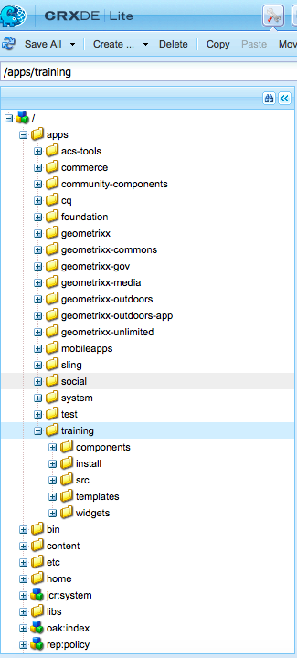
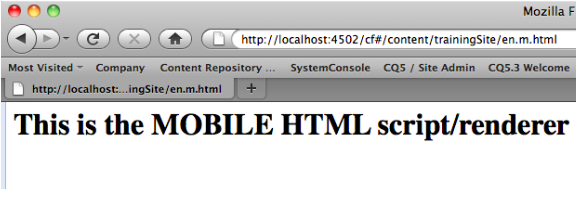
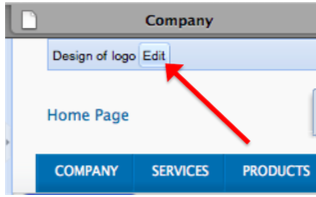

# Understanding the Technology

## Open Systems Gateway Initiative (OSGi)
* Consortium that has developed a specification to build modular and extensible applications
* Allow building applications as a set of reloadable and strongly encapsulated services
* OSGi container manages relations among bundles, which are simply JAR files that contain extra metadata indicating what services they require and which they provide

##  OSGi Framework
* Made up of three layers, that define how extensible applications are built and deployed
    * Module - define how a module, or a Bundle in OSGi-speak, is defined. Plain old JAR file, whose manifest file has some defined entries
    * Lifecycle - defines that states a bundle may be in and describe the state changes. By providing a class implements the *BundleActivator* interface and which is named in the *Bundle-Activator* manifest header, a bundle may hook into the lifecycle process when the bundle is started and stopped
    * Services - describes a registry for services, which may be shared

## Java Content Repository (JCR)
* Defines abstract model and a Java API for data storage and related services commonly used by content-oriented applications
* Object database that provides various services for storing, accessing, and managing content
* Hierachically structured storage, versioning, access control, full text searching, and event monitoring
* Provides generic application data store for both structured and unstructured content
* File systems provide storage for unstructured, hierachical content
* Databases provide storage for structured data due to transactional services and referential integrity functionality
* JCR provides the best of both storage architectures, plus observation, versioning, and full text search
* Support namespaces - prevent naming collisions among items and node types that come from different sources and application domains

## JCR Structure
* Consists of a set of one or more workspaces, each containing a tree of nodes with associated properties
* Each node has one *primary node type* which defines the characteristics of the node
* Associated with any node, zero or more *mixins*, which define additional node characteristics and behaviors
* Data is stored in the properties, which may hold simple values such as numbers and strings or binary data of arbitrary length
* Nodes may point to other nodes via a special reference type property

## Representational State Transfer (REST)
* Architecture style for distributed system
* Application data and state are represented as a set of addressable resources which present a uniform interface that allows transfers of state
* Best example of REST-ful architecture is the web, where "resources" have URIs and the "uniform interface" is HTTP
* HTTP framework (addressable resources + "verbs" + standard ways to transmit metadata)
* REST-ful web applications try to leverage HTTP in its entirety using specific architectural principles
    1. Resource-oriented
    2. Addressable Resources
    3. A Uniform, Constrained Interface
    4. Representation oriented
    5. Communicate statelessly

## Apache Sling
* Web framework that uses a Java Content Repository, such as Apache Jackrabbit or Adobe CRX to store and manage content
* Sling use either script or Java servlets, selected based on simple name conventions, to process HTTP requests in a RESTful way
* Built as a series of OSGi bundles and makes heavy use of a number of OSGi core and compendium services
* Oriented around resources, which usually map into JCR nodes

## Everything is a Resource
* A resource is Sling's abstraction of the object addressed by the URI
* Sling resources usually map to a JCR node
* Servelts and Scripts are handled uniformly in that they are represented as resources themselves and are accessible by the resource path

## Sling Script Resolution
* Type of content to be rendered is not the first processing consideration
* Main consideration is whether the URL resolves to a content object for which a script can then be found to perform the rendering
* Processing is driven by the URL of the HTTP request. This defines the content to be displayed by the appropriate scripts. To do this, information is extracted from the URL
* When appropriate resource (content node) is located, the resource type is extracted from the resource properties
* sling:resourceType property is a path, which locates the script to be used for rendering the content

## Sling and MVC
* Sling is *totally* MVC:
    * Model = JCR repository
    * Controller = Sling engine (url processing, resource + script resolution)
    * View = custom rendering script/servlets, both for read and write (GET + POST)

# 2. Installation and Deployment

# EXERCISE - Install & Start an Author Instance

## What is an Author instance?
* CQ installation content authors will login to and manage pages
* Include: creating, editing, deleting, moving, etc

## What will we install?
* CQSE - Day's Servlet engine
* CRX - Day Software implementation of JSR 283
* CQ WCM
* Product Documentation
* Reference Web Site

## How to install an Author instance
* 1. Rename jar file {cq}-{author}-{port}.jar
* 2. Run command: java -Xmx1024m -jar aem-author-p4502.jar -gui

## Logging into CQ5
* URL: http://localhost:4502 
	* Username: admin
	* Password: admin

# EXERCISE - Create and Edit a CQ Page

## What are the available Author interfaces?
* Navigate to: localhost:4502/welcome.html
	* 
* Websites - access all the pages in your website; create, edit, and delete pages; start a workflow; activate and deactivate pages; restore pages, check external links; access user index
* Digital Asserts - manage digital assets
* Campaigns - Manage marketing campaigns
* Inbox - Manage workflow inbox items
* Users - Manage users and permissions
* Tools - Manage packages, designs, importers, workflow templates and scripts, replication agent and upgrades
* Tagging - Manage tags and taxonomies

## To Edit a page
* 1. Click on the Websites button on the Welcome Screen or http://localhost:4502/siteadmin
* 2. Navigate to **Geometrixx Demo Site** => **English** => **Company** => **News**. Then open the **Press Releases** Page
	* 
* 3. After you open the page, switch to class view by remove the **editor.html** in the URL bar
* 4. You can start to add content. You do this by adding new or existing paragraphs (also called components) from the Sidekick
	* 

## To Create a new page
* 1. On Site Admin screen, Select a web site. **Click New..New Page** on the right-hand toolbar
	* 

# EXERCISE - Browse Related Application/Server Interfaces

## What interfaces exist?
* **CRX interface**
	* http://localhost:4502/crx/de
* **Apache Felix interface**
	* http://localhost:4502/system/console
* **ClientLibs**
	* http://localhost:4502/libs/cq/ui/content/dumplibs.html
* **QueryBuilder Debugger**
	* http://localhost:4502/libs/cq/search/content/querydebug.html
* **Tag Administration Console**
	* http://localhost:4502/libs/cq/tagging/content/debug.html
* **i18n Translator**
	* http://localhost:4502/libs/cq/i18n/translator.html
* **Dependency Finder**
	* http://localhost:4502/system/console/depfinder
* **Error Log**
	* http://localhost:4502/bin/crxde/logs?tail=5000
* **ContentSync Console**
	* http://localhost:4502/libs/cq/contentsync/content/console.html

# EXERCISE - Create an Application/Project using CRXDE Lite

## What is CRXDE Lite?
* Embedded into CQ/CRX and enables you to perform standard development tasks in a Web browser
* With CRXDE Lite, you can create and edit files (e.g. JSP, Java, HTML, etc.) folder, Templates, Components, Dialogs, nodes, properties, and bundles; all while logging and integrating with SVN

## What is an application/project?
* Where you will store CQ elements such as Templates, Components, OSGi bundles, and static files

* Recommended structures:
    * /apps/app-name - application container
    * /apps/app-name/components - Components container
    * /apps/app-name/components/page - Page components container
    * /apps/app-name/components/global - global component files
    * /apps/app-name/templates - Templates container
    * /apps/app-name/src - OSGi bundles container
    * /apps/app-name/install - compiled OSGi bundles container

## How to create a project using CRXDE Lite:
* 1. Right-click - then **Create.., Create Folder..**
* 2. Repeat this process until you have created all recommended application/project structure
* 3. Click **Save All**
	* 

# EXERCISE - Create a Template

## What is a Template?
* A Template is used to create a Page and defines which components can be used within the selected scope
* A Template is a hierarchy of nodes that has the same structure as the page to be created, but without actual content
* Each Template will present you with a selection of components available for use
* Templates are built up of Components
* A Template is the basis of a Page
* To create a Page, the Template's content must be copied to the corresponding position in the site-tree (this occurs automatically if page is created using CQ)
* This copy action also gives the Page its initial content and the property sling:resourceType, the page to the "Page" Component that is used to render the page

## How to create a Template
* 1. Right-click on /app/app-name/templates - then select **Create.., Create.. Template**
* 2. Enter the desired Template information in the dialog:
    * Label = the name of the Template/node will be created
    * Title (jcr:title) = title that will be assigned to the Template
    * Description (jcr:description) = description will be assigned to the Template
    * Resource Type (sling:resourceType) - the Component's path will be assigned to the Template and copied to implementing pages
    * Ranking (ranking) = order in which this Template will appear in relation to other Templates
	* 
* 3. Select **Next** for **Allow Paths** - paths where this template may be used to create pages. Click on the plus sign and enter the following value: */content(/.*)?*
* 4. Click **Next** for **Allowed Parents** then select **OK** on **Allowed Children**

## Testing your Template
* 1. Open Site Admin Console and Select Websites
* 2. Choose New Button from the toolbar => New Page
* 3. See the template in the list of available templates in the Create page Dialog
	* 

# EXERCISE - Create a "Page-rendering" Component

## What is a "Page-Rendering" Component?
* Components are modular, re-usable units that implement specific functionality/logic to render the content of your Web site
* They have no hidden configuration files, can include other Components, and can run anywhere within CQ5 or in isolation (e.g. portal)
* A Component could be described as a collection of scripts (e.g JSPs, Java Servlets, etc.) that completely realize a specific function
* A "Page" component is typically referenced by a Template

## How to create a "Page-Rendering" Component using CRXDE Lite
* 1. Right-click /apps/app-name/components/page - then select **Create.., Create Component...**
* 2. Enter the desired Component information
	* 
* 3. Select **Next** for **Advanced Component Settings** and **Allowed Parents** then select *OK* on **Allowed Children**
* 4. Enter some HTML code, similar to below
contentpage.jsp
```jsp
<html>
    <head>
        <title>Hello World !!!</title>
    </head>
    <body>
        <h1>Hello World !!!</h1>
        <h2>Welcome to a new Day</h2>
    </body>
</html>
```

# EXERCISE - Create Pages & Web Site Structure

## What is a Page?
* A Page is where content authors will create and edit content that will most likely to be published and viewed by site visitors. It is an exact copy of the Template from which it was created

## How to create a Page
* 1. Select **Websites** in CQ Siteadmin tool - select **New..., New Page...**
* 2. Enter and select the desired Page information and Template on which the Page is based on
	* 
* 3. Open newly create page
* 4. Repeat this process to create a web site structure similar to:
    * Training Site
        * English
            * Company
            * Services
            * Products
                * Triangle
                * Square
                * Circle
        * Espanol

# EXERCISE - Include the "global.jsp" in the Page Component

## Why include the global.jsp script?
* Recommend to include the following code:
```jsp
<%@ include file="/libs/foundation/global.jsp"/>
```
* Provided *global.jsp* declares the Sling, CQ and JSTL taglibs and exposes the regularly used scripting objects defined by the <cq:defineObjects /> tag.
* <cq:defineObjects> tag exposes the following, regularly used, scripting objects which can be referenced by the developer. It also exposes the objects defined by the <sling:defineObjects> tag
    * componentContext - the current component context object of the request (com.day.cq.wcm.api.components.ComponentContext)
    * component - current CQ component object of the current resource (com.day.cq.wcm.api.components.Component)
    * currentDesign - current design object of the current page (com.day.cq.wcm.api.designer.Design)
    * currentPage - current CQ WCM page object (com.day.cq.wcm.api.Page)
    * currentNode - current JCR node object (javax.jcr.Node)
    * currentStyle - current style object of the current cell (com.day.cq.wcm.api.designer.Style)
    * designer - designer object used to access design information (com.day.cq.wcm.api.designer.Designer)
    * editContext - edit context objet of the CQ component (com.day.cq.wcm.api.components.EditContext)
    * pageManager - the page manager object for page level operations (com.day.cq.wcm.api.PageManager)
    * pageProperties - the page properties object of the current page (org.apache.sling.api.resource.ValueMap)
    * properties - the properties object of the current resource (org.apache.sling.api.resource.ValueMap)
    * resource - current Sling resource object (org.apache.sling.api.resource.Resource)
    * resourceDesign - design object of the resource page (com.day.cq.wcm.api.designer.Design)
    * resourcePage - resource page object (com.day.cq.wcm.api.Page)

## How to include the global.jsp script in your "Page" Component
* 1. Open **contentpage.jsp**
* 2. Enter the include statement   
```jsp
<%@include file="/libs/foundation/global.jsp"%>
<html>
    <head>
        <title>Hello World !!!</title>
    </head>
    <body>
        <h1>Hello World !!!</h1>
        <h2>Welcome to a new Day</h2>
    </body>
</html>
```
* 3. Test your script by requesting a Page in CQ
	* If successful, you should not notice any difference

# EXERCISE - Display Basic Page Content
* As mentioned previously, in the repository, the nodes define the structure and the properties hold the data
* In order to render content on any page, we need to render the data from those properties

## How can I display basic Page content?
* 3 ways to access content in CQ:
    * Via the **properties** object, an instance of the ValueMap (Sling API) class - contains all properties of the current resource
    ```java
    String pageTitle = properties.get("jcr:title", "TITLE");
    ```
    * Via **currentPage** object, an instance of the Page (CQ API) class - provide some methods to access content
    ```java
    String pageTitle = currentPage.getTitle();
    ```
    * Via **currentNode** object, an instance of the Node (JCR API) class - which provide access to content via the getProperty() method
    ```java
    String pageTitle = currentNode.getProperty("jcr:title").getString();
    ```
    
## How to dynamically display basic Page content in your "Page" Component:
* 1. Open **contentpage.jsp** file
* 2. Enter some JSP and HTML code, similar to below
```jsp
<%@include file="/libs/foundation/global.jsp"%>
<html>
    <head>
        <title><%= currentPage.getTitle() == null ? currentPage.getName() :
currentPage.getTitle() %></title>
    </head>
    <body>
        <h2>properties</h2>
        Title: <%= properties.get("jcr:title") %><br />
        <h2>currentPage</h2>
        Title: <%= currentPage.getTitle() %><br />
        Name: <%= currentPage.getName() %><br />
        Path: <%= currentPage.getPath() %><br />
        Depth: <%= currentPage.getDepth() %><br />
        <h2>currentNode</h2>
        Title: <%= currentNode.getProperty("jcr:title").getString() %><br />
        Name: <%= currentNode.getName() %><br />
        Path: <%= currentNode.getPath() %><br />
        Depth: <%= currentNode.getDepth() %><br />
	</body>
</html>
```
* 3. Test your script by requesting a Page in CQ
	* If successful, you should new see content related to the requested Page, similar to the image below
	* 

# EXERCISE - Create Multiple Scripts/Rendereres for the "Page" Component
* Allow for multiple views of the same content

## What is Sling and why have multiple scripts/renderers for a Component?
* Using Apache Sling, the type of content to be rendered is not the first processing consideration
* Instead the main consideration is whether the URL resolves to a content object for which a script can then be found to perform the rendering

## Apache Sling Script Resolution
* All Apache Sling scripts are stored in sub-folders of either /apps or /libs, which will be searched in this order
* With Sling, you specify which script renders a certain entity (by setting the sling:resourceType property in the jcr:content node)
* Script resolution
    * Folders (nodes of type nt:folder) take precedence over jsp file names when resolving using selectors, at least for the first selector
    * Only one selector in a file name has any effect - any files with names containing two selectors don't ever get selected, but names of folders can be used to match the selectors in the request
    * Scripts with HTTP method names is selected as a last resort
    * Scripts with names that include HTTP methods in addition to another selector or extension in a jsp file name are NEVER selected

## The resolution process
* Servlet Resolution Process 4 elements of SlingHttpServletRequest:
    * *resource type* - request.getResource().getResouceType()
    * *request selectors - request.getRequestPathInfo().getSelectorString()
    * *request extension* - request.getRequestPathInfo().getExtension()
    * *request method name*

* The *resource type* is used as a (relative) parent path to the Servlet while *request extension* or *request method* is used as the Servlet (base) name

## How to create multiple scripts/renderers:
* 1. Right-click /app/app-name/components/page/contentpage - select **New, JSP**
* 2. Enter file name (html.jsp)
* 3. Enter some HTML code, similar to below
```jsp
<html>
    <head>
        <title>Hello World !!!</title>
    </head>
    <body>
        <h1>This is the HTML script/renderer </h1>
    </body>
</html>
```
* 4. Repeat those processes for a script/renderer	 named *m.html.jsp*. Change the xt in the *m.html.jsp* script to
```jsp
<h1>This is the MOBILE HTML script/renderer </h1>
```
* 5. Test your multiple scripts/renderes by requesting a Page in CQ that implements this "Page" Component
	* /content/training_site/en/company.html

	* /content/training_site/en/company.m.html


# EXERCISE - Breakout/Modularize the "Page" Component

## What's the difference between a JSP, CQ, and Sling include?
* <%@ include file="myScript.jsp" %> include a complete file into the current file - at compilation time
* <cq:include script="myScript.jsp"/> includes the file at runtime
* Recommends to use <cq:include /> tag
* This takes components and resource type inheritance into account, and is often simpler than strict adherence to Sling's script resolution using selectors and extensions

## How to include a script at runtime using <cq:include/> in your "contentpage" Component
* 1. Remove *html.jsp* and *m.html.jsp* from "Page" Component
* 2. Create a new JSP file named *body.jsp*
* 3. Cut the body code from *contentpage.jsp* and paste it in *body.jsp*
```jsp
<%@include file="/libs/foundation/global.jsp"%>
<body>
    <h2>properties</h2>
    Title: <%= properties.get("jcr:title") %><br />
    <h2>currentPage</h2>
    Title: <%= currentPage.getTitle() %><br />
    Name: <%= currentPage.getName() %><br />
    Path: <%= currentPage.getPath() %><br />
    Depth: <%= currentPage.getDepth() %><br />
    <h2>currentNode</h2>
    Title: <%= currentNode.getProperty("jcr:title").getString() %><br />
    Name: <%= currentNode.getName() %><br />
    Path: <%= currentNode.getPath() %><br />
    Depth: <%= currentNode.getDepth() %><br />
</body>
```
* 4. Open the file **contentpage.jsp**, and enter some JSP and HTML code, similar to below
```jsp
<%@include file="/libs/foundation/global.jsp"%>
<html>
    <head>
        <title><%= currentPage.getTitle() == null ? currentPage.getName() :
currentPage.getTitle() %></title>
    </head>
    <cq:include script="body.jsp" />
</html>
```
* 5. Test your script by requesting a Page in CQ Adminsite

# EXERCISE - Initialize the WCM

## Why initialize the WCM?
* WCM initialization script performs all necessary steps to provie the whole WCM functionality on a page, including: Dialogs, Widgets, WCM CSS & JS, Sidekick, etc

## How to initialize the WCM in "Page" Component
* 1. Open **contentpage.jsp**, enter JSP code, similar to below
```jsp
<%@include file="/libs/foundation/global.jsp"%>
<html>
    <head>
        <title><%= currentPage.getTitle() == null ? currentPage.getName() :
currentPage.getTitle() %></title>
    <cq:include script="/libs/wcm/core/components/init/init.jsp"/>
</head>
    <cq:include script="body.jsp" />
</html>
```
* 2. Test your script be requesting a Page
	* If successful, you should see the Sidekick appear
	* Remove the **editor.html** in URL to change to Classic Mode
	* 	

# EXERCISE - Extend the Foundation "Page" Component

## Why extend custom/foundation Components?
* Components can inherit the hierarchical structure of another Component include script files, Dialogs, etc.
* Allows you to easily reuse scripts, Dialogs, etc.
* Components within CQ are subject to 3 different hierarchies
    * Resource Type Hierarchy
    * Container Hierarchy
    * Include Hierarchy

## How to extend the foundation "Page" Component using CRXDE
* 1. Right-click on *contentpage* component - select **New, Property**
* 2. Enter the property:
    * Name: sling:resourceSuperType
    * Type: String
    * Value: foundatation/components/page
* 3. Open the **contentpage.jsp**, enter some jsp code, similar to below, removing the <head> section and including the head.jsp script that we inherited from the foundation "Page" Component
```jsp
<%@include file="/libs/foundation/global.jsp"%>
<html>
    <cq:include script="head.jsp" />
    <cq:include script="body.jsp" />
</html>
```
* 4. Test your script by requesting a Page in CQ

# EXERCISE - Extend the Script Structure of the "Page" Component

## Why add additional structure?
* Allow to more easily reuse Components in the future

## How to add additional structure to the "Page" Component
* 1. Create 3 new JPSs (header.jsp, content.jsp, footer.jsp)
* 2. Open the **header.jsp**, enter some HTML and JSP code
```jsp
<%@include file="/libs/foundation/global.jsp" %>
<div class="header">
    <div class="container_16">
        <div class="grid_8">
           <div> logo </div>
        </div>
        <div class="grid_8">
            <div class="search_area">
                <div> userinfo </div>
                <div> toptoolbar </div>
                <div> search </div>
                <div class="clear"></div>
            </div>
        </div>
        <div> topnav </div>
    </div>
</div>
```
* 3. Open the **content.jsp**, enter some HTML and JPS code
```jsp
<%@include file="/libs/foundation/global.jsp" %>
<div class="container_16">
    <div class="grid_16">
        <div> breadcrumb </div>
        <div> title </div>
    </div>
    <div class="grid_12 body_container">
        <div> par </div>
    </div>
    <div class="grid_4 right_container">
        <div> newslist </div>
        <div> rightpar </div>
</div>
    <div class="clear"></div>
</div>
```
* 4. Open the **footer.jsp**, enter some HTML and JPS code
```jsp
<%@include file="/libs/foundation/global.jsp" %>
<div class="footer container_16">
    <div class="grid_6">
        <div> toolbar </div>
    </div>
    <div class="clear"></div>
</div>
```
* 5. Open the **body.jsp**, enter some HTML and JPS code
```jsp
<%@include file="/libs/foundation/global.jsp" %>
 <body>
     <div class="bg">
        <cq:include script="header.jsp"/>
        <cq:include script="content.jsp"/>
        <cq:include script="footer.jsp"/>
    </div>
</body>
```
* 6. Test your script by requesting a Page in CQ
	* If successful, you should see a simple text output of words
	* 

# EXERCISE - Create and Assign a new Design

## What is a Design and why do I need it?
* Allow you to separate content and desgin
* Enforce a consistent look and feel across your web site, as well as share global content
* Many Pages use the same Design, will have access to common CSS files and images

## How to create a Design for your Web site, using CQ5 Tools Console
* 1. Navigate to the "Tools" section of CQ
    * URL : http://localhost:4502/libs/wcm/core/content/misc.html
* 2. Select "Design" Folder - then select **New..., New Page...**
* 3. Enter the Design properties in the dialog
	* 

* 4. Select Geometrixx Design, copy *static.css* and *image* folder to our new Design Folder

## How to assign a Desgin to your Web site, using CQ siteadmin
* 1. Go to "Websites" section of CQ:
    URL: http://localhost:4502/siteadmin
* 2. Open root page of your web site - /content/training_site
* 3. Select "Page Properties" in the Sidekick
	* 
* 4. Select **Advanced** - then select **Desgin** Option
* 5. Select newly created **TrainingDesign**
	* 

## EXERCISE - Create a Navigation Component

## Why do I create dynamic navigation?
* Allow for web site structure to be easily modified and represented/navigated in real-time

## How do I create dynamic navigation?
* Consider the following image, which represents a simple Web site structure
	* 

* To create a dynamic navigation component that display all the valid, children Page of a language Page (e.g "en"), you need to identify the following:
	* What Page is being requested?
	* At what level does the requested Page exists?
	* Is the requested Page valid?

* Important Java classes/interfaces:
    * com.day.cq.wcm.api.Page
    * com.day.cq.wcm.api.PageFilter
    * com.day.cq.wcm.api.PageManager

## How to create a dynamic navigation Component
* 1. Right-click /apps/app-name/components - then select **New Component**
* 2. Enter the desired Component information - then click **Finish**
	* 

* 3. Open **topnav.jsp**, and enter some HTML and JSP code
```jsp
<%--
Draws the top navigation
--%>
<%@include file="/libs/foundation/global.jsp"%><%
%><%@ page import="java.util.Iterator,
        com.day.text.Text,
        com.day.cq.wcm.api.PageFilter,
        com.day.cq.wcm.api.Page,
        com.day.cq.commons.Doctype,
        org.apache.commons.lang.StringEscapeUtils" %><%
// get navigation root page Page
Page navRootPage = currentPage.getAbsoluteParent(2);
// check to make sure the page exists
if (navRootPage == null && currentPage != null) {
    navRootPage = currentPage;
}
if (navRootPage != null) {
   Iterator<Page> children = navRootPage.listChildren(new PageFilter
(request));
%> <ul>  <%
   while (children.hasNext()) {
         Page child = children.next();
%>
         <li>
            <a href="<%= child.getPath() %>.html">
            <%= StringEscapeUtils.escapeXml(child.getTitle())%> </a>
</li> <%
}
%> </ul> <%
} %>
```
* 4. Open **header.jsp** and replace "topnav" div with <cq:include> of the navigtaion Component
```jsp
<%@include file="/libs/foundation/global.jsp" %>
<div class="header">
  <div class="container_16">
     <div class="grid_8">
        <div> logo </div>
     </div>
     <div class="grid_8">
        <div class="search_area">
           <div> userinfo </div>
           <div> toptoolbar </div>
           <div> search </div>
           <div class="clear"></div>
         </div>
     </div>
     <cq:include path="topnav" resourceType="training/components/topnav" />
  </div>
</div>
```
* 5. Test your script by request a Page
	* If successful, you should see navigation links/titles related to your web site structure
	* 

# EXERCISE - Add a Log Message

## Why add log message?
* Monitor the values of variables assigned/used
* *log* object already provided when include *global.jsp*

## How to add a log messge
* 1. Open **topnav.jsp**, enter some JSP code
```jsp
while (children.hasNext()) {
    // get next child page
    Page child = children.next();
	//log message
	log.info("Child page [{}] found.", child.getTitle());
```
* 2. Test your script by request a Page. Check file error.log in */crx-quickstart/logs* folder

# EXERCISE - Enable the Debugger
* Goal - to enable the debugger in CQ and CRXDE. This allows to more easily debug various scripts

## Why enable the debugger?
* Monitor the sequence of steps executed by the system

## How to enable debugging in CQ and CRXDE
* 1. Shutdown CQ author instance
* 2. Navigate to where CQ has been installed
* 3. Enter following command
    * java -Xmx1024 -Xdebug -Xrunjdwp:transport=dt_socket,server=y,address=30303,suspend=n -jar aem-author-4502.jar
* 4. Start CRXDE Lite - Tools - Install SiteCatalyst Debugger
	* 

# EXERCISE - Create a Title Component

## What is a Dialog?
* Provide author the ability to write content
* CQ Dialog is similar to other dialogs: it gather user input via a "form", potentially validates it, and then makes that input available for further use

* The root node of the Dialog has to be of node type "cq:Dialog" and named "dialog"

* Below this Dialog root node, the nodes for the tabs of the Dialog have to be added
* These "tab nodes" must be of node type "cq:WidgetCollection"

* Below the "tab nodes" the "widget nodes" can then be added
* The "widget nodes" must be of node type "cq:Widget"

## How to create a title Component with a Dialog
* 1. Create a new title "content" Component
	* 
* 2. Open the file **title.jsp**, and add some JSP and HTML code
```jsp
<%@include file="/libs/foundation/global.jsp"%>
<h2><%= properties.get("title", currentPage.getTitle()) %></h2>
```
* 3. Open the file **content.jsp** and replace the "title" <div> with a <cq:include> of the title Component
```jsp
<%@include file="/libs/foundation/global.jsp" %>
<div class="container_16">
 <div class="grid_16">
    <div> breadcrumb </div>
    <cq:include path="title_node" resourceType="training/components/title" />
 </div>
 <div class="grid_12 body_container">
     <div> par </div>
 </div>
 <div class="grid_4 right_container">
     <div> newslist </div>
     <div> rightpar </div>
</div>
 <div class="clear"></div>
</div>
```
* 4. Test your script
	* 
* 5. Right-click the title Component - the select **New, Dialog**
* 6. Enter the desired Dialog properties
	* 
* 7. Right-click the *tab1* node - then select **New, Node**
    * Name = items
    * Type = cq:WidgetCollection
* 8. Create a new node under newly create *items* node
    * Name = title
    * Type = cq:Widget
* 9. Select the newly created *title* node - create new Property
    * The property defines where the content is stored
        * Name = name
        * Type = String
        * Value = ./title
    * The property defines the Widget type
        * Name = xtype
        * Type = String
        * Value = textfield
    * The property defines that label applied to the Widget
        * Name = fieldLabel
        * Type = String
        * Value = Enter Title Here
* 10. Test your script/Dialog - double-click the "title" content
* 11. Enter the desired custom title
	* 
* 12. Review the Page output of the title content
	 *

# EXERCISE - Create a List Children Component

## Create a List Children Component

## Create a List Children Component
* Using Page, PageFilter, and PageManager classes, create a *listChildren* component

* 1. Include/import the appropriate Java classes
* 2. Get a property whose value will be come the parent of the list
* 3. If the property is empty, use a default
* 4. Use the path that the author entered to get the parent page (use pageManger object)
* 5. Set up a page iterator, filtering by valid pages
* 6. Iterate over the children
* 7. For each child, write out a link
* 8. Create a diaglog box
* 9. Place an input widget on the dialog box so the author can enter the list parent
* 10. Edit *content.jsp*. Replace the placeholder for *newslist* with a <cq:include> of you new component

# EXERCISE - Create a Logo Component
* To create a Component that allows designers to manage a Web site's logo (binary content), through the use of a Design Dialog

## Why use Design Dialog?
* To enforce a consistent look and feel across your site, as well as share global content
* Allows content authors/designers to write binary content and have it displayed

## How to create a logo Component with a Design Dialog
* 1. Using the same steps, create a new logo Component
    * Important - use SuperType *foundation/components/parbase*
    * Recommend to extend this "helper" Component to render images, titles
	* 
* 2. Open the file **logo.jsp**, and add some HTML and JSP code
```jsp
<%@include file="/libs/foundation/global.jsp"%>
<%@page import="com.day.text.Text,
    com.day.cq.wcm.foundation.Image,
	com.day.cq.commons.Doctype" %>
<%
String home = Text.getAbsoluteParent(currentPage.getPath(), 2);
Resource res = currentStyle.getDefiningResource("fileReference");
if (res == null) {
    res = currentStyle.getDefiningResource("file");
}

log.error("path is:" + currentStyle.getPath());
%><a href="<%= home %>.html"><%
if (res == null) {
	%> Home Page <%
} else {
	Image img = new Image(res);
    img.setItemName(Image.NN_FILE, "file");
    img.setItemName(Image.PN_REFERENCE, "fileReference");
    img.setSelector("img");
    img.setDoctype(Doctype.fromRequest(request));
    img.setAlt("Home Page");
    img.draw(out);
}
%></a>
```
* 3. Open the file **header.jsp**, replace the "logo" <div> with a <cq:include> of the logo Component
```jsp
<%@include file="/libs/foundation/global.jsp" %>
<div class="header">
   <div class="container_16">
      <div class="grid_8">
         <cq:include path="logo" resourceType="training/components/logo" />
      </div>
      <div class="grid_8">
         <div class="search_area">
            <div> userinfo </div>
            <div> toptoolbar </div>
            <div> search </div>
            <div class="clear"></div>
         </div>
      </div>
      <cq:include path="topnav" resourceType="training/components/topnav" />
   </div>
</div>
```
* 4. Test your script by request a page
	* 
* 5. Create a new Design Dialog for the Logo Component
	* 
* 6. Create an **items** node (nodeType cq:WidgetCollection) under the *tab1* node of the logo Component
* 7. Create an **absParent** node (nodeType cq:Widget) under the *items* node
* 8. Assign the following properties to *absParent*
    * property defines where the content is stored
        * Name = name
        * Type = String
        * Value = ./absParent
    * property defines the Widget type
        * Name = xtype
        * Type = String
        * Value = textfield
    * property defines the label
        * Name = fieldLabel
        * Type = String
        * Value = Parent Level (absolute)
    * property gives the author extra information
        * Name = fieldDescription
        * Type = String
        * Value = (e.g 1 for /content/site)
* 9. Copy the node /libs/foundation/components/image/dialog/items/image - paste to the logo's Desgin Dialog so that is a sibling of *tab1* node
* 10. Review the properties associated with this *smartimage* widget
* 11. Test your script by requesting a page. Select **Design Mode* on Sidekick, and select "Edit" for logo Component to invoke the Design Dialog
	* 
	* 
* 12. Enter the design custom logo
	* 
* 13. Select **Edit** mode - then review the Page output
	* 

# EXERCISE - Include the Foundation Breadcrumb Component

## Why include a foundation Component?
* Large amount of Component provided out-of-the-box
* Location: /libs/foundation/components
* Act as learning tools, providing excellent examples of what you can do as within CQ as a developer
* Extend those Components to provide a custom solution

## How to include the foundation breadcrumb Component
* 1. Open the file **content.jsp** and replace the "trail" <div> section with a <cq:include> of the foundataion breadcrumb Component
```jsp
<%@include file="/libs/foundation/global.jsp" %>
<div class="container_16">
   <div class="grid_16">
      <cq:include path="breadcrumb" resourceType="foundation/components/
breadcrumb" />
      <cq:include path="title_node" resourceType="training/components/
title" />
   </div>
   <div class="grid_12 body_container">
      <div> par </div>
   </div>
   <div class="grid_4 right_container">
      <cq:include path="newslist" resourceType="training/components/
listChildren" />
      <div> rightpar </div>
</div>
   <div class="clear"></div>
</div>
```
* 2. Test your script by requesting a Page in CQ
	* 

# EXERCISE - Modify the Foundataion Breadcrumb Component

## Modify the Foundation Breadcrumb component
* 1. Create the *foundation/components* structure in */apps* and copy the Foundataion breadcrumb component to the *components* folder
* 2. Modify the code to allow the author to enter the start of the crumb as a path, instead of as a level
* 3. Modify the Design Dialog to allow the author to enter a path
* 4. Test your code
* 5. Examine the repository to see the value written into the design when athor enters values into the design dialog box and saves them

# EXERCISE - Modify your topnav component
* Goal - to modifty your local topnav component so that the code allows an author with design privileges to set the parent of the navigation by entering a path

## Modify your topnav component
* 1. Make modifications to obtain the following result:
    * Author/designer can enter a path design to set the parent of the top navigation list of pages

# EXERCISE - Include the Foundation Paragraph System Component

## What is the foundation Paragraph System Component?
* Necessity when wanting to have manageable and scable Page content, without requiring excessive coding/Template creation
* location:
    * /libs/foundation/components/parsys
* Allows content authors the ability to dynamically add, delete, move, copy and past "paragraphs" on a Page
* Ability to use the column control Component to structure your content in columns
* Should be used as often as possible, thus allowing for mere simple Component configuration as opposed to creating a large number of Templates

## How to include the foundation paragraph system Component
* 1. Open the file **content.jsp** and replace the "par" <div> section with a <cq:include> of the foundation paragraph system Component
```jsp
<%@include file="/libs/foundation/global.jsp" %>
<div class="container_16">
   <div class="grid_16">
      <cq:include path="breadcrumb" resourceType="foundation/components/
breadcrumb" />
      <cq:include path="title_node" resourceType="training/components/
title" />
  </div>
  <div class="grid_12 body_container">
     <cq:include path="par" resourceType="foundation/components/parsys" />
  </div>
  <div class="grid_4 right_container">
     <cq:include path="newslist" resourceType="training/components/
listChildren" />
     <div> rightpar</div>
  </div>
  <div class="clear"></div>
</div>
```
* 2. Test your script by requesting a Page in CQ
	* 
* 3. Select **Design mode** on your Sidekick - then select **edit** for the parapgraph system Component to invoke the Design Dialog
* 4. Select the Components you like to allow for this instance of the paragraph system
	* 
* 5. Select **Edit mode** - then review the Page output of the paragraph system Component
	* 
* 6. Add contents to the Page by drop-and-drag the desired Component(s) into the parapgraph system

# EXERCISE - Content Finder and Drag-and-Drop

## Create a Simple Image Component
* 1. Right-click /apps/app-name/component - then select **New, Component**
* 2. Enter the desired Component properties
    * Label = myImage
    * Title = Training Image Component
    * Description = Simple Image Component
    * Super Resource Type = foundation/components/parbase
    * Group = Training
    * Allowed Parents = */*parsys
* 3. Enter the following code into **myImage.jsp**
```jsp
<%@ page import="com.day.cq.wcm.foundation.Image" %>
<%@include file="/libs/foundation/global.jsp"%>
<%
    Image image = new Image(resource);
    image.setSelector(".img"); // use image script
    image.draw(out);
%><br>
```

## Create a Component Dialog Box for our Image Component
* 1. Right-click your myImage Component and select **New... Dialog**
* 2. Define the following properties on the *items* parent of the *tab1* node:
    * property defines widget reference
        * Name = xtype
        * Type = String
        * Value = cqinclude
    * property defines the path to the reference
        * Name = path
        * Type = String
        * Value = /libs/foundataion/components/image/dialog/items.infinity.json
* 3. Delete the *tab1* node

## Add the myImage Component to the Sidekick
* 1. Select **Design** mode
* 2. Click Edit button on **Design of par**
* 3. Select Training Group
* 4. Return to **Edit mode** by expanding the Sidekick

## Test your Image component
* 1. Drag the Training Image componet onto a page
* 2. Try to drag an image onto the thumbnail. Note that drag-and-drop does not work yet. We have not yet defined the *editConfig* nodes and properties that will support this functionality
* 3. Drag-and-drop into the dialog box does work
* 4. Drag an image onto the dialog box

## Defining editConfig
* 1. Right-click on your Image component. Select **New... Node**
    * Name: cq:editconfig
    * Type cq:EditConfig
* 2. Righ-click the new *cq:editConfig* node and select **New... Node**
    * Name: cq:dropTargets
    * Type: nt:unstructured
* 3. Right-click the new *cq:dropTargets* node and select **New... Node**
    * Name: image
    * Type: cq:dropTargetConfig
* 4. Add property of new *image* node
    * Name: groups - Value: media
    * Name: accept - Value: image/.*
    * Name: propertyName - Value: ./fileReference
* 5. Test the new functionality by dragging a new Training Image component onto the page and the draggin an image from the Content Finder onto the new paragraph

# EXERCISE - Create a Search Component
* Allow users to search the content of the web site/repository based on a query string provided in the request

# How can I search web site content?
* 1. An HTML form is needed to collect the user's input
* 2. Capture the search string
* 3. Prepare a query statement based on the search string
* 4. Collect and parse the query results
* 5. Output the query results

* When querying a Java Content Repository (JCR), some basic functionality (API calls) need to be implemented:
    * javax.jcr.Session - JCR session - Node.getSession()
    * javax.jcr.Workspace - JCR workspace - Session.getWorkspace()
    * javax.jcr.query.QueryManager - used to create Query objet - Workspace.getQueryManager()
        * createQuery(String statement, String language) - creates the Query object
    * javax.jcr.Query
        * execute() - executes this Query and returns a QueryResult object
    * javax.jcr.query.QueryResult
        * getRows() - returns an iterator over the Rows of the query table

## How to create a search Component
* 1. Create new search "content" Component
	* **Allowed Parents**: */*parsys
	* 


* 2. Open the file search.jsp, and enter some HTML and JSP code, similar to below
```jsp
<%@include file="/libs/foundation/global.jsp"%>
<%@ taglib uri="http://java.sun.com/jsp/jstl/core" prefix="c" %>

<%@ page import="javax.jcr.query.QueryResult,
                javax.jcr.query.Query,
                javax.jcr.Node,
                javax.jcr.NodeIterator,
                org.apache.commons.lang.StringEscapeUtils,
				java.util.List, java.util.ArrayList" %>
<%
%>

<center>
    <form action="${currentPage.path}.html">
        <input name="q" value="${param.q}" />
   		<input value="Search" type="submit" />
     </form>
</center>
<br />

<%
String queryParam = slingRequest.getParameter("q");
if (queryParam != null && ! "".equals(queryParam)) {
    String stmt = "select * from cq:Page where jcr:path like '/content/training_site/%' and contains(*, '" + queryParam + "') order by jcr:score desc";
    Query query = currentNode.getSession().getWorkspace().getQueryManager().createQuery(stmt, Query.SQL);
	QueryResult results = query.execute();

    if (results.getNodes() != null && results.getNodes().hasNext()) {
		NodeIterator it = results.getNodes();
        List<Page> listPage = new ArrayList<Page>();
        while (it.hasNext()) {
       		Node node = it.nextNode();
    		String npath = node.getPath();
    		Page contentPage = pageManager.getContainingPage(resourceResolver.getResource(npath));
			listPage.add(contentPage);
    		}
        pageContext.setAttribute("listPage", listPage);
	}
}
%>

<c:choose>
    <c:when test="${listPage != null}">
		<c:forEach var="page" items="${listPage}">
    		<div class="searchresult"><a href="${page.path}.html">${page.title}</a></div>
		</c:forEach>
    </c:when>
</c:choose>
```
* 3. Add your search Component to the paragraph system Component in **Design mode**
* 4. Test your script by adding an instance of this Component to the paragraph system Component of a Training Page
	* 
* 5. Search for a word

# EXERCISE - Apply i18n to a Component

## Why use i18n?
* To provide dynamic Dialog "messages" based on author's language preference

## What is i18n and when should I use it?
* Internationalization is stored in the repository under nodes (nodeType sling:Folder) named i18n
* The children nodes (nodeType sling:Folder + mixin mix:language) of the i18n node represent languages and are named after the ISO code of the languages that should be supported (e.g. en, de, fr, etc.)
* Below those langauge nodes are the message nodes (nodeType sling:MessageEntry), which will contain a simple key-message pair

* The location of the i18n node within the repository decides its scope

## How to apply i18n to the title Component
* 1. Create an **i18n** node (nodeType sling:Folder) under the root node of the title Component
* 2. Create an **en** node (nodeType sling:Folder) under the newly created *i18n* node
* 3. Assign **mixin**, mix:language to the newly created *en* node
	* 
* 4. Set the following property on the newly created *en* node
    * property identifies the language using the ISO language code
        * Name = jcr:language
        * Type = String
        * Value = en
* 5. Create a **fieldLabel** node (nodeType sling:MessageEntry) under the newly created *en* node
* 6. Assign the following properties to the newly created *fieldLabel* node
    * property identifies the message key
        * Name = sling:key
        * Type = String
        * Value = i18n-title
    * property identifies the message
        * Name = sling:message
        * Type = String
        * Value = Enter Title Here (i18n style)
* 7. Change the **fieldLabel** property (Value = i18n-title) on the title Component's Dialog *title* node
* 8. Repeat steps 2-7 for an additional language
    * ISO code for Spanish = es
    * sling:key value = i18n-title
    * sling:message value = Titulo
* 9. Test your script/Dialog
	* If successful, you should see Dialog output similar to the image below
	* 

# EXERCISE - Create and Register a Widget
* Allow to apply custom Widgets to Dialog and Design Dialogs

## Why do I need custom Widgets?
* Actually, you may never need to create a custom Widget
* CQ and ExtJS Widgets provided OOTB cover a large array of potential user input user-cases and are highly configurable
* Recommend to study available Widgets and configurations via the CQ-Widgets-API: http://dev.day.com/docs/en/cq/current/widgets-api/index.html

* Introduce <cq:includeClientLib> tag - includes a CQ html client library, which can be a *js*, a *css* or a *theme* library
    * **categories** - list of comma-separated client lib categories. This will include all Javascript and CSS libraries for the given categories
    * **theme** - list of comma-separated client lib categories. This will include all theme related libraries (both CSS and JS) for the given categories
    * **js** - list of comma-separated client lib categories. This will include all JavaScript libraries for the given categories
    * **css** - list of comma-separated client lib categories. This will include all CSS libraries for the given categories
    * **themed** - indicates of only themed or non themed libraries should be included

## How to create a JS library of new xtype/Widgets
* 1. Create a **widgets** node (nodeType cq:ClientLibraryFolder) under the root node of the Training Project (e.g /apps/training/widgets)
	* 

* 2. Assign the following properties to the newly created *widgets* node
    * property identifes the category these custom Widgets will be referenced by
        * Name = categories
        * Type = String[]
        * Value = training.widgets
    * property identifies a dependency on core cq libraries
        * Name = dependencies
        * Type = String[]
        * Value = cq.widgets
    * property defines the component this resource is based on
        * Name = sling:resourceType
        * Type = String
        * Value = widgets/clientlib
* 3. Create a **files** node (nodeType sling:Folder) under the newly created *widgets* node
* 4. In the *widgets* client library folder, create a file named *js.txt*. In *js.txt* add comma-seperated list of widgets (js filenames) in the order that you want them to be included

## How to register your newly creatd JS library using CRXDE
* 1. Copy the file */libs/foundation/components/page/headerlibs.jsp*. Paste *headlibs.jsp* into the */apps/app-name/components/page/contentpage*
* 2. Open file **headlibs.jsp**, enter HTMl and JSP code, similar to below
```jsp
<%@include file="/libs/foundation/global.jsp" %><%
%>
  <cq:includeClientLib categories="cq.foundation-main"/>
  <cq:includeClientLib js="training.widgets" />
<%
    currentDesign.writeCssIncludes(pageContext);
%>
```

## How to create and text a custom xtype/Widget
* 1. Create a new file in the folder */apps/training/widgets/files*
* 2. Open the file **training.js*, and enter some JS code, similar to below
```javascript
// Create the namespace
Training = {};
// Create a new class based on existing CompositeField

Training.Selection = CQ.Ext.extend(CQ.form.CompositeField, {
    text: "default text",
    constructor : function(config){
        if (config.text != null) this.text = config.text;
        var defaults = {
                height: "auto",
                border: false,
                style: "padding:0;margin-bottom:0;",
                layoutConfig: {
                    labelSeparator: CQ.themes.Dialog.LABEL_SEPARATOR
                },
                defaults: {
                    msgTarget: CQ.themes.Dialog.MSG_TARGET
				} 
        };
        CQ.Util.applyDefaults(config, defaults);

        Training.Selection.superclass.constructor.call(this, config);
        this.selectionForm = new CQ.Ext.form.TimeField({
            name: this.name,
            hideLabel: true,
            anchor: "100%",
            minValue: '8:00am',
            maxValue: '6:00pm',
            intDate: new Date()
        });
        this.add(this.selectionForm);
    },
    processRecord: function(record, path){
        this.selectionForm.setValue(record.get(this.getName()));
	} 
});
CQ.Ext.reg("trainingSelection", Training.Selection);
```
* 3. Create a **training** node (nodeType cq:Widget) under the Training title Component's Dialog *tab1* widget collection
* 4. Assign the following properties to the newly created *training* node
    * property that define where the content is stored
        * Name = name
        * Type = String
        * Value = ./training
    * property that define the Widget Type
        * Name = xtype
        * Type = String
        * Value = trainingSelection
    * property that define the label
        * Name = fieldLabel
        * Type = String
        * Value = Training Selection Widget
* 5. Test your script/Dialog
	* If successful, you should see the custom Dialog xtype, similar to image below
	* 

# EXERCISE - Create and Consume an OSGi Bundle
* Goal - to create and comsume an OSGi Bundle
* Allow you to create and use custom Java classes in your JSP scripts
* Allow for more traditional Java development and library reuse

## What exactly is an OSGi Bundle?
* OSGi defines an architecture of developing and deploying modular applications and libraries (aka Dynamic Module System for Java)
* Allow you to break your application into individual modules and manage the cross-dependencies between them wih
    * services implemented within the container
    * a contract between the container and your application

* Offers dynamic loading/unloading, configuration and control of these bundles - without restarts

## How to create and consume an OSGi bundle
* 1. Right-click the Training projects OSGi bundle source directory (i.e /apps/training/src) - then Select **Create.., Create New Bundle...**
* 2. Enter the Bundle information
* 3. Open the newly created bundle's file *org.training.test.TestBundle.bnd*
* 4. Create a **new Java class** in the newly created bundle source directory
* 5. Enter the "Source folder", "Package", and "Name"
* 6. Open the newly created Java class file **HelloWorld.java**
* 7. Right-click **HelloWorld.java** - then select **Build..Compile**
* 8. Select **org.training.test.TestBundle.bnd** file - then select **Tool
* 9. Open the Training tile Component's **title.jsp**, and enter some HTMl and JSP code
* 10. Test your bundle/script