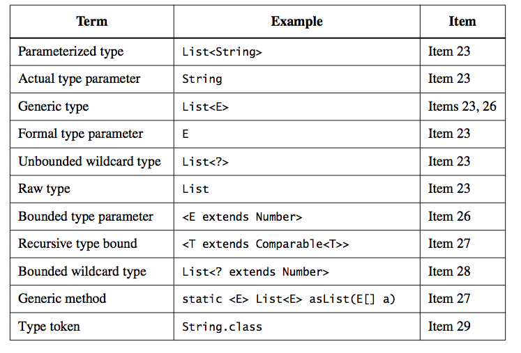

# Chapter 5 - Generics

## Item 23: Don't use raw types in new code
* A class or interface whose declarations has one or more *type parameters* is a *generic* class or interface
* Generic classes and interfaces are collective known as *generic types*
* Each generic type defines a set of *parameterized types*, which consist of the class or interface name followed by an angle-bracketed list of *actual type parameters* (example List<String> is a parameterized type)
* Each generic type defines a *raw type* (example raw type of List<E> is List)

* **If you use raw types, you lose all the safety and expressiveness benefits of generics**
* **You lose type safety if you use a raw type list List, but not if you use a parameterized type like List<Object>**
* **You can't put any element (other than null) into a Collection<?>**
* **You must use raw types in class literals**
    * List.class, String[].class are legal
    * List<String>.class, List<?>.class are not
* **It is illegal to use the instanceof operator on parameterized types other than unbounded wildcard types**

* In summary
    * Using raw types can lead to exceptions at runtime. Don't use them in new code
    * Set<Object> is a parameterized type representing a set that can contain objects of any type
    * Set<?> is wildcard type representing a set that can contain only objects of some unknown type
    * Set is a raw type, which opts out of the generic type system

    

## Item 24: Eliminate unchecked warnings
* **Eliminate every unchecked warning that you can** (assure that you code is typesafe)
* **If you can't eliminate a warning, and you can prove that the code that provoked the warning is typesafe, then (and only then) suppress the warning with an @SuppressWarnings("unchecked") annotation**
* **Always use the SuppressWarnings annotation on the smallest scope possible**
* **Every time you use an @SuppressWarnings("unchecked") annotation, add a comment saying why it's safe to do so**

* In summary:
    * Unchecked warnings are important. Don't ignore them
    * Every unchecked warning represents the potential for a *ClassCastException* at runtime
    * If you can't eliminate an unchecked warning and you can prove that the code that provoked it is typesafe, suppress the warnings with an @SuppressWarnings("unchecked") annotation in the narrowest possible scope
    
## Item 25: Prefer lists to arrays
* Arrays are *covariant* (i.e if Sub is a subtype of Super, then the array type Sub[] is a subtype of Super[])
* Generics are *incovariant*
* Arrays are *reified* (i.e enforce their element types at runtime)
* Generics are implemented by *erasure* (i.e enforce their type constraints only at compile time and discard (or erase) their element type information at runtime
* It is illegal to create an array of a generic type, a parameterized type, or a type parameter (ILLEGAL: new List<E>[], new List<String>[], new E[])
* Types such as E, List<E>, and List<String> are technically known as *non-reifiable*

* In summary:
    * Arrays and generics have very different type rules
    * Arrays are covariant and reified
    * Generics are invariant and erased

## Item 26: Favor generic types
* To summary:
    * Generic types are safer and easier to use than types that require casts
    * Generify your existing types as time permits
    
## Item 27: Favor generic methods
* **The type parameter list, which declares the type parameter, goes between the method's modifiers and its return type**

** In summary:
    * Generic methods, like generic types, are safer and easier to use than methods that require clients to cast input parameters and return values
    * Generify your existing methods to make life easier for new users
    
    
## Item 28: Use bounded wildcards to increase API flexibility
* **For maximum flexibility, use wildcard types on input parameters that represent producers or consumers**
* **PECS stands for producer-extends, consumer-super**
* **Do not use wildcard types as return types**
* **If the user of a class has to think about wildcard types, there is probably something wrong with the class's API**
* **Always use Comparable<? super T> in preference to Comparable<T>
* **Always use Comparator<? super T> in preference to Comparator<T>
* **If a type parameter appears only once in a method declaration, replace it with a wildcard**

* In summary:
    * Using wildcard type in your APIs, while tricky, makes the APIs for more flexible
    * Remember the basic rule: producer-extends, consumer-super PECS
    * All comparables and comparators are consumers
    
## Item 29: Consider typesafe heterogeneous containers
* In summary:
    * The normal use of generics, restricts you to a fixed number of type parameters per container
    * You can get around this restriction by placing the type parameter on the key rather than the container
    * You can use Class objects as keys for such typesafe heterogeneous containers
    * A Class object used in this fashion is called a type token