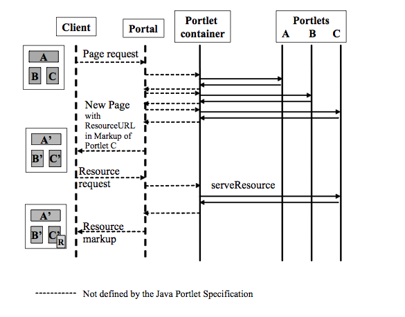

# PLT.13 Resource Serving
* Portlet can create two different kind of resource links in order to serve resources:
    * Direct links to the resource in the same portlet web application. Those links are constructed by the portlet and encoded with the *PortletResponse.encodeURL*. Direct links are not guaranteed to pass through the portal server and will not have the portal context available
    * Resource URL links pointing back to the Portlet. Via these links the *serveResource* method of the *ResourceServingPortlet* interface is called and the portlet can serve the resource. Thus resources served via resource URLs may be protected by the portal security and can leverage the portlet context. Static resources should still be served with direct links in order to allow portal applications to configure and optimize static resource serving in a consistent manner
   
## PLT.13.1 ResourceServingPortlet Interface
* Portlet that want to serve resources addressed via a resource URL must implement the *ResourceServingPortlet* interface with the mode *serveResource*
* The Portlet container must not render any output in addition to the content returned by the *serveResource* call
* For *serveResource* calls the portal should act as a proxy for accessing the resource
* The *serveResource* call normally follows a *render* call and can be viewed as a logical extension of the render phase
* Portlet should not change any state in the *serveResource* call that was issued via an HTTP method GET
* For use cases that require state changes the *serveResource* call should be issue via an HTTP method POST or PUT or DELETE
* For *serveResource* calls only state changes to non-shared state, like the Portlet session scope or portlet preferences, should be performed as otherwise portlets participating in this shared state would display state markup
* Note such state changes impact cache-ability of the resource and set the cache settings accordingly
* *serveResource* call can also be used to implement Asynchronous Javascript and XML (AJAX) use cases

## PLT.13.2 Access to Render Parameters, Portlet Mode, and Window State
* *ResourceRequest* should be provided with the current portlet mode, window state and with current render parameters of the portlet

## PLT.13.3 Access to Request and Response Headers
* Given that Portal/Portlet container does not render any additional markup for a *serveResource* response, it is important for the portlet to be able to access the incoming request headers and to be able to set new headers for the request
* Portlet can access the request headers of HTTP client request through the *getProperty* or *getProperties* call, like all Portlet requests
* Portlet can set HTTP headers for the response via the *setProperty* or *addProperty* call in the *PortletResponse*
* To be successfully transmitted back to the client, headers must be set before the response is committed
* Headers set after the response is committed will be ignored by the portlet container
* Portlet should be aware that the portal may filter out some headers due to the fact that it has already set these headers to a different value or because of security reasons

## PLT.13.4 Getting the HTTP Method
* *ResourceRequest.getMethod* return the HTTP method with which this request was mode, for example, GET, POST, or PUT

## PLT.13.5 Access to the Resource ID
* *setResourceID* set the resource ID on the resource URL
* *getResourceID*
* If no resource ID was set on the resource URL the *getResourceID* method must return *null*

## PLT.13.6 Resource URLs
* Portlet can create resource URLs pointing back to itself via the *createResourceURL* method on the *PortletResponse*
* When an end user invokes such a resource URL the portlet container must call the *serveResource* method of the Portlet or return a valid cached result for this resource URL
* If the portlet does not implement the *ResourceServingPortlet* interface, it is left to the portal/portlet container to either provide some meaningful error handling or ignore the URL
* Portlet container must not call the *processAction* or *processEvent* method
* Resource URLs should be provided with the current portlet mode, window state and render parameters that the portlet can access via the *ResourceRequest* with *getPortletMode*, *getWindowState*, or one of the *getParameter* methods
* ResourceURLs cannot change the current portlet mode, window state or render parameters
* Parameters set on a resource URL are not render parameters but parameters for serving this resource and will last only for the current *serveResource* request
* If a parameter is set that is has the same name as a render parameter that this Resource URL contains, the render parameter values must be the last entries in the parameter value array

## PLT.13.7 Caching of Resources
* The supported use cases for *serveResource* include retrieving new markup fragments based on the current portlet state and allowing the portlet to include portlet URLs in the returned markups
* If Portlet URLs are included in the markup, portals/portlet containers must create correct portlet URLs for all text-based markup types
* If the returned markup of the *serveResource* call includes portlet URLs, the cachability of the markup on the browser will most likely be limited as a common practice of portal application is to encode the state of the portlets in the URL
 * *setCachability* method on the *ResourceURL*, Portlet can indicate that is only needs parts of the overall state via the cache level parameter and thus the portal application can create URLs that result in an increased likelihood of a subsequent browser access being served from a browser/web cache
* *getCachability*  method on the *ResourceURL*, Portlet can retrieve the current cache level
* The following values are defined for the cache level parameter:
    * FULL
    * PORTLET
    * PAGE (default)
    
## PLT.13.8 Generic Portlet Support
* *serveResource* method in the *GenericPortlet* class tries to forward the resource serving to the resource ID set on URL triggering the request for serving the resource
* If no resource ID is set, *serveResource* does nothing
