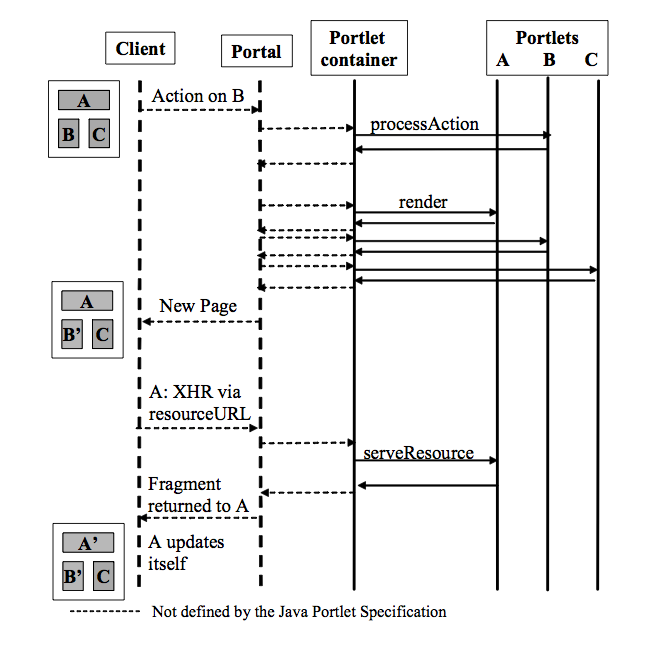

# PLT.14 Serving Fragments through Portlets
* Through *render* method of the Portlet interface the Portlet produces its complete markup that is embedded as a fragment into the overall page by the portal application
* However, there are use cases where the Portlet would like to only replace part of its markup, e.g via an AJAX call:
    * Perform operations that don't need coordination features or changed shared state, like portlet application session scope data, or any navigational state, like render parameters, portlet mode or window state
    * Perform operations that want to leverage coordination features or need to change shared state

## PLT.14.1 Serving Fragments via serveResource Method
* Serving fragments via *serveResource* is under complete control of the Portlet
* Typically Portlet would issue an *XMLHttpRequest* with a resource URL and provide either markup or data as response in the *serveResource*
* The ECMA client side code of the Portlet is then responsible for inserting either the markup or otherwise update the page DOM in a non-disruptive manner for the other components on the page
* Due to the fact that portal application is not involved in serving the fragment several restrictions apply for serving fragments via *serveResource*:
    * No support for coordination like events or shared render parameters
    * *serveResource* call cannot set new render parameters, new portlet mode or window state
    * *serveResource* call cannot issue redirects
    * *serveResource* call should not change application-scoped session state, as other parts of the page will not see these session updates and thus represent an inconsistent user experience

