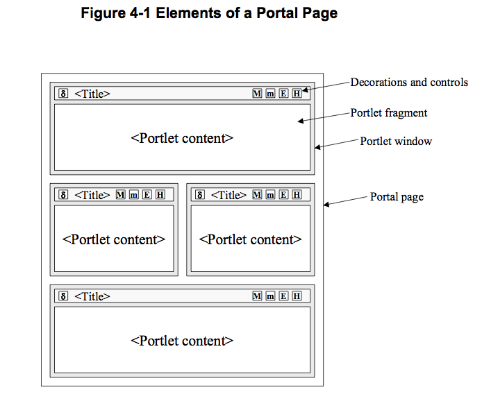
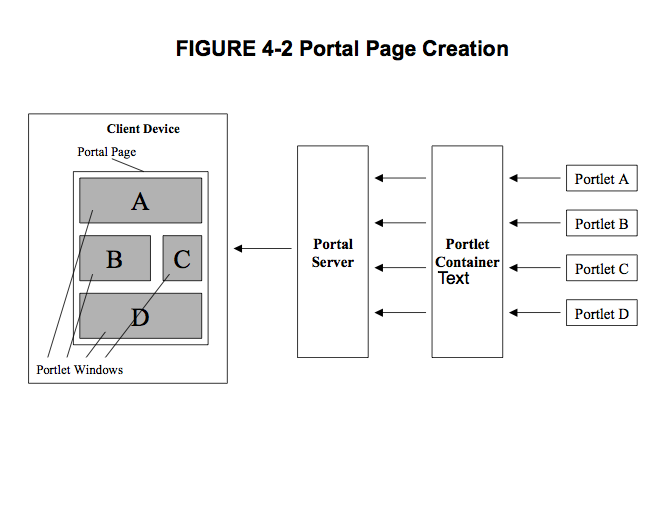

# PLT.4 Portlet Concepts

## PLT.4.1 Portlets
* Portlets provides a componentized user interface (UI) for services. In a Service Oriented Architecture (SOA) one does not write monolithic applications, but separate services that can be orchestrated together into applications. This Service orchestration requires componentized UIs for the services, monolithic web UIs based on Servlets are no longer sufficient
* Portlets provides such a component UI model that is intended to aggregate the component UIs into a larger UI with consistent look and feel. The Java Portlet Specification allows coordination on the UI layer with different means, such as events, application sessions, and public render parameters, in order to provide a deep and seamless integration between the different services
* The predominant applications using Portlets today are Portals aggregating the Portlet markup into Portal Pages, but the Java Portlet Specification and Portlets itself are not restricted to Portals

## PLT.4.2 Embedding Portlets as Elements of a Portal Page
* A Portlet generates markup fragments. A Portal may add a title, control buttons and other decorations to the markup fragment generated by the portlet, this new fragment is called a Portlet Window. Then the Portal may aggregate windows into a complete document, the portal page

* Note that this is only one example on how a Portal could make use of the Portlet markup fragment. There may exist other Portal Implementations with a different Rendering approach. The important part of the Portal Page concept in regards to this specification is that the markup fragment of the Portlet may be not the only markup return in the document to the client. Thus the portlet markup needs to co-exist with whatever other markup the portal produces

### PLT.4.2.1 Portal Page Creation
* Portlets run within a Portlet Container
* The Portlet Container receives the content generated by the Portlets
* Typically, the Portlet Container hands the Portlet content to a Portal
* The Portal Server creates the Portal Page with the content generated by the Portlets and sends it the the client device where it is displayed to the user
 

### PLT.4.2.2 Portal Page Request Sequence
* Users access a Portal by using a client device such as an HTML browser
* Upon receiving the request, the Portal determines the list of Portlets that need to be executed to satisfy the request
* The Portal, through the Portlet Container, invokes the corresponding Portlets
* The Portal creates the Portal Page with the fragments generated by the Portlets and the page is returned to the client

## PLT.4.3 Portlets and Web Frameworks
* The Portlet model provides a clear separation of the state changing logic that is embedded in the *processAction* and the *processEvent* methods and the rendering of markup which is performed via the *render* and *serveResource* methods
* The Portlet model thus follows the popular Model-View-Controller pattern which separates the controller logic from the part the generates the view
* The defaul technology that the Java Portlet Specification provides for rendering views is JSPs
* However,once one starts creating advanced Portlets, existing web frameworks, like Java Server Faces (JSF), Struts, WebWork, Spring MVC Framework, Wicket, or others may be used
* When using such a Web Framework, the Portlets acts as a bridge betwwen the Portlet Environment and the Web Framework
