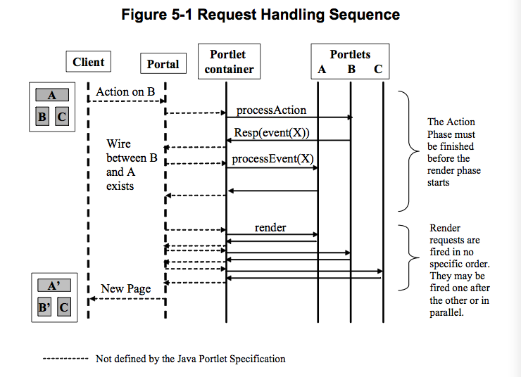

# PLT.5 The Portlet Interface and Additional Life Cycle Interfaces
* The *Portlet* interface is the main abstraction of the Portlet API. All Portlets implement this interface either directly or, more commonly, by extending a class that implements the interface
* The Portlet can optionally implement the additional life cycle interfaces *EventPortlet* and *ResourceServingPortlet* in order to leverage additional functionality for receiving / seding events or serving resources, respectively
* The Portlet API includes a *GenericPortlet* class that implements the *Portlet*, *EventPortlet* and *ResourceServingPortlet* interface and provides default functionality
* Developers should typically extend, directly or indirectly, the *GenericPortlet* class to implement their Portlets

## PLT.5.1 Number of Portlet Instances
* The Portlet definition sections in the deployment descriptor of a Portlet application control how the Portlet Container creates Portlet instances
* For a Portlet, not hosted in a distributed environment (default), the Portlet Container must instantiate and use only one Portlet object per Portlet definition
* In the case where a Portlet is deployed as part of a Portlet application marked as distributed, in the *web.xml* deployment descriptor, Portlet Container may instantiate only one Portlet object per Portlet definition per Virtal Machine (VM)

## PLT.5.2 Portlet Life Cycle
* A Portlet is managed through a well defined life cycle that defines how it is loaded, instantiated and initialized, how it handles request from clients, and how it is taken out of service
* This life cycle of a Portlet is expressed through the *init*, *processAction*, *render* and *destroy* methods of the *Portlet* interface
* The Java Portlet Specfication v2.0 provides additional lifecycle interfaces *EventPortlet* and *ResourceServingPortlet* that the Portlet can implement

### PLT.5.2.1 Loading and Instantiation
* The Portlet Container is reponsible for loading and instantiating Portlets
* The loading and instantiating can occur when the Portlets Container starts the Portlet Application, or deplayed until the Portlet Container determines the Portlet is needed to service a request
* The Portlet Container must load the Portlet class using the same ClassLoader the Servlet Container uses for the Web Application part of the Portlet Application. After loading the Portlet classes, the Portlet Container instantiates them for use

### PLT.5.2.2 Initialization
* After the Portlet object is instantiated, the Portlet Container must initialize the Portlet before invoking it to handle requests
* Initialization is provided so that Portlets can initialize costly resource (such as backend connection), and perform other one-time activiteis
* The Portlet Container must initialize the Portlet object by calling the init method of the *Portlet* interface with a unique (per Portlet definition) object implementing the *PortletConfig* interface. This configuration object provides access to the initialization parameters and the *ResourceBundle* defined in the Portlet Deployment Descriptor
* The configuration object also gives the Portlets access to a context object that describes the Portlet's runtime environment *PortletContext*

#### PLT.5.2.2.1 Error Conditions on Initialization
* During initialization, the Portlet object may throw an *UnavailableException* or a *PortletException*
* In this case, the Portlet Container must not place the Portlet object into active service and it must release the Portlet Object
* The *destroy* method must not be called because the initialization is considered unsuccessful
* The Portlet Container may reattempt to instantiate and initialize the Portlet at any time after a failure
* The exception to this rule is when an *UnavailableException* indicates a minimum time of unavailability
* When this happens the Portlet Container must wait for the specified time to pass before creating and initializing a new Portlet object
* A *RuntimeException* thrown during Initialization must be handled as a *PortletException*

#### PLT.5.2.2.2 Tools Considerations
* The triggering of static initialization methods when a tool loads and introspects a Portlet Application is to be distinguished from the calling of the *init* method
* Developers should not assume that a Portlet is in an active Portlet Container runtime until the *init* method of the *Portlet* interface is called
* For example, a Portlet should not try to establish connections to databases or EJB containers when static (class) initialization happens

### PLT.5.2.3 End of Service
* The Portlet Container is not required to keep a Portlet loaded for any particular period of time
* A Portlet object may be kept active in a Portlet Container for a period of milliseconds, for the lifetime of the Portlet Container, or any amount of time in between
* When the Portlet Container determines that a Portlet should be removed from service, it calls the *destroy* methods of the *Portlet* interface to allow the Portlet to release any resources it is using and save any persistent state. For example, the Portlet Container may do this when it wants to conserve memory resources, or when it is being shutdown
* Before the Portlet Container calls the *destroy* method, it should allow any threads that are currently processing requests within the Portlet object to complete execution. To avoid waiting forever, the Portlet Container can optionally wait for a container-defined time period before destroying the Portlet object
* Once the *destroy* method is called on the Portlet object, the Portlet Container must not route any request to that Portlet object. If the Portlet Container needs to enable the Portlet again, it must do so with new Portlet object, which is a new instance of the Portlet's class
* If the Portlet object throw a *RuntimeException* within the execution of the *destroy* method the Portlet Container must consider the Portlet object successfully destoryed
* After the *destroy* method completes, the Portlet Container must release the Portlet object os that it is eligile for Garbage Collection. Portlet implementations should not use *finalizers*

## PLT.5.3 Portlet Customization Levels
* The Portlet model leverages the flyweight pattern (lazy loading) and provides the Java instance of the Portlet class with all needed data in each request
* This keeps the number of Java instances small and thus allows better scalability for large user numbers

### PLT.5.3.1 Portlet Definition and Portlet Entity
* The Portlet definition may include a set of preference attributes with their default values. They are used to create preferences objects
* At runtime, when serving requests, one or more preference objects are associated with a Portlet
* The resulting association of a specific preference object with a Portlet is called the Portlet Entity. This concept is abstract. There is not a concrete object that represents the Portlet Entity. The Portal / Portlet Container merely associates the proper preference object with the context that is passed to the executing Portlet
* Normally, a Portlet customizes its behavior and the content it produces based on the attributes of the associated preference object. The Portlet may read, modify and add preference attributes
* By default, a prefrences object is built using the initial preferences values defined in the Portlet deployment descriptor.
* A Portal / Portlet Container implementation may provide administrative means to create new preferences objects based on existing ones
* Portal / Portlet Container created preferences objects may have their attributes further customized
* Administration, management and configuration of preferences objects are left to the Portal / Portlet Container implementation. It is also left to the implementation to provide advanced features, such as hierarchical management of preferences objects or cascading changes on preference attributes

### PLT.5.3.2 Portlet Window
* In a consuming application Portlets are customizable, visual components used within portal pages. Such a usage within a Portal page is termed a Portlet Window
* However, at runtime the Portlet will not be able to distinguish these different preference objects as the Portlet Container will provide always one aggregated set of preferences to the Portlet
* Though typically Portlet Window maintain distinct sets of Portlet Entities from other Portlet Windows (based on the same Portlet), this need not be the case
* Two (or more) Portlet Windows can share the same Portlet Entity set and thus provide distinct views onto the same thing
* From a Developer's perspective, Portlet Windows are important because they define distinct runtime views. Hence runtime state (transient state) such as render parameters, portlet mode, window state, and the Portlet-scoped session rate are maintained based on a Portlet Window
* Each Portlet window gets a unique ID assigned by the Portal / Portlet Container that is constant and valid for the lifetime of this Portlet Window
* Portlet Window ID can be accessed by the Portlet via the *PortletRequest.getWindowID()* call and is used by the Portlet Container for keying the Portlet-scoped session data
* The Portlet Window ID returned by *PortletRequest.getWindowID* must not contain a '?' character in order to comply with the requirement for the Portlet scope session ID

## PLT.5.4 Request Handling
* After a Portlet object is properly initialized, the Portlet Container may invoke the Portlet to handle client request
* The *Portlet* interface defines two methods for handling request, *processAction* method and the *render* method
* In addition the Portlet may implement any of the optional interfaces *EventPortlet* and *ResourceServingPortlet* that define the additional lifecycle methods *processEvent* and *serveResource*
* When a Portal / Portlet Container invokes the *processAction* method of a Portlet, the Portlet request is referred to as an action request. As a result of an action, the Portlet may publish one or more events, which result in one or more invocations of the *processEvent* method of this or another Portlet with the Portlet request referred to as an event request. In addition to these Portlet initiated events the Portal / Portlet Container may issue Portal / Portlet Container specific events. When a Portal / Portlet Container invokes the *render* method of a Portlet, the Portlet request is referred to as a Render Request. When a Portal / Portlet Container invokes the *serveResource* method of a Portlet, the Portlet request is referred to as a Resource Request
* Commonly, client request are triggered by URLs created by Portlets. A Portlet URL is targeted to a particular Portlet. Portlet URLs may be of three types: action URLs, render URLs, or resource URLs 
* Normally, a client request triggered by an Action URL translates into one Action Request, zero or more event requests and many Render request, one per Portlet in the Portal page. These render requests may be followed by zero or more resource requests for this client. 
* A client request triggered by a Render URL translates into many Render Requests, one per Portlet in the Portal page.
* In addition a Render URL may result in *processEvent* calls for container-defined events
* A client request triggered by a Resource URL translates into a serveResource request
* If the client is triggered by an Action URL, the Portal / Portlet Container must first trigger the action request by invoking the *processAction* method of the targeted Portlet. The Portal / Portlet Container must wait until the Action Request finishes. Then, the Portal / Portlet Container should call the *processEvent* methods of the event receiving Portlets and after the event processing is finished, must trigger the Render Request by invoking the *render* method for all the Portlets in the Portal page. The render requests may be executed sequentially or in parallel without any guaranteed order
* If the client request is triggered by a Render URL, the Portal/Portlet Container must invoke the *render* method for all the Portlets in the Portal page with the possible exception of Portlets for which their content is beeing cached. The Portal/Portlet Container must not invoke the *processAction* method of any of the Portlets in the Portal page
* If the client request is triggered by a resource URL, the Portal/Portlet-Container must invoke the *serveResource* method of the target Portlet exception of contain that has a valid cache entry. Portal/Portlet-Container must not invoke the *processAction* of any of the Portlets in the Portal page for the client request
* The a Portlet has caching enabled, the Portlet-Container may choose not to invoke the *render* or *serveResource* method. Portal/Portlet-Container may instead use the Portlet's cached content
* A Portlet object placed into service by a Portlet Container my end up handling no request during its lifetime

### PLT.5.4.1 Action Request
* Typically, in response to an Action Request, a Portlet updates state based on the information sent in the ActionRequest parameters
* The *processAction* method of the *Portlet* interface receives two parameters, *ActionRequest* and *ActionResponse*
* The *ActionRequest* object provides access to information such as the parameters of the action request, the window state, the portlet mode, portal context, portlet session and the portlet preferences data
* While processing an action request, the Portlet may instruct the portal/portlet container to redirect the user to a specific URL. If the portlet issues a redirection, when *processAction* method concludes, the portal/portlet-container must send the redirection back to the user agent and it must finalize the process of the client request
* A Portlet may change its Portlet mode and its window state during an action request. This is done using the *ActionRequest* object. The change of Portlet mode must be effective for the following requests the portlet receives. There are some exceptional circumstances, such as changes of access control privileges that could prevent the Portlet mode change from happening. The change of window state should be effective for the following requests the Portlet receives. The Portlet should not assume that the subsequent request will be in the window state set as the Portlet/portal container could override the window state because of implementation dependencies betwwen Portlet modes and window states
* The Portlet may also set, in the *ActionResponse* object, render parameters during the processing of an action request
* The Portlet may delegate the action processing to a Servlet via a request dispatcher call
* The Portlet may publish events via the *ActionResponse* *setEvent* method and thus publish state changes or other notifications to other portlets

### PLT.5.4.2 Event Request
* Events can be used to coordinate state between different Portlets. The *processEvent* method of the *EventPortlet* interface receives two parameters, *EventRequest* and *EventResponse*
* The *EventRequest* object provides access to information such as the event payload, the window state, the portlet mode, the current render parameters, the portal context, the portlet session and the portlet preferences data
* A Portlet may change its portlet mode and its window state during an event request. This is done using the *EventResponse* object. The change of portlet mode must be effective for the following requests the portlet receives
* The Portlet may also set, in the *EventResponse* object, new render parameters during the processing of an event request
* The Portlet may delegate the event processing to a servlet via a request dispatcher call
* The Portlet may publish events via the *EventResponse* *setEvent* method and thus publish state changes and other notifications to other portlets

### PLT.5.4.3 Render Request
* Commonly, during a render request, Portlets generate content based on their current state
* The *render* method of the *Portlet* interface receives two paramters, *RenderRequest* and *RenderResponse*
* The *RenderRequest* object provides access to information such as the parameters of the render request, the window state, the portlet mode, portal context, portlet session and portlet preferences data
* The Portlet can produce content using the *RenderResponse* writer or it may delegate the generation of content to a servlet or a JSP
* The Portlet should not trigger any state chagens in the render request and be a safe operation as defined by the HTTP spec

### PTL.5.4.4 Resource Request
* In order to serve resources or render content fragments via the Portlet, the Portlet can implement the *ResourceServingPortlet* interface and create resource URLs that will trigger the *serveResource* method on this interface. The *serveResource* method of the *ResourceServingPorlet* interface receives two parameters, *ResourceRequest* and *ResourceResponse*
* *ResourceRequest* object provides access to information such as the parameters the resource request, the input stream, the window state, the portlet mode, portal context, ortlet session and the portlet preferences data
* The portlet can produce content using the *ResourceResponse* writer or output stream, or it may delegate the generation of content to a servlet or a JSP

### PLT.5.4.5 GenericPortlet
* *GenericPortlet* abtract class provides default functionality and convenience methods for handling events, resource and render requests. By extending *GenericPortlet*, Portlets also get robust against future changes in the Java Portlet Spec as they can be mitigated in the implementation of *GenericPortlet*

#### PLT.5.4.5.1 Action Dispatching
* For a received action the *processAction* method in the *GenericPortlet* class tries to dispatch to methods annotated with the tag *ProcessAction(name="action name")*, where the the action name must be set on the *ActionURL* as value of the parameter *javax.portlet.action* (or via the constant *ActionRequest.ACTION_NAME*) and following signature:
    * void methodname (ActionRequest, ActionResponse) throws PortletException, IOException;
* A Portlet that wants to leverage this action dispatching needs to set the parameter *ActionRequest.ACTION_NAME* on the action URL

#### PLT.5.4.5.2 Event Dispatching
* For a received event the *processEvent* method in the *GenericPortlet* class tries to dispatch to methods annotated with the tag *@ProcessEvent(qname="event name")* where the event name must be in the format "{" + Namespace URI + "}" + local part (like used by *javax.xml.namespace.QName.toString()* method)
* For using only the local part of the event name and leverage the default namespace defined in the portlet deployment descriptor with the *default-namespace* element the following alternative is prodived: *@ProcessEvent* (name="event namelocalpart")*, where the event name is only the local part
* If the Namespace URI.equals(javax.xml.XMLConstants.NULL_NS_URI), only the local part is used
* The method annotated with the *@ProcessEvent** annotation must have the following signature:
    * void methodName (EventRequest, EventResponse) throws PortletExcetion, IOException
* If no such method can be found the *GenericPortlet* just sets the received render parameters a new render parameters    
* Typically, Portlets will extend the *GenericPortlet* class directly or indirectly and they will provide one method per consuming event that complies with the above definition in order to have the events dispatched to different methods

#### PLT.5.4.5.3 Resource Serving Dispatching
* The *serveResource* method in the *GenericPortlet* class tries to forward the resource serving to the resource ID set on the URL triggering the request for serving the resource
* If no resource ID is set, the *serveResouce* does nothing

#### PLT.5.4.5.4 Rendering Dispatching
* The *render* method in the *GenericPortlet* class sets the title specifed in the Portlet definition in the deployment descriptor and invokes the *doDispatch* method
* The *doDispatch* method in the *GenericPortlet* class implements functionality to aid in the processing of request based on the portlet mode the portlet is currently in
* First its tries to dispatch to methods annotated with the tag *@RenderMode(name="portlet mode name")*
* The method must have the following signature:
    * void methodName (RenderRequest, RenderResponse) throws PortletException, IOException
* If no matching annotated method is found *GenericPortlet* will dispatch to the following methods:
    * *doView* for handling VIEW requests
    * *doEdit* for handling EDIT requests
    * *doHelp* for handling HELP requests
* For any other portlet mode the *GenericPortlet* will throw a *PortletException* per default
* If the window state of the Portlet is *MINIMIZED*, the *render* method of the *GenericPortlet* does not invoke any of the Portlet mode rendering methods
* Typically, Portlets will extends *GenericPortlet* class directly or indirectly and they will either use *@RenderMode* annotation or override the *doView*, *doEdit*, *doHelp* and *getTitle* methods instead of the *render* and *doDispatch* methods

### PLT.5.4.6 Multithreading Issues During Request Handling
* The Portlet Container handles concurrent requests to the same portlet by concurrent execution of the request handling methods on different threads
* Portlet developers must design their Portlets to handle concurrent execution from multiple threads from within the *processAction* and *render* methods, or any of the optional lifecycle methods, like *processEvent* or *serveResource*, at any particular time

### PLT.5.4.7 Exceptions During Request Handling
* A Portlet may thro either a *PortletExcetpion*, a *PortletSecurityException* or an *UnavailableException* during the processing of a request
* A *PortletException* signals that an error has occurred during the processing of the request and that the Portlet Container should take appropriate measures to clean up the request
* If a Portlet throws an exception in the *processAction* or *processEvent* method, all operations on the ActionResponse must be ignored including set events
* Portal/Portlet Contaienr should continue processing the other Portlets visible in the Portal page
* A *PortletSecurityException* indicates that the request has been aborted because the user does not have sufficient rights. Upon receiving a *PortletSecurityException*, the Portlet Container should handle this exception in an appropriate manner
* An *UnavailableException* signals that the Portlet is unable to handle requests either temporarily or permanently
* If a permanent unavailability is indicated by the *UnavailableException*, the Portlet Container must remove the Portlet from service immediately, call the portlet's *destroy* method, and release the portlet object. A Portlet that throws a permanent *UnavailableException* must be considered unavailable until the Portlet application containing the Portlet is restarted
* When temporary unavailability is indicated by the *UnavailableException*, the Portlet Container may choose not to route any requests to the Portlet during the time period of the temporary unavailability
* The Portlet Container may choose to ignore the distinction between a permanent and temporary unavailability and treat all *UnavailableExceptions* as permanent, thereby removing a Portlet object that throws any *UnavailableException* from service
* A *RuntimeException* thrown during the request handling must be handled as a *PortletException* 
* When a Portlet throws an exception, or when a Portlet becomes unavailable, the portal/portlet-container may include a proper error message in the portal page returned to the user

### PLT.5.4.8 Thread Safety
* Implementations of the request and response objects are not guaranteed to be thread safe. This mean that they must only be used within the scope of the thread invoking the *processAction*, *processEvent*, *serveResource* and *render* methods
* To remain portable, portlet applications should not give references of the request and response objects to objects executing in other threads as the resulting behavior may be non-deterministic
