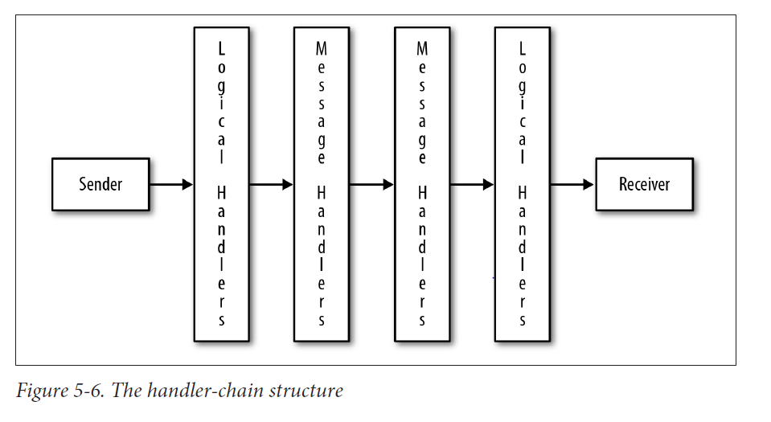

# Chapter 5 - SOAP Handlers and Faults
* SOAP messages have some similarity to the HTTP messages that commonly transport them
* Each type of message, SOAP and HTTP, can have a header and a body, although the header in a SOAP message is optional
* A SOAP message must have a body, which can be, but typically is not, empty
* Not every HTTP message has a body, with GET and DELETE messages as two body
* In each kind of message, the header, if present, is meant to contain meta-data; the body, if present, is meant to contain data
* A SOAP message has a *sender* and targets a *receiver*, but the SOAP messaging architecture allow for *intermediaries*, which are non-terminal recipient along the route from the sender to the ultimate receiver
* The *sender*, *receiver* and the *intermediaries*, are alike in being *nodes* along the path from the sender to the receiver

* Along the route from sender to receiver, an intermediary is supposed to inspect and otherwise process elements in the SOAP message's header, known as *header blocks*; the SOAP message's body, which contains the data, is supposed to be reserved for the receiver alone
* By contract, the sender and the receiver are meant to enjoy access to the entire SOAP message, including the body.
* The SOAP specification does not describe how an intermediary node is to process a header block, as this is an application-specific rather than a SOAP requirement
* The intermediaries can function as filters that screen out messages that should not make their way to the terminal receiver

* In summary, the header/body distinction plays a key role in SOAP's message architecture, and JAX-WS has an API that supports this architecture
* JAX-WS *handler* API, which gives the nodes in the SOAP messaging architecture low-level access to the entire SOAP message: header, body, and attachments

# 1. The Handler Level in SOAP-Based Services and Clients
* In SOAP over HTTP,SOAP message itself is the body of either an HTTP request, typically a POST request, or an HTTP response
* The message consists of:
	* The SOAP *part*, which comprises the SOAP envelope, which in turn consists of an optional header and a required body. The body can be, but typically is not, empty. The header and the body are text, in particular XML
	* Arbitrarily many *attachments*, including none. Attachments are an efficient way to transport media types such as audio or video as binary pay-loads belonging to a SOAP message
* The application and handler levels occur on the service side and on the client side	

* A handler is inherently bidirectional: on either side, client or service, a handler handles incoming and outgoing messages
* A handler can detect whether a given SOAP message is coming in or going out and react accordingly

* Handlers come in two types:
	* A *SOAPHandler*, abbreviated as a message handler, has access to the entire SOAP message: headers, body, and attachments
	* A *LogicalHandler* has access only to the pay-load in the body of a SOAP message

* The handler/application distinction represents a separation of concerns

* To implement the *SOAPHandler* interface and its super-interface *Handler*, a class must define four methods:
	* *getHeaders* - convenience method that gives the hander access to the SOAP header elements or headers for short. The runtime invokes this method first
	* *close* - this method is the last one that the runtime invokes
	* *handleMessage* and *handleFault* - the runtime invokes exactly one of these. Either a standard SOAP response message or a fault message returns to the client
	
* The return type for the methods *handleMessage* and *handleFault* is *boolean*. A return value of *true* means *continue executing other handlers, if any, in the chain*; a return value of *false* means *do not execute other handlers, if any, in the chain*

* JAX-WS handlers are a way to separate low-level concerns, which require inspection and even manipulation of SOAP messages, from the high-level concerns of invoking, as transparently as possible, web service operations
* At the application level, the SOAP is completely hidden; at the handler level, the SOAP is exposed for whatever processing is required

# 2. Handlers and Faults in the predictionsSOAP Service

# 3. Faults from the Application and Handler Levels
* The API for generating a SOAP fault at the handler level differs significantly from the API for generating s SOAP fault at the application level
* At the application level, the regular Java syntax of : throw new Exception(); suffices
* At the handler level, by contrast, the SOAP fault needs to be constructed and then thrown

# 4. Linking the Service-Side Handler to the Service
* The configuration file is referenced with a @HandlerChain annotation
* For an outgoing message, logical handlers come into play first. This is appropriate because such handlers have limited scope; that is, they have access only to the pay-load in the SOAP body
* The (SOAP) message handlers then come into play and these handlers have access to the entire SOAP message
* For an incoming message, the order is reversed: the (SOAP) message handlers have first access and the logical handlers have last access
* Message handlers are sufficient for any handler logic precisely because they have access to the entire SOAP message, but logical handlers are convenient in that the runtime makes available only the SOAP body's pay-load

# 5. SOAP-Based Web Services and Binary Data
* SOAP-based services can deal with binary payloads but such payloads raise issues of efficiency
* There are two general approaches to dealing with binary data in SOAP-based services:
	* The binary data can be encoded using a scheme such as bas64 encoding and the transmitted as the payload of the SOAP body - in other words, as text. Encoding binary data as text results in data bloat
	* The binary data can be transmitted as attachments, which minimizes data bloat

* In the course of SOAP development, there have been three options for attachments:
	* SwA (SOAP with Attachments) is the original specification but does not work well with *document-style* services
	* DIME (Direct Internet Message Encapsulation) is a lightweight but proprietary encoding scheme
	* MTOM (Message Transmission Optimization Mechanism), which is based on XOP (XML-Binary Optimized Packaging) - a modern, efficient, and interoperable way to share binary data through SOAP-based services

* SOAP-based web services are at their best when dealing with text pay-loads, as the SOAP infrastructure then assumes the burden of converting between native language types, on the one side, and XML Schema types, on the other side
* This advantage goes away once the SOAP payloads are binary, regardless of whether the payload is base64 encoded text in the SOAP body or SOAP attachments

# 6. The Transport Level
* JAX-WS is more than just an application-level API
* There is a powerful handler-level API and even a transport-level API

# 7. What's Next? 
* JAX-WS handler APIs, which provide fine-grained control, on either the client side or the service side, over incoming and outgoing SOAP messages
* Such control is required in the SOAP message architecture, with its distinctions among sender, receiver, and intermediary nodes; this control allows any SOAP message to be inspected and manipulated as needed along the route from the message sender to the ultimate receiver
* SOAP attachments are yet another relatively low-level part of JAX-WS
* Although SOAP is not ideally suited for dealing with binary payloads, SOAP can do so efficiently with MTOM

* Web sercies, whether REST-style or SOAP-based, typically require security
* In general, however, there are two broad security challenges:
	* One challenge involves *wire-level* security; technologies such as HTTPS address this multifaceted challenge
	* A second challenge involves *user/roles* security - user authentication and authorization