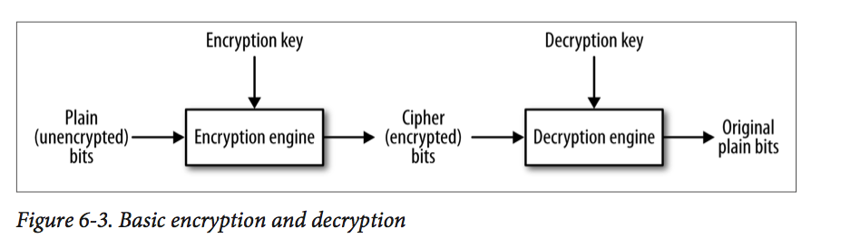
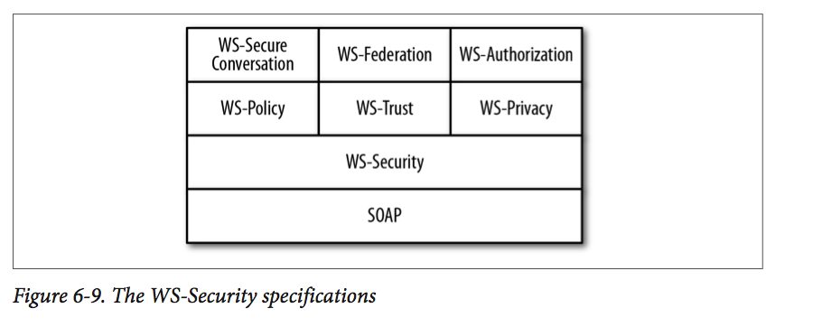

# Chapter 6 - Web Services Security
* *Wire-level security* - security begins at the transport or wire level with basic protocols that govern communications between a web service, whether SOAP-based or REST-style, and its clients

* *User authentication and authorization*

* *WS-Security* - is a collection of protocols that specify how different levels of security can be  within the SOAP-messaging infrastructure rather than though a particular transport

# 1. Wire-Level Security
* Java has various packages that supports SSL/TLS in general and HTTPS in particular

## 1.1 HTTPS Basics
* HTTPS is easily the most popular among the secure versions of HTTP
* HTTPS provides three critical security services over and above the transport service that HTTP provides:
	* *Peer authentication* - mutual authentication or mutual challenge
	* *Confidentiality*
	* *Integrity*

## 1.2 Symmetric and Asymmetric Encryption/Decryption
* Modern approaches to encryption follow two different approaches: symmetric and asymmetric

* In the symmetric approach, the *same* key - called the *secret* or *single* key - is used to encrypt and decrypt

* In the asymmetric approach, the starting point is a *key pair*, which consists of a *private key* and a *public key*

## 1.3 How HTTPS Provides the Three Security Services
* Integrity is the least complicated. The message sent over HTTPS includes a digest value, which the receiver recomputes

* HTTPS handles peer authentication through the exchange of digital certificates. In many cases, however, it is only the client that challenges the server

## 1.4 The HTTPS Handshake
* The client challenges the web server, which sends one or more digital certificates as authentication. Modern digital certificates usually have the X.509 format
* An X.509 certificate is a *public key certificate* that serves as an *identity certificate* by binding the public key from a key pair to an identity such as a person or an organization
* The client can determine whether to accept the server's digital certificates by checking these against its trust-store
* The server has the option of challenging the client
* Once the challenge phase is over, the client begins the process of generating a secret key
* In a common scenario, the client encrypts a 48-bit pre-master secret with the server's public key, available on the server's digital certificate downloaded during the peer authentication phase
* At any point, either the client or the server may insist on starting the entire process all over again

* The primary challenge is to get the pre-master secret securely from the client to the server, and the server's public key, available to the client in the server's digital certificate after the mutual challenge phase
* The master secret key is generate only after the client and the server have agreed upon which *cipher suite*, ort set or cryptographic algorithms, should be used

* Summary of the Cipher suite:
	* TLS - Transport Layer Security, added to HTTP, yields HTTPS
	* ECDHE - Elliptic Curve Diffie-Hellman Key Exchange, which is the algorithm that governs the handshake
	* RSA - this is the *public key cryptography algorithm*
	* RC4_128 - the *stream cipher algorithm*, which is used to encrypt and decrypt the bit traffic between the client and server, has a key length of 128 bits
	* SHA - the certificate's 160-bit identifying hash, also called its fingerprint, is generated with the Secure Hash Algorithm
	
## 1.5 A Very Lightweight HTTPS Server and Client
* An HTTPS server needs two stores for digital certificates:
	* *keystore* - contains digital certificates, including the certificates that an HTTPS server sends to clients during the *peer authentication* phase of the HTTPS hand-shake
	* *truststore* - is a keystore with a specified function: the truststore stores trusted certificates used to verify other certificates
	
## 1.6 HTTPS in a Production-Grade Web Server
* Tomcat does not ship with a keystore of digital certificates and, accordingly, does not enable HTTPS by default
* The service must be turned on by editing the configuration file *TOMCAT_HOME/conf/server.xml*

## 1.7 Enforcing HTTPS Access to a Web Service

# 2. Container-Managed Security
* Wire-level security and users/roles security are related as follows. Under users/roles security, a client furnishes an identification such as a *username* or even a digital certificate together with a security credential that vouches for the identification
* Wire-level security is thus the foundation upon which users/roles security should be implemented, and HTTPS is an ideal way to provide wire-level security for *web*-based systems such as web services

* Six native Tomcat plug-ins with a short description of each:
    * *JDBCRealm* - the authentication information is stored in a relational database accessible through a JDBC driver
    * *DataSourceRealm* - the authentication information again is stored in a relational database and accessible through a Java JDBC DataSource, which in turn is available through a JNDI lookup server
    * *JNDIRealm* - the authentication information is stored in an LDAP-based directory service
    * *UserDatabaseRealm* - the authentication information is stored in a JNDI resource by default with the file *TOMCAT_HOME/conf/tomcat-users.xml*
    * *MemoryRealm* - the authentication information is read into memory, at Tomcat startup, from the file *tomcat-users.xml*
    * *JAASRealm* - the authentication information is available through a JAAS (Java Authentication and Authorization Service) framework
    
# 3. WS-Security
* WS-Security is a family of specifications designed to augment wire-level security and container-managed security by providing a unified, transport-neutral, container-neutral, end-to-end framework for higher levels of security such as message confidentiality and authentication/authorization

* The first layer consists:
    * WS-Policy - this spec describes general security capabilities, constraints, and policies. For example, a WS-Policy assertion could specify that a message requires security tokens or that a particular encryption algorithm be used
    * WS-Trust - this spec deals primarily with how security tokens are to be issued, renewed, and validated. In general, the spec covers brokered trust relationships
    * WS-Privacy - this spec explains how services can state and enforce privacy policies. The spec also covers how a service can determine whether a requester intends to follow such policies
    
* The second layer:
    * WS-SecureConversation - this spec covers secure web service conversations across different sites and, therefore, across different security contexts and trust domains
    * WS-Federation - this spec addresses the challenge of managing security identities across different platforms and organizations. At the heart of the challenge is how to maintain a single, authenticated identity in a heterogeneous security environment
    * WS-Authorization - this spec covers the management of authorization data such as security tokens and underlying policies for granting access to secured resources
    
* WS-Security spec are a guide to how security in general can be handle from *within* SOAP messaging
* Accordingly, the WS-Security spec address security issues as part of SOAP itself rather than as the part of the infrastructure that happens to be in place for a particular SOAP-based service
* The goals of WS-Security are often summarized with the phrase *end-to-end* security, which means that security matters are not delegated to either the transport level (e.g, HTTPS) or a particular service container (e.g, Tomcat), but rather, handled directly through an appropriate security API
* A framework for end-to-end security needs to cover the situation in which a message is routed through intermediaries, each of which may have to process the message, before reaching the ultimate receiver; thus, end-to-end security focuses on message content rather than on the underlying transport or the service container
* As a result, SOAP messaging becomes considerable more complicated

## 3.1 Securing a @WebService with WS-Security

# 4. What's Next?