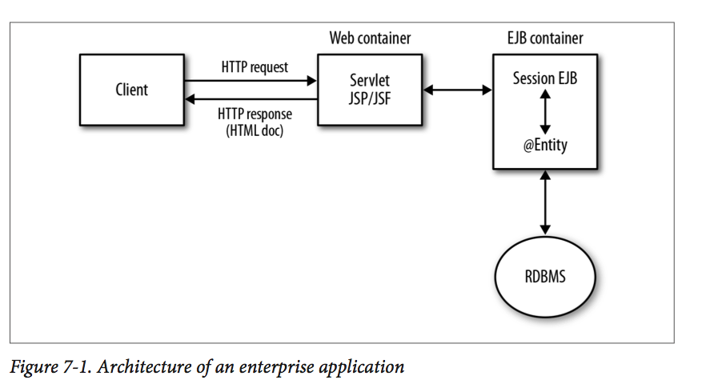

# Chapter 7 - Web Services and Java Application Servers
* This chapter examines how web services can be deployed using a JAS

# 1. The Web Container
* A web container hosts websites and web services, both of which are deployed as WAR files

* In contemporary websites, the model-view-controller (MVC) pattern has become popular, even dominant:
    * *model* maintains state information about the site and is responsible for persistence through a data store such as a database system. @Entity instances are likewise a natural way to implement models
    * *view* provides an appropriate representation of a model. Views in web services are basically response documents, with XML and JSON formats
    * *controller* is a request endpoint that implements the business logic that coordinates interaction between models on the one side and views on the other side. The web service itself is the controller that exposes business logic in @WebMethod or RESTful code and interacts, as appropriate, with models
    
# 2. The Message-Oriented Middleware
* JMS (Java Message Service) supports synchronous and asynchronous messaging styles and two types of message repository: topics and queues

# 3. The Enterprise Java Bean Container

# 4. The Naming and Lookup Service