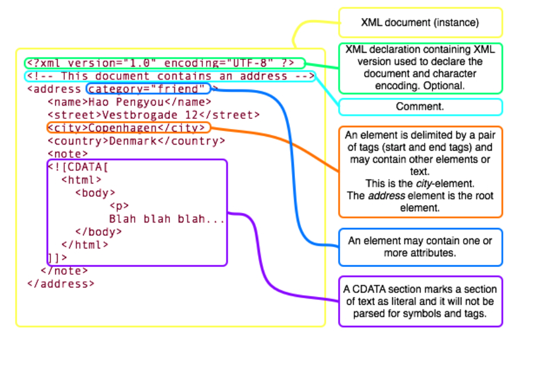
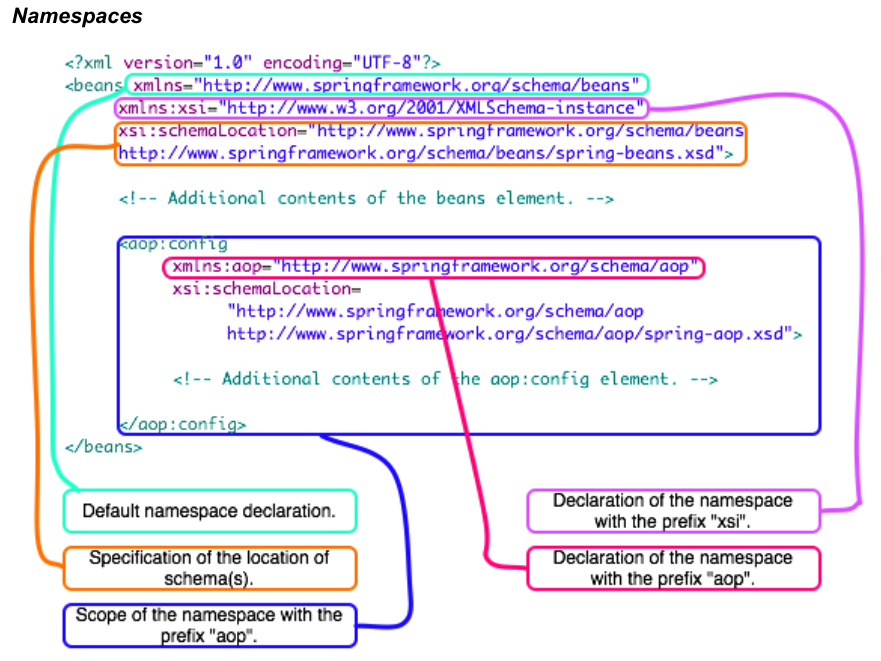
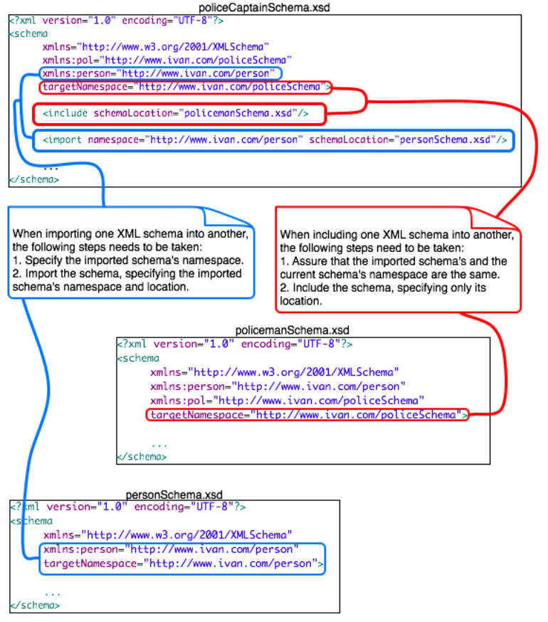

# Chapter 01 - XML Web Service Standards

## 1.1 XML Documents, W3C Schema and the WS-I Basic Profile 1.1
* Given XML documents, schemas, and fragments determine whether their syntax and form are correct (according to W3C schema) and whether they conform to the WS-I Basic Profile 1.1

* **XML Document**
* An XML document represents one possible set of data for a given XML schema

* **Structure**

* XML documents are composed of Unicode text
* An XML document (instance) represents one set of possible data for a particular markup language
* Each XML document must have one root element that must contain all the other elements and text, except the XML declaration, comments, and certain processing instructions

* **Elements**
* An element name must begin with a letter or underscore but must not start with the characters *xml* and must not contain any of the following characters: /, <, >, ?, ", @, &, :
* Element may be empty
* A CDATA section allows an element to contain literal text that will not e parsed for symbols and tags

* **Attributes of Elements**
* An element may have zero, or more attributes
* An attribute of an element consists of name-value pair
* Attribute names have same restrictions as element name
* The value must be in single or double quotes
* An attribute may only appear once in an element
* Attributes must be declared in the start tag (never in the end tag)
* Attribute cannot be nested

* **Namespaces**

* An XML namespace is declared using the *xmlns* attribute in the following form: <myTag xmlns="someURI"...>
* Each namespace must have an unique identifier specified by its URI
* The URI does not have to point to an actual resource
* The default namespace is defined as above
* A namespace can be assigned a prefix that is used to fully qualify elements of the namespace
* The scope of a namespace declaration, whether it is a default namespace location or a namespace declaration declaring a prefix, ranges from the beginning of the start-tag in which it appears to the end of the corresponding end-tag
* Schema locations are specified by one or more pairs of namespace, physical location
* If an XML schema does not specify *elementFormDefault="qualified"*, then the child element are automatically assumed to be in the namespace of the parent
* An XML namespace declaration xmlns="" cancel the default namespace

* **XML Schemas*
* An XML schema describes a markup language; defining which elements and attributes are used in the language, their structure and what their data-types are
* XML schema are XML documents

* **The schema Element**
* The root element of an XML schema is always the *schema* element

* Global element(s) of the target namespace must always be fully qualified
* Global attribute(s) of the target namespace must always be fully qualified

* **Elements**
* Element declarations are used to declare elements of an XML schema

* **Element Type**
* An element declaration can, if no *type* attribute specified, contain a simple or complex type declaration
* The value of *type* attributes can be either one of the 44 built-in types, which belong to the XML schema namespace "http://www.w3.org/2001/XMLSchema", or a complex type
* The built-in types can only contain data and cannot contain other elements

* **Global Elements**
* In order for an XML instance document to be able to directly refer to an element declared in an XML Schema, the element must be declared as a global element
* Global elements are declared as immediate children of the *schema* element, as compared to children of a complex type

* **Complex Types**
* An XML schema may declare complex type which describe how elements that contain other elements are organized

* **The <sequence> Element**

* **The <all> Element**
* The <all> Element cause the elements of the complex type to:
    * Child elements of the complex type can appear in any order
    * Child elements always have a *maxOccurs* of 1 and a *minOccurs* of 0
    * Only single elements may occur in an <all> group
    
* **The <choice> Element**
* Allows one of the elements contained in the <choice> element to be present in the containing element

* **The <simpleContent> Element**
* Enables adding of attributes to global simple types

* **Inheritance of Complex Types**
* XML schema supports inheritance of complex types in a manner similar to inheritance found in object-oriented programming
    * Extension - an extended typed inherits the elements and attributes of the base type and adds new ones
    * Restriction - extended type redefines the element and/or attributes of the base type it wishes to retain and omits the ones it does not want to retain
    
* **Polymorphism and Abstract Base Types**
* As object-oriented programming can assign objects of a subtype to a variable of an abstract super-type, so can subtypes be used with elements of the base type

* **Simple Types**
* Cannot contain child elements or attributes

* **Global Attributes**
* An XML schema can also declare global attributes, which later can be used in the schema declaration(s)
* Note that attributes declared using global attributes always must be fully qualified

* **The anyAttribute Element**

* **Anonymous Types**
* An element declaration can be combined with a simple or complex type declaration
* The simple or complex type will then be referred to as an anonymous type because it cannot be used outside of the element declaration

* **Import and Include**
* Existing XML Schema definitions can be imported or included in a new XML Schema, in order to reuse previous definition and/or to split XML schema definitions into multiple files
    * Import - import a XML schema that has a different namespace from the XML schema into which it is imported
    * Include - include a XML schema that has the same namespace that the XML schema into which it is included

* **Uniqueness Constraints**

## 1.2 XML Schema in Java EE Web Services
* Describe the use of XML Schema in Java EE Web Services
* In general, an XML Schema describes a markup language; how elements and attributes are organized and what their data types are
    * An XML Schema can be used to validate an XML document, in order to ensure its correctness, both in regard to structure and content
    * XML schemas/markup languages may also be reused within other XML schemas
    * XML Schemas with different namespaces can also be used as a versioning system