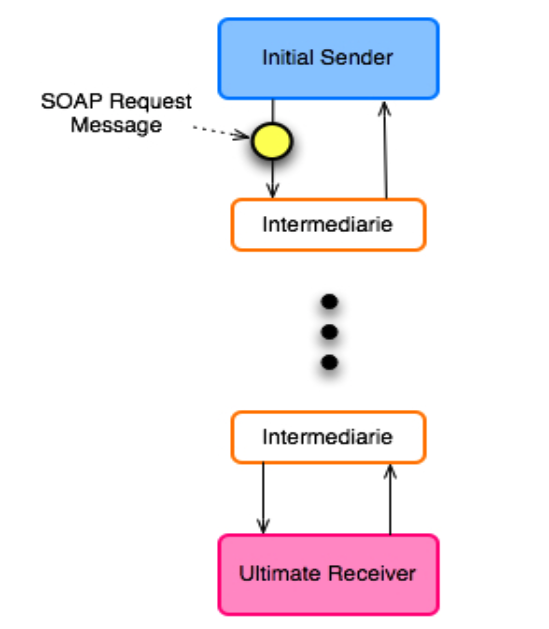
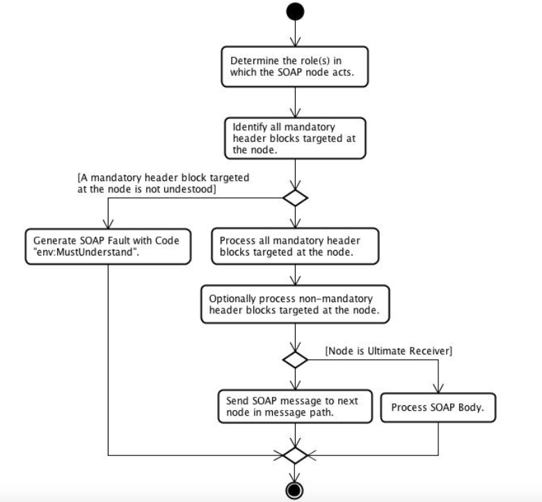
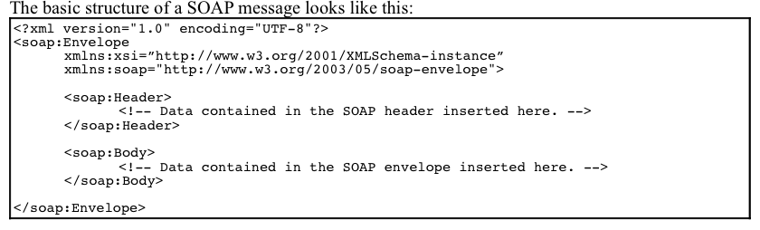

# Chapter 02 - SOAP 1.2 Web Services Standards

## 2.1 SOAP Message Encoding Types
* The following encoding types may be used in SOAP messages:
    * SOAP encoding
    * Literal encoding
    
* SOAP encoding:
    * Describes how to map non-XML based data to a format that can be transferred in SOAP messages
    * It less flexible and more restricted compared to XML
    * Is optional and does not have to be implemented in a SOAP node
    * Is not allowed byt the WS-I Basic Profile
    
* Literal encoding - means that the XML document fragment can be validated against its XML schema
* Messaging modes using the literal encoding are:
    * Document/Literal
    * RPC/Literal
    
* **RPC/Literal Bindings**

* **Document/Literal Bindings**

* **Document/Literal**
* In the Document/Literal SOAP messaging mode, the Body element of a SOAP message contains an XMl document fragment; a well-formed XML element that contains arbitrary data that belongs to an XML schema and namespace separate from the SOAP message's XML schema and namespace

* The Document/Literal messaging mode can use either one-way or the request-response messaging exchange pattern
* Typically the data structures operated on by a Document/Literal web services are larger and/or more complex
* This is suitable for coarse-grained services

* Advantages are that the interface of the service is less likely to change, even if there are changes in the parameter data structure

* Drawbacks include the fact that you expose a complex data structure which may, to some extend, expose the inner workings of the service
* If the inner working change, the changes are more likely to cause ripples that affect clients of the service
* Versioning issues are likely to occur as the service evolves over time

* **RPC/Literal**
* Often used to expose traditional components as web services
* Such components does not explicitly exchange XML data, but have methods with parameters and return values

* Unlike Document/Literal, with which the Body element of the SOAP message may contain any valid XML data, SOAP defines a standard XML format for RPC-style messaging
* However, use and implementation of the SOAP RPC standard is optional
* RPC/Literal messaging mode ca use either the one-way or the request-response messaging exchange pattern, but it is more common to use the request-response one

* With an RPC-style web service, you mostly have operations that take primitive data types like integer, string etc as parameters and produce a result
* This is more suitable for fine grained services
* An advantages is that the data-types you expose can be understood by all clients
* A drawback is that if there is a new version of an operation in the service that needs, for instance, additional parameters then the clients need to upgrade as the service changes, unless of course both the old and new version of the service are published at the same time

* **RPC/Literal vs Document/Literal Summary**
* Both modes are usable
* There are also no simple solutions to service integration issues

* **Messaging Exchange Patterns**
* There are two messaging exchange patterns, which describe the flow of messages:
    * One-way - a request is transferred from a client to a service. The service does not answer the request
    * Request-response - a request is transferred from a client to a service. The service sends a reply to the client
    
## 2.2 SOAP Processing and Extensibility Model
* Describe the SOAP Processing and Extensibility Model

* **SOAP Processing Model**

* A SOAP message is sent by an Initial Sender, passing through zero or more Intermediaries, before reaching the Ultimate Receiver
* Depending on the message exchange pattern, the Ultimate Receiver may generate a SOAP response message that is returned to the Initial Sender

* **SOAP Nodes and SOAP Roles**
* The Initial Sender, Ultimate Receiver and Intermediaries are called SOAP nodes
* A SOAP node is identified by an URI
* Each SOAP node can take on one or more SOAP roles, each of which is identified by a URI known as the SOAP role name
* Even through role names are in the form of an URI, there are no routing or message exchange semantics associated with the SOAP role name
* There are three SOAP roles defines by the SOAP 1.2 spec:
    * next - each SOAP intermediary and the ultimate SOAP receiver MUSt act in this role
    * none - SOAP nodes MOST NOT act in this role. Header blocks in this role will never be formally processed
    * ultimateReceiver - the ultimate receiver MUSt act in this role
    
* The role Attribute
* A SOAP header block is said to be targeted at SOAP node if the SOAP *role* attribute of the header block contains a name of a role in which the SOAP node operates
* In SOAP 1.1, the name of the attribute in header blocks indicating which role it target at is *actor*

* The mustUnderstand Attribute
* This attribute determines whether the processing of a header block with a role attribute matching the node role is mandatory or not

* **Processing SOAP Messages**
* The SOAP message processing model does not maintain any state, each message is processed in isolation
 * A SOAP message is processed by a SOAP node using these steps:
    * Determine the role(s) in which the SOAP node acts
    * Identify all header blocks targeted at the node with the *mustUnderstand* attribute set to true
    * If one or more of the header blocks from the previous steps are not understood by the SOAP node, then generate a SOAP fault with the Code set to "env:MustUnderstand"
    * Process all mandatory header blocks targeted at the node
    * If the node is the Ultimate Receiver, the process the SOAP body
    * If the node is an intermediary and no fault occurred, send the SOAP message along the message part

* Further notes about the processing of SOAP messages:
    * The processing of one SOAP message may result in at most one SOAP fault
    * A SOAP node processing a header block or SOAP body may reference any information in the SOAP envelope
    * SOAP header blocks may be processed in arbitrary order

* **Replaying SOAP Messages**
* There are two kinds of SOAP intermediaries: forwarding intermediaries and active intermediaries

* **SOAP Forwarding Intermediaries**
* A SOAP forwarding intermediary must process a SOAP message, as describe above, and additionally:
    * Remove all processed SOAP header blocks
    * Remove all non-relayable header blocks that were targeted at the node but ignored during processing
    * Retain all relayable header blocks that were targeted at the node but ignored during processing

* **Relayable Header Blocks**
* A SOAP header block may have a *relay* attribute that indicates whether the header block is relayable or not
* The default value of the *relay* attribute is false
* The *relay* attribute should only appear on the root element of a SOAP header block. If it appear elsewhere, it may be ignored

* The following rules apply to the preservation of the XML data in a SOAP message by a SOAP forwarding intermediary:
    * The entire SOAP message must be preserved, except as specified in the following rules
    * SOAP header blocks may be removed
    * SOAP header blocks may be added
    * White space characters may be added to or removed from:
        * Children of the SOAP Envelope element
        * Children of the SOAP Header element
    * Comment elements may be added to or removed from:
        * Children of the SOAP Envelope element
        * Children of the SOAP Header element
    * Attribute items may be added to:
        * The SOAP Envelope
        * The SOAP Header
    * Namespace attributes may be added to:
        * The SOAP Envelope
        * The SOAP Header
    * The the *role* attribute of a SOAP header blocks is Ultimate Receiver, then it may be omitted
    * The *mustUnderstand* attribute of a SOAP header block can be transformed:
        * The value "false" may be substituted with 0
        * The value "true" may be substituted with 1
        * The attribute may be omitted if its value is "false"
    * The base URI of the document information item need not be maintained
    * The base URI of element information items in the SOAP Message may be changed or removed
    * The character encoding property of the document information item may be changed or removed
    * All namespace information items in elements must be preserved
    * Additional namespace information items may be added

* **SOAP Active Intermediaries**
* Active intermediaries may also process SOAP messages in way not described by SOAP Header block(s) found in the incoming SOAP message
* Example of service offered by SOAP intermediaries are: Security services, annotation services and content manipulation services

* **SOAP Versioning Model**
* Versioning only concerns the SOAP Envelope element, it does address versioning of SOAP header blocks, encodings, protocol bindings or anything else

* **SOAP Extensibility Model*

* **SOAP Features**
* What? SOAP Feature is an extension of the SOAP Messaging framework. Example: reliability, security, correlation, routing, and message exchange patterns such as request/response, one-way and peer-to-peer conversations
* Two ways to express SOAP Features:
    * SOAP processing model - describe the behavior of a single node in connection to processing an individual SOAP message
    * SOAP protocol binding framework - mediates the act of sending and receiving SOAP messages by a SOAP node via an underlying protocol
        * Operates between two adjacent nodes in a SOAP message path
        * The WS-I Basic Profile only allows for SOAP over HTTP

* The specification of a SOAP feature must include the following:
    * A name in a form of an URI
    * The information (state) required at each node to implement the feature
    * The processing required at each node to fulfill the obligations of the feature
    * The information is to be transferred from node to node

* **SOAP Message Exchange Patterns**
* What? Template describing the pattern by which message are exchanged between SOAP nodes
* The specification of a message exchange pattern must include:
    * A name in the form of an URI
    * A description of the life-cycle of a message exchange adhering to the pattern
    * A description of temporary relationships between SOAP nodes. For instance: in the request-response message exchange pattern, the Ultimate receive is to send a response message back to the Initial Sender
    * Description of successful and unsuccessful termination of a message exchange pattern

* **SOAP Modules**
* What? Specification of the syntax and semantics of one or more SOAP header blocks
* SOAP module specification must follow these rules:
    * Must provide an URI used as an identifier
    * Must declared the features provided by the module
    * Must specify the content and semantic of the header blocks used to implement the behaviour in question
    * Must specify any known interactions with the SOAP body
* For example:
    * A Module which encrypts and remove the SOAP body, inserting instead a SOAP header block containing a checksum and an indication of the encrypting mechanism used
    * The spec for such module would indicate the decryption algorithm on the receiving side is to run prior to any other modules which rely on the contents of the SOAP body

# 2.3 SOAP Message Construct and SOAP Message with Attachments
* Objective: Describe SOAP Message Construct and create and SOAP message the contains an attachment
* SOAP is a protocol that allows the exchange of structured data specified by an XML schema between peers in a decentralized, distributed environment

* **SOAP Message Elements**

* **Envelope Element**
* Namespace : http://www.w3.org/2003/-5/soap-envelope
* Root of a SOAP message
* Name of the element is <Envelope>
* Contains one optional <Header> element
* Contains one <Body> element

* **Header Element**
* Namespace: http://www.w3.org/2003/05/soap-envelope
* Name of the elements is <Header>
* Contains zero or more distinct XML elements, called header blocks
* Example of types of contents are: security credentials, transaction ids, routing instructions, debugging information

* Header blocks have the following properties:
    * Each header block must have its own namespace
    * Contains zero or more XML element
    * The header block root element may have zero or more of the following attributes:
        * encodingStyle
        * role
        * mustUnderstand
        * relay

* **Body Element**
* Namespace: http://www.w3.org/2003/05/soap-envelope
* The name of the element is <Body>
* A SOAP message must contain exactly one body element
* The body element may contain any well-formed XML data or be empty
* The body element contains either application data or a SOAP fault message
* The body element must be immediate child of the <Envelope>
* The body element must follow the <Header> element, if any, or be the first child of the <Envelope> element

* **Body Element Children**
* All children elements of the SOAP Body element:
    * Should have a namespace specified
    * May have zero or more children, which in turn may be namespace qualified
    * May have zero or more attributes specified

* **The SOAP encodingStyle Attribute**
* To specify the encoding used with SOAP RPC messages

* **SOAP Faults**
* A SOAP message that contains a <Fault> element in its <Body> element is called a fault message
* Fault messages are used to report errors to nodes earlier in the message path
* Possible reasons for faults may be: improper message formatting, version mismatches, trouble processing a header and application-specific errors

* If an error occurs, a SOAP node follows the following procedure to process the error:
    * A SOAP fault is generated by the node, be it an intermediary or the ultimate receiver
    * If the message exchange pattern One-Way is used, the the SOAP fault must not be transmitted to the immediate sender. The SOAP fault may be stored somewhere
    * If the message exchange pattern Request-Response is used, then the SOAP fault must be transmitted to the immediate sender

* If the SOAP Body element contains a <Fault> element, it must contain only one single <Fault> element and nothing else
* A SOAP <Fault> element has the following contents:
    * Code - identifies the error
    * Reason - human-readable description of the error
    * Node
    * Role
    * Detail

* ** The Code Element**
* The SOAP <Code> element may contain the following child elements:
    * Value - high-level description of the fault, using a set of predefined SOAP fault codes
    * Subcode - contains <Value> element to further detail the description of the fault

* Possible values of the <Value> element in the <Code>:
    * Sender
    * Receiver
    * VersionMismatch
    * MustUnderstand
    * DataEncodingUnknown

* **VersionMismatch Faults**
* If a SOAP node generates a fault with the value of the <Value> element being "env:VersionMismatch", a SOAP <Upgrade> header block should be included in the fault message
* The <Upgrade> header block list the fully qualified names of SOAP envelopes the node understands using <SupportedEnveloped> elements

* **MustUnderstand Faults**
* One or more SOAP <NotUnderstood> header block(s) should be included in the fault message
* A <NotUnderstood> element uses the *qname* attribute to specify the fully qualified name of the header block which the node did not understands

* **The Reason Element**
* Contains one ore more <Text> elements, each contains a human-readable description of the errors in a specified language
* All <Text> elements must have the *xml:lang* attribute to specify the language

* **The Node Element**
* Indicates which node generated the fault
* Required if the node is an intermediary, but is optional if the fault node is the ultimate receiver

* **The Role Element**
* Contains an URI specifying which role the faulting code was operating in when the fault occurred

* **The Detail Element**
* Contains an XML fragment providing further detail about the fault

* **SOAP Messages with Attachments (SwA)**
* Provide a way to attach binary data to a SOAP message
* SwA is based on MIME (Multipurpose internet mail extension)

* The Content-Type in the HTTP POST message header is Multipart/Related
* The *start* parameter in the Content-Type of the HTTP POST message header specifies the root MIME part
* The recommended way to refer to other MIME parts is by using CIDs (content ids). A CID is always prefixed by the string "cid:"

* Naturally, the SOAP message will be wrapped in a HTTP request when being sent using HTTP
* If we add an attachment to a SOAP message, the SOAP message will become wrapped in a MIME envelope

* **WS-I Basic Profile on SOAP**

