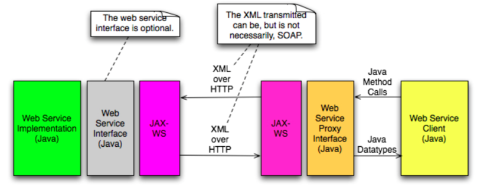
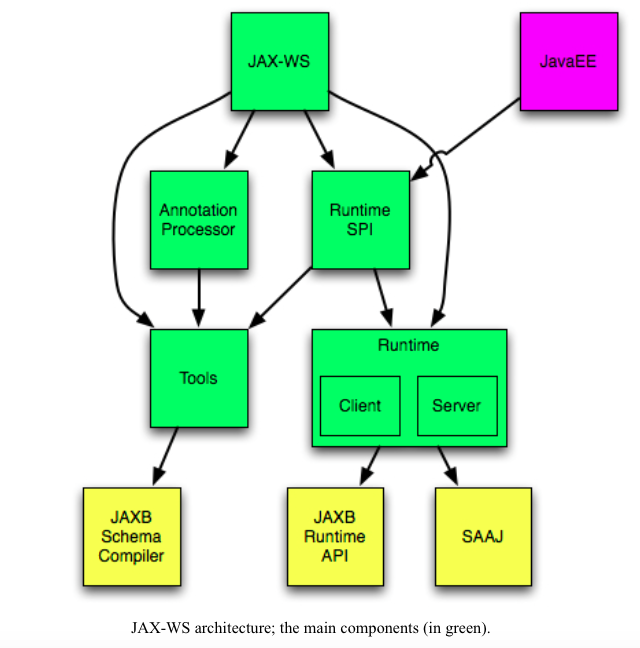

# Chapter 4. JAX-WS

## 4.1 JAX-WS Technology
* Objective: Explain JAX-WS technology for building web services and client that communicate using XML

* Typical invocation of a web service that uses JAX-WS at both the client and server side:

* A typical client invocation of a web service consists of the following steps:
    * The WS client invokes a Java method in a WS proxy interface, supplying parameters
    * JAX-WS generates the appropriate SOAP message for the invoked method
    * JAX-WS maps the parameters of the method call to XML using JAXB and insert them into the SOAP message
    * JAX-WS sends the SOAP message over HTTP to the WS Server
    * At the server side, JAX-WS interprets the SOAP message, mapping it to appropriate Java method in the web service implementation
     * JAX-WS maps the parameters XML data to Java parameters
     * Java-WS invokes the Java method in the ws implementation
     * The ws implementation method process the request and return some data
     * JAX-WS generates the appropriate SOAP response message
     * JAX-WS maps the resulting data to XML data using JAXB and insert them into SOAP message
     * JAX-WS returns HTTP response to the client
     * On the client side, JAX-WS interpret the SOAP message
     * JAX-WS maps the XML data to Java return data
     * The call the the method in the web service proxy returns, supplying the return data

## 4.2 Developing JAX-WS Web Services
* Objective: Given a set of requirements for a Web service, such as transactional needs and security requirements, design and develop Web service application that use JAX-WS technology

* JAX-WS web service can be implemented either using EJB 3 endpoint or using a servlet endpoint
* Both EJB based endpoint and POJO based endpoint will be wrapped by a servlet

* Can have object implement the *WebServiceContext* interface injected using @Resource. This interface contains:
    * MessageContext getMessageContext()
    * Principal getUserPrincipal()
    * boolean isUserInRole(String role)

* **Servlet Endpoints**
* Have access to basic security mechanisms of JavaEE
* Does not manage multi-thread issues
* Does not require an EJB container
* Have access the *HttpSession* object

* **EJB Endpoints**
* Transactions
* Security
* Interceptors
* Access to timer services
* Dependency injection
* Thread management

* **Summary**
* Choose an EJB endpoint if:
    * An existing stateless EJB needs to be exposed as a WS
    * The business logic that the service uses is in an EJB tier
    * You want transaction and/or security services
    * Able to control security at method level
    * Manage concurrent access to endpoint instance(s)

* Choose an Servlet endpoint if:
    * Less complexity is required
    * Less execution overhead is required
    * Able to access web service servlet context
    * Able to access the *HttpSession* object
    * The business logic that the service uses is in a web tier
    * Lightweight container
    * Prepare to manage concurrent access by multiple threads to the endpoint

## 4.3 The I-Stack
* Objective: Describe the Integrated Stack (I-Stack) which consists of JAX-WS, JAXB, StAX, SAAJ

* JAX-WS - Java API for XML Web Services - API for creating Web Services
* JAXB - Java Architecture for XML Binding - Marshalling of Java objects to XML representation and unmarshalling of XML representations to Java objects
* StAX - Streaming API for XML - Reading and writing of XML documents
* SAAJ - SOAP with Attachments API for Java - Facilitates production and consumption of SOAP messages with attachments

## 4.4 JAX-WS Development Approaches
* Objective - Describe and compare JAX-WS development approaches

* Three development approaches that can be used to developing JAX-WS web services:
    * Java first (bottom-up)
    * WSDL first (top-down or contract first)
    * Meet in the middle

* **Java First**
* Write the endpoint class in Java
* Optionally write the service endpoint interface (SEI)
* Annotate the endpoint class, or the SEI if it has been written
* Generate the artifacts needed to deploy the web service
* Package the archive (WAR or JAR) containing the web service
* Deploy the archive in appropriate manner

* Advantages:
    * Requires less knowledge about WSDL, XML
    * Strong tool support
    * More natural approach to Java programmers

* Disadvantages:
    * Interoperability problems may occur with services/clients defined in other languages
    * More sensitive to changes
    * Less control over WSDL

* **WSDL First**
* Write WSDL document describing the WS
* Generate the SEI and additional artifacts from WSDL
* Create the service implementation by writing a class that implements the SEI
* Package the archive
* Deploy

* Advantages:
    * Better interoperability
    * Less sensitive to changes
    * More control

* Disadvantages:
    * Requires more knowledge about WSDL, XML, WS-I Basic Profile

* **Meet in the Middle**
* Existing WSDL document and an existing implementation of the service
* Generate the SEI and additional artifacts from WSDL
* Create a service implementation class that implements the SEI and delegates the performing of business functionality to the existing implementation
* Package
* Deploy

* Advantages:
    * Chosen out of necessity, due to other approaches not being applicable
    * Able to solve problems that the other approaches cannot

* Disadvantages:
    * Overly complex

## 4.5 JAX-WS Features
* Objective - Describe the features of JAX-WS including the usage of Java Annotations

* Dynamic and Static Clients - WS can be invoked using both generated classes (static clients) and dynamically created *javax.xml.ws.Service* and *javax.xml.ws.Dispatch* instances

* Invocation with Java Interface Proxies - SEI are used to create client proxies that can be used to invoke a WS

* Invocation with XML/XML Service Providers - Serialization can be bypassed entirely, allow for interaction with services using raw XML data

* Message Context - Passes a message context, which can contain properties, such as username and password for HTTP authentication, along with XML message from the client, through any handlers on both the client and server side, to the server

* Handler Framework - similar to filters or interceptors for web service requests and response that allows for pre- and post-processing for messages

* SOAP Binding - Provides SOAP binding for SOAP message processing

* HTTP Binding - Provides XML/HTTP binding which allows for implementations of RESTful WS or other services which do not use SOAP

* Converting Exceptions to SOAP Faults - Map Java Exceptions to SOAP fault and reverse

* Asynchronous Invocation - Support asynchronous invocation of WS. Two models for response notification are provided: callback and polling

* One-Way operations - support one-way, "fire-and-forget" operations which allows for loosely coupled applications based on messaging

* Client Side Thread Management - *javax.xml.ws.Service* instance allows for settings of a *java.util.concurrent.Executor*

* Pseudo Reference Passing - Using the *javax.xml.ws.Holder<T>*

* WSDL Style - Support for RPC/Literal and Document/Literal Wrapped

* Java/WSDL Mapping

* Static WSDL - Bypass of the automatic WSDL generation, instead of using a static WSDL document

* XML Catalogs - Support OASIS XML Catalogs 1.1, enabling mapping of XML Schema URLs to local copies copies of the XML Schema

* Run-Time Endpoint Publishing - enable runtime publishing of a WS at runtime using *javax.xml.ws.Endpoint*

* **Annotations*
* Map Java to WSDL and XML schema and reverse
* Used to control how the JAX-WS runtime process and responds to WS invocations

* **Web Service Metadata Annotations**
* WebService - mark the annotated endpoint implementation class as implementing a web service or mark the annotated service endpoint interface as defining a web service interface
* WebMethod - expose a method as a web service operation or exclude a method from being exposed
* OneWay - mark a method as one-way web service operation
* WebParam - customize the mapping of one method parameter to a WSDL message part or XML element
* WebResult - customize the mapping of the return value of a method to a WSDL message part or XML element
* HandlerChain - specify an externally defined handler chain
* SOAPBinding - specify the messaging style (DOCUMENT or RPC), encoding (only LITERAL available) and parameter style (BARE or WRAPPED) of an endpoint. Default is DOCUMENT/LITERAL, WRAPPED

* **JAX-WS Annotations**
* BindingType - specify the binding (HTTP, SOAP 1.1, SOAP 1.2) to use when publishing an endpoint implemented by the annotated endpoint class
* RequestWrapper - specifies JAXB generated request wrapper bean and corresponding XML element for marshalling and unmarshalling the wrapper bean
* ResponseWrapper - specifies JAXB generated response wrapper bean
* ServiceMode - Used in conjunction with *java.xml.ws.Provider<T>* interface to indicate that the endpoint want to access protocol messages or protocol message payload
* WebEndpoint - associates the annotated *getPortName()* method in a generated class implementing the *javax.xml.ws.Service*
* WebFault - specifies mapping between WSDL fault and Java exception and/or service-specific exceptions and WSDL faults
* WebServiceFeature - meta annotation to identify other annotations as web service features
* WebServiceClient - annotates a generated web service class implementing *javax.xml.ws.Service* interface
* WebServiceProvider - Such an endpoint work directly with SOAP message or SOAP message payloads
* WebServiceRef - used to define a reference to a web service and, optionally, an injection target in which the reference will be injected
* Action - Specifies the WS-Addressing Action values for input, output and fault messages of the WSDL operation
* FaultAction - Used inside an Action annotation to specify a WS-Addressing Action value for a fault message

* **JAXB Annotations**
* XmlRootElement - specify the XML schema local name and namespace of the global XML element in a WSDL document which will represent the top level class when mapping between XML and instances of the class
* XmlAccessorType - specifies whether fields and/or properties of a class will be serialized or not
* XmlType - specifies the XML schema local name and namespace of the XML type representation instances of the class
* XMLElement - specifies the XML schema local name and namespace of the local element in the XML schema complex type
* XmlSeeAlso - instruct JAXB to bind additional, specified, classes when binding the annotated class

* **Common Annotation**
* Resource - inject a *WebServiceContext* object
* PostConstruct - specifies a method will be invoked after dependencies injection has been performed and before the instance is put into service
* PreDestroy - specifies a method that will be invoked immediately before the instance of the class is taken out of service by the container

* **@Web Service Feature Annotations**
* Addressing -
* MTOM -
* RespectBinding

* **Additional Features**
* AddressingFeature
    * Represent the use of WS-Addressing
    * Provides transport-neutral mechanisms to address web services and messages

* **MTOMFeature**
* Enable or disable transport optimization of SOAP message as well as setting the threshold used to determine when binary data should be encoded

* **RespectBindingFeature**
* Clarifies the use of the <wsdl:binding> in a JAX-WS runtime
* Only useful with WS that have an associated WSDL

## 4.6 JAX-WS Architecture
* Objective - Describe the architecture of JAX-WS including the Tools SPI that define the contract between JAX-WS tools and Java EE

## 4.7 Creating Web Services with JAX-WS
* Objective - Describe creating a Web Service using JAX-WS

* Developing the most basic form of JAX-WS in 3 steps:
    * Write a Java class that contains the implementation of the service methods
    * Annotate the above class with JAX-WS annotation(s)
    * Compile, package and deploy the WS

* Developing JAX-WS WS using wgen:
    * Write a Java class that contain the implementation
    * Annotate the above class with JAX-WS annotation(s)
    * Using wgen to generate the wsdl document, wrapper beans for the request and response data
    * Insert the address of the WS in the WSDL document
    * Add annotations (@RequestWrapper and @ResponseWrapper) to appropriate methods in order for the wrapper classes to be used
    * Compile, package and deploy

* **Requirements of a JAX-WS Endpoint Class**
* Must be annotated by either @WebService or @WebServiceProvider
* Must not be declared *final* or *abstract*
* Must have default public constructor or no constructor
* Must not define *finalize* method
* May use @PostConstruct and @PreDestroy
* May specify SEI using the *endpointInterface*
* WS methods must be public and must not be final or static
* WS methods must be annotated @WebMethod, except the case when all elements of the @WebMethod have default values
* WS methods must have JAXB compatible parameters and return types

* @WebService - tell JAX-WS that this class contains methods that are to be exposed as WS
    * name - map to the name of <wsdl:portType>
    * serviceName - map to the name of <wsdl:service>
    * targetNamespace - specifies namespace of <wsdl:portType> and/or <wsdl:service>
    * wsdlLocation - specifies the location of the WSDL document

* @SOAPBinding
    * style -DOCUMENT/RPC
    * use - LITERAL/ENCODED
    * parameterStyle - WRAPPED/BARE

* @Resource - DI of web service context

* @PostConstruct - method to be invoked after dependency injection, but before the WS is ready to use

* @WebMethod - mark a method as to be exposed as a web service
    * operationName - maps to the name of the <wsdl:operation> in the <wsdl:portType>
    * action - species SOAPAction for the operation

* @ResponseWrapper and @RequestWrapper
    * className - name of the Java class implementing the JAXB bean that will be used to hold the response/request data
    * localName - name of the XML schema element in which the request/response will be wrapped
    * targetNamespace - name of the XML schema in which the element wrapping the request/response is found

* **Generating WS Artifacts**

* **String Processor Web Service Example (Provider)**
* Process entire protocol messages, usually SOAP, or message payloads
* Such WS will implement the *javax.xml.ws.Provider<T>* interface and annotated with *@WebServiceProvider* annotation
* @ServiceMode specifies whether the provider class will receive and produce entire messages or just the message payloads

## 4.8 JAX-WS Client Communications Models
* Objective - Describe JAX-WS Client Communications Models

* A JAX-WS client can use the following invocation models:
    * Synchronous request-response
    * Asynchronous request-response
    * One-way

* To choose the mode:
    * Obtain *javax.xml.ws.Dispatch<T>* from the *javax.xml.ws.Service*
    * T invoke(T message) - invoke synchronously
    * Response<T> invokeAsync(T message) - invoke asynchronously, return objects that can be pooled for the result
    * Future<?> invokeAsync(T message, AsyncHandler<T> handler) - invoke asynchronously
    * void invokeOneWay(T message)
* When using *Dispatch*, client can choose to work with entire messages, SOAP messages or message payload only

* **Synchronous Request-Response**

* **Asynchronous Request-Response**

* **One-Way**

## 4.9 JAX-WS Web Service Clients
* Objective - Given a set of requirements, design and develop a Web Service client, such as a JavaEE client and stand-alone client, using JAX-WS

* **Dynamic Clients**
* Can choose to work with either SOAP messages or message payloads

* **Static Clients**
* Generate artifacts using wsimport tool

* **Standalone Clients**

* **JavaEE Clients**
* Generated client artifacts with wsimport
* Use @WebServiceRef
    * wsdlLocation

## 4.10
* Objective - Given a set of requirements, create and configure a Web Service client that access a stateful Web service

* Three mechanisms to maintaining a session:
    * Cookies
    * URL Rewriting
    * SSL Sessions

* WS-I Basic Profile says about stateful WS:
    * BP allows a service to use HTTP cookies
    * BP discourages a service to reply on the use of cookies

* Configure client of WS, set *javax.xml.ws.session.maintain* to true
