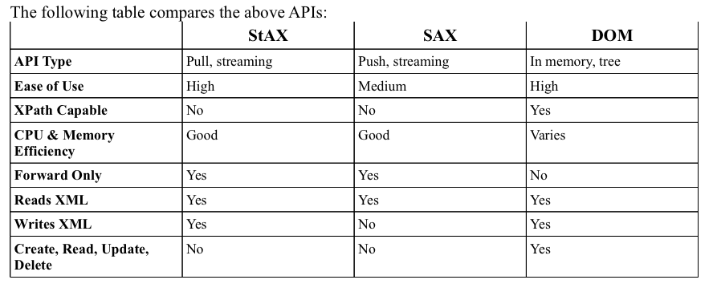

# Chapter 5 - REST, JSON, SOAP and XML Processing APIs (JAXP, JAXB and SAAJ)

## 5.1 REST Web Services
* Objective -  Describe the characteristics of REST Web Services

* The central concept of REST web services is resources
* Resources can be things in the system that represents some real-life concept, like, book, author
* A REST web service provides a way to retrieve a representation of such resource and to manipulate resources using limited set of verbs
* A request to a REST web service usually consists of a HTTP request
* The parts of the request of main interest are the URI and the HTTP method

* The following are some characteristics of REST web services:
    * Addressability - the information that selects which resource to operate on is kept in an URI
    * Uniform Interface
    * Stateless - every request to a REST web service in complete isolation. The server does not maintain any state associated to a client between requests
    * Connectedness - resources are connected to each other using URIs and this enables navigation among the resources, without prior knowledge of their structure
    * Representations - resources are manipulated by exchanging representations of the resources

## 5.2 JSON Web Services
* Describe the characteristics of JSON Web Services

* **JSON Encoding Format**
* JSON, JavaScript Object Notation, is a lightweight text-based data interchange format

* **JSON Web Services**
* JSON Web Services are web services that uses the JSON encoding format instead of, for instance, XML
* Such web services can be JAX-WS web services or REST web services
* REST web services typically allow for the resource representation to be in a format selected by the client at the time of the request

* Some characteristics of web services (REST and JAX-WS) that use JSON are:
    * JSON text can be dynamically executed as JavaScript
    * Minimizes the size of the data - JSON is not as verbose as XML while retaining some of the flexibility and extensibility
    * JSON web services cannot use the web security mechanism that require SOAP header blocks

## 5.3 SOAP vs REST Web Services
* Compare SOAP Web Services to REST Web Services
* REST web services are more appropriate when:
    * The web service is completely stateless
    * A caching infrastructure is considered to inscrease performance and scalability
    * Service producer and consumer have a mutal understanding of the context and the content produced by the service
    * Bandwidth is of importance and needs to be limited
    * Web service delivery and aggregation into existing web sites needs to be easily facilitated
    * Different client wants to retrieve resource representation in different formats, such as XML, JSON etc

* SOAP-based web services are more appropriate when:
    * A formal contract that describes the web service must be established
    * The architecture must address complex nonfunctional requirements
    * The architecture needs to handle asynchronous processing and invocation

## 5.4 SOAP vs JSON Web Services
* Compare SOAP web services to JSON web services
* JSON Web Services are more appropriate when:
    * Serizlizing simpler data structures, as opposed to documents like web pages etc
    * Clients are AJAX clients
    * Bandwidth usage needs to be minmized
    * Validation for the format and contents of the data is not required

* SOAP web services are more appropriate when:
    * You want to ensure that the data returned by the web service can not be evaluated as JavaScript
    * The format, and to some extend the contents, of the data sent to and received from the web service needs to be validated
    * Better tooling is required
    * Web service security involving encryption of part(s) of messages, handling different part of a messages in different ways, end-to-end security and not only transport layer encryption

## 5.5 JAXP APIs
* Objective - Describe the functions and capabilites of the APIs included within JAXP

* JAXP - Java API for XML Processing
* JAXP 1.4 supports the following technologies:
    * XML
    * SAX - Simple API for XML parsing
    * DOM - Document Object Model
    * StAX - Streaming API for XML
    * XSLT
    * XPath
    * XInclude

* **SAX**
* Functions: Read XML data, event-driven, push API
* Capabilities: Generates different kinds of events when an XML is read that can be reacted upon by handlers implemented by the user
* When: State independent processing

* **DOM**
* Functions: Read and write XML data
* Capabilities: Maintain an object model of an entire document in memory
* When: Manipulate the object model representing a document

* **StAX**
* Functions: Read and write XML data, pull API
* Capabilities: High-performance stream filtering, processing, and modification
* When: 

* **XSLT**
* Functions: Convert XML data to other formats. Writing XML data to files
* Capabilities: Given a set of transformation instructions, convert data in XML format to another format
* When:

* **Comparing JAXP APIs

## 5.6 JAXB
* Objective - Describe the functions and capabilities of JAXB, including the JAXB process flow, such as XML-to-Java and Java-to-XML, and the binding and validation mechanisms provided by JAXB

* What: JAXB - Java Architecture for XML Binding
* Functions: Simplifies the process of marshaling and unmarshaling XML data to/form Java objects

* **JAXB Functions and Capabilities**
* From XML schema, generate Java interfaces and class representing the schema
* From Java interfaces and classes representing XML schema, generate the XML schema
* Unmarshal an XML document, optionally validate the source, creating a tree of content
* Marshal a tree of contents objects, creating an XML document
* Validate a tree of contents objects againt an XML schema
* Access that data of an (unmarshalled) XML document in any order
* Customize:
    * Binding style
    * Specify names of classes to be generated
* Marshal binary data, such as MTOM and MIME attachments

* **JAXB Process Flow**

* **XML-to-Java**
* Bind the schema of the XML document - accomplished using a JAXB binding compiler
* Unmarshall the document into Java objects - optinally validate the XML document against an XML schema

* **Java-to-XML**
* Bind the schema of the XML document
* Create the Java object content tree
* Marshal the content tree into the XML document

* **JAXB Binding Mechanisms**

* **JAXB Validatation Mechanisms**
* 4 forms of validation:
    * Unmarshal-time Validation
    * Marshal-time Validation
    * On-demand Validation - deprecated in JAXB 2.0
    * Fail-fast Validation

## 5.7 SOAP Message with Attachment Using SAAJ
* Objective - Create and use a SOAP message with attachments using the SAAJ APIs

* Can use DOM API and SAAJ API together
