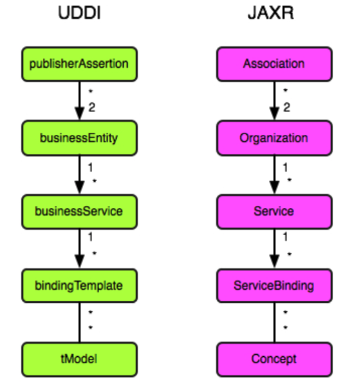

# 6. JAXR

## 6.1 JAXR Basics
* Objective - Describe the function of JAXR in Web service architectural model, the two basic levels of business registry functionality supported by JAXR, and the function of the basic JAXR business objects and how they map to the data structures

* **JAXR in Web Service Architecture**
* What: JAXR connect to a registry, in order to:
    * Publish
    * Discover
    * Utilize
* When:
    * Lookup for location of WS dynamically
    * Support fail-over
    * Looser coupling between WS and clients

* **Business Registry Functionality Levels**
* 2 APIs level:
    * Level 0 - business-level API. Support for this level is required by all JAXR providers
    * Level 0 - low level, generic, API. Support for this level is optional

* WS-I BP only sanctions the use of UDDI registries
* Only allow to use JAXR level 0

* **JAXR Business Objects**
* What: objects that model business concepts

## 6.2 JAXR Client Developement
* Objective - Create JAXR client to connect to a UDDI business registry, execute queries to locate services that meet specific requirements, and publish or update information about a business service