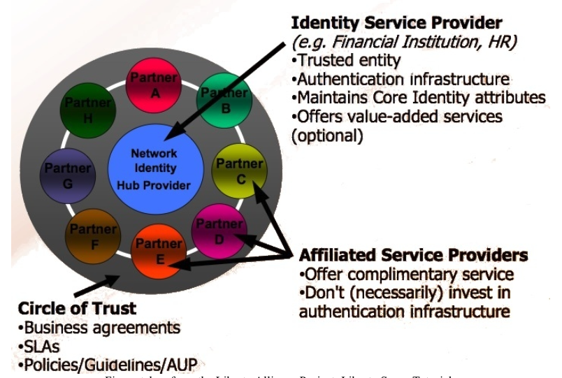
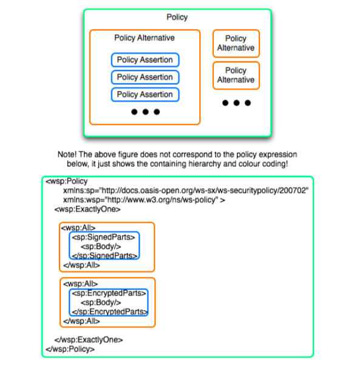

# Chapter 8 - Security

## 8.1 Security Mechanisms
* Objective - Explain basic security mechanisms including: transport level security, such as basic and mutual authentication and SSL, message level security, XML Encryption, XML Digital Signature, and federated identify and trust

* **Transport Level Security**
* Transport level security refers to securing the connection between a web service and a client application using one or both of the following mechanisms:
    * HTTP basic authentication
    * Secure Socket Layer (SSL)

* **HTTP Basic Authentication**
* Is performed in the following steps:
    * Client sends a username and password
    * Web service authenticates the client and returns an authentication header
    * The client includes the authentication header in all subsequent requests
* Only provides authentication of a user, but neither confidentiality nor data integrity

* **Secure Socket Layer**
* Provides confidentiality and integrity by encrypting all the data sent between a client and a web service at the transport layer
* SSL provides two mode of authentication:
    * Unilateral authentication - the client verifies the web service's certificate with a third party, such as a Certification Authority
    * Mutual authentication both the client and the web services verifies each others certificates with a third party

* There are some drawbacks with SSL security:
    * Does not allow intermediaries access to SOAP messages
    * All-or-nothing - either entire messages sent between client and the web service are encrypted or nothing
    * Once a message is decrypted, as it is received, security is completely removed
    * SSL does not really work with other transport protocols

* **Message Level Security**
* Refers to applying one, or both, of the following to a message sent between a web service and a client:
    * Digitally signing the message
    * Encrypting whole or part of the message

* Additionally, if the web service and client exchange multiple messages, a share security context can be specified

* Message level security can aid in assuring the following:
    * Confidentially
    * Integrity
    * Authenticity

* **XML Signature**
* What? - To identify what is signed and make is impossible to alter the signature or what has been signed without detection
* Digitally signing an XML document provide:
    * A way to verify the integrity of the message
    * Message authentication
    * A way to verify the identity of message sender

* A signature of an XML element in an XML document is created by:
    * Transforming the XML data to be signed to a standardized form (canonicalization)
    * Calculating a digest of the canonicalized XML data

* There are three kinds of signatures:
    * Detached Signature - the signature signs the data that is located outside of the XML document in which the signature occurs
    * Enveloped Signature - the signature signs part of the XML document in which the signature occurs
    * Enveloping Signature - the signature signs data contained in the signature itself

* **XML Encrypting**
* Enables encryption of arbitrary data, XML documents, XML elements or XML element contents with the result being an XML document which contains, or references, the encrypted data

* **Federated Identity and Trust**
* Means the linking of a person's user information across otherwise separate boundaries, such as software systems, without centrally storing information
* Federation is enabled through the use of open standards and openly published specifications, enabling interoperability for common use-cases between multiple parties
* An example of identity federation is single sign-on

* A circle of trust is described as a group in which each participant is trusted to describe:
    * The process used to identify user
    * The authentication system used
    * Policies related to the handling of authentication credentials

## 8.2 Web Service Security Initiatives and Standards
* Objective - Identify the purpose and benefits of Web services security oriented initiatives and standards suchs as Username Token Profile, SAML, XACML, XKMS, WS-Security, and the Liberty Project

* Username Token Profile
    * Purpose: WS consumer can supply authentication information to authenticate an identity to a web service producer
    * Benefits: Standardization, Interoperability, Increased security

* SAML - Security Assertion Markup Language:
    * Purpose: XML framework for exchanging authentication, authorization and attribute information. Make Single-sign on, distributed transactions and authorization services possible
    * Benefits: Platform neutrality. Loose coupling. Improved experience for clients using service in different domains

* XACML - eXtensible Access Control Markup Language:
    * Purpose: policy language and access control decision request/response language
    * Benefits: Standardization. Interoperability. Code reusability. Extensibility. Flexibility. Can be used in any environment. Enables distribution of policies to multiple locations

* XKMS - XML Key Management Specification
    * Purpose: delegate authentication, digital signature and encryption services to an external XKMS service
    * Benefits: Reduce complexity and workload of application requiring the mentioned service and PKI (Public Key Infrastructure). Easy to use. Quick to develop. Open standard

* WS-Security
    * Purpose: enable SOAP message content integrity, confidentiality and SOAP message authentication. End-to-end message security not just transport level security
    * Benefits: Flexibility, extensibility, standardization, interoperability

* Liberty Project
    * Purpose: establish open standard, best practices and guideline for federated identity management. Provide an open and security standard for SSO. Promote interoperability
    * Benefits: Improved user experience. Increase security and privacy. Interoperability

## 8.3 JavaEE Based Web Service Security
* Objective - Given a scenario, implement Java EE based web service web-tier and/or EJB-tier basic security mechanisms, such as mutual authentication, SSL and access control

* **Setting up for Mutual Authentication**
* Create a client keystore
* Export the client certificate from the client keystore
* Import the client certificate to the server truststore
* Create a client truststore
* Export the server certificate from the server keystore
* Import the server certificate to the client truststore

* **Web Tier Web Services**

## 8.4 Web Service Security Factors
* Objective - Describe factors that impact the security requirements of a Web service, such as the relationship between the client and service provider, the type of data being exchanged, the message format, and the transport mechanisms

* **Relationship Between Client and Service Provider**
* Geographical distribution of the service provider and its clients
* Whether the service provider and clients are belonging the the same organization
* Whether the service will bill the clients
* Whether the clients connect directly to the service

* **Type of Data Exchanged**
* Publicity available data
* Data related to financial transactions
* Messages with attachment data

* **Message Formats**
* SOAP
* Raw XML
* JSON
* If the WS must support multiple message formats

* **Transport Mechanisms**
* JMS
* HTTP
* SMTP

## 8.5 WS-Policy
* Objective - Describe WS-Policy that defines a base set of constructs that can be used and extended by other Web applications to describe a broad range of service requirements and capabilities

* **What is WS-Policy**
* Language used to express capabilities and requirement of a WS
* Several different kinds of policy assertions:
    * WS Security Policy
    * WS Reliable Messaging Policy
    * WS Atomic Transaction Policy
    * WS Business Activity Framework
    * Devices Profiles for WS

* **Basic Constructs**
* Policy
* Policy Alternative
* Policy Assertions
* Policy Expression

* **Policy Assertions**
* What? - Describe either required behaviour or capabilities of entities such as WS endpoints, WS messages, resources, operations
* Behaviour or capabilities, related to security of a web service, indicated by a policy assertion are to be defined in separate specifications

* **Policy Alternatives**
* What? - Collection of zero or more policy assertions
* The collection is unordered and may contain duplicates

* **Policy Expression**
* What? XML representation of a policy

* **Attaching Policies to WSDL Documents**
* Can be attached to <binding> elements in WSDL document, either by inserting the policy declaration or by referencing it