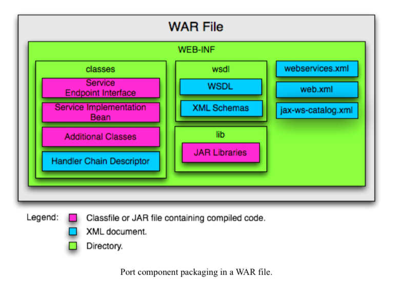
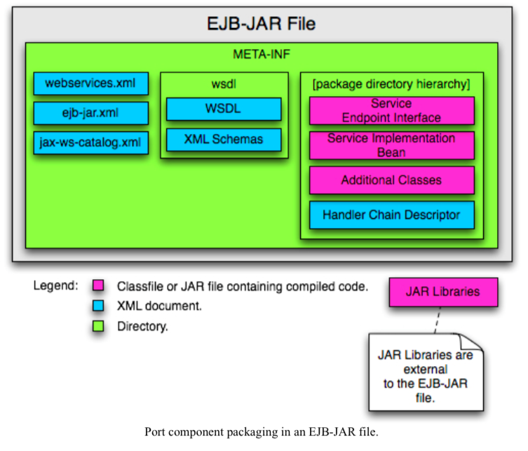
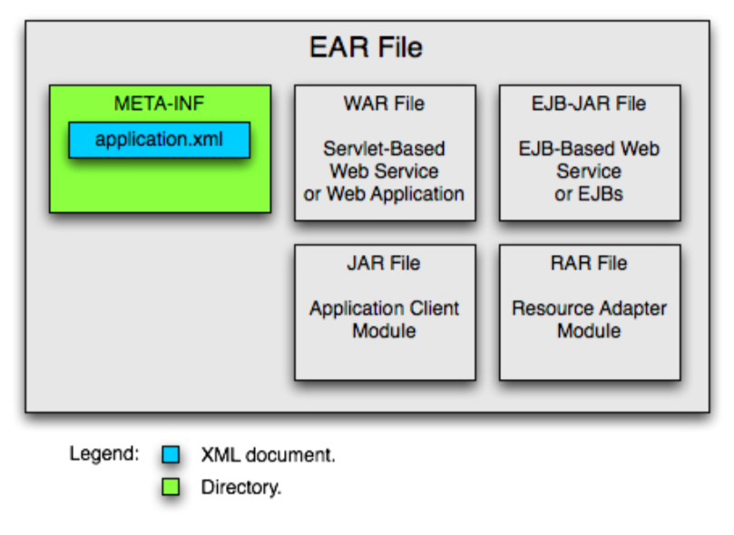

# Chapter 09 - Developing Web Services

## 9.1 Configuration, Packaging and Deployment
* Objective - Describe the steps required to configure, package, and deploy JavaEE Web Services and service clients, including description of the packaging formats, such as .ear, .war, .jar, annotations and deployment descriptor settings

* **Configuration of Web Services**
* Annotations
* webservices.xml
* web.xml
* ejb-jar.xml

* **Annotations and the webservices.xml Deployment Descriptor**
* <webservice-description> - One per WSDL document
* <port-component> - One per @WebService annotation
* <wsdl-file> - @WebService.wsdlLocation
* <port-component-name> - @WebService.name
* <wsdl-service> - @WebService.serviceName
* <wsdl-port> - @WebService.portName
* <service-endpoint-interface> - @WebService.endpointInterface
* <handler-chains> - @HandlerChain

* **Servlet-Based Web Service Configuration Example**

* **EJB-Based Web Service Configuration Example**

* **Configuration of Web Service Clients**
* Client responsible for defining a reference for each web service:
    * Service reference name
    * Service type
    * Service reference type
    * Ports
    * MTOM/XOP support
    * WSDL file location
    * Service
    * Handlers

* Web service client can be configured in the following ways:
    * Annotations
    * In the web.xml deployment descriptor
    * In the ejb-jar.xml
    * In the application-client.xml
    * Programmatically - dynamic clients

* **Using Annotations**
* Annotation-based configuration can be used with both JavaEE and standalone ws clients

* **The javax.xml.ws.WebServiceClient Annotation**
* @WebServiceClient used to annotated a class, typically generated, extending the *javax.xml.ws.Service* class
* The information specified in annotation binds the service class to a particular <wsdl:service> in WSDL file
* Contains the following elements:
    * name
    * targetNamespace
    * wsdlLocation
* The stub generated by *wsimport* are automatically annotated

* **The javax.xml.ws.WebServiceRef Annotation**
* What? - Used to declare a reference to a web service
* Use on? Class, method, fields
* Elements
    * mappedName
    * name
    * type
    * value
    * wsdlLocation

* **The javax.xml.ws.WebServiceRefs Annotation**
* What? Used to declare multiple reference to web services
* Use on? class only
* Contains multiple @WebServiceRef which must specify both name and type

* **The javax.jws.HandlerChain Annotations**

* **Using Deployment Descriptors**
* web.xml, ejb-jar.xml and application-client.xml declare references to web services in <service-ref> elements

* **Packaging of Web Services**
* A port component, that is a component implementing a web service, can contain:
    * WSDL document - not required
    * Service Endpoint Interface (SEI) - not required
    * Service Implementation Bean and dependent classes - required
    * Deployment descriptor, containing, among others, Security Role References - not required 
    * JAX-WS generated portable artifacts - not required
    * OASIS XML Catalog 1.1 - not required

* Can be package in 2 different ways:
    * WAR file - SIB must be a JAX-WS Service Endpoint
    * EJB-JAR file - SIB must be a Stateless Session Bean

* **Packaging of Web Service Clients**
* Two kind of Java web service client:
    * Standalone clients - any kind of clients that does not execute in a container
    * JavaEE clients - clients running in a container, such as web container or an EJB container

* Include the following artifacts:
    * Service Endpoint Interfaces - required
    * Generated service interface class - not required
    * Additional client class - required
    * Web service client deployment descriptor - not required
    * WSDL file - required
    * OASIS XML Catalogs file jax-ws-catalog.xml - not required

* **Deploying Web Services**
* Can be deployed in 3 ways:
    * As a servlet endpoint
    * As a stateless EJB endpoint
    * In an enterprise application

* The deployer of WS is responsible for specifying deployment time binding information
    * Providing bindings for por addresses
    * Provide binding for container managed port access to Service Endpoint Interfaces

* **Deploying Web Service Clients**

## 9.2 XML File Processing
* Objective - Given a set of requirements, develop code to process XML files using SAX, StAX, DOM, XSLT and JAXB APIs

## 9.3 Create WSDL and Generated Service Implementation from XML Schema
* Objective - Given an XML schema for a document style Web service create a WSDL file that describes the service and generate a service implementations

* **Generate Server and Client Artifacts**

## 9.4 XML-Based, Document Style JAX-WS Web Service
* Objective - Given a set of requirements, create code co create an XML-based, document style, Web service using JAX-WS APIs

## 9.5 SOAP Logging
* Objective - Implement a SOAP logging mechanism for testing and debugging a Web service application using JavaEE Web Service APIs

* Handlers - intercept messages sent to, and received by, a web service application
* JAX-WS API supports two types of handlers:
    * Logical Handlers - independent of protocol binding, treats the payload of a message as XML, does not provider access to protocol-specific part of messages
    * Protocol Handlers - protocol binding, treats the payload of a message as SOAP message

## 9.6 Web Service Client Error Handling
* Objective - Given a set of requirements, create code to handler system and service exceptions and faults received by a Web Service client

* **Exception Mapping**

* **Service Exceptions and System Exceptions**
* Service specific exceptions are all checked exceptions, except *java.rmi.RemoteException* and all of its subclasses
* Should have corresponding fault declared in the corresponding operation
* Exceptions that are not service exceptions must not be treated as service exceptions and must not be mapped to WSDL faults

* **Web Service Client Exception View**

* **Error Service**
