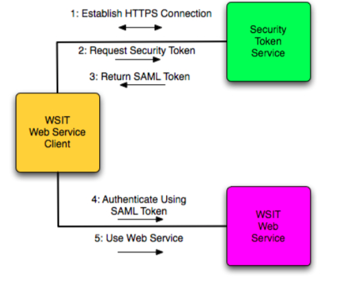

# Chapter 10 - Web Services Interoperability Technologies

## 10.1 WSIT Basics
* Objective - Describe WSIT, the features of each WSIT technology and the standards that WSIT Implements for each technology and how it works

* **What is WSIT?**
* Join effort of Sun and Microsoft to ensure interoperability of web services enterprise technologies

* **WSIT Technologies**
* Core XML
    * Provide a platform agnostic, standardized, means for sharing of data
    * Provide a base for all the other WSIT technologies

* Core Web Services and Optimization
    * Core web services functionality
    * Optimize XML used by web service to reduce application processing time and bandwidth usage

* Reliability
    * Ensure delivery of application messages to webservice endpoints. Re-delivering lost messages
    * Ensure that messages are delivered exactly once
    * Ensure that message are delivered in the order they were sent
    * Support session management

* Bootstrapping
    * From a web service URL, retrieve the web service's WDL, create and configure a client that con access and consume a web service

* Security
    * Interoperable message content integrity and confidentiality, even when messages pass through intermediary nodes
    * Complements transport-level security
    * Supports WS-Secure Conversation, enables the establishing of security context
    * Supports WS-Security Policy, enables WS to clearly state security preferences and requirements for endpoints
    * Support WS-Trust that supports issuing, renewal, and validation of security tokens

* **WSIT Standards Implementations**
* Core XML
    * XML
    * XML Namespaces
    * XML Infoset
    * XML Schema

* Core Web Services and Optimization
    * SOAP
    * MTOM
    * WS-Addressing

* Reliability
    * WS-Reliable Messaging
    * WS-Reliable Messaging Policy
    * WS-Coordination
    * WS-Atomic Transactions

* Bootstrapping
    * WSDL
    * WS-Policy
    * WS-Policy Attachment
    * WS-Metadata Exchange

* Security
    * WS-Security Policy
    * WS-Security
    * WS-Trust
    * WS-Secure Conversation

* **How It Works**

* **Message Optimization**
* Identifies SOAP message with large binary payloads. Using threshold size
* Removes the binary message payload from the SOAP message
* Encodes the binary message payload from the SOAP message
* Adds the binary massage payload to SOAP message as an attachment
* When SOAP message reached its destination, the binary message payload is decode

* **Reliable Messaging**
* One or more message are lost - WS-Reliable Messaging Source Module resend message
* One or more messages are out of order - retain message until earlier messages are received
* One or more duplicate messages are received - discard duplicate message

* **Bootstrapping and Configuration**
* Configure environment
* Retrieve the URL of WS or service registry
* Retrieve information needed to build a client
* Create client artifacts
* Implement the WS client

* **Security**
* Divided into 3 areas: security policy, security trust and secure conversation

* **Security Policy**
* Protection assertions
* Conditional assertions
* Security binding assertions
* Supporting token assertions
* WS Security and Trust assertions

* **Security Trust**
* When establishing trust between a WSIT WS and a WSIT client, a WS-Security Token Service is involved

* **Secure Conversation**
* Procedure:
    * Client authenticates itself to the service by presenting its X509 certificate
    * Service authenticates itself to the client by presenting its X509 certificate
    * Client can now start using the service

## 10.2 WSIT Clients
* Objective - Describe how to create a WSIT clients from a WSDL file

## 10.3 Message Optimization
* Objective - Describe how to configure web service providers and clients to use message optimization

## 10.4 WCF Web Service Clients
* Objective - Create a Microsoft Windows Communication Foundation (WCF) client that access a Java web service

## 10.5 WCF and Java Web Service Interoperability
* Objective - Describe the best practice for production and consumption of data interoperability between WCF web services and Java web service clients or between Java web services and WCF web service clients

* Clients/services written in Java (WSIT) uses JAXB to perform:
    * XML serialization
    * Generating XML schemas from Java classes
    * Generating Java classes from XML schemas

* WCF uses *DataContractSerializer* or *XmlSerializer*

* The different between the two mechanisms:
    * JAXB 2.0 supports all of XML schema, which WCF mechanisms support different XML schema sets
    * Mapping of programming language data types to XML schema constructs differ between the two technologies

* **Web Service Java First**

