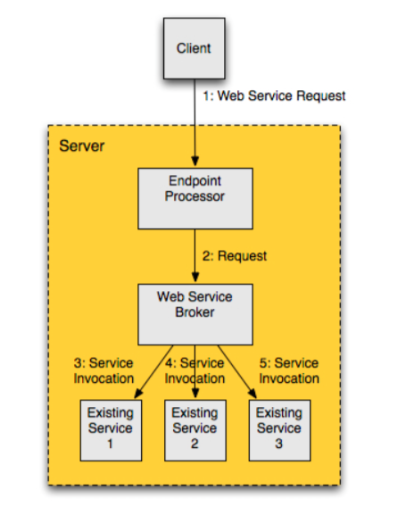

# Chapter 11 - General Design and Architecture

## 11.1 Service Oriented Architecture
* Objective - Describe the characteristics of a service-oriented architecture and how Web services fit this model

* SOA is an architectural style that can affect:
    * How software is deployed
    * Design techniques
    * Development methodology
    * Partner/customer/supplier relationships

* **SOAP Characteristics**
* Loose coupling
* Reusability
* Interoperability
* Scalability
* Flexibility
* Cost Efficient
* Dynamic Discoverability

* **Web Services in SOA**
* Use WSDL
    * Loose coupling, reusability, flexibility
* Use standardized, widely accepted, ways of communication that are vendor-independent
    * Loose coupling, interoperability
* A set of standards and recommendations have been specified to ensure interoperability between web service implemented in different languages
    * Loose coupling, cost efficient, interoperability
* WS can be asynchronous, document based and stateless
    * Scalability, loose coupling
* WS is mature technology with good tool support
    * Cost efficiency
* WS can be registered in UDDI registry
    * Dynamic Discovery

## 11.2 Design Patterns and Best Practices
* Objective - Given a scenario, design a JavaEE web service using Web Services Design Pattern (Asynchronous Interaction, JMS Bridge, Web Service Cache, Web Service Broker) and Best Practices

* **Asynchronous Interaction**
* What? - client issue a request without waiting for a response
* How? - client can either be notified that a response has arrived using a callback or client can pool for the availability of a response
* When?
    * Response time is expected to be long
    * Response time may not be predictable
    * Users may not be continuously online
    * More strict requirements concerning reliability and performance

* **JMS Bridge**
* What? form a bridge between two messaging systems

* How? forward the message from one domain to another domain
* When? messaging systems are cross-domain
* Drawbacks
    * Overhead due to extra layer

* **Web Service Cache**
* What? store results for a period of time

* Benefits
    * Reduce network traffic
    * Increase performance

* Drawbacks
    * Keep data synchronized
    * Handle stale data in cache
    * Adds design complexity
    * Recover data in cache in case of corruption

* **Web Service Broker**
* What? coordinates requests to backing services

* Can be used for the following reason:
    * One or more existing services are to be exposed
    * One or more services need to be exposed in a heterogeneous environment
    * Monitoring and usage restrictions
    * One or more existing services need to be adapted to business requirements

* Benefits
    * Reuse of existing services
    * Integration in heterogeneous environments
    * Monitor access to existing service(s)
    * Restrict access to existing service(s)

* Drawbacks
    * Introduces an additional layer between client and service
    * Protocols such as SOAP over HTTP may affect network performance
    * Existing remote services need to be adapted to provide local access

* **Best Practices**
* Advantages
    * Reusable components
    * Shareable services
    * Improves developer productivity
    * Reduce production time
    * Reduce infrastructure and support cost
    * Increase quality and reduce risk
    * Increase scalability and availability

* Some best practices:
    * Follow WS-I Basic Profile
    * Use WSDL-first development
    * With non-trivial services, separate service implementations in two layers; an interaction layer and processing layer
        * The interaction layer consists of:
            * WS SEI and SIB
            * Logic for preprocessing and delegating requests
            * Logic for formulating responses
        * THe processing layer contains:
            * Business logic used to process client request
            * Logic that integrates with existing WS
    * Find a balance between flexibility and consolidation
    * Carefully choose parameter types and return types of service methods
    * Consider how errors, faults and exceptions are to be handled and what result such conditions will produce
    * When implementing WS handlers:
        * Do not implementing business logic or processing related
        * Do not store client-specific state in a handler
        * Handlers are applied to all request/response can result in a significant performance penalty
        * Handlers should not alter SOAP messages
    * Prefer stateless services over stateful
    * Design endpoints to be idempotent

## 11.3 Web Service Interaction Results
* Objective - Describe how to handle the various types of return values, faults, errors, and exceptions that can occur during a Web service interaction

* Different results that can occur during a web service interaction:
    * Return values
    * Faults, Errors and Exceptions

* **Return Values**
*  **Java Objects and Values**
* What? A Java object returned by a web service is always a copy of an object that resides, or resided, on the server side
* How? WS runtime reconstructs one or more objects by unmarshalling XML data received in response to a WS request
* Effect?
    * Data on client side will become stale if the data on service side is changed
    * Changes to the object(s) on the client side will not reflected on the server side
    * Depending on the marshaling technology, there may be different between the type of object(s) used to created the representation and the resulting object(s)

* **Faults, Errors and Exceptions**
* **Faults**
* What? result of WS invocation will be mapped as follows by JAX-WS
    * If possible, a service-specific exception must be thrown
    * If the fault cannot be mapped to a service-specific exception, then a *ProtocolException* or one of its subclasses must be thrown
* If not processing raw SOAP messages, faults will be mapped to Java exceptions and the exceptions
* Faults can be processed in handlers by using *handleFault* method

* **Errors**
* WS should try to avoid throwing system exceptions
* Such exceptions will result in a *ProtocolException*, or a subclass of *ProtocolException*
* Unchecked exception and provide little information on the cause of the error

* **Exceptions**
* Two kinds of exceptions can occur:
    * System Exceptions
    * Service-Specific Exceptions

* JAX-WS defines following standard, unchecked, exceptions:
    * *javax.xml.ws.WebServiceException* - error during local processing occurs
    * *javax.xml.ws.ProtocolException* - base class for runtime exceptions related to specific protocol bindings
    * *javax.xml.soap.SOAPFaultException* - subclass of *ProtocolException* used in connection with SOAP binding
    * *javax.xml.ws.http.HTTPException* - subclass of *ProtocolException* used in connection with HTTP binding

* **System Exceptions**
* What? all unchecked Java exceptions plus *java.rmi.RemoteException* and all subclasses of *RemoteException*
* Possible cause?
    * Invocation fails due to URI of service being bad
    * Service not being accessible
    * Network communication problems
    * Errors beyond the control of the WS

* System exceptions occurring on the server side during WS invocation will result in an appropriate subclass of *ProtocolException*
* Example:
    * If system exceptions is thrown during the execution of a SOAP WS, a SOAP fault will be generated, and when reaching the client, a *SOAPFaultException* will be thrown

* Tactics for dealing with System exceptions:
    * Retry the WS invocation
    * Redirect the request to an alternative service
    * Notify the user that an error had occurred
    * Logging the error
    * Translate checked system exceptions to an unchecked Java exception and let the client handle the unchecked exception

* **Service-Specific Exceptions**
* What? all checked exceptions, with the exception of *java.rmi.RemoteException* and all of its subclasses
* Service-specific exception thrown by WS method are to be mapped to <wsdl:fault>
* A mapped Java exception class must be annotated with @WebFault annotation
* Possible cause?
    * Data presented to the service is out of bounds
    * Data presented to the service duplicates existing data
    * Data presented to the service is incomplete

* How to handle?
    * Wrap the checked exceptions and throw an unchecked exception
    * Notify the user of client about error
    * Do not allow service-specific exception propagate throughout the client, but wrap them in exception specific to the client
    * Handle exceptions at one single place in the client application

* Do boundary checking of parameters to reduce web service calls

## 11.4 Web Services and Data Integration
* Objective - Describe the role that Web services play when integrating data, application functions, or business process in a JavaEE application

// TODO

* How WS can be used:
    * Integrate the data
    * Integrating application functions
    * Integrate business process

* **Integrating Data**
* What? data located in a system is adapted to allow access from other systems
* Data format is likely to vary between the systems, additionally the data models may also be different

* **Web Service as an Integration and Transformation Layer**
* WS enables various kinds of data from different sources available in a manner (XML or JSON) that can be read and understood by clients
* A canonical data model, data model does not depend on any application, can be established, by using XML
* Using XML has following advantages:
    * XML schemas can be enforced - validation of data
    * XMl documents can be transformed and converted to others formats
    * XML is both platform and programming-language independent

* **Web Services as Metadata Provider**
* Metadata is data about the format of data
* Such metadata is present in a WSDL file

* **Integration Application Functions**
* What? integrating new applications with existing or legacy applications

* **Web Services and User Experience**
* What? WS can aid in integrating application functions to provide a more seamless experience of multiple applications for users
* Example: single-sign on

* **Web Service as a Reuse Facilitator**
* What? WS can integrate application functions in an enterprise, and across enterprise boundaries to avoid the same function being implemented in multiple locations
* Benefits?
    * Increase reuse, reduces cost and increases flexibility

* **Web Services as an Integration Layer**
* What? integrate new application with existing application functions
* Act as a facade behind which details of the underlying (legacy) system is hidden
* Provide a opportunity to control and monitor access to the underlying systems

* **Integrating Business Processes**
* What? integration of the existing systems of an enterprise in order to support a set of business processes
* A business processes is a number of steps that together form a business task or a business function
* How? by exchange of XML document between business processes according to certain business rules

* **Web Services as Enterprise Service Providers**
* WS with a WS registry can provide a dynamic way to maintain a catalog of services provided by business partners or services of an enterprise supplies to business partners

* **Web Services a a Communication Facilitator**
* What? ties together different business partner
* Gains?
    * Provide cost effective way to integrate business partners of varying sizes
    * Can be used on a variety of platforms
* Drawbacks
    * Additional layer causes delays due to validation and processing of XML data
    * Complex, require investments in education
