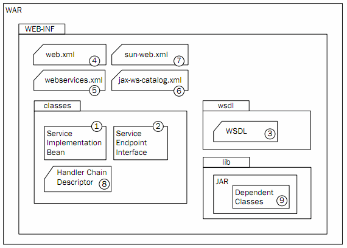
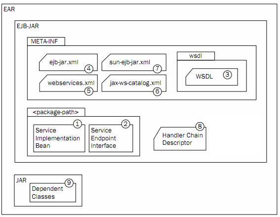

# Chapter 06 - Create a web service client for a SOAP based web service

## 6.1 Create a standalone client

### 6.1.1 Use *wsimport* to generate artifacts
* JAX-WS defines two service usage models:
    * Proxy Clients
    * Dispatch Clients
    
* In proxy-based client model, your applications work on local proxy objects that implement the SEI that is being exposed by the web service endpoint

* The dispatch-client model offered by JAX-WS is a lower-level model that requires you to supply the necessary XML request yourself. This model can be used in the situations where you want to dynamically build up the SOAP request itself or where you must use a non-SOAP-based web service endpoint

* Collectively, both client types are also known as *BindingProviders* because both clients realize the JAX-WS *javax.xml.ws.BindingProvider* interface
* The *BindingProvider* interface allows for a common configuration model

* **Proxy clients**
* The *wsdl* tool will read the WSDL of a deployed web service and generate the Java objects necessary to invoke it, including a class that extends *javax.xml.ws.Service*, which provides the client view of a web service
* This can be confusing concept because we tend to think of the service as being located on the server
* But a service instance acts as a factory to create proxies that allow you to invoke a web service as if it was local
* These proxies are sometimes referred to as SEI (Service Implementation Interface) objects

* The tool generates portable artifacts tha use only standard Java means. It will automatically call on JAXB to create value types that map Java to XML and the result can be used to perform web services operations

* The *wsimport* tool has a variety of options, many of which have to do with customization

* *The generated Service class*
* The *Service* class is the value of the name attribute of the WSDL <service> element
* The generated *Service* class allows you to:
    * Get available ports (service endpoint interfaces)
    * Get the location of the WSDL document associated with the service
    * Get the Executor instance associated with the service, which provides threading capability to service invocations
    * Create a *Dispatch*
    * Create a *Service* instance
    * Call the *getPort* method on the *Service* instance to invoke the web service operations
    
* This class extends *javax.xml.ws.Service*, and is annotated with a *@WebServiceClient* annotation that specifies the location of the WSDL representing the service to be invoked
* It contains factory methods that return the Java object that represents the WSDL port you can invoke operations on

* *The generated Port class*
* The runtime will do the work behind the scenes by delegating the invocation to an implementation of *javax.xml.ws.spi.ServiceDelegate*, which the *Service* class decorates

* The *@RequestWrapper* and *@ResponseWrapper* annotations capture information that JAXB needs to perform the marshalling and unmarshalling operations. If the service is defined using *document/literal* mode, this annotation also serves to resolve overloading conflicts

### 6.1.2 Create a client application using these artifacts
* The client cannot create or destroy web service implementations and has no view into its life cycle, which is handle entirely on the server
* A port object has no identity. It cannot meaningfully be compared to other port objects. You cannot ask for a specific instance of a port
* Treat service invocations as stateless. There is no mechanism within *Service* to handle state across requests
* All data binding is performed by JAXB

#### 6.1.2.1 Invoke web service synchronously or asynchronously
* **Synchronous clients**
* By using the synchronous model, you can develop SOAP-based web service client code without worrying about the uderlying protocol details
* The generated *Service* class has two constructors:
    * The first constructor is the default constructor. It configures the service so that any dynamic proxies created from it are produced by using the WSDL document that was used to generate the client code
    * The second constructor initializes the service by using a specified WSDL document

* **Asynchronous clients**
* The asynchronous client programming model in JAX-WS is merely a convenient functionality for developing web service clients
* It does not refer to real asynchronous message exchanges
* You can create asynchronous clients by configuring the tool that you use to generate JAX-WS web service client code

* JAX-WS offers two asynchronous programming models:
    * Polling clients
    * Callback clients

* These approaches merely differentiate, in the Java method, signatures that are generated on the client-side web service port interface
* When you enable asynchronous clients in your tool, JAX-WS generates three methods for every operation that is defined in the web service *portType*:
    * One-way asynchronous method
    * An asynchronous polling method
    * An asynchronous callback method

* *Polling clients*
* The polling client programming model refers to the usage of the asynchronous method that returns a typed *javax.xml.ws.Response*
* The client application invokes the *xxxAsync* method, which returns a response object
* this object provides methods to query for response arrival, cancel a response, and get the actual response

* *Callback clients*
* The callback client programming model refers to the usage of the asynchronous method that accepts an input parameter of typed *javax.xml.ws.AsyncHandler*
* The client passes in an anonymous inner class of type *AsynchHandler*. This class has a method called *handleResponse* that is invoked by the JAX-WS runtime when the message is received. The argument to this method is of the same type that is used for the polling method, a typed response object

## 6.2 Create a client in a managed component in a EE container

### 6.2.1 Use wsimport to generate artifacts

### 6.2.2 Using @WebServieRef in the client application
* The *@WebServiceRef* annotation is used to declare a reference to a web service

* Use the *@WebServiceRef* annotation to inject a reference to the service you want to invoke. Note that this does not have to be only a servlet or EJBC
* you might also want to invoke a web service from other component-managed resources, such as a *Filter*, a *SessionContextListener*, a *ServletContextListener*, or a *TagHandler* depending on your use case

* Using *@WebServiceRef*, you can get a reference to a web service and an injection target for it. Items annotated with *@WebServiceRef* follow the standard rules for resource injection within Java EE 6
* It defines following attributes or properties:
    * *name* - identifes the reference to the component using the resource, as a JNDI name
    * *wsdlLocation* - the URL pointing to the WSDL for the referenced web service
    * *type* - the resource class type
    * *value* - the service class class type, which must extend *javax.xml.ws.Service*
    * *mappedName* - a name, such as a JNDI name, that maps from the value of the "name" property to a resource known to the server
    * *lookup* - a portable JNDI lookup name that resolves to the target web service reference

* There are two ways to use the *@WebServiceRef* annotation:
    * To define a reference whose type is a generated service class. In this case, the *type* and *value* element will both refer to the generated service class type
    * To define a reference whose type is a SEI. In this case, the *type* element MAY be present with a default value if the type of the reference can be inferred from the annotated field/method declaration, but the *value* element MUST always be present and refer to a generate service class type

### 6.2.3 Package and deploy accordingly
* **Packaging a servlet endpoint using a WAR**

* Service Implementation Bean *required* is contained in the *WEB-INF/classes*. Alternatively, the SIB could be contained in a JAR under the *WEB-INF/lib* or even in a extension JAR installed in the web container and referrenced by the WAR's *MANIFEST Class-Path*. As lolg as the SIB is on the application classpath, the packaging will work. This class file must be annotated with *@WebService* or *@WebServiceProvider*
* Service Endpoint Interface *optional* is contained in the *WEB-INF/classes*. The SEI class may be located anywhere on the application classpath. When used, the SIB's *@WebService.endpointInterface* attribute's value must match the complete name of this SEI
* WSDL *optional* is contained in the *WEB-INF/wsdl* directory. When used, the SIB's *@WebService.wsdlLocation* attribute's value must equal the relative location of this file (the *wsdlLocation* can also be an absolute URL). Any files referenced by the WSDL must be referenced relative to the WSDL's location
* web.xml *optional* is contained in the *WEB-INF/* directory
* webservices.xml *optional* is contained in the *WEB-INF/* directory
* java-ws-catalog.xml *optional* is contained in the *WEB-INF/* directory
* sun-web.xml *optional* is contained in the *WEB-INF/* directory
* Handler Chain Descriptor *optional* is contained under the *WEB-INF/classes* directory where it will be available as a resource on the application classpath
* Dependent classes *option* are bundled in a JAR and contained under the *WEB-INF/lib* directory where they are available on the application classpath

* **Packaging an EJB endpoint using an EJB-JAR**

