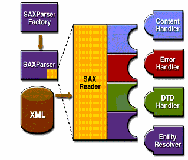
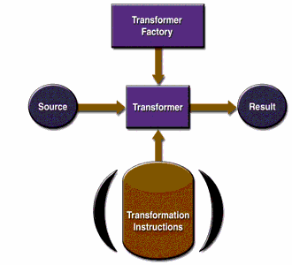
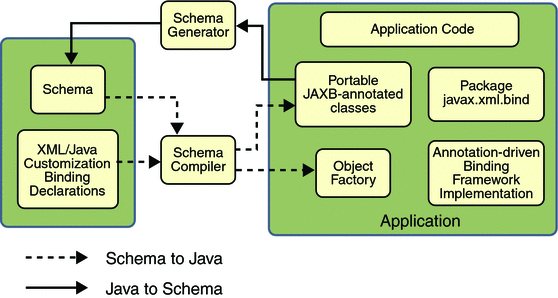

# Chapter 10 - Create low-level SOAP web services

# 10.1 Describe the functions and capabilities of the APIs included within JAXP
* The Java API for XML Processing (JAXP) is for processing XML data using applications written in the Java programming language
* JAXP leverages the parser standard Simple API for XML Parsing (SAX) and Document Object Model (DOM) so that you can choose to parse your data as a stream of events or to build an object representation of it
* JAXP also supports the Extensible Stylesheet Language Transformations (XSLT) standard, giving you control over the presentation of the data and enabling you to convert the data to other XML documents or to other formats, such as HTML
* JAXP also provides namespace support, allowing you to work with DTDs that might otherwise have naming conflicts
* As of version 1.4, JAXP implements the Streaming API for XML (StAX) standard

* Desgned to be flexible, JAXP allows you to use any XML-compliant parser from within your application
* It does this with what is called a pluggability layer, which lets you plug in an implementation of SAX or DOM API
* The pluggability layer also allows you to plug in an XSL processor, letting you control how your XML data is displayed

* The main JAXP APIs are defined in the *javax.xml.parsers* package
* That package contains vendor-neutral factory classes, *SAXParserFactory*, *DocumentBuilderFactory*, and TransformerFactory*, which give you a *SAXParser*, a *DocumentBuilder*, and an XSLT transformer, respectively
* *DocumentBuilder*, in turn, creates a DOM-compliant *Document* object

* **Simple API for XML Parsing**
* To start the process, an instance of the *SAXParserFactory* class is used to generate an instance of the *SAXParser*

* The parser wraps a *SAXReader* object
* When the parser's *parse()* method is invoked, the reader invokes one of the several callback methods implemented in the application
* Those methods are defined by the interfaces *ContentHandler*, *ErrorHandler*, *DTDHandler*, and *EntityHandler*

* Summary of the key SAX APIs:
    * *SAXParserFactory* - creates an instance of the Parser determined by the system property, *javax.xml.parsers.SAXParserFactory*
    * *SAXParser* - defines several kinds of *parse()* method. In general, you pass an XML data source and a *DefaultHandler* object to the parser, which processes the XML and invokes the appropriate methods in the handler object
    * *SAXReader* - The *SAXParser* wraps a *SAXReader*. Typically, you do not care about that, but every once in a while you need to get hold of it using *SAXParser's getXMLReader()* so that you can configure it. It is the *SAXReader* that carries on the conversation with the SAX event handlers you define
    * *DefaulHandler* - implements the *ContentHandler*, *ErrorHandler*, *DTDHandler*, and *EntityResolver* interfaces (with null methods), so you can override only the ones you are interested in
    * *ContentHandler* - methods such as *startDocument*, *endDocument*, *startElement*, and *endElement* are invoked when an XML tag is recognized
    * *ErrorHandler* - methods *error()*, *fatalError()*, and *warning()* are invoked in response to various parsing errors
    * *DTDHandler* - defines methods you will generally never be called upon to use. Use when processing a DTD to recognize and act on declarations for an unparsed entity
    * *EntityResolver* - the *resolveEntity()* method is invoked when the parser must identity data identified by a URI

* *When to use SAX*
* SAX is fast and efficient, but its event model makes it most useful for state-independent filtering
* If the processing you are doing is state-indenpendent (meaning that it does no depend on the elements that have come before), then SAX work fine

* On the other hand, for state-dependent processing, where the program needs to do one thing with the data under element A but something different with data under element B, the a pull parser such as the Streaming API for XML (StAX) would be a better choice
* SAX requires much less memory than DOM, because SAX does not construct an internal representation (tree structure) of the XML data, as a DOM does
* Instead, SAX simply sends data to the application as it it read; your application can then do whatever it wants to do with the data it sees

* Pull parsers and the SAX API both act like a serial I/O stream
* You see the data as it streams in, but you cannot go back to an earlier position or leap ahead to a different position
* In general, such parsers work well when you simply want to read data and have the application act on it

* But when you need to modify an XML structure - especially when you need to modify it interactively - an in-memory structure makes more sense. DOM is on such model
* However, although DOM provides many powerful capabilities for large-scale documents, it also require a lot of complex coding

* *Parsing an XML File Using SAX*
* 

* **Document Object Model APIs**
* Use the *javax.xml.parsers.DocuemntBuilderFactory* class to get a *DocumenetBuilder* instance, and you use that instance to produce a *Document* object that conforms to the DOM specification
* The Builder you get, in fact, is determined by the system property *javax.xml.parsers.DocumentBuilderFactory*, which selects the factory implementation that is used to produce the builder
* The plat

* *When to Use DOM*
* The Document Object Model standard is, above all, designed for documents (e.g articles and books)
* In addition, the JAXP 1.4.2 implementation supports XML Schema, something that can be an important consideration for any givn application

* On the other hand, if you are dealing with simple data structures and if XML Schema is not a big part of your plans, then you may find that one of the more object-oriented standards, such as JDOM or dom4j, is better suited for your purpose

* From the start, DOM was intended to be language-neutral. Because it was designed to use with lanuguages such as C and Perl, DOM does not take advantage of Java's object-oriented features. That fact, in addition to the distinction between documents and data, also helps to account for the ways in which processing a DOM differs from processing a JDON or dom4j structure

* *Parsing an XML File Using DOM*
* Create a new instance of *DocumentBuilderFactory*
* Custom configuration using that new instance
* Create a new *DocumentBuilder* using the instance of *DocumentBuilderFactory*
* Parse the XML file using *DocumentBuilder* instance

# **Extensible Stylesheet Language Transformations APIs**
* A *TransformerFactory* object is instantiated and used to create a *Transformer*
* The source object is the input to the transformation process
* A source object can be created from a SAX reader, from a DOM, or from an input streawm

* Similarly, the result object is the result of the transformation process. The object can be a SAX event handler, a DOM, or an output stream

* When the transformer is created, it can be created from a set of transformation instructions, in which case the specified transformations are carried out
* If it is created without any specific instructions, then the transformer object simply copies the source to the result

* **Streaming API for XML APIs**
* StAX is the latest API in the JAXP family, and provides alternative to SAX, DOM, and TraX for developers looking to do high-performance stream filtering, processing, and modification, particularly with low memory and limited extensibility requirements
* To summarize, StAX provides a standard, bidirectional pull parser interface for streaming XML processing, offering a simpler programming model than SAX and more efficent memory management than DOM. StAX enables developers to parse and modify XML streams as events, and to extend XML information models to allow application-specific additions

* *Comparing StAX to Other JAXP APIs*
* As an API in the JAXP family, StAX can be comared, among other APIs, to SAX, TrAX, and JDOM. Of the latter two, StAX is not as powerful or flexible as TrAX or DOM, but neither does it require as much memory or processor load to be useful, and StAX can, in many cases, outperform the DOM-based APIs

* With this in mind, the closest comparisons can be made between StAX and SAX:
    * StAX-enabled clients are generaly easier to code than SAX
    * StAX is a didirectional API, meaning that it can both read and write XML documents. SAX is read only, so another API is needed if you want to write XML
    * SAX is a push API, whereas StAX is pull

* The StAX API exposes methods for iterative, event-based processing of XML documents
* XML documents are treated as a filtered series of events, and infoset states can be stored in a procedural fashion
* Moreover, unlike SAX, StAX API is bidirectional, enabling both reading and writing of XML documents

* The StAX API is really two distinct API sets: a *cursor* API and an *iterator* API

* *Cursor API*
* Represents a cursor with which you can walk an XML document from beginning to end
* This cursor can point to one thing at a time, and always move forward, never backward, usually one infoset element at a time

* The two main cursor interfaces are:
    * *XMLStreamReader* - includes accessor methods for all possible information retrievable from the XML Information model, including document encoding, element names, attributes, namespaces, text nodes, start tags, comments, processing instructions, document boundaries, and so forth
    * *XMLStreamWriter* - provides methods that correspond to *StartElement* and *EndElement* event types

* Cursor API mirrors SAX in many way

* *Iterator API*
* StAX iterator API represents an XML document stream as a set of discreate event objects
* These events are pulled by the application and provided by the parser in the order in which they are read in the source XML document

* The base iterator interface is called *XMLEvent*, and there are subinterfaces for each event type
* The primary parser interface for reading iterator events is *XMLEventReader*, and the primary interface for writing iterator events is *XMLEventWriter*

* *Comparing Cursor and Iterator APIs*
* Things that you can do with the Iterator but cannot do with Cursor API:
    * Objects created from the *XMLEvent* subclasses are immutable, and can be used in arrays, lists, and maps, and can be passed through your applications even after the parser has moved on to subsequent events
    * You can created subtypes of *XMLEvent* that are either completely new information items or extensions of existing items but with additional methods
    * You can add and remove events from an XML event stream in much a simpler ways that with the cursor API

* Similarly, keep some general recommendations in mind when making your choice:
    * If you are programming for a particularly memory-constrained environment, like Java ME, you can make smaller, more efficient code with the cursor API
    * If performance is your highest priority - the cursor API is more efficient
    * If you want to create XML processing piplines, use the Iterator API
    * If you want to modify the event stream, use the Iterator
    * If you want your application to be albe to handle pluggable processing of the event stream, use the iterator API
    * In general, if you do not have a strong preference one way or the other, using the Iterator API is recommended because it is more flexible and extensible

## 10.2 Describe the functions and capabilities of JAXB, including the JAXB process flow, such as XML-to-Java and Java-to-XML, and the binding and validation mechanisms provided by JAXB
* Java Architecture for XML Binding (JAXB) provide a fast and convenient way to bind between XML Schemas and Java representations, making it easy for Java Developers to incorporate XML data and processing functions in Java applications
* As part of this process, JAXB provides methods for unmarshalling XML instance documents into Java content trees, and then marshalling Java content trees back into XML instance document
* JAXB also provides a way to generate XML Schema from Java objects

* A JAXB implementation consists of the following architectural components:
    * Schema compiler - binds a source schema to a set of schema-driven program elements. The binding is described by an XML-based binding language
    * Schema generator - maps a set of existing program elements to a derived schema. The mapping is described by program annotations

* The general steps in the JAXB data binding process are:
    * Generate classes - an XML Schema is used as input to the JAXB binding compiler to generate JAXB classes based on that schema
    * Compile classes - all of the generated classes, source files, and application code must be compiled
    * Unmarshal - XML documents written according to the constraints in the source schema are unmarshalled by the JAXB binding framework. Unmarshalling provides a client application the ability to convert XML data into JAXB-derived Java objects
    * Generate content tree - the unmarshalling process optionally involves validation of the source XML documents before generating the content tree
    * Validate (optional)
    * Process content - client application can modify the XML data represented by the Java content tree by means of interfaces generated by the binding compiler
    * Marshal - the processed content tree is marshalled out to one or more XML output documents. The content may be validated before marshalling. Marshalling provides a client application the ability to convert a JAXB-derviced Java object tree back into XML data

* **Unmarshalling**
* Generates content tree from XML document instance through JAXB binding framework
* Sources for unmarshalling can be:
    * Files/documents
    * InputStream
    * String buffers
    * DOM nodes
    * SAX Sources

* *javax.xml.bind.JAXBContext* provides an abstraction (entry point to the JAXB API) for managing the XML/Java binding information necessary to implement the unmarshal, marshal and validate operations

* *JAXBContext* is created via *newInstance(contextPath)*, where *contextPath* contains a list of Java package names that contain schema derived interfaces and classes

* *Unmarshaller*, *Marshaller*, *Validator* object are created from *JAXBContext* object

* *javax.xml.bind.Unmarshaller* is a Java interface. It governs the process of deserializing XML data (XML document instance) into newly created Java content tree, optionally validates XML data as it is unmarshalled

* **Marshalling**
* Content tree may be marshalled by passing it it to *marshal* method of *Marshaller* object, content trees are no longer required to be valid before marshalling
* *javax.xml.bind.Marshaller* is a Java interface, it governs the process of serializing Java content trees back into XML data

* **Validation**
* Forms of validation
    * Fail-fast Validation - simple runtime type constraint check that can be performed by property setter method
    * On-Demand Validation - applications can call the Validator.validate method on the Java content tree

## 10.3 Use Provider API to create a web service

### 10.3.1 Process the entire SOAP message, using the SAAJ APIs
* **SAAJ overview**
* SAAJ API contains all the classes that you need to send and receive SOAP messages
* All the SAAJ classes belong to the *javax.xml.soap* packages namespace

* The SAAJ types and the types from the *org.w3c.dom* Java XML package are closely related
* In fact, many of the classes in SAAJ extend or implement behavior from classes in the *org.w3c.dom* package namespace
* *SOAPPart* implements the *org.w3c.dom.Document* interface

* **Accessing Elements of a Message**
* Using getter method of SOAP message: *getSOAPPart*, *getEnvelope*, *getHeader*, *getBody*

* **Adding Content to the Body**
* The *SOAPBody* object contains either content or a fault
* To add content to the body, you normally create one or more *SOAPBodyElement* objects to hold the content
* You can also add sub-elements to the *SOAPBodyElement* objects by using the *addChildElement* method
* For each element or child element, you add content by using the *addTextNode* method

* When you create any new element, you also need to create an associated *javax.xml.namespace.QName* object so that it is uniquely identified

* *QName* objects associated with *SOAPBodyElement* or *SOAPHeaderElement* objects must be fully qualified; they must be created with a namespace URI, a local part, and a namespace prefix
* Specifying a namespace for an element makes clear which one is meant if more than one element has the same local name

* Recall that the headers and content in a *SOAPPart* object must be in XML format
* SAAJ API takes care of this fore you, building the appropriate XML constructs automatically when you call methods such as *addBodyElement*, *addChildElement*, and *addTextNode*

* **Getting the Content of a Message**
* The initial step for retrieving a message's content are the same as those for giving content to a message: either you can use *SOAPMessage* object to get the *SOAPBody*, or you access the *SOAPBody* object through *SOAPPart* and *SOAPEnvelope*
* Then you access the *SOAPBody* object's *SOAPBodyElement*, because that is the element to which content was added

* **Adding Content to the Header**
* To add content to the header, you create a *SOAPHeaderElement* object
* As with all new elements, it must have an associated *QName* object

* **Creating an AttachmentPart Object and Adding Content**
* *SOAPMessage* object creates an *AttachmentPart* object, and the message also must add the attachment to itself after content has been added
* The *SOAPMessage* class has three methods for creating an *AttachmentPart* object

* Each *AttachmentPart* object has one or more MIME headers associated with it
* When you specify a type to the *setContent* method, that type is used for the header *Content-Type*
* *Content-Type* is the only header that is required

* **Accessing an AttachmentPart Object
* *SOAPMessage* class provides two versions of the *get
Attachments* method for retrieving its *AttachmentPart* objects

* When it is given no argument, the method *SOAPMessage.getAttachments()* return a *java.util.Iterator* object over all the *AttachmentPart* objects in a message

* When *getAttachments* is given a *MimeHeaders* object, which is a list of MIME headers, it returns a iterator over the *AttachmentPart* objects that have a header that matches one of the headers in the list

### 10.3.2 Process only the SOAPBody, using JAXB
* **Developing a dispatch client that uses JAXB**

* **Developing a JAX-WS logical handler that uses JAXB**

## 10.4 Use Dispatch API to create a dynamic web service client
* XML web services use XML messages for communication between services and service clients
* The higher level JAX-WS APIs are designed to hide the details of converting between Java method invocations and the corresponding XML messages, but in some cases operating at the XML message level is desirable
* The *javax.xml.ws.Dispatch* interface provides support for this mode of interaction

* *Dispatch* supports two usage models, identified by constants 
    * *javax.xml.ws.Service.mode.MESSAGE* - in this mode, client application work directly with protocol-specific message structures
    * *javax.xml.ws.Service.Mode.PAYLOAD* - client applications work with the payload of messages rather than the messages themselves
    
* *Dispatch* is a low level API that requires clients to construct messages or message payloads as XML and requires an intimate knowledge of the desired message or payload structure
* *Dispatch* is a generic interface that supports input and output of messages or message payloads of any type
* Implementations are required to support the following types of objects:
    * *javax.xml.transform.Source* - use of *Source* allows clients to use XML generating and consuming APIs directly. *Source* objects may be used with any protocol binding in either message or message payload mode
    * *JAXB Objects* - allows clients to use JAXB objects generated from an XML Schema to create and manipulate XML representations and to use these objects with JAX-WS without requiring an intermediate XML serialization
    * *javax.xml.soap.SOAPMessage* - allows clients to work with SOAP messages using the convenince features provided by the *SOAPMessage* objects. May only be used with Dispatch instances that use the SOAP binding in message mode
    * *javax.activation.DataSource* - allows clients to work with MIME-typed messages. May only be used with *Dispatch* instances that use HTTP binding in message mode

* *Dispatch* instances are obtained using the *createDispatch* factory methods of a *Service* instance
* The *mode* parameter of *createDispatch* constrols whether the new *Dispatch* instance is message or message payload oriented
* *The *type* parameter controls the type of object used for messages or message payloads
* *Dispatch* instance are not thread safe

* *Dispatch* instances are not required to be dynamically configurable for different protocol bindings; the WSDL binding from which the *Dispatch* instance is generated contains static information including the protocol binding and service endpoint address
* However, a *Dispatch* instance may support configuration of certain aspects of its operation and provides methods to dynamically query and change the values of properties in its request and response contexts

* A *Dispatch* instance supports three invocation modes:
    * Synchronous request response (*invoke* methods) - method blocks until the remote operation completes and the results are returned
    * Asynchronous request response (*invokeAsync* methods) - method returns immediately, any results are provided either through a callback or via a polling object
    * One-way (*invokeOneWay* methods) - method is logically non-blocking, subject to the capabilitiws of the underlying protocol, no results are returned

* *Dispatch* supports two forms of asynchronous invocation:
    * *Polling* - the *invokeAsync* returns a *Response* that may be polled using the methods inherited from *Future<T>* to determine when the operation has completed and to retrieve the results
    * *Callback* - client supplies an *AsyncHandler* and the runtime calls the *handleResponse* method when the results of the operation are available. The *invokeAsync* return a *Future<?>* that may be polled to determine when the operation has completed

* The followig interfaces are used to obtain the results of an operation invocation:
    * *javax.xml.ws.Response* - a generic interface that is used to group the results of an invocation with the reponse context. *Response* extends *java.util.concurrent.Future<T>* to provide asynchronous result polling capabilities
    * *javax.xml.ws.AsyncHandler* - a generic interface that clients implements to receive results in an asynchronous callback. It defines a single *handleResponse* method that has a *Response* object as its argument

* **Configuring the client BindingProviders**
* Both proxy-based clients and dispatch-based clients share a common configuration model
* The configuration is performed programmatically in the context of the Java web serice client code
* By using this configuration, you can specify an explicit endpoint location, HTTP protocol session behavior, HTTP authentication credentials, and more

* The actual programmatic configuration is performed on the *javax.xml.ws.BindingProvider* client-side object
* The dynamic proxies that are generated by the JAX-WS runtime implement the *javax.xml.ws.BindingProvider* interface, where the *Dispatch* interface extends it

* To configure the client *BindingProvider*, you add information to the request context, which is an ordinary *java.util.Map<String, Object>* taht contains the actual configuration
* The map is available by using the *BindingProvider.getRequestContext()* method

* JAX-WS 2.1 specifies the following standard properties that can be used to configure the request context:
    * *javax.xml.ws.service.endpoint.address* (value type: String) - specifies the web service endpoint address
    * *javax.xml.ws.security.auth.username*
    * *javax.xml.ws.security.auth.password*
    * *javax.xml.ws.session.maintain*
