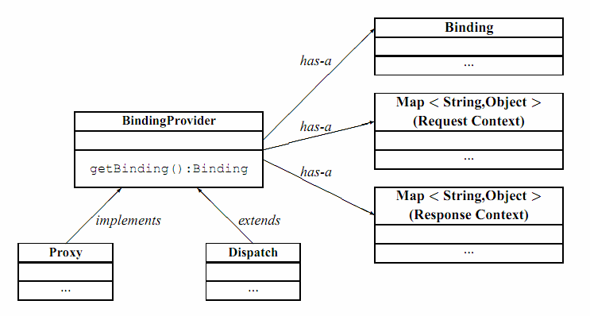

# Chapter 12 - Use WS-Addressing with a SOAP web service.md
* In a moderately complex system, a receiver of a message must know information about the sender
* With an asynchronous request-response implementation model, the receiver must know at least the sender's address to send back responses that are disconnected from the request channel that was previously used by the web services client to issue the request

* The purpose of the WS-Addressing specification is to provide an interoperable way of communicating betwwen senders and receivers by providing a transport-neutral mechanism to address Web services and messages
* The WS-Addressing specification defines XML elements to identify the web services endpoints and to secure end-to-end endpoint indentification in messges
* This specification enables messaging systems to support message transmission through networks that include processing nodes, such as endpoint managers, firewall, and gateways

* WS-Addressing is a World Wide Web Consortium (W3C) specicifation that aid interoperability between web services by defining a standard way to address web services and to provide addressing information in messages
* The WS-Addressing specification introduces two primary concepts:
    * Endpoint references - provide a standard mechanism to encapsulate information about specific endpoints. Endpoint refrences can be propagated to other parties and then used to target the Web service endpoint that they represent
    * Message addressing properties - MAPs are a set of well-defined WS-Addressing properties that can be represented as elements in SOAP headers and provide a standard way of conveying information, such as the endpoint to which to a direct message replies, or information about the relationhsip that the message has with other messages

* For JAX-WS applications, you can enable WS-Addressing support in several ways, such as configuring policy sets or using annotations in code
* You can now use JAX-WS 2.1 annotations and feature classes to do the following tasks:
    * Enable WS-Addressing from either the server or the client
    * Have more control over the behavior of WS-Addressing when using policy sets
    * Specify whether WS-Addressing is enabled and whether to use synchonous, asynchronous, or both messaging patterns
    * Specify actions to be assocaited with a web service operation or fault response

* The following additional features are related to the JAX-WS enhancements:
    * Java representations of WS-Addressing endpoint references are available
    * You can create Java endpoint refernce instances fro the application endpoint, or other endpoints in the same application, at runtime
    * You can create Java endpoint refrerence instances for endpoints in other applications by specifying the URI of the endpoint refrence
    * On services, you can use annotations to specify whether WS-Addressing support is enabled and whether it is required
    * On clients, you can use features to specify whether WS-Addressing support is enabled and wether it is required
    * You can configure client proxy or dispatch objects by using endpont refrences
    * Java supports for endpoint refrences that represent web services resource (WS-Resource) instances is available
    * You can associate refrence paramters with an endpoint reference at the time of its creating to correlate it with a particular resource instance
    * In targeted web services, you can extract the refrence parameters of an incoming message so that the web service can rout the messge to the appropriate WS-Resource instance

## 12.1 Use Addressing on the service

### 12.1.1 Use @Addressing annotation with a web service
* *javax.xml.ws.soap.Addressing*
* This annotation represents the use of WS-Addressing with either the SOAP 1.1/HTTP or SOAP 1.2/HTTP binding. Using this annotation with any other binding is undefined

* This annotation MUST only be used in conjunction with the *WebService*, *WebServiceProvider*, and *WebServiceRef* annotaions
* When used with *WebService* annotation, this annotation MUST only be used on the service endpont implementation class
* When used with *WebServiceRef* annotation, this annotation MUST only be used when a proxy instance is created
* The injected SEI proxy, and endpoint MUST honor the values of the *@Addressing* annotation

* The *required* property can be used to specify if WS-Addressing headers MUST be present on incoming messages

* This annotation's behaviour is defined by the corresponding feature *AddressingFeature*

* To make sure that your endpoint and its client are portable, the endopint must use the *@Action* annotation to indicate their WS-Addressing actions, and it should use the *@FautlAction* annotation for creating WS-Addressing-compliant SOAP faults

### 12.1.2 Use wsam:Addressing policy in WSDL
* If the endpont enables Addressing, that can be indicated in the generated WSDL as per the Addressing 1.0 - Metadata

* Endpoint's use of addressing, if any, MUST be indicated in the *wsdl:binding* or *wsdl:port* sections of the WSDL 1.1 as per WS-Addressing 1.0 - Metadata

### 12.1.3 Use Addressing in the deployment descriptors
* Deployment descriptors are standard text files, formateed using XML and packaged in a web services application
* You can optionally use the *webservices.xml* deployment descriptors to augment or override application metadata specified in annotations within JAX-WS

### 12.1.4 Use AddressingFeature with javax.xml.ws.Endpoint API
* JAX-WS 2.1 introduces the notion of features. A features is associated with a particular functionality or behavior
* Some features may only have meaning when used with certain binding while other features may be generally useful
* Those features can be used while creating service and proxy instances
* JAX-WS 2.1 introduces three standard features for creating proxy instances, *AddressingFeature*, *MTOMFeature*, and RespectBindingFeature* as well as the base *WebServiceFeature* class

* The *AddressingFeature* is used to control the use of WS-Addressing by JAX-WS
* This feature MUST be supported with the SOAP 1.1/HTTP or SOAP 1.2/HTTP bindings
* Using this feature with any other binding is undefined
* This features corresponds to the *@Addressing* annotation

* Enabling this feature on the server will result in the runtime being capable of consuming and responding to WS-Addressing headers

* Enabling this feature on the client will cause JAX-WS runtime to include WS-Addressing headers in SOAP messages as specified by WS-Addressing

* Disabling this feature will prevent a JAX-WS runtime from processing or adding WS-Addressing headers from/to SOAP messages even if the associated WSDL specifies otherwise

* The AddressingFeature's property:
    * required - can be configured to control whether all incoming message MUST contain Addressing headers
    * responses - can be configured to control whether the endpont requires the use of anonymous, non-anonymous and all responses

* This features si automatically enabled if the WSDL indicates the use of addressing as per the WS-Addressing 1.0 - Metadata
* Developers may choose to prevent this from happening by explicitly disabling the *AddressingFeature*

* To write a portable endpoint and its corresponding client with this version of JAX-WS, an endpoint MUST explicitly specify what WS-Addressing Actions are to be used via the *Action* and *FautlAction* annotations
* The client MUST explicitly enable addressing via this *AddressingFeature*, and for each invocation, the client MUST explicitly set the *BindingProvider.SOAPACTION_URI_PROPERTY*

* The following describes the effects of this feature with response to enabled or disabled:
    * ENABLED - WS-Addressing will be enabled. At runtime, WS-Addressing headers MUST be consumed by the receiver and produced by the sender even if the WSDL declares otherwise. The *mustUnderstand=0* attribute MUST be used on the WS-Addressing headers
    * DISABLED - WS-Addressing will be disabled even if an associated WSDL specifies otherwise. At runtime, WS-Addressing headers MUST NOT be used. WS-Addressing may be explicitly disabled to prevent a JAX-WS implementation from consuming and producing WS-Addressing headers

* The *required* property can be used to specify if WS-Addressing headers MUST be present on incoming message
* This property only has meaning when used on the endpont had has no affect when used on the client

* The *Endpoint* class can be used to create and publish web service endponts

* An endpoint consists of an object that acts as the web service implementation (called implementator) plus some configuration information, e.g a Binding
* Impelementator and Binding are set when the endpont is created and cannot be modified later
* Other configuration information may be set at any time after the creation of an *Endpoint* but before its publication

* An implementator object MUST be either an instance of a class annotated with the *@WebService* annotation or an instance of a class annotated with the *@WebServiceProvider* annotation and implementing the *Provider* interface

### 12.1.5 Use @Action and @FaultAction on the service methods
* **javax.xml.ws.Action**
* The @Action annotation is applied to the methods of a SEI
* It is used to specify the *input*, *output*, *fault* WS-Addressing Action value associated with the annotated method

* **javax.xml.ws.FaultAction**
* The @FaultAction annotation is used within the @Action annotation to specify the WS-Addressing Action of a service specific exception

* JAX-WS 2.1 defines *javax.xml.ws.Action* and *javax.xml.ws.FaultAction* annotations to explicitly associated an *Action* with *input*, *output*, and *fault* messages of the mapped WSDL operation

### 12.1.6 Use WebServiceContext.getEndpointReference()
* An endpoint implementation can retrieve an *javax.xml.ws.EndpointReference* for the endpont using *getEndpointReference* methods

* **javax.xml.ws.W3CEndpointReference**
* *W3CEndpointReference* is a concreate implementation of the *javax.xml.ws.EndpontReference* class and is used to reference endpoints that are compliant with the W3C Web Services Addressing 1.0

## 12.2 Use Addressing on the client

### 12.2.1 Use AddressingFeature with getPort() methods
* Create an instace of *javax.xml.AddressingFeature*, using *true* as a constructor parameter
* Then pass this feature instance to the port accessor method on the service stub you got from *wsimport*

* JAX-WS 2.1 specification indicates that client must explicitly enable addressing in order to use addressing in a web service that declares support for it
* For each invocation, the client must also explicitly set *BindingProvider.SOAPACTION_URI_PROPERTY*

### 12.2.2 Use Addressing in the deployment descriptors

### 12.2.3 Use BindingProvider.getEndpointReferene()
* The *BindingProvider* interface represents a component that provides a protocol binding for use by client, it is implemented by proxies and is extended by the *Dispatch* interface

* A web service client can get an *javax.xml.ws.EndpointReference* from a BindingProvider instance that will reference the target endpoint

* An impelementation MUST be able to return an *javax.xml.ws.EndpointReference* for the target endpoint if a SOAP binding is being used
* The the *BindingProvider* instance has a binding that is either SOAP 1.1/HTTP or SOAP 1.2/HTTP, the a *W3CEndpointReference* MUST be returned

* The returned *W3CEndpointReference* MUST contain *wsam:ServiceName* and *wsam:ServiceName[@EndpointName]* as per Addressing 1.0 Metadata

### 12.2.4 Use getPort(EndpointReference) methods
* Proxies provide access to service endpoint interfaces at runtime without requiring static generation of a stub class

* An instance of a proxy MUST implement *javax.xml.ws.BindingProvider*

* A proxy is created using the *getPort* methods of a Service instance:
    * T getPort(Class<T> sei)

* The use of WS-Addressing requirements can be indicated in a WSDL as per Addressing 1.0 - Metadata
* A proxy created using *getPort()* calls is configured with the addressing requirements as specified in the associated WSDL or explicitly passing *javax.xml.ws.soap.AddressingFeature* web service feature

* A proxy MUST be configured with the use of addressing requirements as indicated in the assocaited WSDL
* But if the proxy is created using *javax.xml.ws.soap.AddressingFeature*, the feature's addressing requirement MUST take precedence over WSDL's addressing requirements
