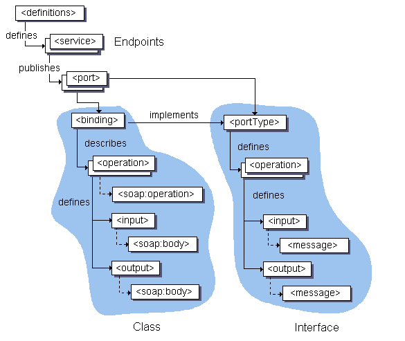

# WSDL: Web Service Description Language -- Abstract
* WSDL is a specification which defines the document format for precisely describing web services in a common XML grammar.
* SOAP has bean widely adopted as the standard messaging protocol for Web Services
* WSDL help to reap the benefits of SOAP by providing a way for *Web Service Providers* and *Web Service Consumers* to work together easily

# 1. WSDL Overview
* To invoke a contract (i.e function) provided by a Web Service, you need to know in advance:
    * How the SOAP messages are structured
    * Which protocol will be used
    * The internet address of the *Web Service*
    * Name of the contract
    * The number of parameters as well as their types
* *WSDL* represents a contract between a *Web Service Consumer* and *Web Service Provider* in which it specifies the exact message format, Internet Protocol, Internet address of the Web Service provide, etc...

* With *WSDL*, one can automate the generation of proxies for Web Services in a truly language-independent and platform-independent way.
* *JAX-RPC* is one of technologies which can interpret a WSDL document to generate interfaces and network stubs for its described Web Service

* *WSDL* has been designed such that it can express bindings to protocols other than *SOAP*, our main concern here is *WSDL* as it relates to *SOAP over HTTP*

* *WSDL* represents a cornerstone of the web service architecture, because it provides a common language for describing services and a platform for automatically integrating those services
    
* *WSDL* describes the following critical pieces of data:
    * Interface information describing all publicity functions
    * Data type information for all message requests and message responses
    * Binding information about the transport protocol
    * Address information for locating the specified service

* *WSDL* document does not provide Security and QoS information

* WSDL document defines services as collections of network endpoints, or ports. In WSDL, the abstract definition of endpoint and messages is separated from their concrete network deployment or data format bindings
* Messages: abstract descriptions of the data being exchanged
* Port types: abstract collections of operations
* A Port defined by associating a network address with a reusable binding
* Service: a collection of port

# 2. WSDL Document Structure
* A *WSDL* document is an XML document that adheres to the WSDL XML Schema

* The WSDL document is divided into six major elements:
    * *<definitions>* element MUST be the root element of all WSDL documents. It defines the name of the Web Service, declares multiple namespaces, and contains all the *services* elements
    * *<types>* element describes all the data types used between the client and server
    * *<message>* element describes a one-way message, whether it is a single message request or a single message response. It defines the name of the message and contains zero or more message *<part>* elements, which can refer to message parameters or message return values
    * *<portType>* element combines multiple *message* elements to form a complete one-way or round-trip operation. Example, a portType can combine one request and one response message into a single request/response operation
    * *<binding>* element describes the concrete specifics of how the service will be implemented on the wire. WSDL includes built-in extensions for defining SOAP services, and SOAP-specific information goes here
    * *<service>* element defines the address for invoking the specified service. Most commonly, this includes a URL for invoking the SOAP service
    
* In addition, the WSDL specification also defines:
    * *<documentation>* element is used to provide human-readable documentation
    * *<import>* element is used to import other WSDL documents or XML Schemas
    
* WSDL Schema requires that all sections appear in a specific order: *import*, *types*, *message*, *portType*, *binding*, and *service*

# 3. Logical Sections of WSDL Document
* Each *WSDL* document contains both an abstract definition of the service and the concrete description of how the service binds to a particular network implementation and data format bindings
* A WSDL document can be partitioned into two logical sections:
    * *abstract definitions* - defines SOAP messages in a language - and platform - independent manner
    * *concrete descriptions* - define site-specific matters such as serialization
    
* The first three element: *<type>*, *<message>*, and *<portType>*, are all abstract definitions of the Web Service interface. These elements constitute the programmatic interface
* The last two elements, that are *<binding>* and *<service>*, describe the concrete details of how the abstract interface maps to messages on the wire. These details are typically handled by the underlying infrastructure

* Each WS is described in *WSDL*, which is an XML format for documenting the exchange of messages between the service requester and service provider
* The exchange of messages is termed *an operation*, and a collection of operations is called a port Type (interface)
* A Service is a group of ports
* The key property of *WSDL* is that it separates the abstract description of service functionality from the concrete details of the service implementation
* The aim of WS is to allow different service providers to implement this abstract service description upon their chosen concrete middleware binding

## 3.1 Abstract Definitions
* A WSDL *portType* is comparable to a component interface
* An *operation* is therefore the equivalent of a component method

* A typical *operation* consists of a group of related input and output messages. The execution of an operation requires the transmission or exchange of these messages between client and provider

* *types* contains platform - and language - independent data type definitions
* *messages* contains input and output parameters for the service, and are used to describe different messages that the services exchanges
* *parts* represent either incoming or outgoing operation parameter data
* *portTypes* represent service interfaces and uses the messages section to describe function signatures. It represent a set of operation supported by the service
* *operations* represents a particular interaction (a Web Service function) with the service and is used to describe the input, output, and exception messages

## 3.2 Concrete Description
* Specific location and implementation information about a Web Service are the concrete parts of a *WSDL* document, as represented by the *<binding>*, *<service>*, and *<port>* elements which is child element of *<service>* element

* *binding* specifies binding of each operation in the portTypes section. It associates the abstract descriptions of a *portType* with a protocol such as SOAP and HTTP, message styles (RPC or document), and encoding styles (Literal or SOAP encoded)
* *service* in addition to protocol-specific information, the *WSDL document should also describe where the service is deployed*
* *port* associates between a binding and the network address at which it can be found, contain endpoint data, including physical address and protocol information

# 4. WSDL Document Elements
* The Web Services Description Language (WSDL) is *an XML format for describing network services as a set of endpoints operating on messages containing either document-oriented or procedure-oriented information*

# 4.1 The XML Declaration
* The *XML Declaration* always appears at first line to declare that the document is XML. It helps XML parser to determine whether to parse the WSDL file at all or signal an error

* Restrictions in WS-I Basic Profile 1.0:
    * A DESCRIPTION MUST use version 1.0 of XML
    * A DESCRIPTION MAY include the Unicode Byte Order Mark (BOM)
    * A DESCRIPTION MUST use either UFT-8 or UTF-16 encoding
    
## 4.2 The <definitions> Element
* A WSDL definition is an XML document with the root element called *definitions* from the *http://schemas.xmlsoap.org/wsdl/* namespace

* The *message*, *portType*, and *binding* elements must be named (by their *name* attributes)

* Restrictions in WS-I Basic Profile 1.0:
    * A DESCRIPTION using the WSDL namespace (prefixed *wsdl* in this Profile) MUST be valid according to the XML Schema found at *http://schemas.xmlsoap.org/wsdl/2003-02-11.xsd"
    * A DESCRIPTION using the WSDL SOAP binding namespace (prefixed *soapbind* in this Profile) MUST be valid according to the XML Schema found at *http://schemas.xmlsoap.org/wsdl/soap/2003-02-11.xsd*
    
    
## 4.3 WSDL <import Element
* The use of the *import* element allows the separation of the different elements of a service definition into independent document, which can then be imported as needed
* Use *wsdl:import* to import WSDL files and use *xs:import* to *import XML Schemas*

* *5.1.2 WSDL and Schema Import
    * A DESCRIPTION MUST only use the WSDL *import* statement to import another WSDL description
    * To import XML Schema Definitions, a DESCRIPTION MUST use the XML Schema *import* statement
    * A DESCRIPTION MUST use the XML Schema *import* statement only within the *xsd:schema* element of the types section
    * A DESCRIPTION MUST NOT use the XML Schema *import* statement to import a Schema from any document whose root element is not *schema* from the namespace *http://www.w3.org/2001/XMLSchema*
    * An XML Schema directly or indirectly imported by a DESCRIPTION MAY include the Unicode Byte Order Mark (BOM)
    * An XML Schema directly or indirectly imported by a DESCRIPTION MUST be either UTF-8 or UTF-16 encoding
    * An XML Schema directly or indirectly imported by A DESCRIPTION MUST use version 1.0 of the eXensible Markup Language W3C Recommendation
    
* *5.1.3 WSDL Import location Attribute Syntax*
    * A DESCRIPTION MUST specify a non-empty location attribute on the wsdl:import element
    
* *5.1.4 WSDL Import location Attribute Semantics*
    * In a DESCRIPTION the value of the location attribute of a wsdl:import element SHOULD be treated as a hint

* *5.1.5 Placement of WSDL import Elements*
    * When they appear in a DESCRIPTION, wsdl:import elements MUST precede all other elements from the WSDL namespace except wsdl:documentation
    * When they appear in a DESCRIPTION, wsdl:types elements MUST precede all other elements from the WSDL namespace except wsdl:documentation and wsdl:import
    
* The *WSDL import* element MUST declare two attributes: *namespace* and *location*
* The value of the *namespace attribute* must match the *targetNamespace* declared by the *WSDL* document being imported
* The *location attribute MUST* point to an actual WSDL document; it CANNOT BE empty or null, but the location should only be used as a hint and processors are free to use other means to locate the imported WSDL file

* *5.1.9 Namespace Coercion*
    * The *targetNamespace* attribute on the wsdl:definitions element of a description that is being imported MUST have the same value as the namespace attribute on the wsdl:import element in the importing DESCRIPTION

## 4.4 The <documentation> Element
* Any WSDL element can contain the *documentation* element

* *5.1.10 WSDL documentation Element*
    * The wsdl:documentation element MAY occur as a child of the wsdl:import element in a DESCRIPTION
    * The wsdl:documentation element MAY occur as a child of the wsdl:part element in a DESCRIPTION
    * The wsdl:documentation element MAY occur as a first child of the wsdl:definitions element in a DESCRIPTION
    
## 4.5 The <types> Element
* The *<types>* element comprises the Types section. This section may be omitted if there are no data types that need to be declared 
* The WSDL *types* element is a container for defining any data types (complex data types and custom simple types) that are not covered by the XML Schema built-in types

* The wsdl:types element of WSDL 1.1 encloses data type definitions that are relevant to the Web Service described

* *5.2.3 soapenc:Array*
    * In a DESCRIPTION, array declarations MUST NOT extend or restrict the *soapenc:Array* type
    * In a DESCRIPTION, array declarations MUST NOT use *wsdl:arrayType* attribute in the type declaration
    * In a DESCRIPTION, array declarations wrapper elements SHOULD NOT be named using the convention ArrayOfXXX
    * A MESSAGE containing serialized arrays MUST NOT include the *soapenc:arrayType* attribute
    
## 4.6 The <message> Element
* The *message* element describes the payload of a message used by a Web Service
* A *message* element can describe the payloads of outgoing and incoming messages
* WSDL messages don't rely on any specific network protocol. The messages can ultimately be sent using SOAP, HTTP GET, SMTP, etc.

* The *message* element defines the data elements of an operation
* If we consider operations as functions in a traditional programming language, then a *message* element defines the parameters to that function
* Each *part* child element in the *message* element corresponds to the parameter
* Input parameters are defined in a single *message* element, separate from output parameters
* Parameters that are both input and output have their corresponding *part* elements in both input and output *message* elements

* Each *part* element has a name and type attribute, just as a function parameter has both a name and type
* The type of a *part* element can be an XSD base type, a SOAP defined type (soapenc), a WSDL defined type (wsdl), or a Types section defined type

* The message part may declare either a *type* attribute or an *element* attribute, but not both
* If you are using RPC-Style messaging, the *part* elements must use the *type* attribute; otherwise use *element* attribute for the document-style messaging

## 4.7 The <portType> Element and <operation> Element
* A *portType* defines an abstract interface of a Web Service
* A *portType* element composes messages into operations
* A *portType* may contain any number of *operation* elements
* *Operation* elements within a *portType* define the syntax for calling all methods in the *portType*
* Each *operation* element declares the name of the method, the parameter (using *message* elements), and types of each parameter (*part* elements)

* There can be several *portType* elements within a WSDL document. Each *portType* element groups together a number of related operations that describe the abstract interface to a different Web Service

* An operation describes a pattern of interaction between a client and a server
* In an *operation* element:
    * At most one *input* element
    * At most one *output* element
    * Any number of *fault* message
    * Each of these three elements has a *name* and *message* attribute
* Every *operation* defined by a particular *portType* element MUST have a *unique name*

* *5.4.3 Distinctive Operations*
    * A wsdl:portType in a DESCRIPTION MUST have operations with distinct values for their name attributes
    
* *5.4.1 Ordering of part Elements*
    * Permitting the use of *parameterOrder* helps code generators in mapping between method signatures and messages on the wire
    * The order of the elements in the soap:body of a MESSAGE MUST be the same as that of the wsdl:parts in the wsdl:message that describes it
    * A DESCRIPTION MAY use the parameterOrder attribute of an wsdl:operation element to indicate the return value and method signatures as a hint to code generators
    
* *5.4.4 parameterOrder Attribute Construction*
    * A wsdl:portType in a DESCRIPTION MUST be constructed so that the *parameterOrder* attribute, if present, omits at most ONE wsdl:part from the output message
    * The single omitted wsdl:part is the return value
    
## 4.8 The *binding* and *operation* Elements
* The Binding section is where the protocols such as SOAP and HTTP, messaging style (RPC or document), and encoding styles (Literal or SOAP encoding) are fully specified
* Whereas the Types, Messages, and PortType sections deal with data content in the abstract, the Binding section is where the physical details of data transmission is dealt with

* The Binding elements provides specific details on how a portType operation will actually be transmitted over the wire
* The *binding* element and *operation* elements are used in combination with protocol-specific elements
* The *binding* elements identify which *portType* and *operation* elements are being bound, while the protocol-specific elements declare the protocol and encoding style to be associated with the *portType*
* Each type of protocol (SOAP, MIME, and HTTP) has it own set of protocol-specific elements and its own namespace

* The *binding* element uses its *type* attribute to references a particular *portType*
* An *operation* element within a binding specifies binding information for the operation with the same name within the binding's *portType*
* A binding MUST specify exactly one protocol and a binding MUST NOT specify address information

* *5.5 Bindings*
    * In WSDL 1.1, the wsdl:binding element supplies the concrete protocol and data format specifications for the operations and messages defined by a particular wsdl:portType
    
* *5.5.1 Use of SOAP Binding*
    * A wsdl:binding element in a DESCRIPTION MUST use WSDL SOAP Binding as defined in WSDL 1.1 Section 3

* *5.6.6 Multiple Bindings for portType Elements*
    * A wsdl:portType in a DESCRIPTION MAY have zero or more wsdl:bindings that refer to it, defined in the same or other WSDL documents

* *5.6.12 Consistency of portType and binding Elements*
    * A wsdl:binding in a DESCRIPTION MUST have the same set of wsdl:operations as the wsdl:portType to which it refers
    
## 4.9 The SOAP Binding Elements
* Several SOAP 1.1 specific *binding* elements are used in combination with WSDL binding elements:
    * *soapbind:binding* (required)
    * *soapbind:operation* 
    * *soapbind:body* (required)
    * *soapbind:fault*
    * *soapbind:header*
    * *soapbind:headerfault*

## 4.10 The SOAP Binding Element <binding>
* The *soapbind:binding* element indicates that the binding will be made available via SOAP

* The *style* attribute indicates the overall style of the SOAP message format
* The *style* attribute must be declared and only declared as either *rpc* or *document*
* RPC format: the body of SOAP request will include a wrapper XML element indicating the function name
* Document format: the request and response message will consists simple of XML document
* The *transport* attribute indicates the transport of the SOAP messages and must be declared with an explicit value

* *5.6.1 Specifying the transport Attribute*
    * The wsdl:binding element in a DESCRIPTION MUST be constructed so that its soapbind:binding child element specifies the transport attribute
    
* *5.6.2 HTTP Transport*
    * A wsdl:binding element in a DESCRIPTION MUST specify the HTTP transport protocol with SOAP binding. Specially, the transport attribute of its soapbind:binding child MUST have the value *http://schemas.xmlsoap.org/soap/http*
    
## 4.11 The SOAP Binding Element <operation>
* The *soapbind:operation* element indicates the binding of a specific operation to a specific SOAP implementation
* Its specifies the messaging style (RPC or document) for a specific operation and the value of the SOAPAction header field
* The *soapAction* attribute specifies the SOAPAction HTTP header be used for identifying the service

* The WS-I Basic Profile requires that style attributes declared by *soapbind:operation* elements have the same value as the style attribute of their *soapbind:binding* element

* *5.6.3 Consistency of style Attribute*
    * A *wsdl:binding* in a DESCRIPTION MUST either be a RPC-literal binding or a Document-literal binding
    
## 4.12 The SOAP Binding Element <body>
* The *soapbind:body* element enables you to specify the details of the input and output messages
* The *soapbind:body* element has four kinds of attributes:
    * *use* required to be *literal*
    * *namespace*
    * *part*
    * *encodingStyle*
    
## 4.13 The <service> and <port> Elements
* A *service* is a set of *port* elements
* Each *port* element associates a location with a *binding* in a one-to-one fashion
* If there is more than one *port* element associated with the same *binding*, then the addition URL locations can be used as alternatives such as load balancing or failover

* You must give each port a name and assign it a *binding*. Then, within the *port* element, you use an *extensibility* element to define the address details specifics to the binding

* There can be more than one *service* element in a WSDL document
* There are many uses for allowing multiple *service* elements:
    * Group together ports according to URL destination
    * Classify the ports according to the underlying protocol
    
* The *soapbind:address* element simply assigns an internet address to a SOAP binding via its *location* attribute
* Two or more *port* element within the same WSDL document must not specify exactly the same URL value for the *location* attribute of the *soapbind:address*

# 5. WSDL Messaging Exchange Patterns
* In WSDL, there are four basic message exchange patterns used in Web Services: *one-way*, *request-response*, *solicit-response*, and *notification*

* *One-way*
    * The service receives a message. The operation therefore has a single input element

* *Request-Response*
    * The service receives a message and sends a response. The operation therefore has one input element, followed by one output element. To encapsulate errors, an optional fault element can also be specified
    
* *Solicit-Response*
    * The service sends a message and receives a response. The operation therefore has one output element, followed by one input element. To encapsulate errors, an optional fault element can also be specified

* *Notification*
    * The service sends a message. The operation therefore has a single output element

* *5.4.5 Allowed Operations*
    * A DESCRIPTION MUST NOT use Solicit-Response and Notification type operations in a wsdl:portType definition