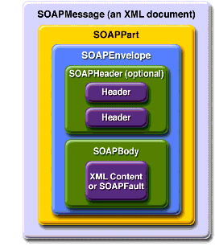
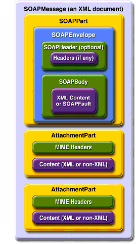

# SAAJ: SOAP with Attachments API for Java -- Abstract
* The *SOAP with Attachments API for Java (SAAJ)* provides a standard way to send XML documents over the Internet from the Java platform
* It is an API you can use to write SOAP messaging applications directly rather than using the JAX-RPC
* By simple making method calls using SAAJ API, you can read and write SOAP-based XML messages, and you can optionally send and receive these types of messages over the Internet
* SAAJ also provides a way to send contents that is not in XML format as attachments of a SOAP message

# 1. Introduction
* The SAAJ API conforms to the Simple Object Access Protocol (SOAP) 1.1 specification and the SOAP with Attachments specification
* It is one of the two packages for XML messaging:
    * *javax.xml.soap*
    * *javax.xml.messaging*
* Using SAAJ, a client can create and send SOAP messages in a point-to-point model
* SAAJ clients can only engage in synchronous request/response message exchanges

# 2. Types of SAAJ Messages
* SAAJ messages follow SOAP standards, which describe the format for messages and also specify somethings that are required, optional, or not allowed
* With SAAJ API, you can create XML messages that conform to the SOAP specifications simply by making Java API calls

## 2.1 Messages Without Attachments
* A SOAP message that does not have attachment has a structure made up of SOAP part, a SOAP envelope, an optional SOAP header, and a SOAP body

* There is a SAAJ class for the entire SOAP message, as well as for each component of the structure
* The *SOAPHeader* is created by default, but it can be deleted if not needed

## 2.2 Messages With Attachments
* A SOAP message can include one or more attachment parts in addition to the SOAP part
* *The SOAP part must contain only XML content*
* *If any content in a message is not in XML format, it must be contained in an attachment part*

* SAAJ provides the *javax.xml.soap.AttachmentPart* class to represent an attachment part of a SOAP message
* A *SOAPMessage* object automatically has a *SOAPPart* object and its required *subelements*, but because *AttachmentPart* object are optional, you have to create and add them
* The *AttachmentPart* object can also have additional MIME headers to identify it or to git its location

## 2.3 Summary
* The *SOAPMessage* consists of a *SOAPPart* and zero or more *AttachmentPart* objects
* The *SOAPPart* represents the SOAP document and includes the *SOAPEnvelope*

# 3. Send/Receive SOAP Message with SAAJ
* There are five steps involves to send and receive SOAP message used SAAJ APIs:
    * Creating a SOAP Connection
    * Creating a SOAP message
    * Populating the message
    * Sending/Receiving SOAP messages
    * Working with the reply message
    
## 3.1 Creating a SOAP Connection
* SAAJ API provide a simple mechanism for *request-response messaging*
* SOAP messages are send and received over *SOAPConnection* object
* The connection that the *SOAPConnection* object represents goes from the sender directly to its destination (typically using an HTTP Post)

## 3.2 Creating a SOAP Message
* *The MessageFactory class itself is abstract and cannot be instantiated. Its newInstance() method creates a new MessageFactory object that is an instance of the default implementation. SAAJ provides a default implementation of the MessageFactory class that makes it easy to get an instance of the class*

## 3.3 Populating SOAP Message
* The new SAAJ message has an *empty body* by default
* To add content to the *body*, you need to create a *SOAPBodyElement* object to hold the content

## 3.4 Sending/Receiving SOAP Messages
* A typical message sent using SAAJ is a request-response message. This type of message is sent over a *SOAPConnection* object, using the *call()* method. The call blocks until it receives the reply

* Any Web Service implemented for request-response messaging must be able to handle HTTP Post request, and must return a response to a message it receives
* The response must be a *SOAPMessage* object, just as the request must be a *SOAPMessage* object

## 3.5 Working with the Reply SOAP Message

# 4. Manipulate SOAP Message with SAAJ

## 4.1 Manipulating Message Content Using SAAJ or DOM APIs
* Because SAAJ nodes and elements implement the DOM Node and Element interfaces, you have many options for adding or changing message content:
    * Use only DOM APIs
    * Use only SAAJ APIs
    * Use SAAJ APIs and then switch to using DOM APIs
    * Use DOM APIs and then switch to using SAAJ APIs

* The basic rule is that you can continue manipulating the message content using SAAJ APIs as long as you want to, but once you start manipulating it using DOM, you should not use SAAJ APIs after that

## 4.1 How to Add Content to the SOAPHeader Object?
* To add content to the header, you need to create a *SOAPHeaderElement* object
* As with all new elements, it must have an associated *Name* object, which you can create using the message's *SOAPEnvelope* object or a *SOAPFactory* object

## 4.2 How to Add Content to the SOAPBody Object?
* The process for adding content to the *SOAPBody* object is the same as the process for adding content to the *SOAPHeader* object
* You access the *SOAPBody* object, add a *SOAPBodyElement* object to it, and add text to the *SOAPBodyElement* object
* Add content with the method *addTextNode*

## 4.3 How to Add Content to the SOAPPart Object?
* If the content you want to send is in a file, SAAJ provides an easy way to add it directly to the *SOAPPart* object
* To add a file directly to the SOAPPart object, you use a *javax.xml.transform.Source* object from JAXP (The Java API for XML Processing)
* There are three types of Source objects:
    * SAXSource
    * DOMSource
    * StreamSource

## 4.4 How to Add a Document to the SOAP Body?
* You can add a DOM document directly to the body of the message

## 4.5 How to Add Attributes?
* The *SOAPElement* interface provides methods for adding an attribute, for getting the value of an attribute, and for removing an attribute

## 4.6 Header Attributes
* Attributes that appear in a *SOAPHeaderElement* object determine how a recipient processes a message
* You can think of header attribute as offering a way to extend a message, giving information about such things as authentication, transaction management, payment, and so on
* A header attribute refines the meaning of the the header, while the header refines the meaning of the message contained in the SOAP Body

* *The Actor Attribute*
* The attribute *actor* is optional, but if is used, it must appear in a *SOAPHeaderElement* object
* Its purpose to indicate the recipient of a header element
* *An actor is identified by its URI*
* *Each SOAPHeaderElement object may have only one actor attribute, but the same actor may be an attribute for multiple SOAPHeaderElement objects*

* *The mustUnderstand Attribute*
* This attribute says whether or not the recipient (indicated by the actor attribute) is required to process a header entry
* *If the actor for a header that has a mustUnderstand attribute set to true cannot process the header, it must send a SOAP fault back to the sender. The actor must not change state or cause any side-effects, so that to an outside observer, it appears the the fault was sent before any header processing was done*

# 5. The SOAP Attachment
* A SOAP message package with attachments is constructed using the MIME multipart/related type
* Soap with Attachments (SwA) is the usual solution for attaching arbitrary data to SOAP messages
* SAAJ supports SwA through the class *AttachmentPart*
* A *SOAPMessage* contains a SOAPPart and *any number of AttachmentParts*
* *The wire format of the object changes from SOAP to MIME as soon as the first attachments is added*

## 5.1 Creating an AttachmentPart Object and Adding Content
* The SOAPMessage object creates an AttachmentPart object, and the message also has to add the attachment to itself after content has been added

## 5.2 Accessing an AttachmentPart Object
 
# 6. Using SOAP Faults

## 6.1 Overview of SOAP Faults
* If you send a message that was not successful for some reason, you may get back a response containing a SOAP Fault element that gives you status information, error information, or both
* There can be only one SOAP Fault element in a message, and it must be an entry in the SOAP Body
* Further, if there is a SOAP Fault element in the SOAP Body, there can be no other element in the SOAP Body

* A SOAPFault object, the representation of a SOAP Fault element in the SAAJ API, is similar to an Exception object in that it conveys information about a problem

* A SOAPFault object contains the following elements:
    * A *fault code*
    * A *fault string*
    * A *fault actor*
    * A *Detail* object
    
## 6.2 Creating and Populating a SOAPFault Object
* Using *SOAPFault* interface

## 6.3 Retrieving Fault Information
* Using *SOAPFault* interface
