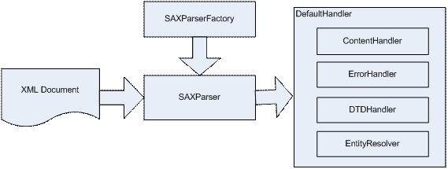
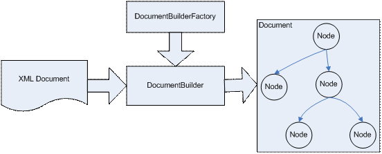
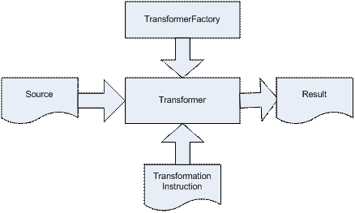

# JAXP: Java API for XML Processing -- Abstract
* The XML Parser is the link between the XML document representing data and the application code
* The Java API for XML Processing (JAXP) enables application to parse and transform XML documents independent to a particular XML processing implementation
* JAXP is a Java interface that provides a standard approach to parsing XML documents
* A basic JAXP session will look like this:
    * Instantiate a factory class
    * Using the factory class to instantiate the provider class
    * Using the provider class to perform the XML processing/parsing
    
* DOM parsers read then entire document into memory and allow you to traverse the document in a random access way
* SAX parsers call handlers to interpret XML data as it's encountered in the document

# 1. Simple API for XML (SAX)
* The *Simple API for XML (SAX)* is available with the JAXP
* SAX is one of two common way to write software that accesses XML data
* SAX is an *event-driven methodology* for XML processing and consists of many callbacks
* *Using SAX with JAXP allows developers to traverse through XML data sequentially*, one element at a time, using a delegation event model
* *Each element is parsed down to its left node before moving on to the next sibling of that element in the XML document, therefore at no points there is any clear relation of what level of the tree we are at*

* *SAX is very useful for processing very large XML documents or streams, because all the XML data processed does not need to kept in runtime memory. SAX is also very useful for retrieving a specific value in a XML document and creating a subset of a XML document. It lacks randomly access or modifying the XML data capability, in such case, the Document Object Model (DOM) should be used*

* The key in SAX is to provide code for the various callbacks, then let a parser trigger each of them when appropriate. Typical SAX routine:
    * Create a SAXParser instance using a specific vendor's parser implementation
    * Create an event handler object and register the event handler object to the parser
    * Start parsing and sending each event to the handler
    
# 2. Document Object Model (DOM)
* The *DOM* is a set of interfaces that exposes an XML document as a tree structure comprised of nodes for accessing and manipulating these objects and their inter-relationships
* Some nodes in the tree may contain other nodes
* Each node has a type that is represented by an interface in the package *org.w3c.dom*, such as Element, Attribute, Comment and Text

    
* DOM Parser Processing
    * Creates a DocumentBuilder instance, which is *DOM* parser, using a specific vendor's parser implementation
    * The parser parses the document and returns a DOM org.w3c.dom.Document object
    * The entire document is stored in memory
    * DOM methods and interfaces are uses to extract data from this object

# 3. XML Transformations
* XML Transformations (XSLT) is an API that can be used to transform XMl documents into other XML documents or other formats such as HTML

# 4. Summary
* By utilizing the JAXP API, code is written to interact directly with the abstraction layer
* This guarantees vendor independence and the ability to swap out the backend implementation quickly and easily
* SAX is an event-based parsing model that utilizes callback procedures
* DOM is a tree-walking model that parse the XML data into a tree before manipulating it
* JAXP is a powerful, flexible, and easy to use set of tools that will meet the XML processing needs of most Java Developers
