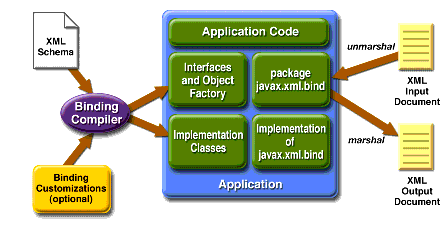

# JAXB: Java Architecture of XML Binding -- Abstract
* The Java Architecture of XML Binding (JAXB) provides a free, fast and convenient way to bind XML Schemas to Java representations, making it easy for Java Developers to incorporate XML data and processing functions in Java applications without having to know much XML

# 1. JAXB Overview
* JAXB is a Java technology that enables you to generate Java classes from XML Schemas by means of a *JAXB Compiler*
* The *JAXB binding compiler* takes XML Schema as input, and then generates a package of Java classes and interfaces that reflect the rule defined in the source schema
* The *JAXB binding framework* provides:
    * Methods for unmarshalling XML instance documents into *Java content trees*, and then marshalling *Java content trees* back into XML instance document
    * Methods ofr validating XML content as it is unmarshalled and marshalled

* Some of the advantages associated with using the JAXB framework:
    * *Efficient Mechanism*
    * *Increased Productivity*
    
* Implementing JAXB in your Java applications is typically a two-step process:
    * One ore more schemas are defined as needed, and then the JAXB binding compiler is run against these schemas to generate JAXB packages, classes, and interfaces
    * Java application developers use the generated JAXB packages and the JAXB utility packages in a binding framework to unmarshal, marshal, and validate XML content
    
# 1.1 Core Components in a JAXB Implementation

* *XML Schema*: uses XML syntax to describe the relationships among elements, attributes and entities in an XML document. The purpose of an XML Schema is to define a class of XML documents that must adhere to a particular set of structural rules and data constraints. In the Context of JAXB, an XML document containing data that is constrained by an XML Schema is referred to as a document instance, and the structure and data within a document instance is referred to as a content tree

* *Binding Customizations*: overrides the default binding rules by means of binding customizations made either inline as annotations in a source schema, or as statements in an external binding customization file that is passed to the JAXB binding compiler

* *Binding Compiler*: transform, or bind, a source XML Schema to a set of JAXB content classes in the Java programming language. Basically, you run the JAXB binding compiler using an XML Schema as input, and the binding compiler generates Java classes that map to constraints in the source XML Schema

* *Implementation of javax.xml.bind*: runtime API that provides interfaces for unmarshalling, marshalling, and validating XML content in a Java application

* *Schema-Derived Classes*: schema-derived classes generated by the binding JAXB Compiler

* *Java Application*: in the Context of JAXB, a Java application is a client application that uses the JAXB binding framework to unmarshal XML data, validate and modify Java content objects, and marshal Java content back to XML data

* *XML Input Documents*: XML content that is unmarshalled as input to the JAXB binding framework, an XML instance document, from which a Java representation in the form fo a content tree is generated

* *XML Output Documents*: XML content that is marshalled out to an XML document. In JAXB, marshalling involves parsing an XML content object tree and writing out an XML document that is an accurate representation of the original XML document, and is valid with respect the source schema. JAXB can marshal XML data to XML documents, SAX content handlers, and DOM nodes

## 1.2 JAXB Binding Process
* The general steps in the JAXB data binding process are:
    * *Generate classes*: an XML Schema is used as input to the JAXB binding compiler to generate JAXB classes based on that schema
    * *Compile classes*: all the generated classes, sources files, and application code must be compiled
    * *Unmarshal*: XML documents written according to the constraints in the source schema are unmarshalled by the JAXB binding framework
    * *Generate content tree*: the unmarshalling process generates a content tree of data objects instantiated from the generated JAXB classes; this content tree represents the structure and content of the source XML documents
    * *Validate (optional)*: validate the source XML documents before generating the content tree
    * *Process content*: client application can modify the XML data represented by the Java content tree by means of interfaces generated by the binding compiler
    * *Marshal*: the processed content tree is marshalled out to one or more XML output document
    
* Using JAXB involves two discrete sets of activities:
    * *Design Time Binding Process*: generate and compile JAXB classes from a source schema
    * *Run Time Binding Process*: run the application to unmarshal, process, validate, and marshal XML content
    
## 1.3 Distinct Advantages of JAXB
* JAXB simplifies access to an XML document from a Java program:
    * JAXB allows you to access and process XML data without having to know XML or XML processing
    * JAXB allows you to access data in non-sequential order
    * By unmarshalling XML data through JAXB, Java content objects that represent the content and organization of data are directly available to your program
* JAXB uses memory efficiently
* JAXB is flexible:
    * You can unmarshal XML data from a variety of input sources
    * You can marshal a content tree to a variety of output targets
    * You can unmarshal SAX events
    * JAXB allows you to access XML data without having to unmarshal it
    * You can validate source data against an associated schema as part of the unmarshalling operation
    * You can validate a content tree, using the Validator class, separately from marshalling
* JAXB's binding behavior can be customized

## 1.4 JAXB Best Practices
* JAXB is particularly useful if you want to:
    * Access configuration values from a properties files stored in XML format
    * Develop a tool that can create or modify a configuration properties file represented in XML format
    * Receive dat in the form of an XML document
    * Validate data input by user
    * Bind an XML document into a Java representation
    * Unmarshal an XML document already known to be valid
    
# 2. Binding XML Schemas

## 2.1 Simple Type Definitions
* A schema component using a simple type definition typically binds to a Java property
* The following Java property attributes include:
    * Base type
    * Collection type, if any
    * Predicate
    
## 2.2 Default Data Type Bindings
* The Java language provides a richer set of data type than XML Schema
* XML Schema Type               Java Data Type
* xsd:string                    java.lang.String
* xsd:integer                   java.math.BigInteger
* xsd:int                       int
* xsd:short                     shot
* xsd:long                      long
* xsd:decimal                   java.math.BigDecimal
* xsd:float                     float
* xsd:double                    double
* xsd:boolean                   boolean
* xsd:byte                      byte
* xsd:QName                     javax.xml.namespace.QName
* xsd:dateTime                  java.util.Calendar
* xsd:base64Binary              byte[]
* xsd:hexBinary                 byte[]
* xsd:unsignedInt               long
* xsd:unsignedShort             int
* xsd:unsignedByte              short
* xsd:time                      java.util.Calendar
* xsd:date                      java.util.Calendar
* xsd:anySimpleType             java.lang.String

## 2.3 Default Binding Rules
* The JAXB binding model follows the default binding rules summarized below:

* From          ==>                        To
* XML Namespace URI ==> Java package
* Named complex type ==> Java content interface
* Anonymous inline type definition of an element declaration ==> Java content interface
* A named simple type definition with a basetype that derives from "xsd:NCName" and has enumeration facet ==> enum class
* A global element declaration to a Element interface ==> Java Element interface
* Local element declaration that can be inserted into a general content list ==> Java Element interface
* Attribute ==> Java property

# 3. JAXB Binding Framework
* The JAXB binding framework is implemented in three Java packages:
    * *javax.xml.bind* defines abstract classes and interfaces that are used directly with content classes
    * *javax.xml.bind.util* contains utility classes that may be used by client applications to manage marshalling, unmarshalling, and validation events
    * *javax.xml.bind.helper* provides partial default implementations for some of the *javax.xml.bind* interfaces
    
## 3.1 JAXB binding framework package - javax.xml.bind
* Is a set of interfaces through which client applications communicate with code generated from a Schema
* The main client entry point into the binding framework is the *JAXBContext* class
* It provides an abstraction for managing the XML-Java binding information necessary to implement the JAXB binding framework operations: *unmarshal*, *marshal*, and *validate*

* Instances of those interfaces can be created from a JAXBContext object:
    * *Unmarshaller*: governs the process of deserializing XML data into Java content trees, optionally validating the XML data as it is unmarshalled
    * *Marshaller*: governs the process of serializing Java content trees back into XML data
    * *Validator*: performs the validation on an in-memory object graph

## 3.2 Unmarshalling
* The *Unmarshaller* class provides the client application that contains classes generated by JAXB binding compiler, the ability to convert XML data into a tree of Java content objects

* By default, *Unmarshaller* is very forgiving. Event if the document is invalid, it tries to recover from errors. If the document is so broken that it cannot be read, an *UnmarshalException* will be thrown

* *A ValidationEventHandler can explicitly tell a JAXB implementation whether it should reject a document or try to recover from errors. It also gives you more information, such as line numbers, about errors*

## 3.3 Marshalling
* A *Marshaller* is used to write an object graph into XML

## 3.4 Validation
* The *Validator* class is responsible for controlling the validation of content trees during runtime

* There are three forms of Validation in JAXB:
    * *Unmarshal-Time Validation* (All JAXB Providers are REQUIRED to support this operation)
    * *On-Demand Validation* (All JAXB Providers are REQUIRED to support this operation)
    * *Fail-Fast Validation* (JAXB Providers are NOT REQUIRED to support this type of validation)

# 4. Binding Can Be Customized
* The binding language is an XML based language which defines constructs referred to as binding declarations
* A binding declaration can be used to customize the default binding between an XML Schema component and its Java representation

## 4.1 Why Customize?
* In most cases, the default bindings generated by the JAXB binding compiler will be sufficient to meet your needs
* There are cases, however, in which you may want to modify the default bindings
    * Creating javadoc for the schema-derived JAXB package
    * Providing semantically meaningful customized names
    * Overriding default bindings
    * Specify that a model group should be bound to a class rather than a list
    
## 4.2 Inline Annotated Schema

## 4.3 External Binding Declaration

# 5. A Sample with JAXB Binding Compiler XJC

## 5.1 System Requests
* Java Web Services Developer Pack

## 5.2 JAXB Binding Compiler xjc
* The *Java Architecture for XML Binding (JAXB)* provides a *JAXB Binding compiler xjc*
* The *JAXB binding compiler* takes XML Schema as input, and then generates a packages of Java classes and interfaces that reflect the rules defined in the source schema
* JAXB generates Java classes and interfaces corresponding to the top-level elements and top-level *complexType* elements
* In a XML Schema, an element is represented with *xs:element*, and a *complexType* is represented with *xs:complexType*

## 5.3 Generating Java Classes
* xjc -primer.po -d src po.xsd

## 5.4 Creating an XML Document from the Java Classes

# 6. References
