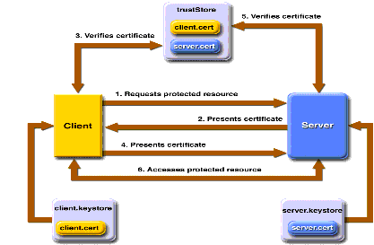

# JAX-RPC: Java API for XML-Based Remote Procedure Call -- Abstract
* The Java API for XML-Base Remote Procedure Call (JAX-RPC) is an important step forward in the quest for Web Services interoperability across heterogeneous platforms and languages

* JAX-RPC provides a uniform APIs that enables developers to create Web Service clients and access WEb Service servers based on SOAP

* A developer using JAX-RPC can either consume a remote Web Service as a client or expose a Web Service from the client side

## 1. JAX-RPC Overview
* JAX-RPC is for Web Services interoperability across heterogeneous platforms and languages. This makes JAX-RPC a key technology for Web Services integration

* You can use the standard JAX-RPC programming model to develop Web Service clients and endpoints based on SOAP
* JAX-RPC requires SOAP and WSDL standards for this cross-platform interoperability

* Using JAX-RPC, you are not exposed to the complexity of the underlying runtime mechanisms (for example, SOAP protocol level mechanism, marshalling and unmarshalling)

* JAX-RPC provides support for WSDL-to-Java and Java-to-WSDL mapping as part of the development of Web Service clients and endpoints

* JAX-RPC enables a Web Service endpoint to be developed using either a Java Servlet or Enterprise JavaBeans (EJB) component model
* A JAX-RPC client can use stubs-based, dynamic proxy or dynamic invocation interface (DII) programming models to invoke a heterogeneous Web Service endpoint

* JAX-RPC requires SOAP over HTTP for interoperability. JAX-RPC provides support for SOAP message processing model through the SOAP message handler functionality
* JAX-RPC uses SAAJ API for SOAP message handler
* SAAJ provides a standard Java API for constructing and manipulating SOAP messages with attachments

* JAX-RPC provides support for document-based messaging. Using JAX-RPC, any MIME-encoded content can be carried as part of a SOAP message with attachments

* JAX-RPC supports HTTP level session management and SSL based security mechanisms

* For typical Web Service scenarios, using JAX-RPC reduces complexity for developers by:
    * Standardizing the creation of SOAP requests and responses
    * Standardizing the marshalling and unmarshalling of parameters and other runtime and deployment-specific details
    * Removing these SOAP creating and marshalling/unmarshalling tasks from a developer's responsibilities by providing these functions in a library or a tool
    * Providing standardized support for different mappings scenarios, including XML to Java, Java to XML, WSDL-to-Java, and Java-to-WSDL mappings

# 2. JAX-RPC High Level Architecture
* Java API for XML-based RPC (JAX-RPC) is intended to be a Java API to expose remote procedure calls that use XML to business applications that occur primarily on the periphery of organizations

* SOAP defines the XML-based protocol for exchange of information in a distributed environment, specifying the envelop structure, encoding rules, and a convention for representing remote procedure calls and responses
* The client JAX-RPC runtime maps the request's Java types to XML and forms a corresponding SOAP messages for the request

* Development of Web Service and Client Application:
    * Defining a service interface that declares methods that clients can invoke on the remote service
    * Writing a Java class that implements the interface
    * Deploying the service to the Web Server
    * Writing the client application that interacts with the service
    
# 3. JAX-RPC Supported Java Types
* JAX-RPC supports only a subset of Java types, because the data types transmitted by the remote procedure calls must map to XML data types
* When a Web service receives a remote method call from its client, the JAX-RPC runtime service environment first transforms the XML representation of the call inputs to its corresponding Java type (aka *deserialization*), then passes the Java object to the service implementation to process the remote call
* After the call is processed, the JAX-RPC runtime service environment transforms the return object to its XML representation (aka *serialization*)

* *Marshalling* over the wire requires object state to be extracted and sent in a well-defined format
* *Unmarshalling* requires that the format to be known, for reconstruction to take place
* The *marshal* and *unmarshal* successfully, both sides in the exchange must use the same protocol to encode and decode object structure and data

## 3.1 Java-to-XML Marshalling
* *A Java class must follow these rules to be a JAX-RPC conformant value type*:
    * Class must have a public default constructor (no-arg)
    * Class must not implement (directly or indirectly) the *java.rmi.Remote* interface
    * Class may implement any Java interface (except *java.rmi.Remote*) or extend another Java class
    * Class may contain public, private, or protected information. Fields must be supported JAX-RPC data
    * Class must follow the JavaBeans set and get method design pattern
    * Class may contain static or transient fields
    * Class for a JAX-RPC value type may be designed as a JavaBeans class with simple properties
    
* *Finally, Java arrays also can be used in JAX-RPC, provided that the type of the array is one of the JAX-RPC supported types. JAX-RPC also supports multi-dimensional arrays*

# 4. JAX-RPC Service-Side Programming Models
* JAX-RPC defines two server-side programming models for creating J2EE Web Service endpoints: 
    * *JAX-RPC Service Endpoints* - The service implementation is a Java class in the Web container. The service adheres to the Web container's servlet lifecycle and concurrency requirements
    * *Enterprise JavaBeans Endpoints* - The service implementation is a stateless session bean in an EJB container. The service adheres to the EJB container's lifecycle and concurrency requirements
    
* The service is made portable with the definition of a port component, which provides the services' outside view for Web service implementation. A port component consists of:
    * A WSDL document describing the Web service that its clients can use
    * A service endpoint interface defining the Web services' methods that are available to clients
    * A service implementation bean implementing the business logic of the methods defined in the service endpoint interface. The implementation may be either a Java class in the Web container or a stateless session bean in the EJB container

* JAX-RPC requires the service definition interfaces must follow RMI conventions, no remote references allowed, and all objects are passed by copy

* Container-specific service interface, created by the J2EE container, provide static stub and dynamic proxies for all ports

* Use a stateless Session Bean to expose Web Services if you:
    * Need to expose previously existing stateless Session Beans as Web Services
    * Need declarative transaction management
    * Need the thread management provided by EJB Container
    * Need role based security
    
* Use Java classes to expose your Web Service if you:
    * Need to expose previously existing Java classes as Web Service
    * Want a light-weight system, and don't care much about transactional capabilities that an EJB container provides
    
## 4.1 JAX-RPC Service Endpoint (JSE)
* A *JSE* is composed of two parts: a service endpoint interface and the service corresponding implementation
* There are some restrictions for the service interface and the service implementation class:
    * The *Service Endpoint Interface* which MUST extends *java.rmi.Remote* interface and declares the web services's publicly accessible methods. All of service endpoint interface's methods MUST throw the *java.rm.RemoteException*
    * The *Service Endpoint Interface* may be generated from a WSDL file
    * The *Service Implementation class* that implements all methods defined by the SEI
    * The *Service Implementation class* may not directly implement the SEI by using Java *implements* keyword
    * The *Service Implementation class* MUST NOT throw *java.rmi.RemoteException*

* JSEs are deployed into a J2EE Servlet container, and have access to the same resources and context information a Servlet has

* The associated servlet typically takes the responsibility of handling transport specific processing of an RPC request and for initiating dispatch to the target service endpoint interface
* Each *Servlet.service()* method maps to a single remote method invocation on the target SEI

* When processing an incoming SOAP request for a one-way operation, the associated servlet is required to send back an HTTP response code of 200 or 202 as soon as it has identified the incoming request as being one-way and before it dispatches it to the target SEI

* The Service Implementation Bean must follow the Service Developer requirements outlined in the JAX-RPC specification :
    * The Service Implementation Bean must have a default public constructor
    * The Service Implementation Bean may implement the SEI as defined by the JAX-RPC Servlet Model. Only the SEI methods are exposed to the client
    * A Service Implementation must be stateless object
    * The class must not be public, must not be final and must not be abstract
    * The class must not defined the finalize() method
    
## 4.2 JAX-RPC Service Endpoint Lifecycle
* The lifecycle of a service endpoint instance is realized through the implementation of the init() and destroy() methods of the *ServiceLifecycle* interface
* The JAX-RPC runtime is responsible for loading and instantiation of service endpoint instances

## 4.3 ServletEndpointContext
* JSEs can use *javax.xml.rpc.server.ServletEndpointContext* interface to interact with its environment

* A Servlet container based JAX-RPC runtime system is required to implement the *ServletEndpointContext* interface
* The JAX-RPC runtime system is required to provide appropriate session, message context, servlet context and user principal information per method invocation on SEI

* Summarize of Servlet-based Endpoint Model:
    * The Service implementation class is an ordinary Java class
    * The invocation of the methods provided the service done inside the servlet container
    * Optional ServiceLifecycle interface for initialization and destruction callbacks
    * Access all resources in the web application
    
## 4.4 Statefull Web Service By JAX-RPC Endpoint Service
* JAX-RPC 1.1 specification does not specify session management using SOAP headers
* A JAX-RPC runtime system is required to use at least one of the following mechanisms to manage sessions:
    * Cookie based mechanism
    * URL rewriting involves adding session related identifier to a URL
    * SSL session may be used to associate multiple RPC invocations on a service endpoint as part of a single session
    
* Setting *javax.xml.rpc.session.maintain* to true, the client indicates that it wants to join the session initiated by the server. The default value is false

## 4.5 JAX-RPC EJB Endpoints
* EJB components, by design, are meant for distributed computing and are hence well suited for exposure as Web Services
* J2EE 1.4 allows exposing only stateless session beans as Web services with JAX-RPC
* Any Web Service client can access the EJB web service using SOAP 1.1 over HTTP

* For exposing the Web Service endpoint you do not need to have home or remote interfaces for the EJBs, only the end-point interface that extends *java.rmi.Remote* and bean implementation class is required

* The endpoint interface MUST comply with the rules for WSDL-to-Java mapping defined by the JAX-RPC specification
* Every business method defined in the Endpoint Interface MUST declare *java.rmi.RemoteException* in its throw clause
* RemoteException is used to report any networking problems associated with processing a client's SOAP request
* The SOAP client will not use the EJB Endpoint Interface directly. Instead SOAP clients will use the WSDL document associated with the EJB Endpoint to generate their own service interface

# 5. Service Lookup
* There are two families of clients, which differ in the way the code is written, packaged, and invoked:
    * Unmanaged clients - lookup through the JAX-RPC ServiceFactory, a factory for the creation of instances of services access points
    * J2EE container-managed clients - lookup through JNDI lookup
    
## 5.1 JAX-RPC ServiceFactory
* JAX-RPC ServiceFactory is the standard way to look up Web Services in a J2SE environment

* Steps are as follows:
    * Optionally, specify the WSDL URL
    * Specify the Web Service's fully qualified name
    * Invoke ServiceFactory's createService() method
    
* The Service Interface obtained is then used to get a stub, dynamic proxy, or DII call Object

## 5.2 JNDI Service Lookup
* J2EE container-managed clients are packaged into Enterprise Archives (.EAR) files and run from inside a J2EE container
* Several different types of J2EE container-managed clients are:
    * Application client container clients
    * Web container clients: JavaBean or Servlet
    * EJB container clients: EJB

* Two step process for Java Naming and Directory Interface (JNDI) lookup:
    * Instantiate a local JNDI context
    * Do a JNDI lookup for the Web Service name in this context

# 6. JAX-RPC Client-Side Programming Models
* JAX-RPC Client Environment:
    * Service client programing model MUST be independent of how a service endpoint is implemented on the service side
    * Service client environment should be capable of importing a WSDL document and generating a Java based client side representation for a service described in the WSDL document. A client side representation includes classes generated based on the mapping of the WSDL definitions to the corresponding Java representation
    * Service client programming model MUST NOT be exposed or tied to a specific XML based protocol, transport or any JAX-RPC implementation specific mechanism
    * Service client programming model can use either J2SE or J2EE programming model
    
* JAX-RPC defines three client-side programming models that Java application can be use to access Web service:
    * *Generated stub*: both Interface (WSDL) and Implementation (stub) are created at compile time
    * *Dynamic proxies*: Interface (WSDL) is created at compile time while Implementation (dynamic proxy) created at runtime
    * *Dynamic invocation interface (DII)*: Both Interface (WSDL) and Implementation are created at runtime

* *Generated stub* and *dynamic proxy* methods use the SEI. The SEI is basically the Java representation of the WS operation described in the WSDL portType element
* The SEI is a Java interface defining methods used by the Java client to interface with the WS
* The SEI is generated by a WSDL to Java mapping tool

## 6.1 Generated Stub
* The stub-based model generates local stub classes fro the proxy from a WSDL document
* When you change the WSDL document, you MUST regenerate the stubs
* Along with the stubs, the tools generate additional classes, and a service definition interface (SDI), which is the interface that is derived from a WSDL's portType. This is the interface you use to access the operation on the WS
* The combination of these files are called client-side artifacts
* Client-side artifacts are a collection of files on the client-side that handle communication between a client and a WS

* Generated client-side artifacts must include:
    * A stub class
    * A service endpoint interface (SEI)
    * A service definition interface (SDI)
    * An implementation of the service definition interface (the location class to help you find the endpoint)
    
* Stub-based Invocation Model:
    * Stub class get generated from WSDL at compile time
    * All needed value classes are also generated
    * Instantiated using the Service class
    * Stub class in bound to a specific XMl protocol (ie SOAP) and transport (HTTP)
    * Best performance
    * Stub class implements *javax.xml.rpc.Stub* interface and *Service Definition Interface*

## 6.2 Dynamic Proxy
* The Dynamic proxy client calls a remote procedure through a dynamic proxy stub, a class that is created during runtime by using JAX-RPC client APIs
* The source code for the static sub client relied on an implementation-specific class, the code for the dynamic proxy client does not have this limitation
* It uses the service factory class to create the service based on the WSDL document and obtains the proxy from the service

* Dynamic Proxy-based Invocation Model:
    * Stubs (Dynamic Proxy) are generated on the fly by JAX-RPC client runtime
    * Application provides the Service Definition Interface (WSDL) the dynamic proxy conforms to
    * The performance is slower than Stub-based invocation
    * Does not depend on implementation specific class
    * Portable client code because it does not depend on vendor generated service class before runtime

## 6.3 Dynamic Invocation Interface
* The Dynamic Invocation Interface (DII) client does not require a WSDL file to generate static stubs or pass the WSDL file to the service factory to create the service; instead, the client must know a service's address, operations, and parameters in advance
* Using the Dynamic Invocation Interface (DII) enables the client to discover target services dynamically on runtime and then to invoke method
* During runtime, the client uses a set of service operations and parameters, establishes a search criterion to discover the target service, and then invokes it methods

* DII looks up a service, create a *javax.xml.rpc.Call* object by setting the endpoint specific parameters and operations, and finally invokes the call object to execute the remote methods

* Dynamic Invocation Model:
    * Gives complete control to client developer
    * A client can call a remote procedure even if the signature of the remote procedure or the name of the service are unknown until runtime
    * Does not require wscompile to create runtime classes
    * Enables broker model
        * Client finds (through some search criteria) and invokes a service during runtime through a broker
        * Used when service definition interface is not known until runtime
        * Create JAX-RPC *javax.xml.rpc.Call* object and set operation and parameters during runtime
        
# 7. JAX-RPC Handler

## 7.1 What is JAX-RPC Handler?
* A *handler* is a component that can be associated with an entire WS or with a particular WS Interface
* A WS can have a number of ports - a port is analogous to a Java Interface - and a handler can be associated with just an interface
* JAX-RPC handler allow you to intercept a SOAP message at various times during a service invocation
* Handlers ca be very generic, such as logging or caching, or very specific, such as handlers that want to process an application-specific SOAP header

* Several handlers can be combined into *handler chain*

* A *handler* is a java class that implements the *javax.xml.rpc.handler.Handler* interface

* When you design SOAP message JAX-RPC handlers you must decide the number of handlers, the order in which the handlers will be executed, and whether to invoke a back-end component

## 7.2 Handler Life Cycle
* JAX-RPC runtime system considers all instances of a particular handler class to be equivalent. This allows JAX-RPC runtime system to pool handler instances, although it is not required 

* The life cycle of a handler consists of two states:
    * A handler either does not exists
    * It is in a ready state
    
* On a service client the *handleRequest()* method is invoked before the SOAP message is sent, and the *handleResponse()* method is invoked before the actual response is received

* On a service endpoint, the *handleRequest()* method is invoked before the actual service endpoint is invoked, and the *handleResponse()* method is invoked before the actual response is sent to the client

* On a service client *handleFault()* method is called before receiving a SOAP Fault, and on the service endpoint the *handleFault()* method is called before generating a SOAP Fault

## 7.3 Stop JAX-RPC Handler's Processing
* There are several ways to stop processing the message:
    * Throw a *JAXRPCException* that signals a runtime error has occurred in the processing of the message
    
## 7.4 Handlers Process

### 7.4.1 Handler Chains
* A *HandlerChain* delegates processing of the SOAP message to its configured chain of handlers
* You specify the handlers in the web-services.xml deployment descriptor file
* An ordered group of handlers is referred to as a *handler chain*

* The *handleRequest*, *handleResponse* and *handleFault* methods for a SOAP message handler get access to the *SOAPMessage* from the *SOAPMessageContext*
* *The implementation of these methods can modify the SOAPMessage including the headers and body elements*

* The *handleRequest()* methods of the handlers in the handle chain are all executed, in the order specified in the web-services.xml file. Any of these methods might change the SOAP message request
* When the *handleRequest()* method of the last handler in the handler chain executed, WS containers invokes the backend components that implements the WS, passing it the final SOAP message request
* When the backend components has finished executing, the *handleResponse()* methods of the handlers in the handler chain are executed in the reverse order specified in the web-services.xml. Any of these method might change the SOAP Message response
* When the *handleResponse()* method of the first handler in the handler chain executes, WS containers return the final SOAP message response to the client application that invoked the WS

### 7.4.2 handleRequest method
* The *handleRequest* method performs one of the following steps after performing handler specific processing of the request SOAP message:
    * Return *true* to indicate continued processing of the request handler chain
    * Return *false* to indicate blocking of the request handler chain. In this case, further processing of the request handler chain is blocked and the target service endpoint is not dispatched. The JAX-RPC runtime system takes the responsibility of invoking the response handler chain next with appropriate *SOAPMessageContext* 
    * Throw the *javax.xml.rpc.soap.SOAPFaultException* to indicate a SOAP fault. The *SOAPFaultException* is thrown by a server-side request handler's *handleRequest* method, the *HandlerChain* terminates the further processing of the request handlers in this handler chain and invokes the *handleFault* method on the *HandlerChain* with the SOAP message context. Next, the *HandlerChain* invokes the *handleFault* method on handlers registered in the handler chain, beginning with the *Handler* instance that threw the exception and going backward in exception
    * Throw the *JAXRPCException* or any other *RuntimeException* for any handler specific runtime error. If *JAXRPCException* is thrown by a *handleRequest* method, the *HandlerChain* terminates the further processing of this handler chain. The WS container catches the exception, terminates further processing of the handler request chain, and invokes the *handleFault()* method of this handler
    
### 7.4.3 handleResponse Method
* The *handleResponse* method performs the processing of the SOAP response message. It does one of the following steps after performing its handler specific processing of the SOAP message:
    * Return *true* to indicate continued processing of the response handler chain. The *HandlerChain* invokes the handleResponse method on the next *Handler* in the handler chain
    * Return *false* to indicate blocking of the response handler chain. In this case, no other response handlers in the handler chain are invoked
    * Throw *JAXRPCException* or any other *RuntimeException* for any handler specific runtime error. If *JAXRPCException* is throw by the *handleResponse* method, the *HandleChain* terminates the further processing of this handler chain

### 7.4.4 handleFault Method
* The *handleFault* method performs the SOAP fault related processing
* The JAX-RPC runtime system should invoke the *handleFault* method if a SOAP fault needs to be processed by either client-side or service-side handlers
* The *handleFault* does one of the following steps after performing handler specific processing of the SOAP fault:
    * Return *true* to indicate continued processing of the fault handlers in the handler chain. The *HandlerChain* invokes the *handleFault* method on the next Handler in the handler chain
    * Return *false* to indicate blocking of the fault processing in the handler chain. No other handlers in the handler chain are invoked
    * Throw *JAXRPCException* or any other *RuntimeException* for any handler specific runtime error. If *JAXRPCException* is thrown by the *handleFault* method, the *HandlerChain* terminates the further processing of this handler chain

* When a *JAXRPCException* or *RuntimeException* raised on the server is converted to a SOAP fault for the purpose of being transmitted to the client

# 8. Security Mechanisms in JAX-RPC

## 8.1 HTTP Basic Authentication
* JAX-RPC implementation has to support HTTP Basic Authentication. JAX-RPC specification does not require JAX-RPC implementation to support certificate based Mutual Authentication using HTTPS (HTTP over SSL)

* The HTTP 1.x protocol has a built in mechanism for requiring a valid username/password to gain access to web resources

* With basic authentication, the following things occur:
    * A client requests access to a protected resource
    * The web server returns a dialog box that requests the username and password
    * The client submits the username and password to the server
    * The server validates the credentials and, if successful, returns the requested resource

* HTTP basic authentication is not particularly secure
* Basic authentication sends usernames and passwords over the Internet as text that is uu-encoded (Unix-to-Unix encoded) but not encrypted
* This form of authentication, which uses Base64 encoding, can expose your usernames and passwords unless all connections are over SSL

## 8.2 Client-Certificate Authentication
* Client-certificate authentication is a more secure method of authentication than either basic or form-based authentication
* It uses HTTP over SSL, in which the server and, optionally, the client authenticate one another using public key certificates

* Secure Socket Layer (SSL) provides data encryption, server authentication, message integrity, and optional client authentication for TCP/IP connection
* You can think of a public key certificate as the digital equivalent of a passport. It is issued by a trusted organization, which is called a Certificate Authority (CA), and provides identification for the bearer

## 8.3 using Mutual Authentication
* With mutual authentication, the server and the client authenticate each other.
* There are two types of mutual authentication

### 8.3.1 Certificate-based Mutual Authentication

* In certificate-based mutual authentication, the following thing occur:
    * A client request access to a protected resource
    * The web server presents its certificate to the client
    * The client verifies the server's certificate
    * If successful, the client sends its certificate to the server
    * The server verifies the client's certificate
    * If successful, the server grant access to the protected resource requested by the client
    
### 8.3.2 Username and password-based mutual authentication
    

* In username and password-based mutual certification, the following things occur:
    * A client requests access the a protected resource
    * The web server presents its certificate to the client
    * The client verifies the server's certificate
    * If successful, the client sends its username and password to the server, which verifies the client's credentials
    * If the verification is successful, the server grants access to the protected resource requested by the client
    
# 9. References