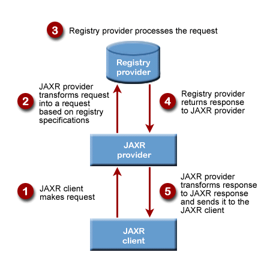

# JAXR: Java API for XML Registries -- Abstract
* *JAXR* is the Java API for XML Registries, used for Universal Discovery and Directory in a WS (UDDI)
* JAXR provides a standard API for publication and discovery of WS through underlying registries

# 1. Introduction
* A WS is a software system designed to support interoperable machine-to-machine interaction over a network
* It has an interface described in a machine-processable format (specially WSDL)
* Other system interact with the Web Service in a manner described by its description using SOAP messages, typically conveyed using HTTP with an XML serialization in conjunction with other Web-related standards

* The WS world is one in which the clients and services find each other and connect without any explicit prior knowledge
* In this open Web world, registries play a critical role in client discovery and lookup, as well as service provider registration
* When WS are written as Java server-based applications, developers need a way to register their services and to do repository search and lookup

* JAXR enables Java software programmers to use a single, easy-to-use abstraction API to access a variety of XML registries
* Simplicity and ease of use are facilitated within JAXR by a unified JAXR information model, which describes content and metadata within XML registries

* JAXR provides a convenient way for Java developers to use a simple API to access a variety of XML registries including UDDI and ebXML

# 2. JAXR Architecture
* The high-level architecture of JAXR consists of the following parts:
    * A *registry provider* implements an existing registry standard, such as OASIS (Organization for the Advancement of Structured Information)/ebXML Registry Services Specification 2.0
    * A *JAXR provider* offers an implementation of the JAXR specification approved by the Java Community Process (JCP). This is an implementation of the JAXR API that provides access to a specific registry provider or to a class of registry providers that are based on a common specification
    * A *JAXR client* is a Java program that uses JAXR to access the registry provider via a JAXR provider
    

* Figure 2 shows a high-level view of the JAXR architecture
* The JAXR provider shown is a JAXR pluggable provider with underlying implementations of a UDDI-specific JAXR provider and an ebXML-specific provider 

* Before a JAXR client can invoke *capability-level methods* on the JAXR provider, it must connect to the provider
* The JAXR provider acts as a proxy on the client's behalf, directing and invoking methods on the appropriated registry provider

* Roles of JAXR Interacts follow chart:

* A JAXR Client uses JAXR interfaces and classes to request access to a registry. The client sends the request to a JAXR provider
* When a JAXR provider receives a request from a JAXR client, it transform the request into an equivalent request that is based on the specifications of the target registry. The JAXR provider then passes this transformed request to a registry provider
* The registry provider receives a request from a JAXR provider and process it. The process in then reversed
* The registry provider returns a response to the JAXR provider, which transforms it to an equivalent JAXR response
* The JAXR provider sends the JAXR response to the JAXR client

# 3. JAXR Capability Profiles
* Because some diversity exists among registry provider capabilities, the JAXR expert group decided to provide multilayer API abstractions through capability profiles
* Each method of a JAXR interface is assigned a capability level, and those JAXR methods with the same capability level define the JAXR provider capability profile

* Currently, JAXR defines only two capability profiles:
    * *level 0 profile* for basic features
    * *level 1 profile* for advanced features

* Because WS-I Basic Profile sanctions the use of UDDI, not ebXML, we MUST we *JAXR level 0 profile

# 4. RegistryService Interface
* The *RegistryService* is the principle interface in the JAXR API
* The JAXR provider supports capability profiles that group the methods on JAXR interfaces by *capability level*

# 5. Build a JAXR Client
* The *javax.xml.registry* package contains the interfaces and classes for access to a registry through a JAXR provider:
    * *ConnectionFactory*: This is an abstract class for factory classes that create a JAXR connection
    * *Connection*: this class represents a connection between a JAXR client and a JAXR provider
    * *RegistryService*: This is the principal interface implemented by a JAXR provider. The *RegistryService* provides the methods that a JAXR client uses to discover various capability-specific interfaces implemented by the JAXR provider, such as the *BusinessLifeCycleManager* and *BusinessQueryManager*
    * *LifeCycleManager*: This interface provides methods to perform "life cycle" operations on information in the registry, as modeled by objects in the information model
    * *BusinessLifeCycleManager*: This is a sub-interface of the LifeCycleManager interface. It provides a way to request life cycle management operations that mimic the UDDI interface
    * *BusinessQueryManager*: This interface provides methods to query the registry. For example, the method findOrganizations searches the registry for all organizations that match criteria specified in the method call 
    
# 6. JAXR Information Model
* Invoking life-cycle and query management methods on the JAXR provider requires the JAXR client to create and use the JAXR information model objects
* The JAXR information model resembles the one defined in the ebXML Registry Information Model 2.0, but also accommodates the data types defined in the UDDI Data Structure Specification

# 7. References