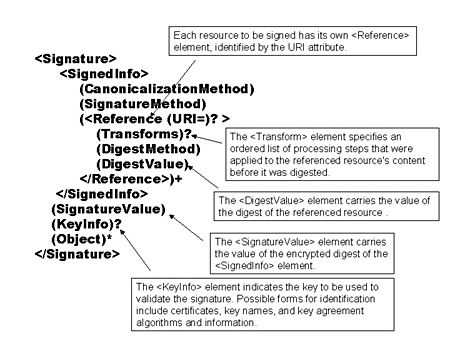
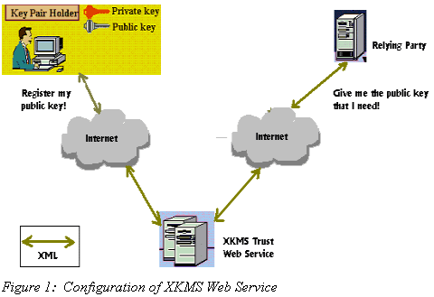
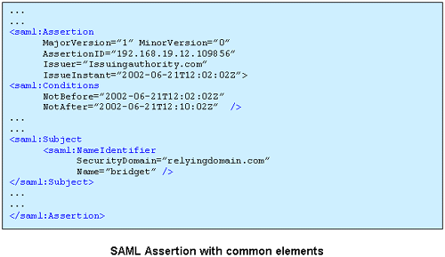
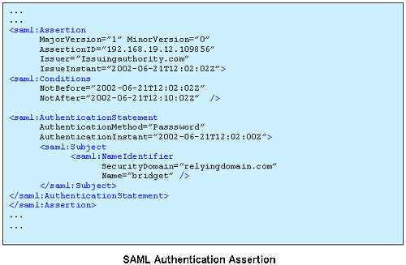
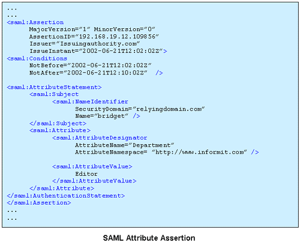
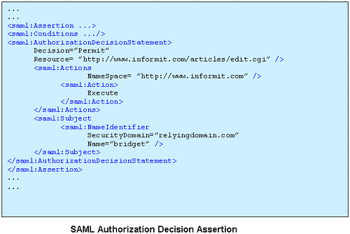
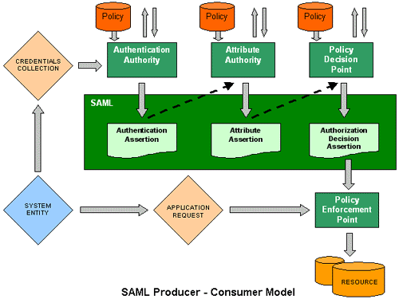

# XML Security - Abstract
* The XML Security standards define XML vocabularies and processing rules in order to meet security requirements
* These standards use legacy cryptographic and security technologies, as well as emerging XML technologies, to provide a flexible, extensible and practical solution toward meeting security requirements
* The XML Security standards include:
    * XML Digital Signature for integrity and signing solutions
    * XML Encryption for confidentiality
    * XML Key Management (XKMS) for public key registration, location and validation
    * Security Assertion Markup Language (SAML) for conveying authentication, authorization and attribute assertions
    * XML Access Control Markup Language (XACML) for defining access control rule
    * Platform for Privacy Preferences (P3P) for defining privacy policies and preferences
* Major use cases include securing Web Services (WS-Security) and Digital Rights Management (eXtensible Rights Markup Language 2.0 - XrML)

# 1. XML Security Overview
* XML has become an valuable mechanism for data exchange across the Internet
* Security is essential for the exchange of sensitive XML documents over the public networks
* Traditional methods of establishing trust between parties are not appropriate on the public internet or, on larger LANs or WANs
* Security has always been vitally important in the business world to ensure the content and transactions, to maintain privacy and confidentiality, and to make sure information is used appropriately

## 1.1 Security
* Security is vital to online business
* Technologies designed to meet security requirements have evolved, but the requirements have remained relatively constant:
    * *Authentication* - Who is is?
    * *Authorization* - What can they do?
    * *Integrity* - Ensure that information is intact
    * *Signature*- Create and verify electronic signatures analogous to handwritten signatures
    * *Confidentiality* - Make content unreadable by unauthorized parties
    * *Privacy* - Limit access and use of individually identifiable information
    * *Digital Rights Management* - Limit use and sharing of content according to license agreements

## 1.2 XML Security
* XML Security standards provide a set of technical standards to meet security requirements
* These standards are designed to conform to common XML paradigms
* The XML Security standards leverage existing XML standards and also enhance XML standards as follows:
    * The XML Security standards define XML vocabularies for representing security information, using XML technologies, such as XML Schema, for definition
    * The XML Security standards use other existing XML standard where possible to leverage current XML efforts
    * The XML Security standards are designed to offer the flexibility and extensibility aspects of XML. They allow security to be applied to XML documents, to XML elements and element content, as well as to arbitrary binary documents. They support extending the XML vocabularies through the use of XML namespaces and extensible XML Schema definitions 
     * XML Security technologies may be applied to end-end security, which is especially important when XML messages are routed through a number of processing intermediaries. Persistent security is associated with the content, rather than with the transport pipe. The security remains with the content. XML Security technologies may be used in conjunction with transport security technologies, such as SSL/TSL, as well
     * XML Security technologies reuse existing cryptographic and security technologies whenever possible, without reinventing the wheel
     
## 1.3 Core XML Security Standards:
* The core XML Security standards are:
    * XML Digital Signature for integrity and signatures
    * XML Encryption for confidentiality
    * XML Key Management (XKMS) for key management
    * Security Assertion Markup Language (SAML)for making authentication and authorization assertions
    * XML Access Control Markup Language (XACML) for starting authorization rules

# 2. XML Digital Signature

## 2.1 Introduction
* Digital signatures are important because they provide end-to-end message integrity guarantees, and can also provide authentication information about the originator of message
* In order to be most effective, the signature must be part of the application data, so that it is generated at the time the message is created, and it can be verified at the time the message is ultimately consumed and processed

* SSL/TLS also provides message integrity (as well as message privacy), but it only does this while the message is in transit. Once the message has been accepted by the server (or more generally the peer receiver), the SLL protection must be stripped off so that the message can be processed. As a more subtle point, SSL only works between the communication endpoints

* A XML signature would define a series of XML elements that could be embedded in, or otherwise affiliated with, any XML document. It would allow the receiver to verify that the message has not been modified from what the sender intended

## 2.2 Digital Signature
* Digital Signatures are a standard in security and cryptography for applications, and are becoming more widespread in their use

* A Digital Signatures is a cryptographic piece of data that is attached to a plaintext or encrypted message to verify the identity of the sender
* The Digital Signature is meant to provide assurance to the receiving user (end user) that what they are working with is unaltered or has its original integrity
* Digital Signatures also fulfill an important non-repudiation function, allowing us to identify the author of the message to which the signature is attached

## 2.3 Basic Cryptography
* Cryptography is the most popular mechanism for protecting digital documents exchanged across the wire between two parties involved in confidential business transactions

* The basic concept of cryptography is illustrated below:
    * A sender application uses high-speed mathematical algorithms to transform a given piece of data to a complicated combination of digits and numbers just before transmission. The algorithms employed are so complex that it is impossible to reproduce the original data from this resulting chunk
    * This meaningless chunk of data is then transmitted across the wire. If any unintended recipients can intercept the communications, they will be able to read onl this chunk, not the original data
    * On the receiving end, premeditated reverse transforms are applied in order to decipher the data chunk. The send has to ensure that only the indented recipients are empowered with reverse transforms
    
* The transformation process applied at the sender's end is know as *encryption*; the process at the receiver's end is known as *decryption*

## 2.4 XML Digital Signature
* XML Signatures contain a series of XML elements and attributes that define various components that are needed to sign an XML document more securely
* This includes information about the location of the XML document to be signed, the algorithm used for signing, and information about the key used for signing

* An important feature of XML Signature is the ability to sign only specific portions for the XML tree rather than the complete document
* In other words, it has the ability to have multiple digital signatures contained within one XML document
* A single XML document may have a long history in which the different components are authored at different times by different parties, each signing only those elements relevant to itself
* This flexibility will also be critical in situations where it's important to ensure the integrity of certain portions of an XML document, while leaving open the possibility for other portions of the document to change

* An XML signature can sig more than one type of resource
* For example, a single XML signature might cover character-encoded data (HTML), binary-encoded data (a JPG), XMl-encoded data, and a specific section of an XML file
* Signature validation requires that the data object that was signed be accessible
* The XML signature itself will generally indicate the location of the original signed object
* This reference can be:
    * Referenced by a URI within the XML signature
    * Reside within with the same resource as the XML signature (the signature is a sibling)
    * Be embedded within the XML signature (the signature is the parent)
    * Have its XML signature embedded within itself (the signature is the child)

* Adding a digital signature to an XML document helps ensure that the data contained in the document is more secure, and that the identity fo the person who signed the XML document can be verified

* XML Signatures are applied to arbitrary content (data objects) via an indirection. Data objects are digested, the resulting value is placed in an element (with other information) and that element is then digested and cryptographically signed

* Basically, an XMLdsig is comprised of four main components or elements:
    * *SignedInfo*
    * *SignatureValue*
    * *KeyInfo*
    * *Object*
    

* Signature are related to data objects via URIs
* Within an XML document, signatures are related to local data objects via fragment identifiers
* Such local data can be included within an enveloping signature or can enclose an enveloped signature

## 2.5 XML Digital Signature Elements
* The *Signature* Element
    * The *Signature* element is the top-level element in an XML Signature tree
    * It has information about what is being signed, the signature, the keys used to create the signature, and a place to store the arbitrary information
    * An optional *Id* attribute can be added as an identifier. This is useful in the case of multiple *Signature* instances within a single file or context
    * The *Signature* element must be *laxly-schema valid*

* The *SignedInfo* Element
    * Information about the *SignatureValue*
    * Information about the application content
    * The *CanonicalizationMethod* and *SignatureMethod* elements describe the type of *canonicalization algorithm* and *signature algorithm* used in the generation of the *SignatureValue*
    * *Reference* define the actual data that we are signing. Most of the added features of XML Signatures show up in the definition and usage of *Reference* elements
    
* The *SignatureValue* Element
    * This element contains the actual signature. As signatures are always binary data, XML DSIG specifies that the signature value is always a simple element with Base64-encoded content

* The *KeyInfo* Element
    * Following the *SignatureValues* is the optional *KeyInfo* Element
    * The *KeyInfo* element is a powerful element that allows for integration of trust semantics within an application that utilizes XML Signature
    * Simply put, a *KeyInfo* element contains specific information used to verify an XML Signature
    * *KeyInfo* is a powerful element because it allows a recipient to verify the signature without having to explicitly hunt for the verification key
    * This feature is useful for automating signature verification, but this type of element can also be dangerous
    
* XML Signature Forms
* There are three types of XML digital signatures:
    * Enveloped - The signature is contained within the document is signing
    * Enveloping - The signed document is contained within the signature element
    * Detached - The signature references a document that is else where through a *Universal Resource Identifier* (URI)

* *Enveloped Form*
    * Is useful when you have a simple XML document which you want to guarantee the integrity
    * For example, XKMS messages can use enveloped signatures to convey *trustable* answers from a server back to a client
    
* *Enveloping Form*
    * Is useful when the signing facility wants toa dd metadata to a signature - it doesn't have to modify the source document, but can include additional data covered by the signature within the signature document it generates
    * The signature is over content found within an Object element of the signature itself. The Object (or its content) is identified via a Reference (via a URI fragment identifier or transform)
    
* *Detached Form*
    * Is useful when you can't modify the source
    * The downside is that it requires two XML documents - the source and its signature - to be carried together

## 2.6 How to Create an XML Signature
* Determine which resources are to be signed
    * Identifying the resources through a Uniform Resource Identifier (URI)
    
* Calculate the digest of each resource
    * In XML Signatures, each referenced resource is specified through a *Reference* element and its digest is placed in a *DigestValue* child element
    
* Collect the Reference elements
    * Collect the *Reference* elements (with their associated digests) within a *SignedInfo* element
    
* Signing
    * Calculate the digest of the *SignedInfo* element, sign that digest and put the signature value in a *SignatureValue* element
    
* Add key information
    * If keying information is to be included, place it in a *KeyInfo* element
    
* Enclose in a Signature element
    * Place the *SignedInfo*, *SignatureValue* and *KeyInfo* elements into a *Signature* element
    
## 2.7 Verifying an XML Signature
* A brief description of how to verify an XML Signature:
    * Verify the signature of the *SignedInfo*. To do so, recalculate the digest of the *SignedInfo* element (using the digest algorithm specified in the *SignatureMethod element) and use the public verification key to verify that the value of the *SignatureValue* element is correct for the digest of the *SignedInfo* element
    * If this step passes, recalculate the digests of the references contained within the *SignedInfo* element and compared them to the digest values expressed in each *Reference* element's corresponding *DigestValue* element 
    
## 2.8 Conclusion
* As XML becomes a vital component of the emerging electronic business infrastructure, we need trustable, secure XML messages to form the basic of business transactions
* One key to enabling secure transactions is the concept of a digital signature, ensuring the integrity and authenticity of origin for business documents
* XML Signature is an evolving standard for digital signatures that both addresses the special issues and requirements that XML presents for signing operations and uses XML syntax for capturing the result, simplifying its integration into XML applications

## 2.9 Reference
* http://java.boot.by/wsd-guide/

# 3. XML Encryption
* The *XML Encryption* provides end-to-end security for applications that require secure exchange of structured data
* XML itself is the most popular technology for structuring data, and therefore XML-based encryption is the natural way to handle complex requirements for security in data interchange applications

* The *XML Encryption* recommendation defines an XML vocabulary and processing rules enabling *confidentiality* to be applied to a variety of content
* XML Encryption serves the purpose of maintaining the confidentiality of information, both while in transit as well as when stored
* Other technologies for confidentiality such as Secure Socket Layer (SSL)/Transport Layer Security (TLS) or Virtual Private Networks (VPNs) only provide confidentiality while the information is in transit, not while it is stored at a server

## 3.1 Introduction
* WS imply constant service interactions and exchange of XML-formatted business data across different subsystems
* Many of these may involve confidential business transactions, in which the data exchanged must be private throughout the transaction

* During complex business process, the XML business data has to pass through several systems, applications, and networks. It becomes important to ensure that the confidentiality of information is being protected during this commutation

## 3.2 Basic Cryptography
* Cryptography is the most popular mechanism for protecting digital documents exchanged across the wire between two parties involved in confidential business transactions

* The basic concept of cryptography is illustrated as follows:
    * A sender application uses high-speed mathematical algorithms to transform a given piece of data to a complicated combination of digits and numbers just before transmission
    * This meaningless chunk of data is then transmitted across the wire
    * On the receiving end, premeditated reverse transforms are applied in order to decipher the data trunk
    
## 3.3 XML Encryption
* *XML Encryption* is the process of encrypting and decrypting digital XML content, using certain syntax and algorithms

* The XML Encryption recommendation defines the framework and processing rules for XML encryption and decryption
* It defines an XML vocabulary for packaging all the information needed to process encrypted content, such as encryption algorithm and parameters, information about keys, and encrypted content

* The XML Encryption recommendation supports the following features:
    * XML and non-XML content may be encrypted, giving broad applicability to the recommendation
    * Confidentiality may be applied at a fine level of granularity to XML content. It may be applied to XML elements and XML element content as well as entire XML documents
    * XML Encryption produces well-formed XML from well-formed XML
    * XML Encryption is compatible with and may be used in conjunction with XML Digital Signatures
    * XML Encryption allows for encryption of a symmetric key that may be packaged with encrypted content
    * XML Encryption supports a variety of encryption algorithms and techniques
    
## 3.4 XML Encryption Key Concepts:
* When an XML element or element content is encrypted, it is replaced by an *EncryptedData* element
* When non-XML content is encrypted, the result is a new XML document containing an *EncryptedData* element
* An *EncryptedData* element may include a Type attribute to assist the recipient in decrypting it
* The *EncryptedData* element defines the algorithm used for encryption, provides the encrypted content, and may include information necessary to determine the key needed for decryption
* The symmetric key used to encrypt content may be conveyed in an *EncryptedKey* element
* XML Encryption supports the selection of appropriate encryption algorithms and defines XML identifiers for common cases and may be extended for others
* Definitions for identifying key information are based on XML Digital Signature definitions and extended
* User-defined properties may be associated with an encrypted element, such as a timestamp or log reference
* The actual cipher text, the result of encryption, is specified using a *CipherData* element. This may contain the actual encrypted data within a *CipherValue* element, or a URI reference to encrypted data that is store elsewhere *CipherReference*. A reference is useful when the encrypted data is large and not needed by most parties, such as processing intermediaries

## 3.5 XML Encryption Element
* *EncryptedData* element is the most important element

* *CipherData* is a mandatory element that provides the encrypted data
* *CipherData* element must either directly contains the cipher data in the form of base64 text of the *CipherValue* element, or provide a reference to an external location containing the encrypted octet sequence via the *CipherReference* element

* *EncryptedData* Element
* The *EncryptedData* element begins the XML-encrypted section within the document
* An XML document may contain zero or more *EncryptedData* elements. *EncryptedData* cannot be the parent or child of another *EncryptedData* element
* However, the actual data encrypted can be anything, including EncryptedData and EncryptedKey elements (i.e super-encryption)
* During the super-encrypting of an EncryptedData or EncryptedKey element, one must encrypt the entire element. Encrypting only the content of these elements or encrypting selected child elements is an invalid instance under the provided schema

* The following rules govern the *EncryptedData* element:
    * It is the core element that should enclose all encrypted XML data
    * It cannot be a parent or child of another *EncryptedData* element
    * It may become a root of the document
    * Its standard namespace is *xmlns='http://www.w3c.org/2001/04/xmlenc#'*
    
* *CipherData* Element
* Being a child of the *EncryptedData* element, it encloses the actual cipher string that results from the encryption process
* The *CipherData* element makes use of the *CipherValue* tag to enclose the encrypted string. This is called *enveloping* the raw encrypted data
* In case the encrypted string is available elsewhere in the network, it is referred within the *CipherReference* tag. This is called *referencing* the encrypting data

* *EncryptedKey* Element
* Is used for embedding relevant key information, required for decrypting the data, at the receiving end

## 3.6 Encrypting Algorithms and Keys Exchange
* Two types of cryptographic approaches are available for encrypting data within XML documents:
    * Symmetric key cryptography - the same key is used to encrypt and decrypt data at either end. To send confidential information to a receiver, the sender must also share the symmetric key with the recipient but not anyone else. This can be difficult without person to person contact
    * Public key cryptography - the keys function as pairs: one is a secret key or private key, the other is called a public key. Anybody can encrypt data using the public key, but for decryption, you need the private key as well as the public key
    
* XML-encryption process uses an ingenious combination of both algorithms to secure communications between the services
* The symmetric key is used to encrypt the content, and the symmetric key is encrypted using public key cryptography

## 3.7 SSL/TSL versus XML Encryption
* SSL/TSL are good for securing communications across two parties, they are not suitable for multi-party interactions, which is typical characteristic of XML/Web Service interactions
* SSL and TSL do not have the capability to encrypt only specific parts of the document or to encrypt different portions of the document using different keys - which are critical to XML encryption

## 3.8 Future of XML Encryption

## 3.9 Conclusion
* XML encryption secures documents exchanged between WS
* By making use of cryptographic methodologies, XML encryption enables the encryption of specific parts of an XML document
* Keys are exchanged using a combination of public and symmetric key cryptography
* XML encryption specifications have established the standard syntax for representing various parts of an encrypted XML document. APIs and tool-kits are in the process of evolving

# 4. XML Key Management Specification (XKMS)

## 4.1 Introduction
* The XML Key Management Specification (XKMS) defines protocols for *Public Key Management* services
* XKMS is based on a comprehensive, open, and standards based approach to adding trust processing to cryptographic XML applications
* XKMS is a foundational specification for secure WS, enabling WS to register and manage cryptographic key used for Digital Signatures and Encryption

## 4.2 Public Key Management
* *Public Key Management* includes the creation of a public and private key pair, the binding of this key pair with identify and other attributes, and the representation of this key pair in different formats, such as by key name, digital certificate or key parameters

* When signing, private key is used to sign and public key is used to verify
* When encrypting, public key is used for encryption and private key is used to decrypt

* *In either case the private key must be maintained under control of the owner and the public key may be shared with others. XKMS is designed to help manage the sharing of the public key to enable signature verification and encrypting for recipients*

## 4.3 Public Key Infrastructure (PKI)
* The comprehensive system required providing public-key encrypting and digital signature services are known as PKI
* The purpose of a public-key infrastructure is to manage keys and certificates. By managing keys and certificates through a PKI, an organization establishes and maintains a trustworthy networking environment
* PKI refers to a set of security services for authentication, encryption, and digital certificate management under which documents are encrypted with a private key and decrypted using a publicly available key accessible to the recipient via a network

## 4.4 XKMS Functions
* An XKMS-compliant service supports the following operations:
    * Register: used to register key pairs for escrow services
    * Locate: used to retrieve a public key registered with an XKMS-compliant service
    * Validate: used to ensure that a public key registered with an XKMS-compliant service is valid
    
## 4.5 The Benefits of XKMS
* XKMS defines a WS Interface to PKI. The most important benefits of XKMS:
    * Easy to use
    * Quick to deploy
    * Open
    * Ideal for mobile devices
    * Future-proof
    
## 4.6 Features of XKMS
* XKMS defines three specifications. These specifications define the XML request and response messages necessary for registering and managing information associated with public keys and for ensuring that security requirements are met:
    * XML Key Registration Service Specification (XKRSS) - define protocol to support the registration of key pair by a key pair holder
    * XML Key Information Service Specification (XKISS) - defines protocols support the processing of Key Information associated with a XML Digital Signature
    * Protocol Bindings - defines mechanisms for meeting security requirements, including mechanism to ensure message confidentiality, integrity, and security

## 4.7 Key Concepts
* Important points about the XKMS specification are:
    * Defines XML Protocol messages to convey key registration and information requests to a trust server and to convey responses from the server 
    * KeyInfo processing is delegated to the trust service by the client, minimizing the complexity of the client
     * XKISS includes online status functionality equivalent to that in traditional PKI OCSP protocols as part of the Validate functionality
     * Registration supports the requirements of smart card manufacturing, including bulk processing and pending responses
     * Support the use of XML Digital Signatures for message integrity and authentication
     * A Locate or Validate request may include a *KeyInfo* element and *RespondWith* element in the request
     * *KeyBinding* element is used to associate information with a key
     * Key usage definition is deliberately limited to Encryption, Signing and Key Exchange
     * *KeyBinding*, *UseKeyWith* element defines which application and application entity the key is intended for
     
## 4.8 XKMS Web Service
* With XKMS, the complex PKI tasks are offloaded to a WS using XKMS APIs that uses XML
* The key functionality of PKI, exposed by the XKMS WS include:
    * Registering the signing key pair
    * Locating the public key
    * Validating the key
    * Key revocation
    * Key recovery
    
 

* Generating a key pair, securely storing it, creating a certificate, traversing and verifying certificate chains, checking whether a certificate has been revoked etc..., is currently done with vendor-specific APIs

## 4.9 Summary
* XKMS stands for *XMK Key Management Specification*
* Consists of two parts:
    * XKISS (XML Key Information Service Specification) - resolving and validating public keys contained in signed and encrypted XML
    * XKRSS (XML Key Registration Service Specification) - public key registration, revocation, and recovery
    
* XKMS defines a WS Interface to a PKI (Public Key Infrastructure)

## 4.10 Reference

# 5. SAML
* Security Assertions Markup Language (SAML) is an XML-based framework for exchanging authentication and authorization data between security domains, between an *identify provider* and a *service provider*
* SAML enables sharing security and profile information across different segments involved in business (for example customers, partners, and suppliers), regardless of their own enterprise security frameworks

* SAM is being defined by the OASIS (Organization for the Advancement of Structured Information) security services technical committee. The committee aims to outline a standard XML framework for exchanging authentication and authorization information

* SAML 1.0 specification set, released in Feb 2002, covers:
    * *Assertions*: XML Schema and definitions for exchanging security *assertions across the services
    * *Request/Response protocol*: XML Schema and definitions for request/response model of transmitting security information
    * *Bindings*: specific SOAP calls over HTTP for transmitting SAML requests and responses
    * *Profiles*: for implanting and extracting SAML assertions
    * *Security considerations*: while using SAML
    * *Conformance guidelines*
    * *A Test suite*: use cases and requirements
    
## 5.1 All about Assertions
* The concept of assertions lies at the very root of SAML
* An assertion is a *package* of information that supplies *one or more statements* made by a SAML authority
* The authority that issues assertions is known as the *issuing authority*
* Applications and services, which trust the issuing authority and make use of its services, are called *replying parties*

* SAML makes use of the assertions concept to exchange security information across disparate systems and services
* In a typical SAML cycle, the relying party, which needs to authenticate a specific client request, sends a SAML-based SOAP request to its issuing authority. The authority responds with a SAML assertion, which affirms the relying party with the security information requested

* SAML defines three kinds of statements that can be carried within an *assertion*:
    * Authentication Statement
    * Attribute Statement
    * Authorization Decision Statement
    
* The security information for exchanging is expressed in the form of assertions about subjects, where a subject is an entity (either human or computer) that has an identity in some security domain. A typical example of a subject is a person, identified by his or her email in a particular Internet DNS

* Assertions can convey information about authentication acts performed by subjects, attributes of subjects, and authorization decision about whether subjects are allowed to access certain resources
* Assertions containing authentication statements merely describe acts of authentication that happened previously

* As a framework, it deals with three things:
    * Defines syntax and semantics of XML-encoded assertion messages
    * Defines request and response protocols between requesting and asserting parties for exchanging security information
    * Defines rules for using assertions with standard transport and message frameworks. For example, it defines how SAML assertion message can transport using SOAP over HTTP
    
* One major design goal for SAML is *Single Sign-On (SSO)*, the ability of a user to authenticate in one domain and use resources in other domain without re-authentication
* In other works, a client can access multiple resources in different domains without re-authenticating every time

## 5.2 Authentication Statement
* The *authentication statement* says that a specific subject was authenticated by the issuing authority at a given time
* Example: Subject A has been authenticated by means of methodology B at time C

## 5.3 Attribute Statement
* The *attribute statement* describes specific attributes of a subject as name-value pairs
* Example: Subject A has been associated with attributes B, C and D; and with values E, F and H at the time of this assertion

## 5.4 Authorization Decision Statement
* The *authorization decision statement* says whether a given subject has been granted specific permissions to access a particular resource
* Example: Can subject A with evidence B be permitted to access C with privilege D at this time E?

## 5.5 SAML In Action

## 5.6 SAML - Protocol Bindings and Profiles
* Bindings define the standard way that SAML request/response messages should be transported across the authorities and parties by providing mappings between SAML messages and standard communication protocols
* SAML defines a protocol by which clients can request assertions from XML authorities and get a response from them
* This protocol, consisting of XML-based request and response message formats, can be bound to many different underlying communications and transport protocols; SAML currently defines one binding, to SOAP over HTTP

## 5.7 References

# 6. XACML
* Although SAML provides a mechanisms for making authentication and authorization assertions and conveying these assertions using XML protocols, a vocabulary is also needed for expressing the rules needed to make authorization decisions
* One XML vocabulary created specially for expressing authorization rules is the *XML Access Control Markup Language*

* XACML stands for *Extensible Access Control Markup Language*, and its primary goal is to provide access control mechanism and policies in XML syntax
* XACML is expected to complement SAML in providing authentication and authorization capabilities to XML documents and WS in particular

* A standard access control language results in lower costs because there is no need to develop an application-specific access control language or write the access control policy in multiple language

* XACML strives to provide fine-grained control over authorization privileges that can exist over a resource (such as read, write, create, delete and so on), based on specific criteria such as the following:
    * Subject identity (Example: only subscribers can access the credit card password)
    * Subject group (Example: only senior managers are entitled to view the financial statement)
    * Authentication mechanism (Example: requests should be authenticated using XML Dsig)
    * Protocol over which the request is made (Example: credit card statements can be viewed only over HTTPS)
    
* XACML is an OASIS standard that describes both a policy language and an access control decision request/response language both written in XML
* The policy language is used to describe general access control requirements, and has standard extension points for defining new functions, data types, combining logic, etc
* The request/response language lets you form a query to ask whether or not a given action should be allowed, and interpret the result
* The response always includes an answer about whether the request should be allowed using one of four values: *Permit*, *Deny*, *Indeterminate*, or *Not Applicable*

* Features of XACML:
    * Standard - standard language that has been reviewed by a large community of experts and users
    * Generic - one policy can be written which can then be used by many different kinds of applications
    * Distributed - a policy can be written which in turn refers to other policies kept in arbitrary locations
    * Powerful - the standard language already supports a wide variety of data types, functions, and rules about combining the results of different policies

* Before a server can return a resource it must determine if the requester is authorized to use the resource

* XACML defines:
    * XML vocabulary for expressing authorization rules
    * XML vocabulary for expressing a variety of conditions to be used in creating rules
    * How rules are to be combined and evaluated
    * A means for creating policy statements, a collection of rules applicable to a subject
    
* Key Concepts:
    * The XACML draft uses the SAML definitions for subjects and actions
    * XACML defines rules as targets, effects and conditions
    * Target include resources, subjects and actions, as defined in SAML
    * Effect is either *Allow* or *Deny*
    * Conditions are predicates and attributes defined in the XACML specification
    
## 6.1 Examples
* Rules may be combined, and the XACML includes a specification on how this is done 
* In addition, rules may be collected into policy statements, including a target, rule-combining algorithm specification, a set of rules, and obligations
* The target of a policy statement is used to determine where the policy is applicable and may be stated explicitly or derived from the targets of the policy rules
* An obligation is an action to be performed once the authorization decision is comple

## 6.2 Reference
