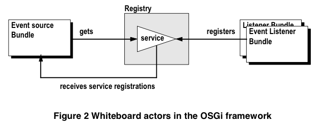

# 1 Introduction
* The dynamic nature of OSGi service model require extra effort to track the changes
* Traditional with listeners was found to be overly complicated and error prone

# 2 Background

## 2.1 The Listener Pattern

## 2.2 The OSGi Environment
* OSGi collaboration model is implemented with the *service registry* - allows *bundle* to register services
* Services are normal Java objects that are typically defined by a Java interface allowing different implementations to co-exist

## 2.3 The Whiteboard Pattern
* Leverages the OSGi framework's service registry instead of implementing a private registry as required by the listener pattern
* Has event listeners registry themselves as a sevice with the OSGi framework
* When the event source has an event object to deliver, the event source calls all event listeners in the service registry
* Remarkably, the event source is **NOT** registered with the framework as a service
	