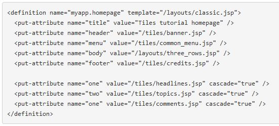

# Tiles Advanced Topics

# 1. Nesting and Extending Definitions

## 1.1 Named sub-definitions
* Tiles supports nesting definitions natively
* One way of using nested definitions is creating a named *sub-definition* and using it as an attribute

## 1.2 Anonymous nested definitions
* The anonymous definition put under the attribute can be used only by the surrounding definition

## 1.3 Cascaded attributes
* Attributes defined in a definition can be cascade to be available to all nested definitions and templates

## 1.4 Extending Definitions
* Can extend definitions like a Java class. The concepts of *abstract definition*, *extension*, and *override* are available

* **Abstract definition** - a definition which the template are not completed filled. Useful to create a base page and number of existing definitions, reusing already created layout

* **Definition extension** - a definition can inherit from another definition, to reuse an already made definition

* **Template and attribute override** - when extending a definition, its template can be overridden
* Overriding a template:

* Overriding attributes:

# 2. List Attributes

## 2.1 Simple usage
* To include a list attribute you can use <put-list-attribute>

## 2.2 List attribute inheritance

# 3. Tiles Runtime Composition

