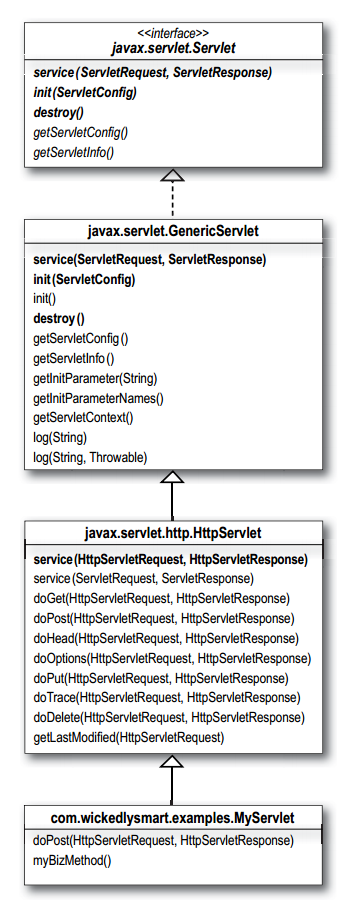

# 4. Being a Servlet
* Objectives
    * 1.1 For each of the HTTP Methods (such as GET, POST, HEAD, and so on), describe the purpose of the method and the technical characteristics of the HTTP Method protocol, list triggers that might cause a client to use the Method, and identify the HttpServlet method that corresponds to the HTTP Method
    * 1.2 Using the HttpServletRequest interface, write code to retrieve HTML form parameters from the request, retrieve HTTP request header information, or retrieve cookies from the request
    * 1.3 Using the HttpServletResponse interface, write code to set an HTTP response header, set the content type of the response, acquire a text stream for the response, acquire a text stream for the response, acquire a binary stream for the response, redirect an HTTP request to another URL, or add cookies to the response
    * 1.4 Describe the purpose and event sequence of the servlet lifecycle: (1) servlet class loading, (2) servlet instantiation, (3) call the init() method, (4) call the service() method, and (5) call the destroy() method
    
## HTTP Methods
* GET - asks to *get* the thing (resource / file) at the requested URL
* POST - asks the server to *accept* the body info attached to the request, and give it to the thing at the requested URL it's like a fat GET.. a GET with extra info sent with the request
* HEAD - asks for only the *header* part of whatever a GET would return. Like GET, but with no body in the response
* TRACE - asks for a loop-back of the request message, so that the client can see what's being received on the other end, for testing or troubleshooting
* PUT - says to *put* the enclosed info (the body) at the requested URL
* DELETE - says to *delete* the thing at the requested URL
* OPTIONS - asks for a *list* of the HTTP methods to which the thing at the requested URL can response
* CONNECT - says to *connect* for the purposes of tunneling

## Review: servlet lifecycle and API
* The Container initializes a servlet by loading the class, invoking the servlet's no-arg constructor, and calling the servlet's init() method
* The init() method (which the developer can override) is called only once in the servlet's life, and always before the servlet can service any client requests
* The init() method gives the servlet access to the ServletConfig and ServletContext objects, which the servlet needs to get information about the servlet configuration and the web app
* The Container ends a servlet's life by calling its destroy() method
* Most of a servlet's life is spend running a service() method for a client request
* Every request to a servlet runs in a separate thread! There is only one instance of any particular servlet class
* Your servlet will almost always extends *javax.servlet.http.HttpServlet*, form which it inherits an implementation of the service() method that takes an HttpServletRequest and an HttpServletResponse
* HttpServlet extends *javax.servlet.GenericServlet* an abstract class that implements most of the basic servlet methods
* GenericServlet implements the Servlet interface
* Servlet classes (except those related to JSPs) are in one of two packages: *javax.servlet* or *javax.servlet.http*
* You can override the init() method, and you must override at least one service method (dotGet(), doPost(), etc.)

* The HttpServlet's dotGet() and doPost() methods take an HttpServletRequest and an HttpServletResponse
* The service() method determines whether doGet() or doPost() runs based on the HTTP Method (GET, POST, etc.) of the HTTP request
* POST requests have a body; GET requests do not, although GET requests can have request parameters appended to the request URL (sometimes called "query string")
* GET requests are inherently (according to the HTTP spec) *idempotent*. They should be able to run multiple times without causing any side effects on the server. GET request shouldn't *change* anything on the server. But you *could* write a bad, non-idempotent doGet() method
* POST is inherently not *idempotent*, so it's up to you to design and code your app in such a way that if the client sends a request twice by mistake, you can handle it
* If an HTML form does not explicitly say "method=POST", the request is sent as a GET, not a POST. If you do not have a doGET() in your servlet, the request will fail 
* You can get parameters from the request with the *getParameter(paramName)* method. The return value is always a String
* If you have multiple parameter values for a given parameter name, use the *getParameterValues(paramName)* method that returns a String array
* You can get *other* things form the request object including headers, cookies, a session, query string, and an input stream

## PrintWriter and OutputStream
* println() to a *PrintWriter*
* write() to an ServletOutputStream
* response.getOutputStream()
* response.getWriter()

## Servlet redirect
* You can't do a sendRedirect() after writing to the response!
* sendRedirect() takes a String, NOT a URL object!

## Review: HttpServletResponse
* You use the Response to send data back to the client
* The most common methods you'll call on the response object (HttpServletResponse) are *setContentType()* and *getWriter()*
* Be careful - many developers assume the method is getPrintWriter(), but its getWriter()
* The *getWriter()* method let you do character I/O to write HTML (or something else) to the stream
* You can also use the response to set headers, send errors, and add cookies
* In real world, you'll probably use a JSP to send most HTML responses, but you may still use a response stream to send binary data (like a JAR file) to the client
* The method you call on your response for getting a binary stream is *getOutputStream()*
* The *setContentType()* method tells the browser how to handle the data coming in with the response. Typical content types are "text/html", "application/pdf", and "image/jpeg"
* You don't have to memorize content types (aka MIME types)
* You can set response headers using *addHeader()* or *setHeader()*. The difference depends on whether the header is already part of the response. If it is, *setHeader()* will *replace* the value, but *addHeader()* will *add an additional value* to the existing response. If its not, the *setHeader()* and *addHeader()* behave in exactly the same way
* If you don't want to response to a request, you can redirect the request to a different URL. The browser takes care of sending the new request to the URL you provide
* To redirect a request, call *sendRedirect(String)* on the response
* You cannot call *sendRedirect()* after the response is committed! In other words, if you've already written something to the stream, it's too late to do a redirect
* A request *redirect* is different from a request *dispatch*. A request *dispatch* happens on the *server*, while a *redirect* happens one the *client*. A request dispatch hands the request to another component on the server, usually within the same web app. A request *redirect* simply tells the browser to go a different URL

1 B 
2 C
3 D
4 B
5 B
6 B
7 B
8 B
9 A B C
10 D