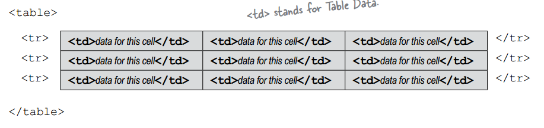

# 9. Custom tags are powerful
* Objectives - Building JSP pages using tag libraries
    * 9.1 Describe the syntax and semantics of the "taglib" directive: for a standard tag library, for a library of Tag Files
    * 9.2 Given a design goal, create the custom tag structure to support that goal
    * 9.3 Identify the tag syntax and describe the action semantics of the following JSP Standard Tag Library (JSTL v1.1) tags: (a) core tags: out, set, remove, and catch, (b) conditional tags: if, choose, when, and otherwise, (c) iteration tags: forEach, and (d) URL-related: url

## EL and standard actions are limited
* There's a standard library of custom tags known as the *JSP Standard Tag Library (JSTL 1.1)*

## The case of the disappearing HTML (reprised)

## There's a better way: us the <c:out> tag
* You can explicitly declare the conversion of XML entities
* You can explicitly declare NO conversion of XML entities
    * <c:out value="abc" escapeXml='true' />
    * escapeXml='false' - any HTML tags are evaluated, not displayed as text
    * escapeXml attribute default to true
* Using the c:out tag to render the text of users prevents cross-site hacking

## Null values are rendered as blank text
* EL prints nothing if user is null
* A JSP expression tag prints nothing if user is null
* Set a default value with the default attribute
    * <c:out> provides a default attribute
    * <c:out value='${user}' default='guest' />
    * <c:out value='${user}'>guest</c:out>
    
## Looping without scripting
* <c:forEach> tag is the answer
* Loops through the entire *array* and prints each *element* in a new row
* Crash refresher on HTML tables
    * tr stands for Table Row
    * td stands for Table Data

* Tables are pretty straightforward. They've got *cells*, arranged into *rows* and *columns*, and the data goes inside the cells
* Rows are defined with tr (Table Row) tag, and columns are defined with the td (Table Data) tag
* The number of rows comes from the number of *tr* tags, and the number of columns comes from the number of *td* tags you put inside the *td*
* Data to print/display goes only inside the <td> tags!

## Deconstruction <c:forEach>
* The <c:forEach> tag maps nicely into a for loop - the tag repeats the *body* of the tag *for each* element in the collection (array, Collection, Map or comma-delimited String)
* The key feature is that the tag assigns each element in the collection to the variable you declare with the *var* name
* The variable that holds each ELEMENT in the collection. Its value changes with each iteration
* Getting a loop counter with the optional *varStatus* attribute
    * varStatus makes a new variable that holds an instance of javax.servlet.jsp.jstl.core.LoopTagStatus
    * The LoopTagStatus has a *count* property that gives you the current value of the iteration counter

## You can even nest <c:forEach> tags
* You can nest <c:forEach> tags for more complex table structures
* The "var" variable is scoped to ONLY the tag!

## Doing a conditional include with <c:if>
* <c:if> cannot do *else*
* The <c:choose> tag and its partners <c:when> and <c:otherwise>
* The <c:choose> tag is NOT required to have a <c:otherwise> tag

## The <c:set> tag... so much cooler than <jsp:setProperty>
* <jsp:setProperty> tag can do only one thing - set the property of a bean
* With <c:set>, you can set a value in a Map, make a *new* entry in a Map, create a new request-scoped attribute
* Set comes in two flavors: *var* and *target*
    * *var* version is for setting attribute variables
    * *target* version is for setting bean properties or Map values
    * Each of those two flavors comes in two variations: with or without a body
    * <c:set> body is just another way to put in the *value*
    * The body is evaluated and used as the value of the variable
* If the value evaluates to null, the variable will be REMOVED!

## Using <c:set> with beans and Maps
* This flavor of <c:set> works for only two things:
    * bean properties
    * Map values
* You can't use it to add things to lists or arrays
* The "target" must evaluate to the OBJECT! You don't type in the String "id" name of the Bean or Map attribute!
* The "target" attribute needs a value that resolves to the REAL THING. That means an EL expression or a scripting expression (<%= %>) or <jsp:attribute>

## Key points and gotchas with <c:set>
* You can never have BOTH the "var" and "target" attributes in a <c:set>
* "Scope" is optional, but if you don't use it the default is *page* scope
* If the "value" is null, the attribute named by "var" will be removed!
* If the attribute named by "var" does not exist, it'll be created, only if "value" is not null
* If the "target" expression is null, the Container throws an exception
* The "target" is for putting in an expression that resolves to the Real Object. If you put a String literal that represents the "id" name of the bean or Map, it won't work. In other words, "target" is not for the attribute *name* of the bean or Map - it's for the actual attribute *object*
* If the "target" expression is not a Map or a bean, the Container throws an exception
* The the "target" expression is a bean, but the bean does not have a property that matches "property", the Container throws an exception. Remember that the EL expression ${bean.notAProperty} will also throw an exception

## <c:remove> just makes sense
* *set* does a *remove* only when you pass in a null value
* The *var* attribute MUST be a String literal! It can't be an expression!!!
* The scope is optional, but if you leave it out then the attribute is removed from ALL scopes

### Test your Tag memory
* varStatus
* test
* value
* c:when test, c:otherwise

## With <c:import>, there are now THREE ways to include content:
* The include directive
    * <%@ include file="header.jsp" %>
    * Static: adds the content from the value of the *file* attribute to the current page at *translation* time
* The <jsp:include> standard action
    * <jsp:include page="header.jsp" />
    * Dynamic: adds the content from the value of the *page* attribute to the current page at *request* time
* The <c:import> JSTL tag
    * <c:import url="http://abc.com/header.html" />
    * Dynamic: adds the content from the value of the *url* attribute to the current page, at *request* time. It works a lot like <jsp:include>, but it's more powerful and flexible
    * Unlike the other two includes, the <c:import> url can be from outside the web Container!
* They all have different attribute names! 
 
## <c:import> can reach OUTSIDE the web app
* Witch <c:import>, you have the option to pull in content from *outside* the Container

## Customizing the thing you include
* The JSP with the <jsp:include>
    * Use <jsp:param>

## Doing the same thing with <c:param>
* The JSP with the <jsp:import>
    * <c:param name="" value="" />
    
## <c:url> for all you hyperlink needs
* <c:url value="/abc.jsp/>

## What if the URL needs encoding?
* Using <c:param> in the body of <c:url>

## Make your own error pages
* The designated ERROR page ("errorPage.jsp")
    * <%@ page isErrorPage="true" %>
    * Confirms for the Container, this is an error page
* The BAD page that throws an exception ("badPage.jsp")
    * <%@ page errorPage="errorPage.jsp" %>
    * Tells the Container, if something goes wrong here forward the request to errorPage.jsp

## Configuring error pages in the DD
* Declaring a catch-all error page using <error-page>
* Declaring an error page for a more explicit exception <exception-type>
* Declaring an error page based on an HTTP status code <error-code>
* <location> MUST be relative to the web-app root/context, which means it MUST start with a slash

## Error pages get an extra object: exception
* The exception implicit object is available ONLY to error pages with an explicitly-defined page directive:
    * <%@ page isErrorPage="true" %>
* In other words, configuring an error page in the DD is not enough to make the Container give that page the implicit exception object!
* ${pageContext.exception}

## The <c:catch> tag. Like try/catch... sort of
* You can do a kind of try/catch using the <c:catch> tag, to wrap the risky tag or expression

## You can make the exception an attribute
* Using the "var" attribute in <c:catch>
* This creates a new paged-scoped attribute named "myException", and assigns the exception object to it
* Flow control works in a <c:catch> the way it does in a *try* block - NOTHING runs inside the <c:catch> body *after* the exception
* A <c:catch> acts more like a *try* block, because it's where you put the risky code

## What if you need a tag that's NOT in JSTL?
* The "Core" library
* General-purpose
    * <c:out>
    * <c:set>
    * <c:remove>
    * <c:catch>
* Conditional
    * <c:if>
    * <c:choose>
    * <c:when>
    * <c:otherwise>
* URL related
    * <c:import>
    * <c:url>
    * <c:redirect>
    * <c:param>
* Iteration
    * <c:forEach>
    * <c:forTokens>

## Using a tag library that's NOT from the JSTL
* To use a custom library, you MUST read the TLD
* Everything you need to know is in there
* Main thing you have to know:
    * The tag *name* and *syntax*
    * The library URI

## Making sense of the TLD
* The TLD describes two main things: custom tags, and EL functions
* <tlib-version> MANDATORY (the tag, not the value)
* <short-name> MANDATORY
* <uri> the unique name we use in the taglib directive!
* Defines a tag with <tag>
    * <description> optional
    * <name> REQUIRED! This is what you use inside the tag (example: <my:advice>)
    * <tag-class> REQUIRED! This is how the Container knows what to call when someone uses the tag in a JSP
    * <body-content> REQUIRED! This say that the tag must NOT have anything in the body
    * <attribute> - If you tag has attributes, the one <attribute< element per tag attribute is required
        * <name>
        * <required> - This use you MUST put attribute in the tag
        * <rtexprvalue> - This say the attribute can be a RunTimEXPRession value (i.e doesn't have to be a String literal)

## Using the custom "advice" tag

## The custom tag handler
* The tag handler extends SimpleTagSupport, and implements two key methods: doTag(), the method that does the actual work, and setUser(), the method that accepts the attribute value
* The Container calls doTag() when the JSP invokes the tag using the name declared in the TLD
* The Container calls the setUser() method to set the value from the tag attribute. It uses JavaBean property naming conventions to figure out that a "user" attribute should be sent to the setUser() method
* Custom tag handlers don't use custom method names!
    * The method name is ALWAYS *doTag()*, so you never declare the method name for a custom tag
* Only function use a method signature declaration in the TLD!

## Pay attention to <rtexprvalue>
* The <rtexprvalue> is especially important because it tells you whether the value of the attribute is evaluated at translation or runtime
* If the <rtexprvalue> is false, or isn't defined, you can use only a String literal as that attribute's value

## <rtexprvalue> is NOT just for EL expression
* You can use *three* kinds of expression for the value of an attribute (or tag body) that allows runtime expression:
    * EL expression
        * <mine:advice user="${userName}" />
    * Scripting expression
        * <mine:advice user='<%= request.getAttribute("userName") %>' />
    * <jsp:attribute> standard action
        * <mine:advice><jsp:attribute name="user">${userName}>
* <jsp:attribute> lets you put attributes in the BODY of a tag, even when the tag body is explicitly declared "empty" in the TLD!!
* <jsp:attribute> is simply an alternate way to define attributes to a tag

## What can be in a tag body
* A tag can have a body *only* if the <body-content> element for this tag is not configured with a value of *empty*
* The <body-content> element can be one of either three or four values, depending on the type of tag
    * empty - The tag must NOT have a body
    * scriptless - The tag must NOT have scripting elements (scriptlets, scripting expression, and declaration), but it CAN have template text and EL and custom and standard action
    * tagdependent - the tag body is treated as plain text, so the EL is NOT evaluated and tags/actions are not triggered
    * JSP - the tag body can have anything that can go inside a JSP
* THREE ways to invoke a tag that can't have a body
    * An empty tag: <mine:advice user="${userName}" />
    * A tag with *nothing* between the opening and closing tags: <mine:advice user="${userName}"> </mine:advice>
    * A tag with only <jsp:attribute tags between the opening and closing tags
    * The <jsp:attribute> tag is the ONLY thing you can put between the opening and closing tags of a tag with a <body-content> of empty! It's just an alternate way to put the attributes in, but <jsp:attribute> tags don't count as a "body content"

## The tag handler, the TLD, and the JSP
* These three pieces - the tag handler class, the TLD, and the JSP are all you need to deploy and run a web app that uses the tag
* The tag handler developer creates the TLD to tell both the Container and the JSP developer how to use the tag
* A JSP developer doesn't care about the <tag-class> element in the TLD; that's for the Container to worry about
* The JSP developer cares most about the URI, the tag name, and the tag syntax
* Think of the TLD as *the API for custom tags*

## The taglib <uri> is just a name, not a location
* The <uri> element in the TLD is a unique name for the tag library
* It does NOT need to represent any actual location
* It simply has to be a name - *the same name you use in the taglib directive*
* It LOOKS like a URL to a web resource, but it's not. It's just a name that happens to be formatted as a URL
* *All that matters i that the <uri> in the TLD and the uri in the taglib direct match!*
* The Container looks for a match between the <uri> in the TLD and the uri value in the taglib directive. The uri does NOT have to be the location of the actual tag handler!

## The Container builds a Map
* The OLD (before JSP 2.0) way to map a taglib uri to a TLD file
    * Define <taglib> element in the DD
* The NEW (JSP 2.0) way to map a taglib uri to a TLD file
    * No <taglib> entry in the DD!
* The Container automatically builds a map between TLD files and <uri> names

## Four places the Container looks for TLDs
* Directly inside WEB-INF
* Directly inside a sub-directory of WEB-INF
* Inside the META-INF directory inside a JAR file that's inside WEB-INF/lib
* Inside a sub-directory of META-INF inside a JAR file that's inside WEB-INF/lib

## When a JSP uses more than one tag library
* If you want to use more than one tag library in a JSP, do a separate taglib directive for each TLD. There are few issues to keep in mind...
    * Make sure the taglib uri names are unique
    * Do NOT use a prefix that's on the reserved list:
        * jsp:
        * jspx:
        * java:
        * javax:
        * servlet:
        * sun:
        * sunw:

## Mock Exam
1 A 
2 C 
3 D
4 B D
5 B C E
6 A B D
7 B