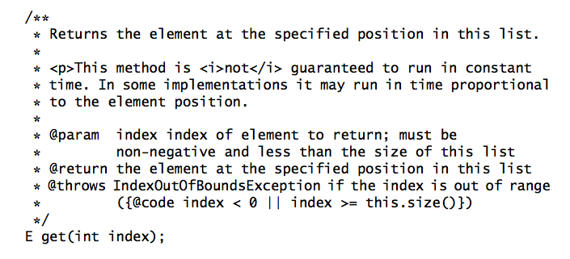

# Chapter 07 - Methods

## Item 38: Check parameters for validity
* To summarize:
    * Each time you write a method or constructor, you should think about what restrictions exist on its parameters
    * You should document these restrictions and enforce them with explicit checks at the beginning of the method body
    * It is important to get into the habit of doing this
    * The modes work that is entails will be paid back with interest the first time a validity check fails
    
## Item 39: Make defensive copies when needed
* **You must program defensively, with the assumption that clients or your class will do their best to destroy its invariants**
* **Defensive copies are made before checking the validity of the parameters, and the validity check is performed on the copies rather than on the originals**
* **Do not use the clone method to make a defensive copy of a parameter whose type is subclassable by untrusted parties**

* In summary
    * If a class has mutable components that it gets from or returns to its client, the class must defensively copy these components
    * If the cost of the copy would be prohibitive *and* the class trusts its client not to modify the components inappropriately, then the defensive copy may be replaced by documentation outlining the client's responsibility not to modify the affected components
    
## Item 40: Design method signatures carefully
* **Chose method names carefully**
* **Don't go overboard in providing convenience method**
    * Consider providing a "shorthand" only if it will be used often
* **When in doubt, leave it out**
* **Avoid long parameter lists**
* **Long sequence of identically typed parameters are especially harmful**
* **For parameter types, favor interfaces over classes**
* **Prefer two-element enum types to boolean parameters**

## Item 41: Use overloading judiciously
* **The choice of which overloading to invoke is made at compile time**
* **Selection among overloaded methods is static, while selection among  overridden methods is dynamic**
* **Avoid confusing uses of overloading**
* **A safe, conservative policy is never to export two overloadings with the same number of parameters**

* To summarize
    * Just because you can overload methods doesn't mean you should
    * You should generally restrain from overloading methods with multiple signatures that have the same number of parameters
    * You should at least avoid situations where the same set of parameters can be passed to different overloadings by the addition of casts
    * If such a situation cannot be avoided, you should ensure that all overloadings behave identically when passed the same parameters
    * If you fail to do this, programmers will be hard pressed to make effective use of the overloaded method or constructor, and they won't understand why it doesn't work
    
## Item 42: Use varargs judiciously
* **Don't retrofit every method that has a final array parameter; use varargs only when a call really operates on a variable-length sequence of values**

* In summary:
    * varargs methods are a convenient way to define methods that require a variable number of arguments, but they should not be overused
    * They can produce confusing results if used inappropriately
    
## Item 43: Return empty arrays or collections, not nulls
* In summary
    * **There is no reason ever to return null from an array or collection-valued method instead of returning an empty array or collection**
    * The null-return idiom is likely a holdover from the C programming language. In C, there is no advantage to allocating an array if zero is returned as the length
    
## Item 44: Write doc comments for all exposed API elements
* **To document your API properly, you must precede every exported class, interface, constructor, method, and field declaration with a doc comment**
* **The doc comment for a method should describe succinctly the contract between the method and its client**

* **Is is no longer necessary to use the HTML <code> or <tt> tags in doc comments: the Javadoc {@code} tag is preferable because it eliminates the need to escape HTML metacharacters**
* **No two members or constructors in a class or interface should have the same summary description**
* **When documenting a generic type or method, be sure to document all type parameters**
* **When documenting an enum type, be sure to document the constants**
* **When documenting an annotation type, be sure to document any members**

* To summarize
    * Documentation comments are the best, most effective way to document your API
    * Their use should be considered mandatory for all exported API elements
    * Adopt a consistent style that adheres to standard conventions